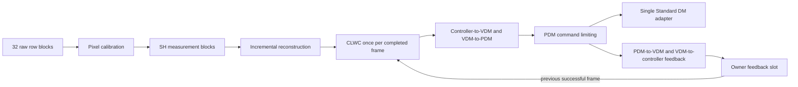

# Classic row execution design

Date: 2026-09-30. Status: source-grounded implementation plan. No row graph,
buffer remediation, build, or live row qualification is delivered by this
document. The first matched full-frame HEART functional gate precedes row work.
This is a development benchmark increment under the explicit comparison scope,
not a change to the [RTC product authority map](../docs/README.md).

## Selected comparison

Use the same seven recorded 352 × 352 U16 images, prepared calibration files,
offered rate, readout duration, simulator, and 277-element Standard DM capture
for these five configurations:

| Configuration | Ingress and graph | Initial execution |
| --- | --- | --- |
| HEART baseline | Existing ordinary progressive stdWfs receiver and compiled Classic chain | Existing FFTSIMPLE / CPUF32 baseline; capture the actual binary and effective configuration |
| FGN complete frame | HEART adapter assembles a frame; developed nine-node Classic graph | Serial |
| JFG complete frame | HEART adapter assembles a frame; developed nine-node Classic graph | Serial |
| FGN row | HEART adapter publishes 11-row blocks; developed fused SH row reconstructor plus the complete controller chain, eight nodes | Serial first; existing synchronous helper lanes characterized separately |
| JFG row | HEART adapter publishes 11-row blocks; developed SH measurement blocks and incremental reconstruction plus the complete controller chain, nine nodes | Serial first; existing persistent reconstruction helpers characterized separately |

The HEART baseline keeps its ordinary progressive receiver and existing science.
FFTSIMPLE / CPUF32 is the expected compiled baseline selection, not a claim that
YAML chooses a compiled implementation. Record binary hashes, build selection,
thread placement, requested flags, available readback, and first-frame state.
The current HEART runner records flag acknowledgements separately from effective
flag and zero-state evidence. A wire capture alone does not establish either.
See [the matched review](CLASSIC_MATCHED_REVIEW.md) and
[the HEART runner](run_classic_heart_live.py).

First establish functional row delivery using serial execution. Then compare
helper counts and matrix layouts with a declared, equal compute-core budget and
placement. Record coordinator and helper CPUs, SMT siblings, transport/adapter
CPUs, Julia thread IDs, and competing work. Fusion and helper lifetime differ
between FGN and JFG and belong in each result. Full-frame helper variants are
outside this first gate.

## Fixed transport contract

Choose 11 rows per datagram and 32 datagrams per frame. One payload contains
11 × 352 × 2 = 7,744 pixel bytes, below the unchanged simulator's 8,024-byte
payload limit. A 22-row payload would require 15,488 bytes. The existing HEART
row source requires one datagram to equal one row output; it does not combine
two datagrams into a 22-row output. A 22-row subaperture can span two or more
11-row blocks; existing SH workspaces retain the pixels required for it.

| Boundary | Element type and logical shape | Schema | Rate |
| --- | --- | --- | --- |
| Public raw input | U16, `[11, 352]`, row-major | `org.calculon.ao.raw-pixel-row-block/1` | `32 × frame_rate` |
| Calibration to SH | F32, `[11, 352]` | `org.calculon.ao.calibrated-pixel-row-block/1` | `32 × frame_rate` |
| Reconstruction to CLWC | F32, `[221]` | `org.calculon.ao.controller-residual-error/1` | `frame_rate`, conditional |
| Public demanded output | F32, `[277]` | `org.calculon.ao.demanded-pdm-command/1` | `frame_rate`, conditional through upstream admission |
| Private controller feedback input/output | F32, `[221]` | `org.calculon.ao.controller-constraint-feedback/1` | `frame_rate` |

The Standard WFS `id_frame` is preserved in SPA Header `seq`. For packet
ordinal `k = 1..32`, Header `offset = 11 × (k − 1)` is a zero-based detector-row
offset: `0, 11, …, 341`, not a byte offset. Header `MARKER` is set only on
packet 32; `DISCONT` and `CORRUPTED` retain their existing meanings. Each block
shares its frame ID. Timestamp validity comes from the ordinary Header PTS.

JFG converts this into `SampleMetadata(sequence, offset; terminal=…, …)`.
FGN converts the same Header to its declaration sample and `RowBlockInfo`.
The final SH/reconstruction sample retains the frame ID and final sample
timestamp, sets offset zero and terminal true, and carries accumulated
discontinuity. The graph then propagates it to the demanded command.
FGN/JFG wire commands retain the WFS frame ID; the inspected HEART runner
expects WFS IDs `0..N−1` and DM IDs `1..N`. Compare using those explicit
conventions rather than changing either command protocol.

Observed authority:
[HEART source](../../pipewireao-spa-plugin-heart-fullframe/spa/plugins/heart/source.c),
`row_datagram_matches`, `queue_frame`, and `reserve_row_frame`;
[JFG Header conversion](../../JuliaFilterGraph-progressive-requal/julia/FilterGraphPipeWire/src/graph_node.jl),
`_buffer_metadata`;
[FGN row conversion](../../calculon-algorithms-progressive-requal/crates/calculon-fgn/src/algorithm.rs),
`row_block_info` and `row_block_process_result`.

## Complete scientific chain and state ownership

The JFG split graph provides a tested helper adaptation without new scientific
code. Its data flow is:



FGN replaces the SH measurement and reconstruction nodes with its existing
`shwfs-row-reconstructor-f32`; all downstream nodes are retained. Both SH
implementations use the prepared origins and coordinate arrays, inclusive pixel
threshold 20, flux threshold 1,000, supplied active mask and reference slopes,
and scientific subaperture order. Completion schedules mark regions ready by
their final detector row but release only the greatest ready prefix in the
original scientific order. Reconstruction consumes pair-interleaved x/y
columns in that order. This may postpone work when early scientific indices
occupy late detector rows; it is an existing ordering constraint.

For valid input, JFG's measurement node publishes a measurements/columns/count
triplet on every row block, including a zero count when no new subaperture is
ready. The reconstructor defers its `[221]` output until the terminal block and
requires all 376 columns. FGN's fused node likewise publishes reconstructed
output only at completion. No nonterminal block admits CLWC or the projections.
JFG's graph-level deferred result makes every external output unavailable until
the full path completes, even though calibration has completed internally.
The first 31 callbacks therefore publish no command; callback 32 publishes one
command and one feedback vector.

Keep the existing Float32 recurrence and projection calibration:

```text
sₙ = uₙ₋₁ − 0.99 fₙ₋₁
uₙ = 0.99 sₙ − 0.3 rₙ
```

The 221-element controller, 277-element full VDM/PDM, hidden-mode gain zero,
limits ±0.8 microns, and all existing projection matrices stay unchanged.
Controller history and feedback start at zero. The existing JFG
`PreparedFeedbackBridge` copies feedback only when the entire graph is terminal
and successful. The native module commits feedback only when its private output
has a full payload; an absent nonterminal payload leaves the retained slot
unchanged. A corrupted, missing, reordered, or superseded row sequence abandons
partial sensing/reconstruction, keeps the last command/controller history, and
marks the next accepted frame discontinuous. Reset clears both graph and bridge.

Do not infer full equivalence from Float32 types. Row AXPY accumulation and the
full-frame dense kernel can use different reduction orders. The maintained
[precision review](CLASSIC_PRECISION_REVIEW.md) already records a long-sequence
full-frame comparison failure. Preserve its acceptance criterion and unresolved
numerical findings; qualify row arithmetic separately.

## Exact fixture changes

### Common calibration and downstream nodes

Replace `pixel-calibration-u16-f32` with
`pixel-calibration-row-u16-f32`, preserving node name `pixel-calibration`:

```text
image_rows = 352
image_columns = 352
row_block_rows = 11
initial_flat = null
initial_background = null
```

Retain the existing `closed-loop-correction`, `controller-to-vdm`, `vdm-to-pdm`,
`pdm-command`, `pdm-feedback-to-vdm`, and `vdm-feedback-to-controller` nodes and
their links, configuration, properties, and parameters. Retain the same private
feedback pair. Expose only raw plus private feedback as data inputs and demanded
plus private feedback as outputs in the live graph. Parameter Ports may remain.

### JFG split fixture: nine nodes

Add `rtc-classic-row-feedback.conf` beside the full-frame JFG fixture. Keep the
names `shack-hartmann` and `reconstruction` so all existing qualified parameter
assignments remain unchanged. Change their labels and configurations as follows:

| `shack-hartmann-measurement-block-f32` field | Value |
| --- | --- |
| `image_rows`, `image_columns`, `row_block_rows` | `352`, `352`, `11` |
| `subaperture_rows`, `subaperture_columns`, `subaperture_count` | `22`, `22`, `188` |
| `initial_subaperture_origins`, `reference_slopes`, `active` | `null`; shared parameter preload supplies them |
| `coordinate_scale`, `pixel_threshold`, `flux_threshold` | `1.0`, `20.0`, `1000.0` |
| `measurements_schema` | `org.example.ao.measurement-block/1` |
| `column_indices_schema` | `org.example.ao.reconstructor-column-indices/1` |
| `measurement_count_schema` | `org.example.ao.measurement-block-count/1` |

These internal schema strings are the existing SH progressive Graph test
convention; both linked declarations receive exactly the same strings.

| `incremental-dense-reconstructor-f32` field | Value |
| --- | --- |
| `measurement_count`, `measurement_block_capacity`, `blocks_per_sample` | `376`, `376`, `32` |
| `reconstructed_count`, `initial_reconstructor` | `221`, `null` |
| `measurements_schema`, `column_indices_schema`, `measurement_count_schema` | The same three strings above |
| `reconstructed_schema` | `org.calculon.ao.controller-residual-error/1` |
| `reconstructor_schema` | `org.calculon.ao.shwfs-reconstructor/1` |

Replace the image/slopes links with:

```text
pixel-calibration:calibrated → shack-hartmann:row-block
shack-hartmann:measurements → reconstruction:measurements
shack-hartmann:columns → reconstruction:columns
shack-hartmann:count → reconstruction:count
reconstruction:reconstructed → closed-loop-correction:residual-error
```

### FGN fused fixture: eight nodes

Derive a row template from the existing developed Classic full-frame template.
Remove the separate `shack-hartmann` node and give `reconstruction` the label
`shwfs-row-reconstructor-f32`. Its fields are the detector/subaperture dimensions,
origins, coordinate scale, thresholds, references, and active mask listed above,
plus `actuator_count = 221`, `initial_reconstructor = null`, and
`reconstructed_schema = org.calculon.ao.controller-residual-error/1`.
The fused declaration has no measurement-triplet schema fields.
Link `pixel-calibration:calibrated` to `reconstruction:row-block`, and its
`reconstructed` output to the existing CLWC input.

For FGN, retain `plugin` and each node's base `config.rate = [ frame_rate 1 ]`.
The declaration multiplies row input rates by 32; do not set the base rate to
32 × frame_rate as well. JFG passes its base rate to `PipeWireNode`, with the
same declaration rate multiplier and `RowMajorLayout()` boundary adapter.

### Prepared parameter ports

| JFG split qualified port | FGN fused qualified port | Prepared type/shape |
| --- | --- | --- |
| `pixel-calibration:background` | Same | F32 `[352,352]` |
| `shack-hartmann:subaperture-origins` | `reconstruction:subaperture-origins` | U32 `[188,2]` |
| `shack-hartmann:coordinates` | `reconstruction:coordinates` | F32 `[484,2]` |
| `shack-hartmann:reference-slopes` | `reconstruction:reference-slopes` | F32 `[188,2]` |
| `shack-hartmann:thresholds` | `reconstruction:thresholds` | F32 `[188,2]` |
| `shack-hartmann:active` | `reconstruction:active` | Bool `[188]` |
| `reconstruction:reconstructor` | Same | F32 `[221,376]` |
| `closed-loop-correction:shape-to-hidden` | Same | F32 `[1,221]`, zero |
| `closed-loop-correction:hidden-to-shape` | Same | F32 `[221,1]`, zero |
| `controller-to-vdm:controller-to-vdm` | Same | F32 `[221,221]` |
| `vdm-to-pdm:active-to-full` | Same | F32 `[277,221]` |
| `vdm-to-pdm:vdm-to-pdm` | Same | F32 `[277,277]` |
| `pdm-feedback-to-vdm:full-to-active` | Same | F32 `[221,277]` |
| `pdm-feedback-to-vdm:pdm-to-vdm` | Same | F32 `[277,277]` |
| `vdm-feedback-to-controller:vdm-to-controller` | Same | F32 `[221,221]` |

The row calibration declaration also has `flat`, F32 `[352,352]`, with the
existing unity default. The native module's startup artifact interface accepts
F32 row-major artifacts only. Its fused node must therefore receive verified
origins and active mask through existing construction fields, as the current
full-frame launcher does, and preload the other parameters before activation.
JFG can preload all typed parameters through `replace_parameters!`.

## Helper execution and scalability

JFG's existing `prepare_cpu_progressive_graph` adapts
`incremental-dense-reconstructor-f32`, and its direct-source binding recognizes
`ShackHartmannMeasurementBlockF32`. Persistent output-row workers consume the
producer's frame-owned measurements in order; terminal processing joins once
before publication. `execution.cpu` supplies `row_workers`, optional
`worker_thread_ids`, and `matrix_layout = shared | sharded`. Explicitly select
zero workers for the serial gate; the omitted-worker legacy default otherwise
selects helpers. Warm and reset the CPU owner, publish its `.graph`, retain the
owner for the full lifetime, and close it after the PipeWire node stops.
Parameter replacement must use the CPU owner's method so replacement bounds
and any sharded layouts are rebuilt before processing.

JFG's fused `ShackHartmannRowReconstructorF32` has serial progressive arithmetic
but no `CpuDenseRowExecutor` adaptation. Requesting CPU row workers on a graph
containing only that reconstructor raises the existing requirement for an
incremental dense node. Adapting it would be new executor work; the selected
split fixture avoids it.

FGN's fused node calls `run_progressive_reconstruction` for each newly ready
column range. `workers = { helpers = H }` enables the existing bounded executor.
It splits disjoint output rows while preserving column order, and joins helper
callbacks before the row callback returns. Thus it distributes work over readout
and parallelizes a ready group, but does not keep that group executing after
callback return. Lane count is capped by available lanes, spanned output cache
lines, and output extent. Do not label its helper lifetime equivalent to JFG's
frame-owned persistent workers.

Both paths retain a full calibrated detector workspace. Neither is a zero-copy
streaming sensor algorithm. JFG's direct internal measurement publication avoids
an additional helper handoff copy, whereas external borrowed measurements use
the existing copy path. At 221 outputs, helper overhead may exceed useful work;
the existing Classic profile measured SH image processing as the dominant work.
Measure before claiming a helper speedup. Current CPU progress counters sample
inside terminal reconstruction, after terminal input and upstream sensing; they
are not proof of completion before the last camera pixel arrives.

## Confirmed native buffer blocker and bounded remediation

Observed current `SPAParamBuffers` choices are `(default=4, min=2, max=16)` in
both [the Julia/native callback endpoint](../../pipewire-classic-warmup/src/pipewire/ndarray-filter.c)
`add_port` and [the native graph module](../../pipewire-classic-warmup/src/modules/module-ndarray-filter-chain.c)
`add_graph_port`. The HEART row source advertises `min = row_blocks_per_frame`,
rejects fewer than 32 buffers, and reserves all 32 before starting a frame.
Those negotiation ranges cannot intersect for the selected geometry.

Existing `node.reliable` and FIFO properties do not change these choices.
`PIPEWIREAO_PROPS` is applied in `pw_filter_connect`, after these endpoint ports
have authored their buffer parameters. No inspected endpoint property currently
sets the buffer-count range. The public `pw_filter_update_params` API could carry
an explicit buffer parameter, but the ndarray-owned filter wrappers do not
currently expose a supported operation for overriding these ports. Keep that
ownership boundary intact.

The smallest proposed core change is to raise only the two advertised maxima
from 16 to 64, preserving default 4 and minimum 2. Generic `pw_filter` already
has a fixed capacity of 64 and rejects counts above it; the HEART source also
has a fixed maximum of 64. Negotiation then admits a source minimum of 32
without changing small existing peers' choices or adding another API/property.
The selected raw pool occupies 32 × 7,744 = 247,808 payload bytes, excluding
buffer and metadata overhead. One-frame capacity permits startup; any need for
a second frame's reserve must be measured and explicitly configured within the
existing bounded 64-buffer limit.

A future public buffer-count property would require parsing before endpoint
port construction, range checks against that same native capacity, exact
documentation, and both endpoint implementations. It is larger than the
two-range correction and is not required for this first gate. No HEART change,
22-row regrouping, unbounded allocation, or scientific API change is proposed.

## Shared replay and live entrypoint changes

The existing JFG `ClassicArrayReplay.prepare_case(...; graph_fixture=…)` already
loads all parameter artifacts by unique port name, so the split fixture can use
its scientific loader unchanged. Its current raw buffer and telemetry buffers
still assume full frames. Allocate raw/output buffers from the selected prepared
graph formats, keeping the full-frame defaults and existing replay files exact.
For helper preparation, add a narrowly scoped graph preparation hook or extract
the shared parameter-loading function so it can target a
`PreparedCpuProgressiveGraph` owner; do not load parameters into its `.graph`
and bypass CPU replacement preparation.

Add a row replay entrypoint that sends 32 borrowed row views or copies into its
fixed `[11,352]` raw buffer, supplying explicit raw metadata and `nothing` for
private feedback metadata. Assert all command/controller boundaries unavailable
for blocks 1..31, available for block 32, and carry feedback exactly once after
that successful terminal call. Warm at least an initial and feedback-consuming
complete frame, then reset. Keep row selection/copying and report work outside
the stated processing timing boundary.

The row declarations do not expose full-frame slopes, flux, or validity ports;
the split node exposes measurement blocks instead. Record the supported terminal
boundaries (`reconstructed`, `correction`, `demanded`, controller feedback).
Use existing scientific tests or cold diagnostic workspace inspection to compare
sensing arrays. Do not write the last calibrated row as if it were a complete
calibrated frame, or silently fabricate the previous replay's eight boundaries.

Extend the live entrypoint/launcher with explicit frame/row selection and exact
source/effective fixture hashes. Replace its whole-frame warmup calls with the
row driver when selected. Reuse the existing owner callbacks and feedback bridge;
no scientific callbacks are added. A row callback count is a block count, so
`frame_count = callback_count` from the full-frame entrypoint must not survive
this extension. Validate terminal commands through the single DM capture and
source counts; division by 32 alone cannot prove successful frame completion
after dropped or superseded blocks.

## Delivery gates and acceptance

1. Finish and report the existing full-frame HEART short gate. Keep unresolved
   effective-state and numerical evidence explicit.
2. Implement the two native buffer range corrections as one coherent core
   increment. Verify source-minimum-32 negotiation, rejection beyond native
   capacity, unchanged small-buffer negotiation, and release/reset behavior.
   This is software transport verification, not a timing qualification.
3. Add the FGN eight-node and JFG nine-node fixtures and row array replay. Compare
   all seven source frames from reset at supported scientific boundaries; check
   31 deferred callbacks and one terminal command/controller update per frame.
   Exercise missing/reordered/corrupted blocks, reset, supersession, and feedback
   retention using existing row/graph tests. Preserve current tolerances.
4. Run the short serial live gate only after readiness and links are complete.
   Require 224 received packets for seven frames, no rejected/dropped/starved
   source frame, seven ordered demanded commands, healthy feedback, exact units,
   and correct source/DM frame-ID mapping. Record negotiated raw buffer count.
5. Characterize helper layouts separately under matched placement/core budgets.
   Report callback work, camera-to-command latency, delivery coverage, process
   CPU, startup, memory, and GC with their distinct boundaries. Scale offered
   rate only after coverage and numerical gates pass; successful callbacks or
   low median latency do not establish sustained offered-rate operation.

## Inspected source revisions

| Worktree | HEAD inspected |
| --- | --- |
| `JuliaFilterGraph-progressive-requal` | `c1cd735bc153890a2603b4195ca32abdb8ad29c6` |
| `calculon-algorithms-progressive-requal` | `19c9a21cb5993e097914b49b07bbd45232073555` |
| `pipewire-classic-warmup` | `1045d32aedcd800783c69e984ac62de22d6187f8` |
| `pipewireao-rtc-progressive-requal` | `5f7e37e9dd5995d613da6858e096acb5162346f9`; existing benchmark changes retained |

Relevant implementation and test references:

- [JFG pixel row calibration](../../JuliaFilterGraph-progressive-requal/julia/FilterGraphAlgorithms/src/algorithms/image/pixel_calibration.jl)
- [JFG SH measurement blocks](../../JuliaFilterGraph-progressive-requal/julia/FilterGraphAlgorithms/src/algorithms/wavefront_sensor/shack_hartmann_measurement_block.jl)
- [JFG incremental reconstruction](../../JuliaFilterGraph-progressive-requal/julia/FilterGraphAlgorithms/src/algorithms/wavefront_sensor/incremental_dense_reconstruction.jl)
- [JFG fused SH row reconstruction](../../JuliaFilterGraph-progressive-requal/julia/FilterGraphAlgorithms/src/algorithms/wavefront_sensor/shack_hartmann_row_reconstruction.jl)
- [JFG split SH Graph tests](../../JuliaFilterGraph-progressive-requal/julia/JuliaFilterGraph/test/progressive_wavefront_reconstruction.jl)
- [JFG CPU helper ownership and direct publication](../../JuliaFilterGraph-progressive-requal/julia/JuliaFilterGraph/src/cpu_progressive_graph.jl)
- [JFG Graph deferred publication](../../JuliaFilterGraph-progressive-requal/julia/JuliaFilterGraph/src/graph.jl)
- [FGN fused SH row declaration](../../calculon-algorithms-progressive-requal/crates/calculon-algorithms/src/composites/shack_hartmann_row_reconstruction.rs)
- [FGN generated SH row/helper Graph tests](../../calculon-algorithms-progressive-requal/crates/calculon-fgn/tests/algorithm_declaration_graph.c)
- [Native filter bounded buffers](../../pipewire-classic-warmup/src/pipewire/filter.c)

This pass inspected source and configuration only. Its buffer incompatibility
and helper capabilities are observed source facts; performance benefits remain
unmeasured. No new production source or live transport was changed or exercised.
