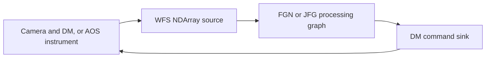
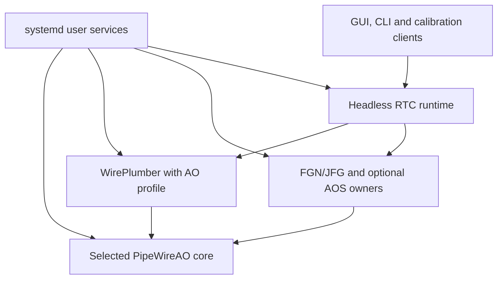

# PipeWireAO ecosystem integration

Direction requested on 2026-10-06. This document explains the existing components
and a proposed integration with WirePlumber. It does not claim that WirePlumber
has been qualified with PipeWireAO or that the current deployment supervisor has
been replaced. The [architecture](architecture.md) and
[operating contract](operations.md) remain authoritative for implemented behavior.

## Component responsibilities

The workstation should assemble existing components around an ordinary PipeWire
session. Our extensions are NDArray transport and scientific graph execution.
Process supervision, object discovery and general session policy can use systemd
and WirePlumber. Algorithms remain in their scientific packages.

Graph authoring remains in existing PipeWireAO `filter.graph` configurations,
using standard PipeWire relaxed SPA-JSON. AOS model configuration and AOC method
configuration stay with their existing applications. Integration should reference
these configurations rather than introduce another graph language or bundle
format.

| Component | Responsibility | Integration boundary |
| --- | --- | --- |
| **PipeWireAO** | PipeWire with NDArray formats, buffers, ports, metadata and scheduling; the native FGN graph host | Typed NDArray ports, explicit links, native properties and parameters |
| **FGN** | Execute a prepared scientific graph through the native graph host; Rust algorithms come from `calculon-algorithms` and its FGN adapter | An ordinary PipeWire processing node exposing declared ports and controls |
| **JFG** | Prepare and execute Julia scientific graphs; `FilterGraphAlgorithms` supplies algorithms and `FilterGraphPipeWire` publishes the graph | The same kind of ordinary processing node, implemented in Julia |
| **AOS** | Simulate the instrument: atmosphere, optics, mirrors, wavefront sensors and detectors | An owner may publish multiple sources and sinks; the current HIL adapter exposes one WFS/command exchange |
| **AOC** | Prepare probes, estimate interaction matrices, construct reconstructors and calculate calibration diagnostics | Numerical plans, workspaces and results; acquisition uses the deployed instrument endpoints |
| **WirePlumber / proposed WirePlumberAO profile** | Discover objects, apply session policy and realize declared links using the existing WirePlumber framework | PipeWire registry, properties, SPA POD parameters and links |
| **systemd** | Start, stop and supervise processes; apply resource and scheduling limits | User services and, where configured, administrator-provisioned resources |
| **Headless RTC runtime** | Own the RTC lifecycle, scientific readiness, acquisition coordination and artifact adoption | Existing native controls; operation continues without a GUI or CLI client |
| **Workstation GUI and CLI tools** | Edit/select configurations, request lifecycle and property/parameter changes, and observe status | Clients of the same headless runtime and native control contracts |

FGN and JFG are alternative implementations of a processing role. A session can
contain either or both when their port contracts agree. Matching algorithms,
coordinates, units and calibration artifacts is necessary for numerical
equivalence; choosing another executor alone does not establish equivalence.

PipeWire schedules the published nodes. FGN or JFG schedules its own internal
graph and manages its prepared workspaces and workers. WirePlumber does not
execute the reconstructor or assign individual MVM shards.

## Data path

The selected instrument supplies pixels and receives commands. An AOS instance
can occupy this role through its existing adapter.



This diagram shows one WFS/command path, not a limit on an instrument's endpoint
count. The arrows show its scientific path through PipeWireAO ports and links.
Calibration, telemetry and science-camera nodes can be attached through their
declared ports. A real device adapter may use its device protocol internally;
the RTC algorithms still consume and produce their declared array types.

The current development profiles are non-actuating. Real hardware authority and
device admission require their own qualification; this diagram does not assert
that those deployment gates are complete.

## Control and deployment

The proposed deployment separates process supervision from session policy and
scientific execution:



This is a target ownership diagram, not the current process topology. The
runtime-to-WirePlumber interface remains to be selected using existing
WirePlumber facilities. It is not a proposed new private control protocol.

The accepted split keeps RTC lifecycle logic in the headless runtime.
WirePlumberAO supplies instrument discovery, availability and connection policy.
It does not become the scientific lifecycle owner. The runtime retains readiness,
source hold/release, reset coordination, artifact admission and required-owner
failure handling. Scientific owners still perform preparation and adoption.

The [adversarial architecture review](APPLICATION_ARCHITECTURE_REVIEW.md) makes
link-ownership transfer conditional on preserving admission, negotiation and
failure behavior. The first pilot retains established FGN hosting and separate
JFG processes. `module-rt` supplies participating PipeWire thread scheduling;
it does not launch JFG or place every executor worker. WirePlumber's
`pw-module-client` hosting is an optional FGN deployment choice sharing its
process lifetime, not a prerequisite for integration.

### GUI and command-line control

The GUI edits the project and controls a running session. Command-line tools
must be able to select that same session and use the same native operations,
admission checks and completion semantics. There is one lifecycle owner across
both clients. Disconnecting or terminating either client does not stop an
otherwise running RTC. Clients request a stop through an explicit lifecycle
operation.

Lifecycle, status, properties and parameter publication already have native
contracts. The existing `pipewireao-rtc-deploy` CLI exposes `sessions`,
`select-session` and `control`; see [deployment usage](JULIA_DEPLOYMENT_USAGE.md)
and [supervisor controls](NATIVE_SUPERVISOR_CONTROL.md). For example, the existing
installed CLI can list sessions and query one exact session, with
`RTC_SESSION_UUID` set to the selected session's UUID:

```sh
pipewireao-rtc-deploy sessions
pipewireao-rtc-deploy control --session "$RTC_SESSION_UUID" -- status
```

This records an existing interface, not a claim that every desired operator
workflow has been qualified. Future GUI and CLI actions should extend the same
public contracts. Saved project edits do not silently modify an active graph;
the runtime must admit and report the requested change. Live controls use native
PipeWire serialization even when a CLI renders its result as JSON.

### Running an RTC

1. Start or connect to the selected PipeWireAO core, using an explicit instance.
2. Start or load the selected graph owner with its existing graph configuration
   and calibration artifacts. Prepare buffers, algorithm workspaces and any JIT
   compilation before accepting acquisition.
3. Discover the exact declared sources, processing nodes and sinks. Validate
   their types, layouts, dimensions, units, rates and identities; create the
   declared links.
4. Confirm graph readiness and actual worker placement, then release the source.
   Observe lifecycle and command delivery through existing native interfaces.
5. On stop or reset, coordinate the source and processing owners so an unfinished
   frame cannot become a command from the next generation.

The existing implementation already performs this admission sequence through its
Julia deployment supervisor and Rust session runner. Moving general discovery
and linking into WirePlumber should preserve these semantics.

`After=` orders systemd service startup. It does not establish that a graph has
prepared its reconstructor, completed Julia warmup or negotiated its ports.
WirePlumber object activation likewise does not establish scientific readiness.
The headless RTC runtime retains that domain-level admission responsibility.

Systemd can provide the process CPU envelope and scheduling/memory-lock limits.
Executor code retains per-thread placement and verifies its actual workers.
An affinity mask alone does not establish exclusive cores or immutable thread
placement. User services cannot grant privileges beyond the limits provisioned
for the user. The selected RTC layouts exclude CPU0/1.

### Activating AOS

A simulation session selects AOS as the instrument endpoint provider, with a
model configuration for Classic, Copper or another supported instrument. The
RTC graph remains an RTC graph. Its instrument binding and applicable calibration
artifacts must match the simulated sensor, mirror and coordinate conventions.

AOS HIL is a first-class session participant. It is optional when selecting the
instrument provider, but required for the admitted session once selected. One
AOS instance may publish multiple sources and sinks, such as several WFS and
science-camera outputs and several mirror or other controllable-optic inputs.
The session binds each declared endpoint to its exact owner instance and role;
discovery must not mix instances or interchangeable-looking endpoints by name.

The session declares which endpoints are required for its operating mode and
which are optional observation products. Each has its own shape, encoding,
coordinates, units and rate. Optional observers do not become required simulation
dependencies. The AOS owner retains model-time advancement, shared plant state
and synchronization between sensors and commands; source count does not imply
independent optical stepping or a mandatory one-source/one-sink pairing.

| Session concern | AOS HIL participation |
| --- | --- |
| Process and core | An independently supervised Julia owner joins the selected PipeWireAO core through the existing HIL adapter |
| Preparation | Prepare/warm the selected model, backend and transport while acquisition is held; verify all required endpoints and resource placement |
| Connections | Bind the declared sensor, command and observation paths through FGN/JFG and other session nodes using each endpoint's exact contract |
| Acquisition | Declare drivers, rates and command/exposure association for the selected model; release only after complete session admission |
| Control | GUI and CLI request coordinated start/pause/reset/stop through the headless runtime and existing native owner controls |
| Loss/restart | Simulator or required endpoint loss revokes admission; restart prepares a fresh instance and requires readmission |

The currently implemented complete-frame fixture has one WFS source and one
command sink. Its source is the lockstep graph driver. This is a supported
fixture, not an architectural limit on the number of endpoints an AOS instance
can provide. A general multiple-endpoint adapter and its timing/coherence
contracts are not claimed implemented by this fixture.

For that fixture, command/frame feedback stays inside the simulator owner. The
external PipeWire plant exchange path remains acyclic: source → processor → sink.
A transport feedback link is not needed to advance the plant; declared scientific
feedback and observation paths retain their existing contracts. For this exchange,
frame `n` accepts its matching command, which AOS applies to frame `n + 1`. Coordinate
pause/reset at a completed exchange and preserve coordinated drain/reset behavior.
The pilot must verify that stale or duplicate commands, including commands from
before reset/restart, cannot be adopted into a new acquisition generation.

The simulation process prepares the model and adapter before releasing pixels.
The existing HIL adapter publishes WFS arrays, receives a matching DM command and
uses it to advance the next simulated frame. Model time and wall-clock pacing
are separate. Pausing, resetting and stopping require coordination at the
exchange boundary.

AOS may use CUDA or AMDGPU while the RTC uses CPU FGN or JFG. GPU simulation does
not require a GPU RTC executor. The current HIL exchange uses complete images
and one frame/command exchange in flight; it is not proof of progressive camera
readout or multiple frames in flight. Its GPU-to-host transport staging is also
not a wholly zero-copy GPU-to-CPU path.

Enabling the simulator should become a workstation action backed by lifecycle
controls and systemd services. It should not require a second RTC implementation,
a second session core or optics calculations inside WirePlumber. The GUI can
disconnect while the admitted RTC and simulation continue.

The current supervisor already launches the single-exchange owner on its selected
remote with native bootstrap and held acquisition (`deployment/hil/simulator.jl`,
`simulator_owner.jl`). WirePlumber/systemd integration must preserve that behavior;
publishing endpoint nodes alone is not sufficient HIL admission. Calibration uses
the existing held-probe/exposure path and its selected session topology.

The pilot checks cross-instance pairing with duplicate endpoint names, zero
publication while held and actual source-driver selection. It also checks
pause/reset during a pending exchange, completion or bounded failure, delayed
commands across reset, independent endpoint loss and fresh held owner restart.
These are functional participation gates, not additional timing claims.

### Using AOC for calibration

AOC supplies numerical methods. The existing Julia calibration application
supplies the acquisition workflow:

1. Select a method and prepare its probes: zonal, Hadamard, modal or spatial
   sine/cosine, as supported by the current method configuration.
2. Apply each probe through the deployed command path. Collect the corresponding
   exposure and WFS response using command/exposure completion identities.
3. Estimate the interaction matrix and evaluate flux, clipping, uncertainty,
   repeatability and held-out prediction error.
4. Construct and validate a reconstructor in the controller's coordinates, then
   save the artifacts and load the prepared reconstructor through existing
   parameter controls.

The workflow uses completion events rather than arbitrary sleep intervals.
Using AOS changes the instrument endpoints, not the meaning of calibration.
Real and simulated instruments should use the same acquisition procedure where
their adapters support it. Spatial sine/cosine probes sample a chosen modal
basis; a partial basis does not automatically provide a complete zonal matrix.

AOC does not own process supervision, PipeWire linking or artifact activation.
Focal-plane sharpening primitives are available, but they do not by themselves
constitute a deployed closed-loop sharpening workflow. Saved configurations and
reports may use JSON; live controls retain native PipeWire serialization.

## What to reuse from WirePlumber

The cloned WirePlumber 0.5.18 source already contains:

- `WpObjectManager` for asynchronous object discovery and feature activation;
- PipeWire object proxies and native parameter enumeration;
- `WpSpaPod`, `WpProperties` and `WpSpaJson` wrappers;
- configurable components, profiles, Lua policy and events/hooks;
- link creation and activation infrastructure;
- `wireplumber.service` and `wireplumber@.service` user-unit templates.

An AO profile should select the necessary components and exact declared link
policy. Desktop audio default-device selection and automatic rerouting are not
appropriate substitutes for instrument identity, array shape and calibration
matching. Existing generic mechanisms should be used before adding extensions.

**WirePlumberAO is a proposed integration name:** initially an AO profile and
policy/configuration alongside upstream WirePlumber. Native changes are justified
only by a demonstrated NDArray integration gap. There is no established need for
another session-manager framework or a permanently divergent fork.

The [initial compatibility fixture](validation/wireplumber-compatibility-20261006/README.md)
now passes with unmodified WirePlumber source built against AO through private
build dependency aliases. Generic discovery, NDArray format/metadata parsing and
explicit linking work for that complete-frame FITS/discard path. This requires
no native WirePlumber patch; a maintained build/release selection and additional
AO contracts still need qualification.

The [Copper HIL coexistence pilot](validation/wireplumber-hil-coexistence-20261006/README.md)
also passes with CUDA AOS and each CPU executor using existing artifacts. A
port/link-only WirePlumber profile observes the exact admitted cohort while the
runtime retains scientific admission and every link. Native stop/reset/resume,
exact retained baseline prefixes and continued operation after WirePlumber
SIGKILL pass. No native WirePlumber or scientific source changes were needed.
This is observation/coexistence evidence, not connection-policy or ownership
transfer qualification. Required-owner loss and replacement remain open here.

The broader compatibility questions retain these scopes:

1. WirePlumber currently requests `libpipewire-0.3` and `libspa-0.2` through
   pkg-config; PipeWireAO uses an AO library namespace. Determine whether stock
   WirePlumber can attach to the AO instance and which build selection changes,
   if any, are necessary.
2. Verify discovery, SPA parameter handling and explicit links for NDArray
   formats and metadata. Determine whether generic wrappers suffice and which
   standard audio-specific helpers should be excluded from the AO profile.

Its user-unit template currently binds to `pipewire.service`. An AO deployment
must bind to the intended AO core and select the correct remote, configuration
and module paths. It should not replace or disturb the desktop audio session.

RTC already provides a generated `pipewireao-rtc@.service`: systemd starts its
Julia supervisor, which prepares the private core and required scientific owners,
admits the session and retains their cleanup. There are no independent core,
AOS or JFG units in that package. Keep this service as the first integration
boundary and add WirePlumber as an optional instance-scoped service. The current
RTC `READY` notification follows source release, so `After=pipewireao-rtc@…`
can order post-admission observation but cannot establish observation during
held startup. Such an observer must not stop the RTC when it exits or authorize
source release when it restarts. Separate scientific-owner units retain the
failure-cohort gates in the architecture review.

The [optional Copper user-service increment](validation/wireplumber-user-service-20261007/README.md)
now implements that boundary. A copied companion runs upstream WirePlumber
directly under systemd; its Julia ExecStartPre adapter binds fresh configuration
to the active RTC MainPID, exact native incarnation and admitted topology.
`BindsTo`/`After`/`PartOf` propagate RTC lifecycle to the observer without reverse
control. Both CPU executors with CUDA AOS pass the scoped lifecycle, prefix and
cleanup gates. The runtime still supervises its scientific owners and owns all
links; separate owner units and connection policy transfer remain unimplemented.

## Current implementation and proposed transfer

| Work | Current owner | Proposed owner |
| --- | --- | --- |
| Private core and child-process startup, termination and reaping | Julia deployment supervisor | systemd services, with existing admission coordination retained |
| Instrument discovery and connection policy | Rust RTC runner/session configuration | WirePlumber object and policy infrastructure |
| Realization and lifetime of admitted session links | Rust RTC runner | One designated owner; transfer to WirePlumber only after admission/failure parity |
| Scientific readiness, source hold/release and reset coordination | RTC supervisor/runner and scientific owners | Headless RTC runtime and scientific owners |
| NDArray buffers, scheduling and internal graph execution | PipeWireAO, FGN and JFG | Same existing components |
| Plant simulation and instrument calibration | AOS/adapter and Julia acquisition application/AOC | Same existing components |
| Optional operator interface | Workstation GUI and existing CLI | GUI and CLI clients of the same headless runtime using native controls |

Only one component should own each session link and lifecycle action during
migration. Preserve existing controls until their replacement is demonstrated.
The runtime declares the required session and uses actual object/link state for
admission and failure handling. If WirePlumber owns a session's links, runtime
loss must revoke that realization and a restarted owner must remain held until
fresh admission. If the transfer adds more coordination than it removes, retain
runtime ownership of admitted links and use WirePlumber for instrument discovery
and availability policy. Neither GUI nor CLI owns links that the admitted session
depends on.

Breaking the large Rust source files into modules is useful after establishing
this boundary; copying all their responsibilities into a new manager would retain
the duplication.

## Next implementation increment

1. Prove WirePlumber compatibility with an isolated PipeWireAO instance and a
   small existing NDArray source-to-sink graph. Check discovery, negotiated
   formats, explicit links and teardown. Leave the desktop session untouched.
2. Pilot explicit connection realization for one existing Copper RTC session.
   The runtime-owned-link coexistence stage passes for CUDA AOS with each CPU
   executor; see the evidence above. Explicit WirePlumber realization and its
   ownership-transfer gates below are not implemented.
   Preserve exact owner identities, negotiation order/passive links, native
   controls and held-source admission. Check pending withdrawal, owner replacement
   and runtime/WirePlumber loss before transferring link lifetime. Reuse existing
   artifacts and compare outputs; no new calibration campaign is needed just to
   establish session-manager compatibility. Judge whether the transfer reduces
   maintained responsibility before selecting it.
   Include AOS HIL on that same core with both CPU FGN and CPU JFG using existing
   artifacts. Check matched frame/command sequences, units, pause/reset, GUI/CLI
   absence, stale/duplicate commands across reset and simulator/endpoint loss.
   A source-to-discard test alone does not establish HIL participation.
3. Migrate process supervision separately to systemd user services, including
   optional AOS activation on the same core. Preserve required-owner failure
   handling, held startup, fresh readmission and actual per-thread placement.
   Check start, stop, reset, owner failure and GUI/CLI absence before claiming
   deployment parity. Process restart alone never authorizes acquisition.
4. Remove redundant supervision and registry/link code only after that parity.
   Keep the existing scientific packages and graph configurations intact.

The first isolated FITS/discard step passes within its recorded scope. The RTC/AOS
connection pilot and ownership transfers remain proposed, not completed. Existing
qualification results retain their recorded scope; see
[current work](roadmap.md#current-work).
Timing qualification remains a separate gate: define the offered camera/readout
pattern, age/loss/overload contract and resource budget, and measure concurrent
owner-reaching controls as well as independently paced ingress. Lockstep HIL
remains scientific/lifecycle evidence.

## Source pointers

Current source was inspected without changing the sibling repositories:
RTC `dae581a`, WirePlumber `bdc17eb`, PipeWireAO `29da2d6`, JFG `b609116`,
AOS `ed9a3f3`, HIL adapter `15fd37d` and AOC `f79104d`. AOS and
`calculon-algorithms` have pre-existing working-tree edits; their observed APIs
are not a claim that every edit has been committed or qualified.

- RTC: `deployment/julia/src/deploy.jl`, `supervisor_controls.jl`,
  `calibration_method.jl`; `deployment/hil/calibration_acquisition.jl`;
  `deployment/pipewireao-rtc@.service.in`; `src/live.rs`.
- Scientific packages: JFG's root `README.md`; AOS's model cookbook;
  the HIL adapter's `README.md` and exchange implementation; AOC's `README.md`
  and public module documentation.
- WirePlumber: `lib/wp/object-manager.*`, `lib/wp/spa-pod.*`,
  `src/config/wireplumber.conf`, `src/scripts/linking/`, `src/systemd/user/`.
- Upstream documentation: [WirePlumber design](https://pipewire.pages.freedesktop.org/wireplumber/design/understanding_wireplumber.html),
  [components and profiles](https://pipewire.pages.freedesktop.org/wireplumber/daemon/configuration/components_and_profiles.html)
  and [multiple instances](https://pipewire.pages.freedesktop.org/wireplumber/daemon/multi_instance.html).
