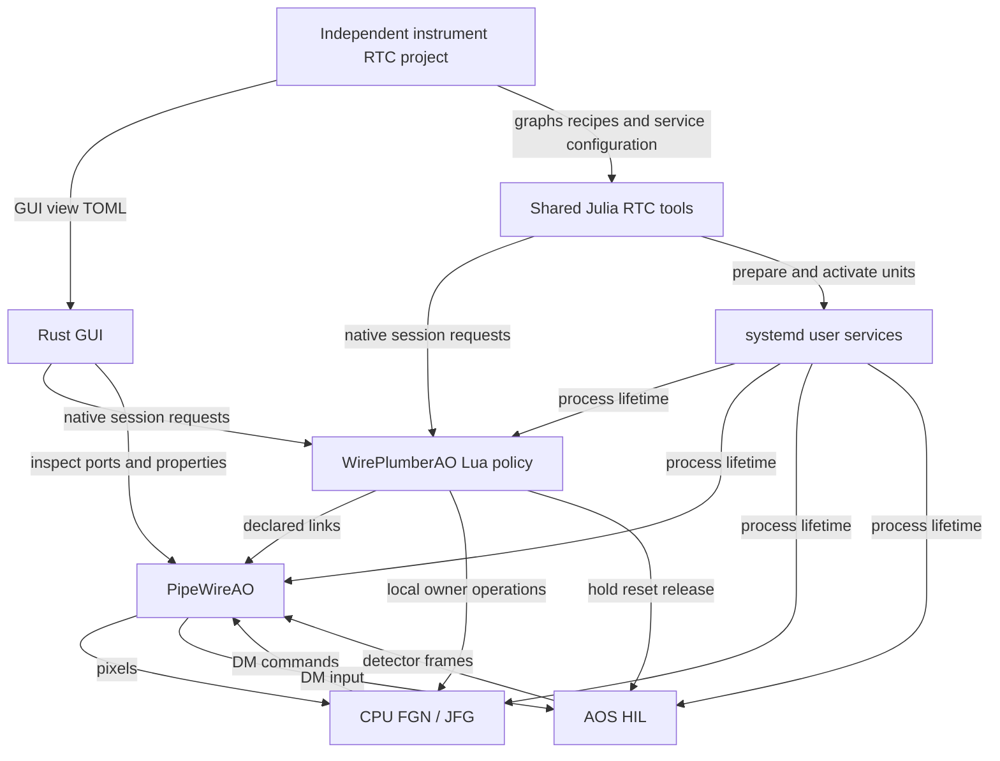

# RTC workstation structure and Julia migration

Status: revised proposal for review, 2026-10-08. Source baseline: `bbe8af6`.
This plan preserves RTC-ARCH-024/025 and RTC-DEV-030. It does not authorize
another lifecycle owner or claim the migration is implemented.

## Recommended structure

Make `pipewireao-rtc` a reusable Julia package for operational tools and
calibration driving. Each instrument RTC lives in its own project/repository.
The shared package does not become a monorepo of instrument implementations.
Keep the GUI in Rust and session policy in WirePlumberAO Lua. Reuse PipeWire's
interfaces for discovery, ports, links, formats and properties. Preserve native
v1 controls during implementation migration; evaluate protocol simplification
separately.

The headless workstation is a composition of services. It continues running
when the GUI or a command-line client exits.

| Component | Ownership |
| --- | --- |
| systemd user services | Process lifetime and configured scheduling/resource policy |
| WirePlumberAO Lua | Session admission, external links, coordinated start/stop/reset/update and required-loss handling |
| PipeWireAO | Native object interfaces, NDArray transport and published-node scheduling |
| FGN/JFG | Scientific graph execution, workers, workspaces and local adoption |
| AOS/HIL | Plant physics, model time, causal frames/commands and declared sources/sinks |
| AOC | Calibration probes, estimators and scientific calibration products |
| Shared Julia RTC tools | Configuration validation, systemd configuration/installation, preflight, CLI and completion-driven calibration driving |
| Instrument RTC project | Graphs, owner entrypoints, calibration recipes, coordinate/unit conventions, artifact references, session declarations and GUI TOML profile |
| Rust GUI | Visualization, configuration drafts, direct engineering inspection and session requests |



Native session requests also travel over PipeWire; they are application
semantics on that transport. Calibration clients use the acquisition owner's
native endpoint. WirePlumber owns session readiness. An AOS instance may expose
several declared sources/sinks; the diagram omits optional observation endpoints.

## Observed starting point

- Rust source is grouped by control, session and calibration. The Rust Statig
  and Julia DeploymentRunner session coordinators are removed.
- `deployment/julia` already contains the named `PipeWireAODeployment` package,
  native clients, export/install tools, session CLI and calibration campaigns.
  It also contains instrument-specific Classic/Copper/HEART export and analysis
  modules that need separation from generic tooling.
- At the proposal baseline, interaction-matrix acquisition executed the sealed Rust
  `bin/rtc-calibrate`; direct Julia capture stages already use native actions.
  See [the campaign](../deployment/julia/src/calibration_campaign.jl).
- The GUI imports this repository's Rust session client. Its generic PipeWire
  registry and PropInfo/Props access are independent of that dependency. It is
  the only active external Rust consumer found.
- The GUI already accepts `--view-config PATH` for typed operator-view TOML.
  Supported renderers can be composed without changing Rust. New semantic
  renderers require GUI implementation and schema review.
- WirePlumber's `modules/module-ao-control-endpoint.c` provides the bounded
  native endpoint; `src/scripts/ao/session.lua` owns policy. Neither belongs
  in a Julia launcher or GUI adapter.
- The starting exporter recursively copied `package_root()`. The first
  implementation increment extracts Base-only file-copy helpers and replaces
  root copying with explicit source/resource entries. Current source/test and
  scientific-resource directory closures remain until separation. See
  [the boundary inventory](RTC_PACKAGE_BOUNDARIES.md); this does not complete the
  root move or instrument-project migration.

## Independent instrument projects

The shared package should contain generic configuration, systemd, native control,
session and calibration modules with thin command entrypoints. Generic systemd
resources and protocol test records belong there. Instrument algorithms,
matrices, recipes and named owner entrypoints do not.

An instrument project has its own revision and Julia dependency environment.
An illustrative layout is:

```text
instrument-rtc/
  Project.toml
  Manifest.toml
  src/                # optional instrument integration and owner entrypoints
  bin/                # thin commands using shared tools
  configs/            # standard graph/session configurations; hardware/HIL modes
  calibration/        # recipes, coordinate maps and acceptance configuration
  artifacts/          # manifests/references; optional small calibration files
  gui/
    operator-views.toml
  systemd/            # instrument unit configuration and overrides
  test/
  docs/
```

This is a directory example, not a new operational bundle format. Large measured
recordings need not be committed to Git; calibration products retain hashes and
provenance. One REVOLT project may own Classic and Copper variants. Unrelated
instruments need not share a repository, release or dependency environment.
Repository creation and migration destinations require an implementation
inventory; this plan creates none. Keep the existing HEART repository unchanged.
Scientific algorithms remain in their packages, referenced by instrument glue.

### Calibration driving

Shared tools drive prepared probe plans through native acquisition actions:
hold, adopt, settle, collect, restore and release. They handle correlated
completion evidence, finite deadlines, exposure association and recovery.
AOC constructs probes and estimates products. Instrument recipes select the
method, illumination preparation, amplitudes, units, coordinate maps,
clipping/quality criteria and artifact destinations. They use AOC methods
rather than duplicate estimators. An adapter binds the declared owners and
ports; the common driver must not branch on instrument names.

CLI and GUI can invoke the same workflow. A running calibration is owned by its
calibration client process and acquisition owner, not a GUI panel. It is not a
second session authority. Define cancellation and client-loss recovery through
the existing bounded acquisition contract. Scientific acceptance remains
separate from successful acquisition and artifact adoption.

### systemd configuration

Shared tools render, install, inspect and activate ordinary user units from the
selected project's declared processes and configuration. Instrument entrypoints
load the scientific graphs. Host/site settings supply CPU placement, RT priority
and permitted memory/resource policy; these are not hardcoded for every
instrument. Retain the current target's CPU0/1 exclusion. systemd owns process
lifetime and enforcement; WirePlumber owns admission and session state. An
active unit alone does not prove readiness. This adds no launcher daemon,
service manager or persistent deployment database.

### GUI customization and the DAW model

The instrument's GUI TOML selects supported views, titles, bindings and
presentation defaults. It is separate from executable graph/session
configuration, which uses maintained PipeWire relaxed SPA-JSON paths.
No headless instrument project depends on the GUI package. The optional GUI
loads its instrument view file and observes the admitted session; missing GUI
views do not gate headless admission.

The DAW model supplies project editing, routing visibility, controls and meters.
An instrument project references graphs, artifacts, calibration recipes and
connections. Preparing it configures services. Opening a GUI view alone neither
starts acquisition nor grants admission. Runtime state is observable by GUI and
CLI alike. The GUI retains layout, selections and drafts, but no authoritative
copy of session state; disconnect sends no implicit Stop.

| State | Owner |
| --- | --- |
| Offline, Configuring, Ready, Running, Fault | WirePlumber session policy |
| Service active/failed and process incarnation | systemd |
| Prepared/executing graph and adopted generations | FGN/JFG |
| Model time, source cursor and pause/reset | AOS/HIL |
| Acquisition phases and correlated results | Calibration client and acquisition owner |
| Layout, selection and unsaved drafts | GUI |

HEART distinguishes block READY/RUNNING/CORRECTING and shared WFS/DM/loop
activity. Our session Running state does not prove correction authority.
Preserve graph execution, correction enablement and physical authority as
separate concepts. Physical-device authority remains outside the current
non-actuating scope.

## Control and dependency boundaries

Use standard registry, Node/Port/Link, PropInfo, Props and NDArray observation
APIs for generic engineering access. Retain `pipewireao.rtc.session/1` for
coordinated session requests and confirmed outcomes, and the existing native
action profile for calibration. Existing engineering write permissions remain.
The Lua policy owns session sequencing; clients own serialization/observation.

Maintain shared conformance records and profile specifications. Preserve
endpoint/controller identity, correlation, finite deadlines, bounded pending
work, stale-result fencing and separate submission/adoption observations.
Unknown outcomes permit neither automatic retry nor rebind. Keep v1 operation
IDs and field types through migration. Any incompatible protocol pruning needs
a separate version/rollout decision.

Move the GUI-used Rust dependency closure into its existing native adapter,
using its bounded worker and PipeWire bindings. A separate shared Rust crate
needs another active consumer. Keep native code outside WASM; remote browser
transport/authentication remains deferred.

Preserve separate operational and scientific environments. Installation,
discovery and session controls must not load AOS/JFG or initialize a GPU.
AOC probe generation/reduction runs in the selected scientific environment;
the acquisition driver consumes prepared plans. Each instrument selects its
own science dependencies. AOS may use CUDA/AMDGPU without making either a
mandatory dependency of common operational tooling.

Keep the existing Julia package name, UUID
`a3e2c7da-f73f-4284-8482-36ac422b34e6`, Julia >= 1.12 and test workspace during
the first shared root-package move. Package renaming is a separate decision.

Normal installation can use an instrument's project/Manifest with shared
packages and installed PipeWireAO/WirePlumberAO. An optional self-contained export
includes only that instrument's explicit runtime closure and provenance, not
every RTC, the GUI or the entire tooling repository. Version/artifact validation
applies in either mode. The existing sealed-export path remains during migration;
normal environment installation needs its own qualification before use.

Replace recursive copying before the root move. Initially preserve the specific
resources/tests required by installation checks. Resolve shared assets from the
loaded package and instrument assets from the selected project, not an accidental
working directory. Changed exports get new seals; existing sealed installations
and their processes remain untouched.

## Implementation order and evidence

| Phase | Work | Gate |
| --- | --- | --- |
| 1. Establish boundaries | Inventory generic tools versus instrument graph/export/calibration modules. Assign instrument-owned migration destinations; map operation callers and profile contracts. | Every selected operation/resource has an owner and destination. No instrument-name dispatch or mandatory instrument/GUI dependencies in shared tools. HEART source unchanged. |
| 2. Complete Julia tools | Consolidate existing session CLI and systemd tooling. Replace Rust acquisition using the Julia native action client and AOC plans. Expose reusable calibration driving; keep recipes in instrument projects. | Native-record conformance and success/cancellation/timeout/clipping/recovery parity with the temporary Rust oracle. Fresh calibration export needs no Rust executable. Two instrument profiles use unchanged shared tools. |
| 3. Detach GUI | Move its used Rust client closure into its native adapter and remove the RTC Cargo dependency. | Discovery/control, detach/reselect/unknown-outcome checks and existing WASM build pass. Attached GUI native requests do not invoke Julia. |
| 4. Package shared tools and instrument projects | Replace recursive copying with selected closure. Move generic Project/src/test/resources to package root; instrument assets to their projects. Update resource resolution and unit configuration. Retire Rust source after phases 2/3. | Package checks and affected instrument export/install/relocation/tamper checks pass. No other instrument or GUI required. Native records and scientific artifact bytes unchanged. |
| 5. Qualify and remove obsolete paths | Run affected installed checks, document commands and remove paths without active callers. | Selected calibration/session paths pass with bounded clean shutdown. Current guides describe one maintained path. |

Use retained Rust acquisition as a temporary comparison oracle, not a production
fallback. Preserve plan validation, Float32 values, units, probe order,
run/request/exposure identity, whole-stage deadlines and output limits.
Reports/configuration may remain JSON; live controls remain native. Preparation
and compilation precede accepted acquisition/frame work.

## Validation scope

- Reuse 99 live Rust tests, 19 default Rust tests, 2,663 Julia SDK assertions and
  shared protocol records as baselines, not proof of migration.
- Compare Julia acquisition event sequences/reports with retained Rust:
  correlation, rejection, unknown outcomes, clipping, exposure mismatch and
  failed recovery. Include bounded cancellation/client-loss behavior.
- Install independently configured instrument projects against the same shared
  package revision. Verify CLI calibration/systemd configuration without GUI
  dependencies and optional GUI TOML bindings against actual advertised objects.
- Check source/resource inventories, relocation, wrong seals, process
  incarnations, placement and bounded owned cleanup.
- Replay qualified Copper full-frame CPU FGN/JFG with CUDA AOS using unchanged
  inputs. Check start/stop/reset, gain and same-shape matrix adoption, retained
  outputs and GUI independence within existing finite replay boundaries.
- Qualify Classic, calibration and unchanged HEART bridge paths where their
  owners/entrypoints change. Preserve unresolved scientific gates and existing
  progressive graphs; broader row qualification remains roadmap work.
- Preserve zero steady-state allocation/GC requirements in science callbacks.
  Client allocations are separate; owner control preparation/compilation/GC must
  not stall accepted frames. Use targeted live-update allocation/delivery checks
  where those paths change.

No full latency campaign, host tuning, physical actuation or HEART modification
is required for a layout check. Keep the running GUI/HIL service untouched;
installed checks use isolated owned sessions. Executor/scheduling changes need
their own performance gates.

## Review and implementation limits

The instrument-project split supersedes the earlier plan's central
`instruments/` directory. Reusable calibration and systemd tools remain in scope;
GUI independence, WirePlumber/systemd ownership and native v1 controls remain.
The earlier review corrected duplicate-CLI wording and separated scientific
from operational environments. Independent source review of this revision found
no significant contradiction in the project/tooling split or GUI TOML support.
This is not an implemented migration or runtime qualification. Identify concrete
API and repository transfer boundaries before moving code; protocol pruning and
package renaming are separate.
