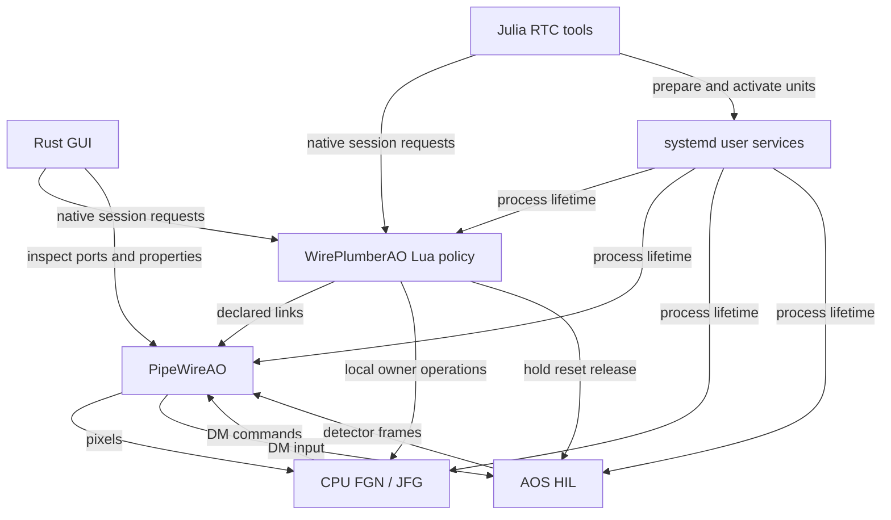

# RTC workstation structure and Julia migration

Status: proposal for review, 2026-10-08. Source baseline: `ae29179`.
This plan preserves RTC-ARCH-024/025 and RTC-DEV-030. It does not authorize
another lifecycle owner or claim that the proposed migration is implemented.

## Recommended structure

Make `pipewireao-rtc` a conventional Julia package containing operational tools
and calibration workflows. Keep the GUI in Rust and session policy in
WirePlumberAO Lua. Reuse PipeWire's interfaces for discovery, ports, links,
formats and properties. Preserve the existing native session contract while
changing implementations; simplify that contract separately where evidence
supports removing machinery.

The headless workstation is a composition of services, not a new RTC daemon.
It continues running when the GUI or a command-line client exits.

| Component | Ownership |
| --- | --- |
| systemd user services | Process lifetime and configured scheduling/resource policy |
| WirePlumberAO Lua | Session admission, external links, coordinated start/stop/reset/update and required-loss handling |
| PipeWireAO | Native object interfaces, NDArray transport and published-node scheduling |
| FGN/JFG | Scientific graph execution, workers, workspaces and local adoption |
| AOS/HIL | Plant physics, model time, causal frames/commands and declared sources/sinks |
| AOC | Calibration probes, estimators and scientific calibration products |
| Julia RTC tools | Configuration, export, installation, preflight, CLI and completion-driven calibration workflows |
| Rust GUI | Visualization, configuration drafts, direct engineering inspection and session requests |

This proposed control and execution split keeps clients outside frame processing:



The native session requests in the diagram also travel over PipeWire. They are
application semantics on that transport, not a separate network service.
Calibration clients request acquisition actions from the declared acquisition
owner through its existing native endpoint. WirePlumber still owns session
readiness. The diagram omits optional observation endpoints and owner-local
calibration details; an AOS instance may expose several declared ports.

## Observed starting point

- Rust source is now organized by control, session and calibration. The old
  Rust Statig and Julia DeploymentRunner session coordinators are removed.
- `deployment/julia` already contains the named `PipeWireAODeployment` package,
  native clients, export/install tools, the session CLI and calibration campaigns.
- Interaction-matrix acquisition still executes the sealed Rust
  `bin/rtc-calibrate`. Direct Julia capture stages already use native actions.
  See [the campaign](../deployment/julia/src/calibration_campaign.jl).
- The native GUI imports the Rust session client from this repository. Its
  generic PipeWire registry and PropInfo/Props access are independent of that
  dependency. The GUI is the only active external Rust consumer found.
- WirePlumber's `modules/module-ao-control-endpoint.c` provides the bounded
  native endpoint. `src/scripts/ao/session.lua` owns the policy. Neither belongs
  in a Julia launcher or GUI adapter.
- The current exporter copies `package_root()` recursively. Moving the Julia
  package to the repository root without changing that exporter would copy
  Rust source, documentation and experiment data into installed packages.
  See [the exporter](../deployment/julia/src/science_export.jl).

## State and DAW semantics

| State | Owner | Client behavior |
| --- | --- | --- |
| Offline, Configuring, Ready, Running, Fault | WirePlumber session policy | Observe and request transitions |
| Service active/failed and process incarnation | systemd | Inspect; activate or stop the exact owned units |
| Prepared/executing graph and adopted generations | FGN/JFG | Observe owner acknowledgements |
| Model time, source cursor and pause/reset | AOS/HIL | Request owner operations through the declared coordination path |
| Hold, adopt, settle, collect, restore, release | Calibration workflow and acquisition owner | Advance from correlated completion evidence |
| Layout, selection and unsaved drafts | GUI | Save presentation/project state; refresh operational state on attachment |

The GUI may keep presentation state and drafts. It has no authoritative copy of
the running session. Reattachment uses fresh identity/status observations;
disconnect sends no implicit session Stop.

The DAW model supplies project editing, routing visibility, controls and meters.
The project references ordinary graph configurations, artifacts, instrument
profiles and declared connections. It introduces no second graph language.
Opening a project prepares its package and services; acquisition starts only
after admission. Runtime status remains observable by GUI and CLI alike.

HEART distinguishes block READY/RUNNING/CORRECTING and shared WFS/DM/loop activity.
Our session Running state is not proof of correction authority. Preserve graph
execution, correction enablement and physical authority as separate concepts.
Physical-device authority remains outside the current non-actuating scope;
this migration adds no instrument mode or automatic live rerouting.

## Control interfaces

1. **Generic engineering access:** use standard registry, Node/Port/Link,
   PropInfo, Props and NDArray observation APIs directly. Keep read-only
   inspection independent of managed RTC control. Existing explicit engineering
   write permissions remain; this work does not broaden them.
2. **Coordinated session operations:** retain `pipewireao.rtc.session/1` over
   SPA_PARAM_Props for start/stop/reset, managed updates and confirmed outcomes.
   The Lua policy owns sequencing. Clients own serialization and observation.
3. **Calibration acquisition:** reuse the existing action profile and completion
   evidence. AOC owns probe construction and matrix estimation; acquisition
   code owns exposure association, clipping checks, restoration and release.

Maintain one specification for each profile, with language-specific codecs and
shared conformance records. Preserve endpoint/controller identity, request
correlation, finite deadlines, bounded input/pending work, stale-result fencing,
and separate submission/adoption observations. Do not automatically retry or
rebind after an unknown outcome. WirePlumber retains its single-operation
sequencing and bounded endpoint behavior.

Before removing any operation, classify its callers and semantics. Ordinary
read-only property queries may duplicate standard PipeWire access; generation
proof and multi-owner sequencing may not. Keep v1 operation IDs and field types
through the migration. Any incompatible protocol simplification requires a
separate version/rollout decision. A protocol codec remains necessary even if
there is no separate client-library package.

Move the GUI-used Rust session code into its existing native adapter modules.
Reuse its current bounded worker and PipeWire bindings. Do not create a new
shared Rust crate unless another active consumer needs it. Keep native code out
of the WASM build; browser UI remains supported at its current scope. Remote
browser transport/authentication is a separate deferred capability.

## Julia package layout

The target source layout is:

```text
Project.toml
Manifest.toml
src/
  PipeWireAODeployment.jl
  configuration/     # parse, validate, export, install, artifact closure
  services/          # systemd units, placement, bounded startup/cleanup tools
  control/           # native envelopes and owner-local client support
  session/           # discovery, selection, requests and observations
  calibration/       # acquisition workflow, campaigns and artifact publication
  instruments/       # RTC-owned Classic/Copper/HEART/AOS integration glue
bin/                  # thin Julia command entrypoints
configs/              # standard SPA-JSON configurations/templates
resources/
  systemd/            # user service/target templates
  owners/             # thin scientific-owner process entrypoints
test/
  runtests.jl
  Project.toml
  data/               # protocol records and test input data
docs/
```

These are source groups, not a new framework or mandatory public module ladder.
Move existing cohesive modules and update includes rather than adding forwarding
layers. Scientific algorithms stay in their current packages. Instrument glue
references AOS/HIL, JFG and AOC APIs; it does not absorb their algorithms.

Preserve separate operational and scientific environments. Ordinary installation,
discovery and session controls use the lightweight RTC environment; loading them
does not initialize AOS/JFG or a GPU backend. AOC probe construction and reduction
currently run in the scientific environment, including the exported `hil/`
project. Keep that boundary during the acquisition migration. The Julia
acquisition workflow consumes prepared probe plans and native completions; any
new scientific dependency needs an explicit packaging decision.

The initial root-package move keeps the package name and UUID
`a3e2c7da-f73f-4284-8482-36ac422b34e6`. Branding it `PipeWireAORTC` can be a later
explicit API/package-identity decision; it is not needed for this structure.
Keep Julia >= 1.12 and the test workspace. Installed SDKs may retain their
existing `julia/` directory regardless of the source checkout layout.

Export only an explicit runtime closure: project/lock, required Julia source,
entrypoints and assets. Retain the existing validation test closure initially;
reduce it only after identifying exactly what installation validation requires.
Do not copy the whole repository. Resolve resources from the loaded package,
never the working directory. Export to new packages with new seals/provenance;
leave existing sealed installations and their processes unchanged.

## Implementation order and completion evidence

| Phase | Work | Gate before proceeding |
| --- | --- | --- |
| 1. Fix boundaries | Map current operations/callers, distinguish generic access from coordinated requests, and document supported profiles. Record candidates for later protocol simplification. | Every selected operation has an owner, caller, request/reply schema and failure meaning. No silent removal or new policy owner. |
| 2. Complete Julia tools | Consolidate/expose the existing Julia session CLI and fill only identified command gaps. Replace Rust `rtc-calibrate` acquisition with completion-driven Julia using the existing native action client and AOC-produced probe plans. Update exports/campaigns to the Julia entrypoint. | Shared native-record conformance; success, cancellation, timeout, clipping and restoration/release behavior match the retained oracle. Fresh exported calibration package has no operational Rust executable dependency. |
| 3. Detach the GUI | Move only its used Rust client dependency closure into the native session adapter; preserve generic direct PipeWire access. Remove its RTC Cargo dependency. | Native GUI discovery/control tests, detach/reselect/unknown-outcome checks and existing WASM build pass. No Julia invocation is needed for an attached GUI's native control requests. |
| 4. Make the Julia root package | Replace recursive source copying with explicit closure, then move Project/src/test and group resources. Update wrappers, includes and resource resolution. Retire Rust Cargo/source/test code only after phases 2 and 3. | Package load/precompile/tests, fresh export/install, relocation, sealed-resource/tamper checks and literal-call-site audit pass. Native protocol data and scientific artifacts remain unchanged. |
| 5. Qualify and remove obsolete paths | Run affected installed checks, document commands, remove unused wrappers/modules/configurations and old compatibility paths with no active callers. | Selected session/calibration paths pass through the new package with clean shutdown; removed implementations have no executable callers. Current guides describe one maintained path. |

Use the retained Rust acquisition implementation as a temporary oracle in phase
2, not as a production fallback. Preserve plan validation, Float32 values,
units, probe order, run/request/exposure identity, whole-stage deadlines and
output limits. Reports/configuration may remain JSON; live controls remain
native. Preparation and compilation occur before accepted acquisition work.

For phase 4, preserve resource discovery and install behavior first, then move
individual owner resources. SDK content/hash changes require fresh provenance;
they are not scientific algorithm changes. Remove temporary aliases after
active callers migrate; old sealed packages keep their own source and wrappers.

## Validation scope

- Reuse the current 99 live Rust tests, 19 default Rust tests, 2,663 Julia SDK
  assertions and shared protocol records as baselines, not proof of the move.
- Add focused Julia acquisition regressions for correlation, no-effect rejection,
  unknown outcomes, clipped probes, exposure mismatch and failed recovery.
  Compare event sequences and reports with the retained Rust implementation.
- Check relocated packages, explicit source/resource inventories, wrong seals,
  process incarnations, configured placement and bounded owned cleanup.
- First replay the currently qualified Copper full-frame CPU FGN/JFG with CUDA
  AOS using unchanged scientific inputs. Check native start/stop/reset, gain and
  same-shape matrix adoption, retained outputs and GUI independence. Use the
  existing finite replay boundaries rather than a new rate target.
- Qualify migrated Classic, calibration and unchanged HEART bridge paths where
  their entrypoints/owners change. Retain existing unresolved scientific gates.
  Progressive graphs remain preserved; broader new-owner row qualification is
  tracked separately in the roadmap.
- Preserve zero steady-state allocation/GC requirements in scientific callbacks.
  Control-client allocation is separate, but owner-side control preparation,
  compilation and GC must not stall accepted frame work. Run the existing
  targeted live-update allocation/delivery checks where those paths change.

No full throughput/latency campaign, host power tuning, physical actuation or
HEART modification is required for a package-layout check. Keep the running
GUI/HIL service untouched; installed validation uses isolated owned sessions.
Any changed scheduling or executor behavior requires its own performance gate.

## Decisions remaining after review

The recommended default is Julia operational tooling, GUI-local Rust native
clients, unchanged v1 controls during migration, and unchanged Julia package
identity during the root move. Review these before implementation. Specific
protocol pruning and package renaming need demonstrated benefit and explicit
compatibility decisions; neither blocks the initial migration.

Independent source review found no architectural blocker. Its duplicate-CLI
finding was corrected, and separate scientific environments were made explicit.
This is a plan review; migration and runtime qualification remain future work.
