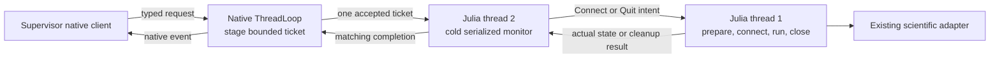

# Native ordinary-owner bootstrap

## Status and authority

This design covers RTC migration issue #9 under [RTC-ARCH-024](architecture.md#native-live-control-transport) and [RTC-DEV-030](operations.md#rtc-dev-030--native-local-live-controls). It is a design, not implementation or qualification evidence.

Source baseline: `2fb82e9`, worktree `pipewireao-rtc-owner-bootstrap`, branch `work/native-owner-bootstrap-design-20261006`. The worktree started clean. External JFG source inspected at `f2f4cd4`; public PipeWireAO Julia source supplies the thread and callback contracts below. Existing unrelated root and JFG changes were preserved.

The primary agent approved the distinct `pipewireao.rtc.owner-bootstrap/1` profile and a reserved second default Julia thread on 2026-10-06. The CPU scientific executor remains serial. The primary agent subsequently approved inactive HIL port preparation and exchange-method warming before Prepared. This profile supplies Status, Connect and Quit for ordinary simulator and external JFG owners. Calibration, correction and HEART retain their selected native profiles. Ordinary simulator pause/resume/reset/query retain the existing scientific `pipewireao.source-control/1` endpoint.

## Observed migration seams

| Source | Current selected behavior | Required seam |
| --- | --- | --- |
| [simulator.jl](../deployment/hil/simulator.jl), `main`, `run_owner`, `run_prepared_owner!` | Scientific imports precede `load_plant`/`prepare_science`; prepared JSON, connect-file wait, connected JSON and quit-file polling surround the frame owner. | Start the cold endpoint before scientific imports; replace the four marker operations with typed owner handshakes. |
| [owner_protocol.jl](../deployment/hil/owner_protocol.jl), `parse_options` | Marker mode is the ordinary-source default. Native acquisition options overload `control-node`, which ordinary SourceControlV1 also uses for its science node. | Distinct bootstrap options; reject marker/file-control flags in the selected ordinary path. |
| JFG `deployment/run_island.jl`, `run_service`/`run_connected_service` | Main constructs, prepares, connects and runs its node; prepared/connect/connected/quit markers drive startup and stop. | RTC SDK wrapper reuses the scientific preparation and run sequence with native handshakes. The existing script's guarded entry point permits inclusion without running its marker entry point. |
| JFG `deployment/startup.jl`, `configure_threads`/`spawn_monitor` | Live owners already require at least two default Julia threads; monitor tasks use public `ThreadPinning.@spawnat` on thread 2. Row workers start at thread 3. | Reuse this reserved monitor role; preserve scientific placement and row-worker assignments. |
| [deploy.jl](../deployment/julia/src/deploy.jl), owner validation/startup/`stop_owner!` | Owners outside the migrated HEART/acquisition cases still wait/touch marker paths. Generic source file-control configuration remains accepted. | Root-owned strict profile selection and native client startup/cleanup; reject unsupported legacy configurations before spawning. |
| [hil_export.jl](../deployment/julia/src/hil_export.jl), [calibration_export.jl](../deployment/julia/src/calibration_export.jl), JFG `deployment/export.py` | Ordinary simulator launches with `--threads=1,0`; generated external JFG launches with `--threads=2,0`; both carry marker descriptors/arguments. | Root-owned descriptors, sealed SDK assets/dependencies, thread flags and placement migrate together. |

The [live-control inventory](LIVE_CONTROL_INVENTORY.md) identifies early preparation and failures before source-port publication as bootstrap debt. Saved output reports, immutable captures, configuration and provenance remain artifacts; their existence is never live readiness authority.

## Thread ownership

Public PipeWireAO `ThreadLoop` runs on a native thread. Its Filter parameter callback stages a bounded owned request in [NativeControlEndpoint](../deployment/julia/src/native_control_endpoint.jl); it does not execute owner effects. `take!`, `check_ticket` and `complete!` serialize endpoint state under the same ThreadLoop lock. The public SDK also exposes EventSource, TimerSource and LoopChannel callbacks, but using them to dispatch owner effects would introduce a new callback policy. This design uses the existing staging boundary.

Public `NdArrayFilter.connect!` and `run!` require the thread that constructed the filter. `quit!` is explicitly callable from any Julia thread. FilterGraphPipeWire forwards these public methods. Therefore preparation, construction, connect, run and close remain on default Julia thread 1. The cold monitor is a sticky task on default Julia thread 2 using public `ThreadPinning.@spawnat`; it never constructs, executes or closes scientific graphs.

Both selected SDK environments declare `ThreadPinning` directly with compat `1`. The installed JFG environment already resolves version 1.1.1. Launch and startup validation require at least two default Julia threads with `--threads=N,0`; ordinary sources require `N=2`. A single-thread native launch fails before scientific preparation. No undocumented Julia scheduler API or arbitrary migrating `Threads.@spawn` replaces the reserved monitor.

Root-owned placement puts monitor thread 2 on the housekeeping CPU with SCHED_OTHER. Scientific CPU groups and executor thread counts remain explicit. Cold monitor work and a second native control connection are resource costs requiring installed verification; they are not a new scientific scheduler or worker.

The diagram shows which thread may apply each operation:



Only the monitor publishes bootstrap lifecycle/completion state. Main sends bounded typed facts to it; shared mutable scientific objects are never borrowed for Status. A lock protects the main/monitor handshake, and endpoint operations are performed after releasing that lock. Neither thread waits for the other while holding an endpoint or handshake lock.

## Wire and lifecycle contract

Reuse the common `NativeControlCodec` envelope, exact endpoint/controller identity, one pending request, one retained terminal completion, one independent rejection and existing finite admission budget. No new JSON-in-POD encoding is introduced. Requests are bounded to 16 KiB and replies to 64 KiB; strict envelope scalar widths, padding and arity remain authoritative.

| Item | Proposed exact representation |
| --- | --- |
| Profile | `pipewireao.rtc.owner-bootstrap/1` |
| Lifecycle Id | Preparing=1, Prepared=2, Connected=3, Fault=4, Stopped=5 |
| Operation Id | Status=1, Connect=2, Quit=3 |
| Request payload | Empty Struct for each operation; unknown operations or extra fields rejected |
| Completion/rejection payload | Struct(lifecycle Id, bounded message String); message at most 8192 UTF-8 bytes, valid text without NUL |
| Capability | Existing six profile-specific version/instance/owner-pid/lifecycle/last-token/controllers fields |
| Binding | Absolute private remote, exact bootstrap node name, spawned owner PID and retained positive incarnation |

There is no acquisition cursor, instrument, held/restored field, run window or fabricated science snapshot. The caller performs mandatory fresh native PID/incarnation/profile/controller proof. Names and process launch hints locate an endpoint; they do not confer authority. A fresh Status requires a newly processed matching request token, including in Preparing. No rebind, retry, marker fallback or saved-report readiness fallback follows uncertainty.

Status has no scientific effect and reports the most recently serialized phase. Connect is accepted only from Prepared; it stages one intent for main and completes only after actual connection/registration. A premature Connect is a healthy negative result and does not wait for preparation or acquire persistent authority. A second Connect from Connected is rejected without reconnecting. Quit from Preparing, Prepared, Connected or Fault stages cancellation/stop; successful Quit requires actual main cleanup, Stopped publication and terminal native flush. Stopped is terminal.

The endpoint's pending ticket is also the only accepted main-effect slot: do not create a second request queue or clear the accepted ticket before completion. Status or other callers during an accepted long Connect/Quit receive the common busy rejection. No extra bootstrap-specific persistent controller binding is introduced; exact per-ticket identity is supplied by the common endpoint. Foreign stale/removal/busy requests preserve lifecycle and the accepted owner's scientific state. Removal/expiry of the controller for an accepted Connect or Quit stops further effect progress and initiates cleanup; expiry of a Status has no scientific effect.

## Preparation and finite effects

The lightweight SDK entry point first validates flags/thread count, loads only the cold transport dependency set, publishes Preparing, starts monitor 2, and then loads scientific packages and the existing source body on main 1. Existing imports that define algorithms remain on main. One `Base.invokelatest` boundary after loading is allowed for owner construction; repeated control dispatch uses already-defined typed methods. No world-age workaround moves science into a native callback.

Preparation is not an accepted Connect effect and has a separate finite supervisor startup budget. Main checks cancellation between scientific imports, plant/backend loading, model preparation, recorder warming and transport preparation. Status remains freshly responsive from monitor 2 while a stage blocks. A blocked vendor/native/import operation cannot be safely interrupted; the process supervisor retains finite TERM/KILL fallback and reports unknown outcome. A native endpoint that has not yet published is likewise bounded by process startup supervision.

**Approved preparation ordering:** the public HIL `prepare_pipewire_hil` creates inactive streams without executing a simulation frame and waits for each node using a separately restarted `configuration.timeout_ns`. Current simulator invokes it after the Connect marker. Setting its configuration once to the remaining Connect time does not pass an absolute deadline through its second wait. Recommended SDK ordering: prepare inactive HIL streams and warm the existing exchange signatures during Preparing, then publish Prepared; accepted main-thread Connect performs existing `start!` and verifies actual registration under its ticket deadline. This changes early inactive-port visibility; it was explicitly approved before implementation. SourceControlV1 admits no frame before native resume. JFG keeps its existing disconnected construction/prepare, then accepted Connect on main; monitor waits for `isrunning` and public PAUSED/STREAMING state after main enters `run!`.

Accepted effects retain the ticket's receipt-based absolute deadline. Main checks it before and after each effect; monitor polls accepted-controller presence and deadline while main is blocked. Any supported nested synchronization receives the remaining deadline. No operation creates a fresh budget, waits for a late result and reports success, or retries a partially applied connect. Main also checks the shared cancellation fact before entering the next effect. Transport uncertainty can cause cleanup; it does not invent an applied scientific operation.

For JFG Quit, monitor may call the public any-thread `quit!` solely to release main's blocking `run!`; main closes the node and execution. For ordinary source Quit, monitor sets cancellation; main observes it at its existing serialized frame/service boundary, closes the HIL transport and writes the existing final report. Native Quit success waits for both cleanup and report publication, without using that report as live authority. Late cleanup remains attributable but cannot produce a successful expired completion.

Main exceptions send a bounded fault fact to the monitor. It publishes Fault while the core permits, preserves the primary error and any publication/cleanup errors, and allows finite supervisor cleanup. Endpoint/core loss is not reported as successful Fault publication. On accepted Quit, the monitor publishes Stopped and its matching completion, synchronizes the existing core within the same deadline, then acknowledges main's safe endpoint-close boundary. The endpoint is not removed immediately after submission or before terminal flush.

## Implementation ownership and order

| Increment | Owned changes | Evidence before integration |
| --- | --- | --- |
| BOOT-1 | Codec/client/runtime under `deployment/julia/src/native_owner_bootstrap_*.jl`; package includes and direct dependency; typed monitor/main handshake. | Pure strict wire/size/phase tests; actual private-core exact identity, fresh Preparing Status, collision/removal/expiry/cleanup tests. |
| BOOT-2 | `deployment/hil/native_owner_bootstrap.jl`, lightweight ordinary simulator entry point/body hooks, distinct parser options, generated external JFG SDK wrapper. No JFG algorithm/vendor edits. | Original-thread instrumentation; blocked preparation with responsive Status; Connect actual registration; Quit main cleanup before completion; fail-fast one-thread launch. |
| BOOT-3 — root | Strict deploy profile/configuration, owner clients, absolute remotes/incarnations, export descriptors/assets/direct dependencies, thread placement and launcher flags; reject all legacy operational marker/file-control configurations. | Fresh installed ordinary Classic/Copper native and external JFG profiles, early preparation failure, bounded terminal stop, no marker IPC. |
| BOOT-4 — root | System scientific and allocation gates after selected installed bootstrap migration. | Existing frame/command/reference comparison and inclusive zero-allocation boundary; owner/core/process cleanup, monitored thread placement. |

Root owns deployment runtime/schema, installed admission and scientific qualification. The bootstrap worker owns BOOT-1/2 and, after explicit adjudication, BOOT-3b exporter descriptors, helper/environment lists and their focused tests. Changes to shared generic envelope/endpoint semantics require separate evidence and adjudication. Persisted artifact writes are retained. Unsupported generic external owners must select a supported native SDK adapter or fail preflight with migration guidance.

## Required validation and limits

1. Pure codec tests cover every operation/lifecycle, exact arity/type/width/padding, unknown IDs, malformed text, capacity and complete envelope identity. No snapshot/JSON payload is accepted.
2. Actual private-core tests query Preparing with new tokens while main remains blocked in a representative GC-safe preparation gate; confirm construction/connect/run/close stay on main 1 and monitor stays on 2. Capability retention alone cannot pass this gate.
3. Actual tests distinguish competing/removed/expired requests before take and during accepted effects; reject premature Connect without effects, prevent accepted late Connect/Quit success, preserve matching terminal completion against later removal, and verify all resources close.
4. Connect checks actual public registration/readiness and completes before its original deadline. Quit completion follows main resource cleanup and final artifact publication; flush precedes endpoint removal. Failed preparation exposes fresh Fault when publication is possible and preserves primary failure if it is not.
5. Installed tests cover ordinary simulator CPU and supported external JFG full-frame/row-worker exports, strict thread/config migration, startup before science imports and finite process fallback for a deliberately blocked preparation stage. Backend availability and scientific functional/allocation gates remain separate; these transport tests establish no hardware or realtime qualification.

Observed source contracts justify the design. BOOT-1/2 are implemented and verified at the software levels recorded below. Installed migration, scientific equivalence, inclusive allocation and placement qualification remain root-owned BOOT-3/4 gates.

## BOOT-1/2 implementation evidence

The implementation adds the codec, retained client, cold runtime and installed SDK helper, splits the ordinary simulator into its thin entry point and `simulator_owner.jl` scientific definitions, and adds `jfg_owner.jl` around the existing JFG construction APIs. Including `simulator.jl` as a scientific library still loads its definitions for existing acquisition owners/tests; only its selected process entry point defers those imports until Preparing. Native ordinary parsing rejects every marker/file-control flag and uses distinct `--bootstrap-node`/`--bootstrap-instance`, retaining scientific `--control-node`. The HEART SDK helper's cancellation uses the native owner check hook; no vendor or scientific algorithm changes were made. Report `simulator_sha256`/`source_sha256` still identify the entry point `simulator.jl`, preserving analyzer expectations; the moved scientific body must also be frozen as an exported helper.

The monitor's later-loaded readiness and any-thread quit hooks use `Base.invokelatest` only on cold thread 2. Status/codec dispatch remains defined before scientific loading. The native ThreadLoop has the short name `rtc-bootstrap` for root-owned housekeeping placement. Successful source Connect additionally checks both public stream IDs/states after activation under the same ticket deadline. JFG Connect requires its public node ID, running loop and PAUSED/STREAMING state.

A native private-core discriminator established why ordinary Julia timer sleeps are insufficient for this monitor: a cache-only runtime variant replacing cold idle with `sleep(0.005)` produced **24 pass / 1 fail**, with the fresh matching native completion observed after the main thread's 1 s GC-safe blocking gate ended. The same native callback timestamp assertion passes with the existing JFG-style GC-safe `usleep` plus `yield` cold idle. This is a concrete responsiveness discriminator, not a latency or realtime bound. Initial client-task-return timestamps were not sufficient evidence and were replaced with the native observation timestamp.

| Software evidence | Result | Limits |
| --- | --- | --- |
| Pure codec | 67/67 | Strict operations, phases, arity/type/text/size, full unsigned controller serial, Bool identities and expired pre-binding budget; CPU9. |
| SDK parser | 33/33 | Ordinary flags, distinct nodes/incarnation and preserved JFG arguments; every marker/file-control option rejected. |
| Existing owner protocol suites | 108/108 | CLI, clock, typed source controls and HEART identity regression. |
| Actual private core | 47/47 | Fresh Preparing while main blocks; premature/expired foreign neutrality; busy collision; original-thread Connect; duplicate Connect rejection; cleanup-before-Quit and native flush; fresh Fault during cleanup; active Connect removal/expiry; later-loaded hooks on monitor2; atomic cancellation read zero allocation. CPUs9/11, no SCI frame. |
| Actual external JFG SDK | 7/7 | Exact spawned PID/incarnation, fresh Status, actual public registration and Connected, cold any-thread quit, original-thread close, matching Stopped and exit0. Existing leaky graph has no linked source/no SCI frame; CPUs9/11. |
| Scientific include seam | passed | Existing ordinary/acquisition scientific definitions load; no installed profile claim. |
| Existing simulator unit suites | 174/174 | Model-period, zero-step report/warmup, prefix publication, HEART units/native cancellation and sustained-report metadata regression; CPU9. |
| Single-thread bootstrap | rejected before preparation | Explicit `--threads=N,0`, N≥2 contract. |

Exact commands and retained logs are in `~/.cache/rtc-native-owner-bootstrap-20261006/`: `pure-source-final.log`, `actual-reviewed.log`, `jfg-actual.log`, `timer-before.jl`/`timer-runtime-before.jl`/`timer-before.log`, `include-seams.log`, `simulator-unit.log` and `resolve.log`. Direct ThreadPinning compat1 resolves offline to installed1.1.1; no dependency download or new Cargo target occurred. Source/parser mistakes and fixture races were corrected before these final results; retained earlier logs remain distinguishable.

Documentation local links, whitespace and final newline passed; the Mermaid diagram rendered using the retained CLI image. BOOT-1/2 evidence alone does not close issue #9. The later exporter work is recorded below; installed scientific/allocation and measured monitor/native-loop placement gates remain required.


## BOOT-3b exporter integration

Ordinary HIL source descriptors now bind `pipewireao.rtc.owner-bootstrap/1` at a node distinct from SourceControlV1. They use absolute `@RUNTIME@/@REMOTE@`, explicit role incarnation placeholders and `--threads=2,0`. External JFG owners use `hil/jfg_owner.jl` and retain their scientific graph/rate/parameter/pin arguments. HIL and JFG projects declare ThreadPinning directly. Ordinary process placement requires the `rtc-bootstrap` native ThreadLoop on the process leader CPU with SCHED_OTHER; this descriptor is a requirement, not measured placement evidence.

Recorded legacy JFG descriptors are upgraded only during offline export, after checking their exact maintained script, role, all four marker names/arguments, session control and old remote binding. Unsupported/custom descriptors fail. Runtime profiles retain the strict default; only the input export validation opts into `legacy_export_input=true`. Original sealed base deployment/provenance hashes remain recorded. New HIL bootstrap conversion metadata records the converted roles and current entry-point, scientific-body and SDK helper hashes. Initial calibration records its acquisition/graph transport conversion and helper hashes. Neither path reports historical marker inputs as already natively qualified.

Selecting native calibration/correction acquisition removes ordinary bootstrap flags, fields and the corresponding source placement requirement. The shared calibration/correction export helper lists now include `simulator_owner.jl`, `native_owner_bootstrap.jl` and `jfg_owner.jl`. Exporter and correction owner require the same expanded frozen-helper key set. The correction scientific hash gate remains unchanged in strength: a fresh upgraded HIL base is required, and a historical helper mismatch is rejected.

Focused software verification passed **449/449** checks on CPU9 and retains exact output in `~/.cache/rtc-native-owner-bootstrap-20261006/exporters-final.log`. It covers strict-profile rejection of operational legacy descriptors, explicit offline input acceptance, migrated native profile acceptance, source/control endpoint separation, preserved scientific arguments, marker removal, role incarnation bindings, native acquisition stripping, helper assets/provenance hashes and matching frozen exporter/SDK key sets. These tests do not run an installed scientific cohort, establish stream readiness, measure allocation or prove OS thread placement. Those BOOT-4 gates remain required.


Verification command:

```sh
taskset -c 9 julia --startup-file=no --project=deployment/julia -e 'using PipeWireAODeployment; include("deployment/julia/test/test_native_bootstrap_exports.jl"); include("deployment/julia/test/test_exports.jl"); include("deployment/julia/test/test_heart_calibration_export.jl"); include("deployment/julia/test/test_heart_correction_export.jl")'
```

The strict descriptor suite contributes 12 assertions; the split JFG wrapper suite contributes 18. Earlier `exporters-fixture-error.log` retains a test-only dictionary-pair sorting error corrected by selecting `by=first`; no production remediation was inferred from it. Temporary revision fixtures emit existing `git` diagnostics for paths outside a repository; all final test summaries pass and the process exits zero.

## BOOT-R001 allocation remediation

The independent review established continuous quiet-monitor allocation. The
unchanged GC-enabled private-core oracle reproduced it locally on CPU15:
baseline zero, quiet Connected 500 ms windows 1,714,944 and 1,773,408 bytes.
Suppressing registry traversal alone reduced this to about 4.4 KB per window,
which still failed the zero-byte requirement. Profile.Allocs attributed the
remaining per-cycle allocations to dynamically constructed facts (32 bytes)
and the public SDK filter-state error-pointer reference (16 bytes). A concrete
`Facts` record makes the facts read allocation free. The paired SDK remedy is
PipeWireAO commit `6e4e1ee`; its public getter retains callback/closed/native-error
checks and queries healthy state without allocating error-output scratch.

The monitor now atomically consumes the previous wake with `atomic_xchg!`.
Neither `poll!` nor `take!` clears a later signal. Every duty cycle still checks
endpoint health and pending state under the native ThreadLoop lock and reads
main facts. Registry poll/take runs only for a consumed wake or pending ticket.
Accepted Connect/Quit retains `Endpoint.check_ticket` on every cycle, including
expiry/removal without new ingress. Core errors, registry additions/removals,
controller-info/revocation and accepted/negative publications produce wakes
through the existing callbacks/publisher. A callback after the atomic exchange
leaves its signal for the next cycle; an already-staged ticket independently
forces work through the locked pending check. Fault cleanup and terminal sync
budgets are unchanged.

With both remedies, the original reviewer oracle observes **zero bytes and
zero pool allocations** in both quiet Connected 500 ms windows, matching its
zero baseline. Direct cold `Endpoint.poll!` still allocates 9,712 bytes; deliberate
cold control work is not suppressed or relabelled as quiet operation.

| Focused software verification | Result | Scope |
| --- | --- | --- |
| Actual quiet monitor regression | 12/12 | Same GC-enabled whole-process windows, wake preservation across poll/take, zero direct quiet/facts reads, and a reported health failure with no wake. |
| Existing actual private-core lifecycle | 49/49 | Previous 47 assertions plus staged pending-ticket checks with a consumed hint; freshness, foreign expiry neutrality, busy, original-thread effect, accepted deadline/removal, Fault, cleanup and flush. |
| Actual external JFG SDK | 7/7 | Existing public construction/connect/run/quit and original-thread close seams, zero SCI frames. |
| SDK state getter | 10/10 plus existing filter 143/143 | Cache-only original-getter reversal fails the unchanged zero test (9 pass / 1 fail; 16,000 bytes per 1,000 healthy queries); corrected getter preserves callback identity, native error code/detail and closure. |

Evidence and exact scripts are retained in
`~/.cache/rtc-native-owner-bootstrap-remedy-20261006/`: `idle-before.log`,
`idle-after-final.log`, `idle_diagnostic.jl`, `idle-facts-diagnostic.log`,
`run_actual_proofs.jl`, `actual-runtime-final.log`, and the SDK proof/logs.
The proof selects the fixed source SDK explicitly; the deployment registry
version 0.6.16 still has the old getter. The existing deployment Manifest was
copied into the ignored SDK Manifest to use installed JLL +19; no dependency
resolution/download occurred. Initial standalone fixture invocations lacked
full-suite helper/module setup and were corrected; they establish no production
failure. Independent review and installed inclusive scientific/allocation and
measured placement qualification remain required.
