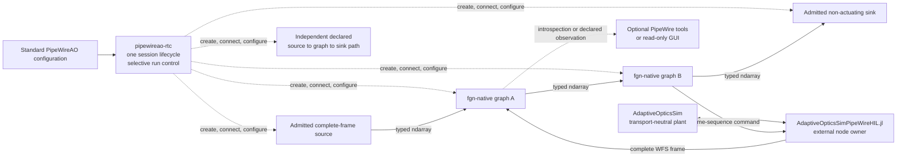

# PipeWireAO development RTC architecture

Status: active development baseline; implementation underway

Review date: 2026-09-01

## Decision

The first executable `pipewireao-rtc` product is a small headless runner for one
non-actuating Calculon/PipeWireAO graph. It loads one standard PipeWire
configuration, realizes a source → graph → sink topology, applies initial
properties and ndarray parameters, exposes a small lifecycle, and leaves the
result visible to ordinary PipeWire clients.

This is decision **RTC-ARCH-011**: use the small, non-actuating development
runner as the only active product baseline. This decision supersedes
RTC-ARCH-010 as the active delivery posture without reusing or changing that
identifier. The former full-RTC decisions and requirements are retained in the
[inactive design archive](archive/full-rtc/README.md). They are not selected by
this baseline.

The purpose is to prove the useful middle ground originally sought for
PipeWireAO: a scientific processing graph that is easier to construct than a
large observatory RTC, but more typed and composable than hand-written shared
memory processes.

The next active direction treats that runner as a small RTC workstation, or
RTCW.

This is decision **RTC-ARCH-013**: extend the development session to contain
multiple existing `fgn-native` filter-graph instances and explicit ordinary
PipeWire links between them. Graph authoring remains in the maintained
PipeWireAO `filter.graph` configuration. The runner MUST NOT parse filter-graph
internals, invent a second session graph language, or schedule frame processing
itself.

One session-level Statig lifecycle initially owns every required endpoint,
filter-graph instance, and link. Configuration is successful only when the
whole declared session is ready; session start, stop, retry, and unload apply
to the session as a unit. PipeWire remains responsible for scheduling and can
execute independent graph components concurrently.

This is decision **RTC-ARCH-014**: add selective run control for declared
execution groups without creating independent graph ownership lifecycles.
The session lifecycle remains the sole owner of configuration, realization,
required-object failure, retry, and cleanup. While the session is `RUNNING`,
the same serialized dispatcher may stop and restart a configured execution
group through typed effects. Stopping a group preserves its realized objects,
links, and algorithm state; reset, bypass, replacement, and unload are
different operations and are not implied.

An execution group names session boundary nodes, not operations inside a
PipeWireAO `filter.graph`. Separately controllable groups cannot be connected
directly in this increment. A shared upstream node remains session-managed,
and each link from it into a group must use declared standard PipeWire passive
link behavior so that a stopped branch cannot make the shared node or another
branch stop progressing. This adds control-plane granularity only: PipeWire
and FGN continue to own scheduling, buffers, and frame processing.

This is decision **RTC-ARCH-015**: compose externally implemented processing
and HIL applications through ordinary PipeWire nodes. The RTC configuration
identifies those nodes and their public ports; it does not identify or
interpret the package, language, process, or internal graph that implements
them. A launcher outside the RTC starts each external application on the
selected private core before the RTC realizes its links.

The first reference application is a transport-neutral AdaptiveOpticsSim plant
through a separate `AdaptiveOpticsSimPipeWireHIL.jl` package. The application
owns one complete WFS-frame source node and one non-actuating
correction-command sink node. AdaptiveOpticsSim MUST NOT depend on or contain
PipeWireAO code. The RTC runner owns the Calculon graphs and the declared links
to those external nodes; it does not load Julia, execute the simulation, or
take ownership of the application nodes.

The adapter keeps the feedback coupling inside its application boundary so the
PipeWire topology remains acyclic. For sequence `n`, it publishes one complete
simulated WFS frame, accepts exactly one complete command with the same
sequence, and applies that command to simulated frame `n + 1`. This is a
non-actuating HIL reference system and does not introduce physical correction
authority.

## Active scope

The active implementation begins with:

- one simulated or recorded complete-frame source;
- one `fgn-native` Calculon execution composite;
- one simulated, discard, or otherwise non-actuating sink;
- one small Rust runner with a Statig hierarchical lifecycle and diagnostics;
- initial scalar properties and ndarray parameters;
- ordinary read-only PipeWire inspection; and
- numerical and state-equivalence tests against the maintained Calculon or
  fused reference.

After that fixture, the active RTCW composition increment adds only:

- a serial chain of two declared `fgn-native` filter-graph instances;
- one declared source forked to two filter-graph instances, each with its own
  non-actuating sink;
- two independent declared source → graph → sink paths in one session;
- declared execution groups for whole-chain, independent-path, and fork-branch
  start and stop control;
- exact PipeWire links from the same standard configuration; and
- optional scientific inspection through standard PipeWire introspection and
  suitable bounded non-gating observation surfaces.

The next reference-system increment adds one externally owned AdaptiveOpticsSim
WFS source, one externally owned simulated command sink, and one or more
runner-owned Calculon graphs between them. The integration package, not
AdaptiveOpticsSim, owns PipeWire stream and acquisition-metadata mapping.

The first maintained fixture is the minimal complete-frame source → graph →
discard path. The AdaptiveOpticsSim HIL reference follows the RTCW composition
fixtures. REVOLT Classic, with its 277-actuator command vector and explicit
SHWFS subaperture origins, follows that reference-system increment.

The following are not part of the active baseline:

- physical cameras or deformable mirrors;
- permission to enter a correction-authorized state;
- operational instrument authority, safe-state arbitration, or multi-process
  fencing;
- durable recording, audit, run reconstruction, or scientific FITS export;
- row-block, region-block, fixed-worker, or multi-batch scheduling;
- Julia graph execution;
- remote control, a web gateway, or WebRTC preview;
- WirePlumber-specific application logic or generated service-manager units;
- CPU affinity, real-time scheduling, NUMA placement, or strict-island
  admission; and
- operational, safety, deadline, tail-latency, or target-host qualification
  claims.

These exclusions are deliberate. A later project may select one capability
from the archive, revise it against current interfaces, and add it without
changing scientist-authored algorithms.

## System boundary

| Component | Active responsibility |
| --- | --- |
| `pipewireao-rtc` | Validate the development configuration, realize its exact session topology, serialize session and execution-group control, report observed status, and clean up the objects it owns. |
| PipeWireAO | Own ndarray transport, format negotiation, scheduling, FGN hosting, property and parameter publication, and standard PipeWire introspection. |
| Calculon | Own ordinary typed scientific algorithms and declarations of ports, shapes, schemas, scalar properties, ndarray parameters, and construction values. |
| Source | Produce complete frames for simulation or deterministic replay. |
| Sink | Consume graph output without addressing or controlling physical hardware. |
| Observer | Inspect standard PipeWire objects and, where a suitable boundary exists, scientific samples. It is optional and never owns runner lifecycle or graph progress. |
| AdaptiveOpticsSim | Own the simulated atmosphere, optics, WFS, deformable mirror, science diagnostics, model time, and frame-to-command causality without a PipeWire dependency. |
| `AdaptiveOpticsSimPipeWireHIL.jl` | Map one prepared AdaptiveOpticsSim HIL boundary to an externally owned PipeWire source and non-actuating sink using public PipeWireAO interfaces. |

The runner is the control plane for this small session. It does not process
frame data, create execution threads for graph operations, or replace
PipeWire scheduling. PipeWireAO and FGN remain the data plane.

## Configuration boundary

The active configuration is standard PipeWire relaxed SPA-JSON, compatible
with existing PipeWireAO tools and the current graph generator. The initial
implementation does not introduce TOML, YAML, a deployment database, a
runner-private topology schema, or a multi-file operational bundle.

The minimum configuration identifies one source, one canonical FGN graph, one
sink, initial properties, ndarray parameter files, and optional observation
ports. The RTCW extension uses the same standard configuration to identify
additional source, graph, sink, link, and execution-group objects. An
execution group contains only declared session node names and does not copy or
interpret a `filter.graph` body. Each `filter.graph` body is passed to the
maintained PipeWireAO module; it is not decoded or regenerated by an
RTC-specific filter-graph parser. Paths and launch-time selections are
resolved before streaming. Construction and topology changes are handled by
stopping and reloading the development session.

An external node is selected by declared external ownership and exact node
name, port name, direction, element type, shape, and schema. Discovery may
locate that already-running declared object; it MUST NOT substitute another
node or create an undeclared critical link. The runner owns links that it
creates to the node but does not own or destroy the node. It does not require
implementation-identifying properties.

This same boundary applies when `JuliaFilterGraph.jl` and its
`FilterGraphPipeWire` adapter publish a prepared Julia graph as one PipeWire
node. The RTCW sees public ports, formats, schemas, and links—not Julia
algorithms or the graph host. General external processing-node lifecycle and
selective-control evidence are planned after the external source-and-sink HIL
slice; the current implementation must not imply that support merely from
external endpoint discovery.

The development safety boundary is the complete launched composition on an
isolated private core. Factory allowlists still govern objects created by the
runner. An external declaration does not prove that an arbitrary node is
non-actuating and does not admit physical endpoints on the user's normal
PipeWire core.

Each graph remains one canonical PipeWireAO model. A script, maintained
generator, or future GUI may construct the standard configuration, but none
introduces another graph executor or private transport.

## Scientist boundary

A scientist supplies an ordinary typed Calculon algorithm and declaration:

- scientific port names, element types, shapes, and schemas;
- scalar runtime properties;
- large ndarray parameters such as reconstructors, masks, references, and
  subaperture origins; and
- construction values that genuinely affect the portable algorithm.

The adapter and host supply PipeWire ports, SPA callbacks, raw-pointer checks,
error translation, property publication, parameter adoption, buffer handling,
and worker machinery. Adding an algorithm must not require a central plugin
registry edit or a hand-written SPA plugin. The same scientific implementation
must remain directly testable with ordinary arrays and usable by another graph
executor such as AdaptiveOpticsSim.

## Implementation language and placement

Rust is the default language for the runner because it is a small stateful
PipeWire client and configuration tool. This choice is not part of the
scientist-facing ABI. C remains at existing SPA and PipeWireAO ABI boundaries;
scientific algorithms remain in their Calculon implementation language.

This is decision **RTC-ARCH-012**: implement the runner lifecycle with
Statig's blocking state-machine API and a single serialized dispatcher from
the first increment. The public lifecycle remains the domain model in
RTC-DEV-004; Statig types stay private. State handlers produce typed effects,
potentially blocking configuration and PipeWire work executes outside the
handlers, and results return as typed completion events. This establishes the
same lifecycle mechanism that later operational work can extend without
selecting any archived physical-device, correction-authority, supervision, or
recovery behavior.

The runner, PipeWire daemon, and optional observer are separate ordinary
processes. The baseline does not prescribe systemd units, affinity, scheduler
classes, or one process per graph operation.

## Authoritative lower contracts

This repository does not duplicate the data-plane contracts:

- [ndarray filter graph](https://github.com/DarrylGamroth/PipeWireAO/blob/master/doc/dox/internals/filter-graph-ndarray.md)
  owns the plugin ABI, graph validation, execution, properties, parameters,
  and FGN worker behavior;
- the Calculon `docs/scalar-property-contract.md` contract owns portable
  property semantics; and
- Calculon algorithm declarations own scientific ports, schemas, shapes, and
  reference behavior.

Row-block and progressive-processing documents remain valid PipeWireAO design
inputs, but they are not selected by this complete-frame RTC baseline.

## Claim boundary

Completing this baseline proves only that an identified development
configuration can construct, run, inspect, and stop its non-actuating graphs,
selectively pause and resume declared execution groups, and match accepted
outputs to the maintained reference within declared tolerances. It does not
prove physical-device interoperability, closed-loop safety, durable
reconstruction, hard real-time behavior, or production readiness.
