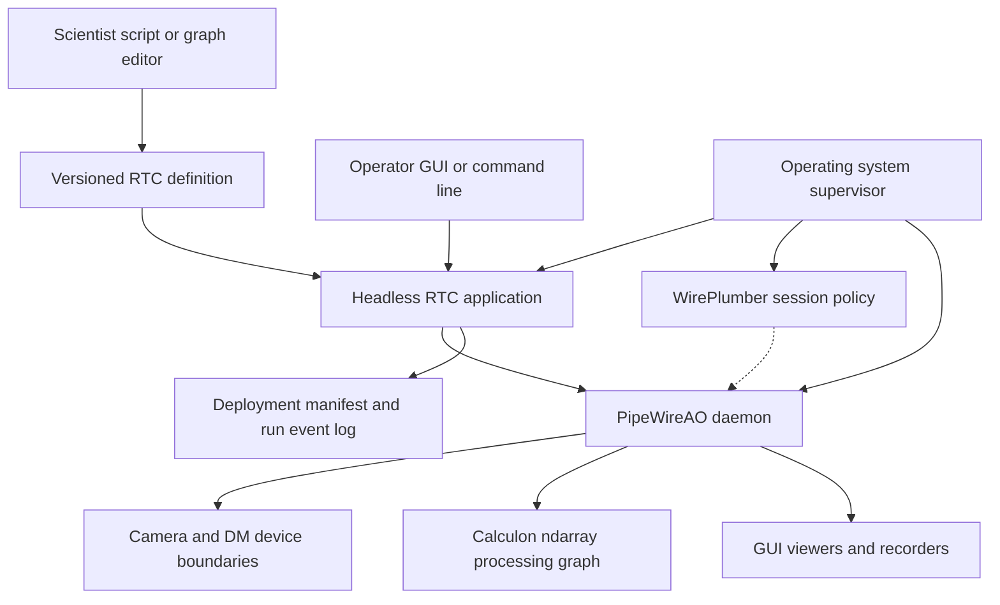
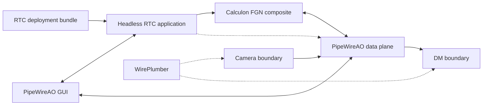
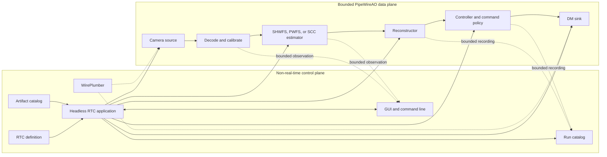
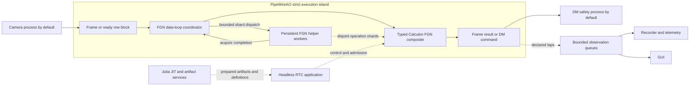

# PipeWireAO real-time controller architecture

Status: proposed system architecture;
RTC-ARCH-001 through RTC-ARCH-008 selected across the RTC document set

Review date: 2026-08-29

## Executive recommendation

Calculon and PipeWireAO already contain most of the difficult real-time data
plane:

- transport-neutral scientific algorithms and declarations;
- a typed ndarray graph with bounded property and parameter publication;
- camera, decoder, calibration, graph, and deformable-mirror boundaries;
- an FGN-owned fixed-worker runtime for dense and progressive row-block
  processing; and
- a detachable graph inspector and ndarray viewer.

They do not yet form an operational real-time controller (RTC). The missing
center is a headless, domain-aware **RTC application**, `pipewireao-rtc`, that
owns the deployment in the same sense that a digital audio workstation (DAW)
owns its project. It resolves configuration, admits the graph, manages the
instrument lifecycle, authorizes correction, activates artifacts, evaluates
health, performs recovery, and records run provenance. It is the runtime
control plane, not part of the frame-processing path.

The recommended product boundary is:

| Owner | Responsibility |
| --- | --- |
| systemd or an equivalent service manager | Start, stop, isolate, and restart operating-system processes; assign privileges, CPU sets, memory limits, and scheduling policy. |
| `pipewireao-rtc` headless application | Interpret one RTC definition, resolve artifacts, construct and validate the graph, own the instrument state machine, authorize correction, evaluate health, and produce a deployment manifest and event log. |
| WirePlumber | Discover and configure devices, apply access policy, and provide narrowly partitioned generic external-link policy. It does not own the RTC definition or instrument lifecycle. |
| PipeWireAO daemon and nodes | Negotiate formats, schedule the admitted graph, move bounded buffers, execute scientific operations, and publish runtime state. |
| Device plugins and hardware watchdogs | Own each physical device, validate device-boundary formats and identity, and put actuators into a safe state even if the RTC application, WirePlumber, or daemon dies. |
| Calculon | Define scientific algorithms, ports, schemas, properties, parameter plans, and portable reference behavior without exposing PipeWire or its Simple Plugin API (SPA). |
| GUI and command-line clients | Edit or select an RTC definition, request lifecycle transitions, inspect nodes and properties, and visualize or record observation streams. They do not own the loop. |

Do **not** fork WirePlumber or base the product on the replaced
`pipewire-media-session` example. Use maintained WirePlumber for generic
PipeWire session policy, and use `libwireplumber` from the headless RTC
application where its cached object model and asynchronous utilities reduce
client plumbing. The RTC application owns the project-like deployment and
explicit AO topology. WirePlumber must exclude those objects from fallback,
movement, and competing auto-link policy.

Hosting the RTC application as WirePlumber components remains a valid
appliance packaging option. In that arrangement, WirePlumber is the host; the
AO components and deployment bundle are still the RTC application. Stock
WirePlumber is no more “the RTC” than it is a DAW.

The intended middle ground is therefore achievable:

- easier to author and inspect than HEART, CACAO, or MagAO-X;
- more explicit, reproducible, bounded, and safe than an assembly of pyRTC
  processes and scripts; and
- neither a second scientific runtime nor a second frame transport layered on
  top of PipeWireAO.

## Scope and non-goals

This document defines the missing system layer above the current Calculon,
PipeWireAO plugin, and GUI workspaces. Its companion
[assessment and delivery roadmap](roadmap.md) compares the local
RTC implementations and supporting projects and defines implementation order.
That comparison describes inspected snapshots, not every feature ever deployed
with those projects.

This proposal does not:

- claim that the current PipeWireAO stack is ready to command a physical DM;
- move configuration parsing, recording, or GUI work onto a real-time data
  loop;
- replace physical watchdogs or device-local safe-state behavior with a
  control process;
- require every RTC to use one archive format;
- require D-Bus, Aeron, or another control bus;
- make the GUI a required service; or
- require scientists to write SPA callbacks, graph plugin wrappers, process
  managers, or lifecycle state machines.

The first target should be a single-host RTC. Multi-host orchestration, NUMA
placement, failover, remote artifact transfer, and observatory integration are
valid later extensions, but they should not distort the first control-plane
contract.

This is the system-level companion to the
[ndarray filter-graph contract](https://github.com/DarrylGamroth/PipeWireAO/blob/master/doc/dox/internals/filter-graph-ndarray.md), the
[row-block ndarray contract](https://github.com/DarrylGamroth/PipeWireAO/blob/master/doc/dox/internals/row-block-ndarrays.md), the
[progressive wavefront-processing design](https://github.com/DarrylGamroth/PipeWireAO/blob/master/doc/dox/internals/progressive-wavefront-processing.md),
the [acquisition identity and timing contract](https://github.com/DarrylGamroth/PipeWireAO/blob/master/doc/dox/internals/acquisition-metadata.md), and the
[polling data-loop design](https://github.com/DarrylGamroth/PipeWireAO/blob/master/doc/dox/internals/polling-data-loops.md). Those documents remain
authoritative for their data-plane and ABI boundaries.

## Document set and authority

This file is the system architecture and decision index. It
should not also become the complete specification for every clock, scientific
quantity, device command, metric, and archive record. Detailed cross-cutting
contracts are maintained as focused companions:

| Document | Authority |
| --- | --- |
| This architecture | RTC system boundary, component ownership, target topology, execution placement, and selected-decision index. |
| [RTC operational architecture](operations.md) | Instrument lifecycle, configuration and artifact admission, scientist workflow, control projection, telemetry, recording, GUI behavior, WirePlumber policy, and process supervision. |
| [RTC assessment and delivery roadmap](roadmap.md) | Comparative evidence, current capability assessment, missing work, implementation phases, completion gates, open decisions, and evidence baseline. |
| [RTC time, causality, and performance](time-and-performance.md) | Clock domains, causal ordering, completed-frame boundaries, deadline semantics, replay timing, benchmark load, and performance evidence. |
| [RTC scientific data and command contracts](scientific-data-and-command-contracts.md) | Quantity and unit compatibility, normalization, DM command stages, constraint outcomes, and controller-result policy. |
| [RTC audit and reconstruction contract](audit-and-reconstruction.md) | Protected-operation progression, causal audit identity, terminal disposition, durability isolation, run reconstruction, and safe replay. |
| [Acquisition metadata](https://github.com/DarrylGamroth/PipeWireAO/blob/master/doc/dox/internals/acquisition-metadata.md) | `SPA_META_Acquisition` ABI and the exact acquisition identity, exposure-time, and multi-host timing fields. |
| [FGN contract](https://github.com/DarrylGamroth/PipeWireAO/blob/master/doc/dox/internals/filter-graph-ndarray.md) | Plugin ABI, graph validation and execution, property and parameter publication, and fixed-worker ownership. |
| [Row-block ndarray contract](https://github.com/DarrylGamroth/PipeWireAO/blob/master/doc/dox/internals/row-block-ndarrays.md) | Row-block format, marker, discontinuity, assembly, and conditional-output behavior. |
| [Progressive wavefront-processing design](https://github.com/DarrylGamroth/PipeWireAO/blob/master/doc/dox/internals/progressive-wavefront-processing.md) | Frame-scoped progressive algorithms, worker partitioning, scientific commit, and serial equivalence. |

The main architecture states only the system-level consequences of those
contracts. New subsystem detail should go in its owning companion and be linked
here. This keeps each document independently reviewable and lets tools load the
relevant contract without consuming the complete RTC roadmap.

## What is the RTC application?

The phrase “RTC application” currently conflates four different things. The
recommended definitions are:

1. An **RTC definition** is a versioned, declarative description of the
   instrument profile, processing graph, artifacts, deployment policy, and
   operator views.
2. An **RTC deployment** is a resolved definition: every artifact, plugin,
   device, dimension, schema, scheduling class, and executable revision is
   concrete and recorded.
3. The **headless RTC application**, `pipewireao-rtc`, loads and realizes one
   deployment and owns its logical lifecycle. Its GUI may disconnect without
   ending the application.
4. A running **RTC system** is the headless application, WirePlumber,
   PipeWireAO daemon, admitted nodes, device boundaries, recorders, and
   operating-system supervision acting together.

Thus, `pipewireao-rtc` is the missing domain executable, but it is not by
itself the complete RTC system. WirePlumber is a session-policy service within
that system, not the owner of the scientific project or instrument lifecycle.

The graph is not the application, the GUI is not the application, and the
session manager is not the application. They are components of one resolved
deployment.

## DAW precedent and application boundary

Professional-audio applications establish the useful precedent. A DAW loads
its project, owns its internal track and plugin graph, registers external JACK
or native PipeWire ports, processes buffers, controls transport and recording,
and persists project state. PipeWire schedules its externally visible node and
ports. WirePlumber configures devices, permissions, and generic external
linking; it does not load the DAW project or manage the DAW's internal plugin
state.

PipeWire maps a JACK client to a PipeWire client plus node, and JACK ports to
PipeWire ports. A session manager is expected to be aware that JACK clients
may link their nodes directly. See the upstream
[PipeWire object mapping](https://pipewire.pages.freedesktop.org/pipewire/page_objects_design.html)
and [WirePlumber linking policy](https://pipewire.pages.freedesktop.org/wireplumber/policies/linking.html).

The RTC follows the same separation:

| Professional audio | PipeWireAO RTC |
| --- | --- |
| DAW project | versioned RTC deployment bundle |
| headless DAW engine | `pipewireao-rtc` headless application |
| internal tracks and plugins | Calculon FGN composite |
| JACK or PipeWire external ports | camera, observation, and DM-facing ports |
| PipeWire scheduler | PipeWireAO deterministic data plane |
| WirePlumber | device discovery, permissions, and generic external policy |
| audio interface | camera and DM device boundaries |
| DAW user interface | detachable PipeWireAO GUI |
| recording session | RTC run catalog and scientific recorders |

This is decision **RTC-ARCH-001**: the headless RTC application owns the
deployment and instrument lifecycle. WirePlumber owns only explicitly assigned
generic session policy. A fixed appliance may host the AO application logic in
a dedicated WirePlumber profile, but doing so changes process packaging, not
domain ownership.

## Assessment and delivery status

The detailed comparison with pyRTC, HEART, CACAO, MagAO-X, TAO-RT, SPIDERS,
and the supporting local projects is maintained in the
[RTC assessment and delivery roadmap](roadmap.md). That companion
also records current Calculon and PipeWireAO assets, missing capabilities, the
dependency-ordered implementation phases, completion gates, risks, and evidence
baseline.

The concise conclusion is that the scientific authoring and bounded ndarray
data plane are strong foundations. The missing product layer is the headless
RTC application, correction and device authority closure, resolved deployment
and artifact admission, common telemetry, recording and replay, and
target-host performance and hardware qualification.

## Target architecture

### Cross-cutting RTC semantic contracts

PipeWire is the execution and transport substrate, but an adaptive-optics RTC
needs meanings that generic media scheduling cannot supply. In particular,
PipeWire does not decide:

- which physical acquisition caused a scientific product or DM command;
- whether two timestamps are comparable or which clock enforces a deadline;
- when all row blocks, workers, state updates, and outputs for one frame are
  terminal;
- whether equal-shaped arrays use compatible quantities, units, bases, or
  normalization;
- whether a DM vector is requested, constrained and demanded, merely accepted
  by an API, physically applied, or independently measured; or
- whether a latency distribution represents a fixed offered load without
  coordinated omission.

PipeWireAO assigns those responsibilities to existing boundaries rather than
creating another runtime:

| Semantic responsibility | PipeWireAO owner and carrier |
| --- | --- |
| Acquisition identity and qualified exposure time | Source or device adapter through `SPA_META_Acquisition`; bounded semantic joins consume the exact identity. |
| Scientific meaning and compatibility | Calculon declaration, FGN scientific schema, SPA ndarray format, and prepared artifact manifest. |
| Property and parameter generation | FGN publication and adoption protocol; row-block consumers prevent a mixed-generation frame from becoming authoritative. |
| Frame and worker completion | FGN coordinator plus the frame-scoped algorithm or aggregator; a graph-cycle callback alone is not automatically a completed frame. |
| RTC lifecycle deadlines and semantic event time | Serialized headless RTC application owner using typed timer and completion events. |
| DM composition, constraints, demand, and result | DM command authority and device plugin under the admitted instrument profile. |
| Audit and run reconstruction | RTC application event sequence, portable stream records, recorder index, and final run record. |
| Latency evidence | Instrumented owners on the measured path plus an isolated metrics collector and reproducible benchmark harness. |

The detailed [time, causality, and performance contract](time-and-performance.md)
requires declared clock domains, identity-based causation, explicit deadline
boundaries, coherent frame-scoped updates, safe replay, schedule-preserving
offered load, bounded local recording, and reproducible target-host evidence.
It adapts the completed-frame rule to the current row-block implementation:
an update may be deferred to a completed-frame boundary, or a graph-cycle
update may invalidate the partial frame before any output or scientific state
commit. It may never create an authoritative mixed-generation frame.

This is decision **RTC-ARCH-007**: treat time, causal identity, frame
completion, deadline meaning, replay pacing, and performance evidence as an
explicit PipeWireAO RTC contract. Use SPA acquisition metadata and FGN
generations as its carriers, but do not infer these semantics from PipeWire
scheduling or timestamps alone.

The detailed [scientific data and command contract](scientific-data-and-command-contracts.md)
makes quantity, unit, coordinate frame, basis, sign, and normalization part of
compatibility. It also preserves the distinction among direct correction,
requested and demanded physical commands, device-native submission, device
acceptance, qualified applied state, and independent measurement. Submission
or acceptance is not physical effect. The
[audit and reconstruction contract](audit-and-reconstruction.md) separately
distinguishes request admission from later authoritative activation and
physical observation.

This is decision **RTC-ARCH-008**: carry adaptive-optics scientific and command
meaning through versioned schemas, prepared manifests, DM authority results,
and causal audit records. Keep generic lookup, conversion, persistence, and
device interpretation outside scientist-authored algorithms and outside the
correction-critical callback.

### Control plane and data plane

Only the solid horizontal path is correction-critical. Control-plane work may
allocate, parse files, take locks, query databases, and perform I/O. It must
prepare immutable or bounded state and publish it through the existing graph
transaction mechanisms. It must never be called synchronously by the data
loop.

Observation edges are explicitly lossy or flow-controlled outside the strict
path. A slow GUI, database, or recorder must not hold a camera buffer or delay
a DM command.

### Ownership rules

| Resource or decision | Single writer | Readers |
| --- | --- | --- |
| RTC target state and correction authority | headless RTC application | GUI, command line, nodes, recorder |
| Physical camera state | camera plugin or dedicated device process | RTC application, WirePlumber, and monitors |
| Physical DM state and safe fallback | DM plugin/device process plus device watchdog | RTC application, WirePlumber, and monitors |
| AO graph topology and module instances | headless RTC application | WirePlumber, GUI, and diagnostics |
| FGN graph sequence, frame adoption, and output publication | owning FGN instance and data-loop coordinator | fixed helper workers and control-plane snapshots |
| One FGN operation shard or partial accumulator during a dispatch | its assigned coordinator or helper lane | coordinator only after acquire completion |
| Runtime scalar property plan | node publication protocol; RTC application is sole protected writer | GUI and telemetry |
| Large ndarray parameter plan | node publication protocol; RTC application is sole activation writer | GUI and telemetry |
| Artifact catalog | artifact service or immutable filesystem bundle | RTC application and GUI |
| Deployment manifest and event sequence | headless RTC application | recorder, GUI, export tools |
| Generic device and access policy | WirePlumber | RTC application and diagnostics |
| Stream files | one recorder instance per recording target | catalog and analysis tools |

There must not be two link-policy owners. The RTC application owns AO topology.
WirePlumber policy must exclude those objects from automatic movement,
fallback, and reconnection, or be disabled for them on the dedicated
PipeWireAO core. Device discovery does not imply authority to choose a
substitute camera or actuator.

### Headless application implementation language

Rust is the default implementation language for `pipewireao-rtc`. The
application is a long-lived, non-real-time control-plane service that combines
a state machine, asynchronous PipeWire object handling, configuration and
artifact validation, database and filesystem I/O, process recovery, and
operator-facing requests. Rust provides a stronger ownership and failure
boundary than C without placing a garbage-collected runtime at the center of
instrument authority.

This choice does not move strict processing into the RTC application:

- C remains appropriate for the existing SPA device boundaries, queue module,
  strict data-loop mechanisms, and a narrow `libwireplumber` or GObject shim if
  the Rust bindings lack a required operation;
- Rust owns the RTC domain state, graph transactions, recorder services, run
  catalog, and command-line tools; and
- Julia remains the preferred scientist-facing environment for graph
  construction, calibration and reconstructor generation, analysis, replay,
  FITS product generation, and ordinary out-of-process PipeWire clients. A
  qualified Julia AOT node may still execute in the graph under the same
  admission contract as any other node.

Binding incompleteness is a reason to add a small generated or hand-audited C
boundary, not to implement the whole control plane in C. Julia's ability to
receive foreign-thread callbacks likewise does not require the authoritative
lifecycle service to share the Julia runtime.

This is decision **RTC-ARCH-002**: implement the first headless RTC application
and recorder services in Rust, retain C for strict or ABI-facing mechanisms,
and keep Julia as a first-class graph-authoring and scientific-service client.
Scientists use the same RTC definition and Calculon declarations regardless of
which language implements the control service.

### Recommended process placement

Process boundaries should follow trust and scheduling boundaries rather than
putting every node in a separate process or loading every library into the
daemon:

A **strict execution island** is the correction-critical scheduling and failure
domain containing the PipeWireAO data-loop coordinator, one synchronous FGN
composite, and its persistent FGN helper workers. A deployment may also admit a
qualified camera or DM boundary into that island. The headless RTC application,
WirePlumber, recorders, GUI, and JIT services never belong to it.

| Component | Default placement | Reason |
| --- | --- | --- |
| Strict Calculon graph | One admitted FGN composite in one PipeWireAO strict execution island. Its data-loop coordinator and the FGN host's existing fixed helper workers execute the graph. | Avoid unnecessary process and scheduler crossings while retaining typed, inspectable internal nodes. |
| Camera SDK boundary | A separate PipeWire client process by default; co-locate with the strict island only when the SDK is qualified and measured row-block crossing cost prevents the deadline. | Camera row blocks can cross the boundary many times per frame, so isolation and earliest-possible processing must be measured together. |
| DM SDK and safety boundary | A separate device process by default; co-locate only after blocking, allocation, crash, and safe-state qualification. | A command normally crosses this boundary once per frame, while actuator failure containment is safety-significant. |
| Headless RTC application | Separate non-real-time process by default. It may use `libwireplumber` as its client library. | Project loading, file I/O, graph transactions, and recovery decisions cannot share the strict loop. The separate process also matches the DAW application boundary. |
| WirePlumber | Maintained session-manager daemon, normally with a minimal PipeWireAO policy profile. | Reuses device discovery, cached object state, access policy, and generic session machinery without making it the RTC application. |
| Julia JIT service or artifact generator | Separate process and ordinary PipeWire client or offline job. | JIT, GC, and compilation remain outside admitted real-time callbacks. |
| Recorder and telemetry exporter | Separate clients, normally one per failure or storage domain. | Disk, network, compression, and databases must not share critical scheduling or failure fate. |
| GUI | Detachable client process. | Operator rendering and interaction must be irrelevant to loop survival. |

PipeWire already supplies the inter-process graph and buffer boundary, so
external device or recorder processes do not require a second transport.
Placement is an admission choice recorded in the deployment, not something a
scientist writes into an algorithm.

This is a hybrid placement: HEART-like co-location and fixed threading inside
the strict correction island, with CACAO- or SPIDERS-like process isolation at
hardware, control, recording, visualization, and language-runtime failure
boundaries. It is neither one process per Calculon algorithm nor one thread per
algorithm. Calculon nodes remain logical synchronous stages inside the FGN
composite.

The FGN worker group is current implementation, not a proposed generic thread
pool. The graph host creates persistent workers outside repeated processing;
the data-loop coordinator also computes one lane; workers operate on disjoint
shards; and completion uses bounded release/acquire publication. SHWFS row
processing delegates newly ready slope-column ranges, while PWFS row processing
delegates newly ready pupil-major normalized-pixel ranges. The scientist does
not create threads, queues, atomics, worker callbacks, or affinity rules.

The current worker operation is a synchronous bounded fork/join for each ready
dense or row-block batch. Asynchronous multi-batch pipelining, in which workers
can continue across several camera batches before a terminal frame fence, is a
separate proposed optimization. It must not be described as implemented.
Likewise, the helpers are fixed persistent threads, but individual per-thread
pinning is not yet a universal FGN guarantee. CPU sets, scheduling class,
worker count, block size, and idle policy belong to deployment admission;
per-thread affinity requires its own implementation and target-host evidence.
The detailed execution contract remains in the
[progressive wavefront-processing design](https://github.com/DarrylGamroth/PipeWireAO/blob/master/doc/dox/internals/progressive-wavefront-processing.md).

The deployment should support explicit placement variants over the same graph
and scientific declarations:

| Placement variant | Process boundary | Intended use |
| --- | --- | --- |
| Isolation-first | Camera process → strict FGN island → DM process | Default bring-up and production baseline; strongest containment and clearest failure attribution. |
| Row-block latency | Qualified camera boundary and FGN composite share the strict island; DM remains isolated | Use only when removing repeated row-block process crossings produces a measured acquisition-to-command benefit. |
| Fully co-located strict island | Qualified camera, FGN composite, and DM boundary share one process | Exceptional target-specific profile when the latency gain is necessary and the larger crash and blocking failure domain is accepted and tested. |

Changing placement must not change the Calculon algorithm or its declaration.
The resolved deployment records the selected variant, process membership,
worker policy, CPU budget, vendor-library revisions, and qualification evidence.

This is decision **RTC-ARCH-005**: keep the correction graph and the FGN host's
fixed row-block workers in one strict execution island; isolate lifecycle,
recording, visualization, and JIT services; isolate vendor device SDKs by
default; and permit device co-location only as a recorded, measured, and
failure-qualified deployment variant.

### Performance and overload contract

The [time, causality, and performance companion](time-and-performance.md)
is authoritative for measurement boundaries, open-loop versus closed-loop
load, coordinated omission, local histogram ownership, metric-interval gaps,
environment capture, and evidence promotion. This section identifies the
deployment values that must be resolved before those measurements can admit a
correction-critical graph.

For each correction-critical deployment, admission must record:

- frame or row-block rate and maximum accepted burst;
- end-to-end acquisition-to-command deadline and percentile target;
- CPU set, scheduling class, worker count, and expected execution budget;
- every bounded pool and queue capacity;
- behavior for missing, late, duplicate, corrupt, or incomplete input;
- whether overload drops the oldest incomplete frame, rejects new work,
  reuses a prior value, opens the loop, or faults; and
- how many consecutive or accumulated violations cause correction revocation.

Every end-to-end claim must name its source event, terminal command or physical
effect event, monotonic measurement clock, included queue and scheduling
stages, and offered-load model. Camera-rate claims preserve scheduled arrivals
when the system stalls and account for every arrival as completed, rejected,
dropped, or timed out. Service-time and unpaced saturation results remain
useful, but they are not camera-rate tail-latency evidence.

The repeated strict path remains preallocated, bounded, lock-free where its
current contract requires it, and independent of files, logs, GUI clients,
recorders, the RTC application, and WirePlumber. This is an admission contract,
not a claim that target-host latency is already qualified. Metrics recorded on
that path use preallocated single-writer storage; interval extraction,
aggregation, formatting, and persistence remain non-gating and expose every
missing interval.

## Operational architecture

The [RTC operational architecture](operations.md) owns the
instrument lifecycle and Statig implementation profile, configuration and
artifact bundle, scientist-facing graph workflow, RTC control object, telemetry
and dynamic observers, indexed recording and derived products, GUI behavior,
WirePlumber policy, and process supervision.

Those mechanisms implement the ownership and placement decisions above. They
do not enter scientist-authored algorithms or move filesystem, database, GUI,
policy, or lifecycle work onto the correction-critical path.

## Delivery roadmap and claim boundary

The [RTC assessment and delivery roadmap](roadmap.md) owns the
implementation phases, immediate REVOLT Classic vertical slice, completion
gates, open decisions, and evidence baseline. None of the proposed system
properties is promoted merely because its component implementation or this
architecture exists.
