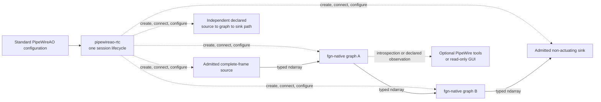

# PipeWireAO development RTC architecture

Status: active development baseline; implementation underway

Review date: 2026-09-01

## Decision

The first executable `pipewireao-rtc` product is a small headless runner for one
non-actuating Calculon/PipeWireAO graph. It loads one standard PipeWire
configuration, realizes a source → graph → sink topology, applies initial
properties and ndarray parameters, exposes a small lifecycle, and leaves the
result visible to ordinary PipeWire clients.

This is decision **RTC-ARCH-011**: use the small, non-actuating development
runner as the only active product baseline. This decision supersedes
RTC-ARCH-010 as the active delivery posture without reusing or changing that
identifier. The former full-RTC decisions and requirements are retained in the
[inactive design archive](archive/full-rtc/README.md). They are not selected by
this baseline.

The purpose is to prove the useful middle ground originally sought for
PipeWireAO: a scientific processing graph that is easier to construct than a
large observatory RTC, but more typed and composable than hand-written shared
memory processes.

The next active direction treats that runner as a small RTC workstation, or
RTCW.

This is decision **RTC-ARCH-013**: extend the development session to contain
multiple existing `fgn-native` filter-graph instances and explicit ordinary
PipeWire links between them. Graph authoring remains in the maintained
PipeWireAO `filter.graph` configuration. The runner MUST NOT parse filter-graph
internals, invent a second session graph language, or schedule frame processing
itself.

One session-level Statig lifecycle initially owns every required endpoint,
filter-graph instance, and link. Configuration is successful only when the
whole declared session is ready; start, stop, retry, and unload apply to the
session as a unit. PipeWire remains responsible for scheduling and can execute
independent graph components concurrently. Per-graph lifecycle control is not
part of this decision and requires a later concrete use case and contract.

## Active scope

The active implementation begins with:

- one simulated or recorded complete-frame source;
- one `fgn-native` Calculon execution composite;
- one simulated, discard, or otherwise non-actuating sink;
- one small Rust runner with a Statig hierarchical lifecycle and diagnostics;
- initial scalar properties and ndarray parameters;
- ordinary read-only PipeWire inspection; and
- numerical and state-equivalence tests against the maintained Calculon or
  fused reference.

After that fixture, the active RTCW composition increment adds only:

- a serial chain of two declared `fgn-native` filter-graph instances;
- two independent declared source → graph → sink paths in one session;
- exact PipeWire links from the same standard configuration; and
- optional scientific inspection through standard PipeWire introspection and
  suitable bounded non-gating observation surfaces.

The first maintained fixture is the minimal complete-frame source → graph →
discard path. REVOLT Classic, with its 277-actuator command vector and explicit
SHWFS subaperture origins, follows after the RTCW composition fixtures.

The following are not part of the active baseline:

- physical cameras or deformable mirrors;
- permission to enter a correction-authorized state;
- operational instrument authority, safe-state arbitration, or multi-process
  fencing;
- durable recording, audit, run reconstruction, or scientific FITS export;
- row-block, region-block, fixed-worker, or multi-batch scheduling;
- Julia graph execution;
- remote control, a web gateway, or WebRTC preview;
- WirePlumber-specific application logic or generated service-manager units;
- CPU affinity, real-time scheduling, NUMA placement, or strict-island
  admission; and
- operational, safety, deadline, tail-latency, or target-host qualification
  claims.

These exclusions are deliberate. A later project may select one capability
from the archive, revise it against current interfaces, and add it without
changing scientist-authored algorithms.

## System boundary

| Component | Active responsibility |
| --- | --- |
| `pipewireao-rtc` | Validate the development configuration, realize its exact session topology, apply initial values, report one session lifecycle, and clean up the objects it owns. |
| PipeWireAO | Own ndarray transport, format negotiation, scheduling, FGN hosting, property and parameter publication, and standard PipeWire introspection. |
| Calculon | Own ordinary typed scientific algorithms and declarations of ports, shapes, schemas, scalar properties, ndarray parameters, and construction values. |
| Source | Produce complete frames for simulation or deterministic replay. |
| Sink | Consume graph output without addressing or controlling physical hardware. |
| Observer | Inspect standard PipeWire objects and, where a suitable boundary exists, scientific samples. It is optional and never owns runner lifecycle or graph progress. |

The runner is the control plane for this small session. It does not process
frame data, create execution threads for graph operations, or replace
PipeWire scheduling. PipeWireAO and FGN remain the data plane.

## Configuration boundary

The active configuration is standard PipeWire relaxed SPA-JSON, compatible
with existing PipeWireAO tools and the current graph generator. The initial
implementation does not introduce TOML, YAML, a deployment database, a
runner-private topology schema, or a multi-file operational bundle.

The minimum configuration identifies one source, one canonical FGN graph, one
sink, initial properties, ndarray parameter files, and optional observation
ports. The RTCW extension uses the same standard configuration to identify
additional source, graph, sink, and link objects. Each `filter.graph` body is
passed to the maintained PipeWireAO module; it is not decoded or regenerated
by an RTC-specific filter-graph parser. Paths and launch-time selections are
resolved before streaming. Construction and topology changes are handled by
stopping and reloading the development session.

Each graph remains one canonical PipeWireAO model. A script, maintained
generator, or future GUI may construct the standard configuration, but none
introduces another graph executor or private transport.

## Scientist boundary

A scientist supplies an ordinary typed Calculon algorithm and declaration:

- scientific port names, element types, shapes, and schemas;
- scalar runtime properties;
- large ndarray parameters such as reconstructors, masks, references, and
  subaperture origins; and
- construction values that genuinely affect the portable algorithm.

The adapter and host supply PipeWire ports, SPA callbacks, raw-pointer checks,
error translation, property publication, parameter adoption, buffer handling,
and worker machinery. Adding an algorithm must not require a central plugin
registry edit or a hand-written SPA plugin. The same scientific implementation
must remain directly testable with ordinary arrays and usable by another graph
executor such as AdaptiveOpticsSim.

## Implementation language and placement

Rust is the default language for the runner because it is a small stateful
PipeWire client and configuration tool. This choice is not part of the
scientist-facing ABI. C remains at existing SPA and PipeWireAO ABI boundaries;
scientific algorithms remain in their Calculon implementation language.

This is decision **RTC-ARCH-012**: implement the runner lifecycle with
Statig's blocking state-machine API and a single serialized dispatcher from
the first increment. The public lifecycle remains the domain model in
RTC-DEV-004; Statig types stay private. State handlers produce typed effects,
potentially blocking configuration and PipeWire work executes outside the
handlers, and results return as typed completion events. This establishes the
same lifecycle mechanism that later operational work can extend without
selecting any archived physical-device, correction-authority, supervision, or
recovery behavior.

The runner, PipeWire daemon, and optional observer are separate ordinary
processes. The baseline does not prescribe systemd units, affinity, scheduler
classes, or one process per graph operation.

## Authoritative lower contracts

This repository does not duplicate the data-plane contracts:

- [ndarray filter graph](https://github.com/DarrylGamroth/PipeWireAO/blob/master/doc/dox/internals/filter-graph-ndarray.md)
  owns the plugin ABI, graph validation, execution, properties, parameters,
  and FGN worker behavior;
- the Calculon `docs/scalar-property-contract.md` contract owns portable
  property semantics; and
- Calculon algorithm declarations own scientific ports, schemas, shapes, and
  reference behavior.

Row-block and progressive-processing documents remain valid PipeWireAO design
inputs, but they are not selected by this complete-frame RTC baseline.

## Claim boundary

Completing this baseline proves only that an identified development
configuration can construct, run, inspect, and stop a non-actuating graph and
that its accepted outputs match the maintained reference within declared
tolerances. It does not prove physical-device interoperability, closed-loop
safety, durable reconstruction, hard real-time behavior, or production
readiness.
