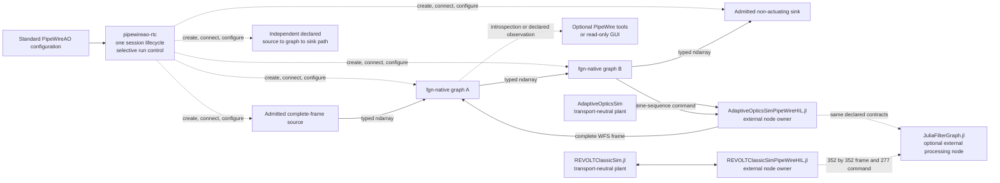

# PipeWireAO development RTC architecture

Status: active development and non-actuating deployment baseline; implementation underway

Review date: 2026-10-01

## Decision

The first executable `pipewireao-rtc` product is a small headless runner for one
non-actuating FGN/PipeWireAO graph. It loads one standard PipeWire
configuration, realizes a source → graph → sink topology, applies initial
properties and ndarray parameters, exposes a small lifecycle, and leaves the
result visible to ordinary PipeWire clients.

This is decision **RTC-ARCH-011**: use the small, non-actuating development
runner as the only active product baseline. This decision supersedes
RTC-ARCH-010 as the active delivery posture without reusing or changing that
identifier. The former full-RTC decisions and requirements are retained in the
[inactive design archive](archive/full-rtc/README.md). They are not selected by
this baseline.

The purpose is to prove the useful middle ground originally sought for
PipeWireAO: a scientific processing graph that is easier to construct than a
large observatory RTC, but more typed and composable than hand-written shared
memory processes.

The next active direction treats that runner as a small RTC workstation, or
RTCW.

This is decision **RTC-ARCH-013**: extend the development session to contain
multiple existing `fgn-native` filter-graph instances and explicit ordinary
PipeWire links between them. Graph authoring remains in the maintained
PipeWireAO `filter.graph` configuration. The runner MUST NOT parse filter-graph
internals, invent a second session graph language, or schedule frame processing
itself.

One session-level Statig lifecycle initially owns every required endpoint,
filter-graph instance, and link. Configuration is successful only when the
whole declared session is ready; session start, stop, retry, and unload apply
to the session as a unit. PipeWire remains responsible for scheduling and can
execute independent graph components concurrently.

This is decision **RTC-ARCH-014**: add selective run control for declared
execution groups without creating independent graph ownership lifecycles.
The session lifecycle remains the sole owner of configuration, realization,
required-object failure, retry, and cleanup. While the session is `RUNNING`,
the same serialized dispatcher may stop and restart a configured execution
group through typed effects. Stopping a group preserves its realized objects,
links, and algorithm state; reset, bypass, replacement, and unload are
different operations and are not implied.

An execution group names session boundary nodes, not operations inside a
PipeWireAO `filter.graph`. Separately controllable groups cannot be connected
directly in this increment. A shared upstream node remains session-managed,
and each link from it into a group must use declared standard PipeWire passive
link behavior so that a stopped branch cannot make the shared node or another
branch stop progressing. This adds control-plane granularity only: PipeWire
and FGN continue to own scheduling, buffers, and frame processing.

This is decision **RTC-ARCH-015**: compose externally implemented processing
and HIL applications through ordinary PipeWire nodes. The RTC configuration
identifies those nodes and their public ports; it does not identify or
interpret the package, language, process, or internal graph that implements
them. A launcher outside the RTC starts each external application on the
selected private core before the RTC realizes its links.

The first reference application is a transport-neutral AdaptiveOpticsSim plant
through a separate `AdaptiveOpticsSimPipeWireHIL.jl` package. The application
owns one complete WFS-frame source node and one non-actuating
correction-command sink node. AdaptiveOpticsSim MUST NOT depend on or contain
PipeWireAO code. The RTC runner owns the FGN graphs and the declared links
to those external nodes; it does not load Julia, execute the simulation, or
take ownership of the application nodes.

The adapter keeps the feedback coupling inside its application boundary so the
PipeWire topology remains acyclic. For sequence `n`, it publishes one complete
simulated WFS frame, accepts exactly one complete command with the same
sequence, and applies that command to simulated frame `n + 1`. This is a
non-actuating HIL reference system and does not introduce physical correction
authority.

This is decision **RTC-ARCH-016**: make the RTC processing-node implementation
substitutable at the ordinary PipeWire boundary. A declared processing role MAY
be realized by a runner-owned `fgn-native` filter graph or by an externally
owned `JuliaFilterGraph.jl` graph published through `FilterGraphPipeWire`. The
session contract names identical scientific ports, shapes, schemas, properties,
parameters, and links; it does not select behavior by implementation language
or package identity.

Object ownership and run-control authority are separate. An external
application creates and destroys its processing node. The RTC MAY request
owner-mediated run control only when the configuration explicitly grants that
authority; unload removes RTC-owned links but leaves the external node alive.
This uses the existing serialized lifecycle and execution-group effects. It
does not add a Julia process manager, a second graph parser, or a second
lifecycle.

This is decision **RTC-ARCH-018**: use an owner-mediated, versioned PipeWireAO
run-control contract for processing nodes. The RTC sends a tokened requested
state through the node's public `SPA_PARAM_Props` surface. The graph host calls
the owner-local `pw_filter_set_active()` operation and publishes the same token,
the result, and observed actual state. The RTC never calls a daemon-private
activation function and does not treat delivery of a request as completion.
Runner-owned and externally owned graph hosts implement the same contract.

This is decision **RTC-ARCH-017**: integrate the REVOLT Classic simulated plant
through the same external HIL boundary. `REVOLTClassicSim.jl` remains
transport-neutral. A separate `REVOLTClassicSimPipeWireHIL.jl` package maps
its prepared 352-by-352 Shack–Hartmann frame and 277-element HSDM277 command
boundary to ordinary PipeWire nodes. The RTC may place either the maintained
`fgn-native` controller or an equivalent `JuliaFilterGraph.jl` processing node
between those endpoints without knowing how the plant or controller is
implemented.

## Active scope

The active implementation begins with:

- one simulated or recorded complete-frame source;
- one `fgn-native` execution composite;
- one simulated, discard, or otherwise non-actuating sink;
- one small Rust runner with a Statig hierarchical lifecycle and diagnostics;
- initial scalar properties and ndarray parameters;
- ordinary read-only PipeWire inspection; and
- numerical and state-equivalence tests against the maintained direct or fused
  Algorithm reference.

After that fixture, the active RTCW composition increment adds only:

- a serial chain of two declared `fgn-native` filter-graph instances;
- one declared source forked to two filter-graph instances, each with its own
  non-actuating sink;
- two independent declared source → graph → sink paths in one session;
- declared execution groups for whole-chain, independent-path, and fork-branch
  start and stop control;
- exact PipeWire links from the same standard configuration; and
- optional scientific inspection through standard PipeWire introspection and
  suitable bounded non-gating observation surfaces.

The next reference-system increment adds one externally owned AdaptiveOpticsSim
WFS source, one externally owned simulated command sink, and one or more
processing graphs between them. The first fixture uses a runner-owned FGN
graph; the following substitution fixture uses an externally owned
`JuliaFilterGraph.jl` node with the same public contract. The integration
package, not AdaptiveOpticsSim, owns PipeWire stream and acquisition-metadata
mapping.

The first maintained fixture is the minimal complete-frame source → graph →
discard path. The AdaptiveOpticsSim HIL reference follows the RTCW composition
fixtures. REVOLT Classic, with its 277-actuator command vector and explicit
SHWFS subaperture origins, follows that reference-system increment.

The following are not part of the active baseline:

- physical cameras or deformable mirrors;
- permission to enter a correction-authorized state;
- operational instrument authority, safe-state arbitration, or multi-process
  fencing;
- durable recording, audit, run reconstruction, or scientific FITS export;
- row-block, region-block, fixed-worker, or multi-batch scheduling;
- runner-hosted Julia graph execution;
- remote control, a web gateway, or WebRTC preview;
- WirePlumber-specific application logic, host-wide scheduling changes,
  NUMA policy, or strict-island qualification; and
- operational, safety, deadline, tail-latency, or target-host qualification
  claims.

These exclusions are deliberate. A later project may select one capability
from the archive, revise it against current interfaces, and add it without
changing scientist-authored algorithms.

## System boundary

```mermaid
flowchart LR
    Config["Standard PipeWireAO configuration"]
    Runner["pipewireao-rtc<br/>one session lifecycle<br/>selective run control"]
    Source["Admitted complete-frame source"]
    GraphA["fgn-native graph A"]
    GraphB["fgn-native graph B"]
    Sink["Admitted non-actuating sink"]
    Parallel["Independent declared<br/>source to graph to sink path"]
    Observer["Optional PipeWire tools<br/>or read-only GUI"]
    Plant["AdaptiveOpticsSim<br/>transport-neutral plant"]
    Adapter["AdaptiveOpticsSimPipeWireHIL.jl<br/>external node owner"]
    JuliaGraph["JuliaFilterGraph.jl<br/>optional external processing node"]
    Revolt["REVOLTClassicSim.jl<br/>transport-neutral plant"]
    RevoltAdapter["REVOLTClassicSimPipeWireHIL.jl<br/>external node owner"]

    Config --> Runner
    Runner -.->|create, connect, configure| Source
    Runner -.->|create, connect, configure| GraphA
    Runner -.->|create, connect, configure| GraphB
    Runner -.->|create, connect, configure| Sink
    Runner -.->|create, connect, configure| Parallel
    Source -->|typed ndarray| GraphA
    GraphA -->|typed ndarray| GraphB
    GraphB -->|typed ndarray| Sink
    GraphA -.->|introspection or declared observation| Observer
    Plant <--> Adapter
    Adapter -->|complete WFS frame| GraphA
    GraphB -->|same-sequence command| Adapter
    Adapter -.->|same declared contracts| JuliaGraph
    Revolt <--> RevoltAdapter
    RevoltAdapter -.->|352 by 352 frame and 277 command| JuliaGraph
```

| Component | Active responsibility |
| --- | --- |
| `pipewireao-rtc` | Validate the development configuration, realize its exact session topology, serialize session and execution-group control, report observed status, and clean up the objects it owns. |
| PipeWireAO | Own ndarray transport, format negotiation, scheduling, FGN hosting, property and parameter publication, and standard PipeWire introspection. |
| Scientific Algorithm packages | Own ordinary typed implementations and declarations of ports, shapes, schemas, scalar properties, ndarray parameters, and construction values. |
| Source | Produce complete frames for simulation or deterministic replay. |
| Sink | Consume graph output without addressing or controlling physical hardware. |
| Observer | Inspect standard PipeWire objects and, where a suitable boundary exists, scientific samples. It is optional and never owns runner lifecycle or graph progress. |
| AdaptiveOpticsSim | Own the simulated atmosphere, optics, WFS, deformable mirror, science diagnostics, model time, and frame-to-command causality without a PipeWire dependency. |
| `AdaptiveOpticsSimPipeWireHIL.jl` | Map one prepared AdaptiveOpticsSim HIL boundary to an externally owned PipeWire source and non-actuating sink using public PipeWireAO interfaces. |
| `JuliaFilterGraph.jl` and `FilterGraphPipeWire` | Optionally own and publish one prepared RTC processing graph as an ordinary external PipeWire node. |
| `REVOLTClassicSim.jl` | Own the REVOLT Classic atmosphere, optics, 352-by-352 Shack–Hartmann detector model, provisional HSDM277 plant, science diagnostics, and deterministic HIL boundary without a PipeWire dependency. |
| `REVOLTClassicSimPipeWireHIL.jl` | Narrow integration package that maps the prepared REVOLT Classic HIL boundary to external PipeWire nodes without moving simulation behavior into the adapter. |

The runner is the control plane for this small session. It does not process
frame data, create execution threads for graph operations, or replace
PipeWire scheduling. PipeWireAO and FGN remain the data plane.

## Configuration boundary

The active configuration is standard PipeWire relaxed SPA-JSON, compatible
with existing PipeWireAO tools and the current graph generator. The initial
implementation does not introduce TOML, YAML, a deployment database, a
runner-private topology schema, or a multi-file operational bundle.

The minimum configuration identifies one complete-frame session rate, one
source, one canonical FGN graph, one sink, initial properties, ndarray
parameters, and optional observation ports. A repeated data port may declare
an exact rational rate; omission inherits the session rate, and both ends of an
ordinary link must have rationally equivalent effective rates. Sparse parameter
ports do not carry a repeated-frame rate. The only admitted rate-transition
object is the ordinary `api.ndarray.latest-hold` SPA node. It converts one
explicit slow input rate to one explicit fast output rate while PipeWire remains
the scheduler; the runner does not add a timer, FIFO, or scheduling layer. The
RTCW extension uses the same standard configuration to identify additional
source, graph, sink, link, and execution-group objects. An
execution group contains only declared session node names and does not copy or
interpret a `filter.graph` body. Each `filter.graph` body is passed to the
maintained PipeWireAO module; it is not decoded or regenerated by an
RTC-specific filter-graph parser. Paths and launch-time selections are
resolved before streaming. Construction and topology changes are handled by
stopping and reloading the development session.

For a configured sparse ndarray parameter, the runner realizes one ordinary
PipeWire output stream with the local development-only
`pipewireao.runtime-parameter` factory identity. The configuration declares
its exact output contract, graph input, link, and initial payload reference.
The runner owns only that source and link; it does not inspect the delegated
`filter.graph` body to discover an internal parameter route. PipeWireAO and
the graph host remain responsible for worker handoff and frame-boundary
adoption.

Scalar updates use the graph's standard `SPA_PARAM_Props` surface. A request
submitted while stopped remains distinct from requested or active generation
evidence; the runner reports submission and observes the host generations
after processing resumes. Ndarray parameter publication follows the same
rule through the declared Parameter Port. Processing-state reset is a
separate owner-mediated request accepted only while stopped.

An external node is selected by declared external ownership and exact node
name, port name, direction, element type, shape, and schema. Discovery may
locate that already-running declared object; it MUST NOT substitute another
node or create an undeclared critical link. The runner owns links that it
creates to the node but does not own or destroy the node. It does not require
implementation-identifying properties.

An external processing declaration additionally states whether session run
control is granted. When granted, the runner uses the versioned owner-mediated
PipeWireAO run-control parameter and waits for its token-matched completion.
When not granted, the external application retains run control and the node
cannot belong to an RTC-controlled execution group. Ownership never transfers
in either case.

This same boundary applies when `JuliaFilterGraph.jl` and its
`FilterGraphPipeWire` adapter publish a prepared Julia graph as one PipeWire
node. The RTCW sees public ports, formats, schemas, and links—not Julia
algorithms or the graph host. The owner-mediated public run-control contract
provides durable lifecycle and selective control without transferring object
ownership to the RTC. External endpoint discovery alone does not grant that
control authority.

The development safety boundary is the complete launched composition on an
isolated private core. Factory allowlists still govern objects created by the
runner. An external declaration does not prove that an arbitrary node is
non-actuating and does not admit physical endpoints on the user's normal
PipeWire core.

Each graph remains one canonical PipeWireAO model. A script, maintained
generator, or future GUI may construct the standard configuration, but none
introduces another graph executor or private transport.

The deprecated product name is not part of the RTC domain model. Runner-local
configuration uses `pipewireao.fgn-native`, and implementation types use FGN
terminology. Existing `org.calculon...` schema strings and legacy Rust artifact
paths remain unchanged compatibility boundaries until a separate versioned
schema and package migration defines their replacements.

## Scientist boundary

A scientist supplies an ordinary typed Algorithm and declaration:

- scientific port names, element types, shapes, and schemas;
- scalar runtime properties;
- large ndarray parameters such as reconstructors, masks, references, and
  subaperture origins; and
- construction values that genuinely affect the portable algorithm.

The adapter and host supply PipeWire ports, SPA callbacks, raw-pointer checks,
error translation, property publication, parameter adoption, buffer handling,
and worker machinery. Adding an algorithm must not require a central plugin
registry edit or a hand-written SPA plugin. The same scientific implementation
must remain directly testable with ordinary arrays and usable by another graph
executor such as AdaptiveOpticsSim.

## Implementation language and placement

Rust is the default language for the runner because it is a small stateful
PipeWire client and configuration tool. This choice is not part of the
scientist-facing ABI. C remains at existing SPA and PipeWireAO ABI boundaries;
scientific Algorithms remain in their owning implementation language.

This is decision **RTC-ARCH-012**: implement the runner lifecycle with
Statig's blocking state-machine API and a single serialized dispatcher from
the first increment. The public lifecycle remains the domain model in
RTC-DEV-004; Statig types stay private. State handlers produce typed effects,
potentially blocking configuration and PipeWire work executes outside the
handlers, and results return as typed completion events. This establishes the
same lifecycle mechanism that later operational work can extend without
selecting any archived physical-device, correction-authority, supervision, or
recovery behavior.

The runner, PipeWire daemon, and optional observer are separate ordinary
processes. The baseline does not prescribe systemd units, affinity, scheduler
classes, or one process per graph operation.

The selected deployment extension below supplies an optional process launcher
and user units without changing that ordinary development invocation.

## Laboratory deployment profile

This is decision **RTC-ARCH-019**: add an opt-in laboratory deployment profile
for repeatable latency experiments. A companion launcher in this repository
places and starts the selected PipeWireAO daemon, RTC runner, pixel source,
processing owner, and command observer. It does not execute Graph operations
or create a second frame scheduler. The ordinary development profile remains
valid without this launcher.

The launcher applies process envelopes before frame ingress. PipeWireAO owns
its data-loop affinity, RT priority, idle policy, and memory locking through
its existing configuration properties. An external Julia Graph owner pins its
own Julia threads through its existing ThreadPinning integration. FGN owns
the placement of any executor workers it creates. The launcher verifies the
resulting thread map and scheduling policy; it does not infer worker roles from
thread names or silently treat a process affinity mask as per-thread pinning.

The profile must record the effective policy and the complete pixel-to-command
delivery result. Failure to apply a required policy prevents a latency run
from starting. A completed replay with missing or repeated commands is a
failed run, even if its completed-command latency is low. This is a research
comparison profile, not physical correction authority, a hard real-time
guarantee, or an unattended service. It does not change C-state, CPU latency
request, huge-page, or host RT-runtime settings by default.

## Selected deployment package

This is decision **RTC-ARCH-020**: promote a non-actuating deployment package
that starts different existing RTC graphs through the same foreground command
and systemd user unit. This deliberately extends the former service and Julia
process-management exclusions. It does not select the archived physical RTC
architecture. AdaptiveOpticsSim and AdaptiveOpticsSimPipeWireHIL deployment
graphs follow completion of this increment.

The Rust runner retains the sole Statig dispatcher. A companion launcher owns
the private core, optional external scientific owner, startup admission and
owned-process cleanup. Scientific packages export standard PipeWire graph
configurations and typed calibration artifacts. A deployment description may
declare process arguments, environment, readiness and placement; it must not
describe or reinterpret scientific operations. Runtime execution must not
depend on benchmark scripts, temporary evidence directories or git worktrees.

Startup loads the stopped session, prepares and warms owners without consuming
recorded science input, verifies effective thread placement and requested
resource rights, then explicitly starts the session. An external source must
provide its own hold/release interface; graph READY alone cannot gate it.
Required-dependency loss fails the whole deployment and revokes ingress. An
explicit restart rebuilds and revalidates all owned processes; no mutation or
RUNNING state is replayed automatically.

The local Unix control endpoint and console share one typed command executor.
Reader/preparation/writer work stays outside the sole owner. Requests, clients,
queues, parameter bytes and reply sizes have finite bounds. Replies distinguish
submission, requested generation and observed active generation. Existing
blocking effects may hold the dispatcher for up to their documented five-second
deadline; health and stop must not claim a shorter bound. A client timeout or
disconnect has an unknown mutation outcome until generations are observed.

Systemd manages deployment processes, not scientific workers. User units cannot
grant missing user-manager groups or raise inherited hard limits. Preflight
reports actual access, limits and affinity; the graph libraries configure their
own workers. Maintained host layouts exclude CPUs 0 and 1. No launcher changes
host power states, IRQ policy, RT runtime allowance or unrelated services.

## Selected AOS/HIL deployment

This is decision **RTC-ARCH-021**: extend the installed non-actuating deployment
with an externally owned AdaptiveOpticsSim plant through
AdaptiveOpticsSimPipeWireHIL. The maintained complete-frame Classic and Copper
science chains remain unchanged, including extrapolation, limits and clipping
feedback. A simulator backend is selected independently of the RTC graph owner.
CPU, CUDA and AMDGPU select explicit AOS execution targets; an unavailable
selected device fails preparation rather than falling back to CPU.

The simulator alone owns model time, seeded optical/detector state and one
frame/command exchange. AOS stages completed GPU products to host before the
transport callback and copies an accepted command back to its exact execution
target. PipeWire callbacks do not execute optics or GPU synchronization. The
transport adapter declares UInt16 ADC encoding and a fixed conversion from the
RTC's micrometre OPD command to the plant's metre OPD command. HSDM277 order is
preserved. These transfers and encoding changes are explicit, not zero-copy.

An optional source-owner declaration selects a prepared application with a
bounded, acknowledged pause/resume/reset interface. The supervisor releases
that source only after stopped-session admission and acknowledged RTC start.
The source completes its outstanding command before acknowledging pause; stop
and reset then reach the RTC owner. A local supervisor endpoint coordinates
these deployment actions and forwards scientific commands to the existing
single Rust dispatcher. It adds no data scheduler or second scientific parser.
Unconfirmed source control fails the owned deployment; mutations are not retried.

Wall pacing and model time are distinct. The installed plant graph uses the
selected model period and its declared exposure. Missed wall periods are
reported, never hidden by bursts or skipped model/command sequences. A finite
qualification batch retains its bounded output and remains held until reset or
shutdown. The provisional instrument influence models and existing measured
RTC calibration do not imply scientific closed-loop convergence; that needs a
separately validated calibration and plant oracle.

## Authoritative lower contracts

This repository does not duplicate the data-plane contracts:

- [ndarray filter graph](https://github.com/DarrylGamroth/PipeWireAO/blob/master/doc/dox/internals/filter-graph-ndarray.md)
  owns the plugin ABI, graph validation, execution, properties, parameters,
  and FGN worker behavior;
- the Rust FGN implementation's scalar-property contract owns portable
  property semantics; and
- Algorithm declarations own scientific ports, schemas, shapes, and
  reference behavior.

The deployment increment selects existing full-frame and row-block transport
and execution interfaces. Their ownership remains entirely with PipeWireAO and
the scientific graph owners.

## Claim boundary

Completing this baseline proves only that an identified development
configuration can construct, run, inspect, and stop its non-actuating graphs,
selectively pause and resume declared execution groups, and match accepted
outputs to the maintained reference within declared tolerances. It does not
prove physical-device interoperability, closed-loop safety, durable
reconstruction, hard real-time behavior, or production readiness.

The latest/hold configuration and lifecycle plumbing is an implemented
development capability. A focused private-core fixture demonstrates a
configured Dummy Driver, source Position cadence, no-buffer slow cycles, held
Acquisition provenance, sustained native/Julia command processing, stop/restart, and
ownership-safe cleanup. It is not a qualified multirate RTC path until live
driver association and hold Position cadence, READY reset, selective-group
recovery, cross-process pool replacement, steady-state allocation, and
latency-distribution evidence are complete.
