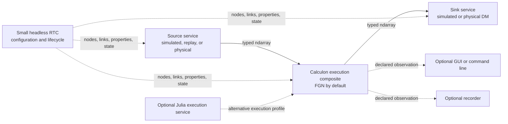
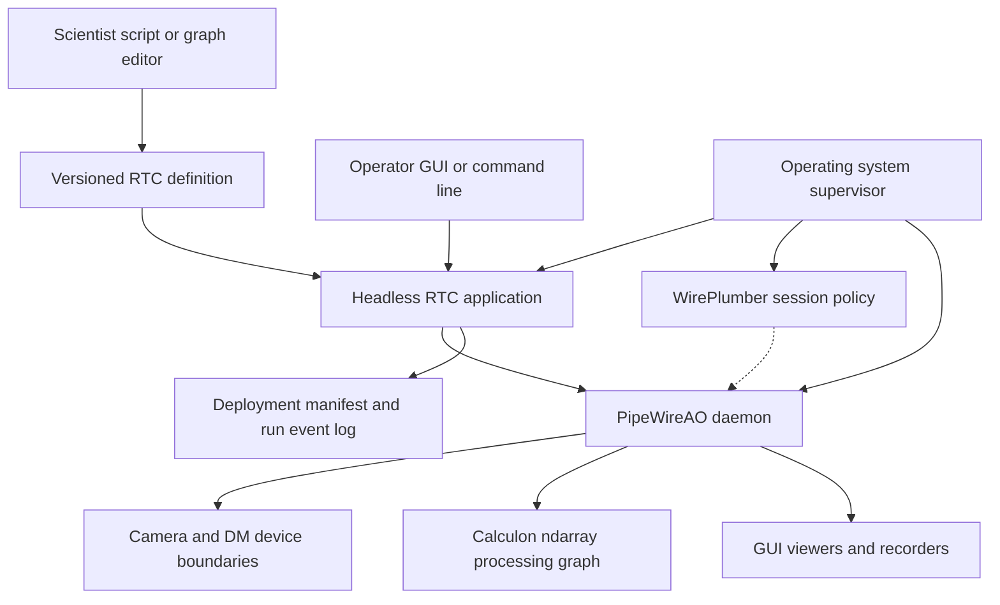
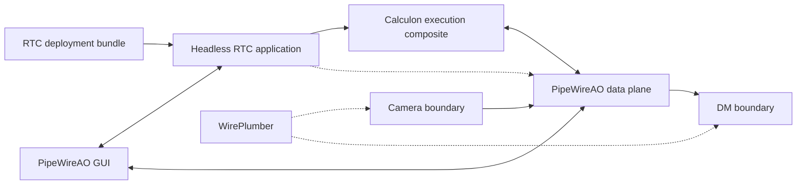
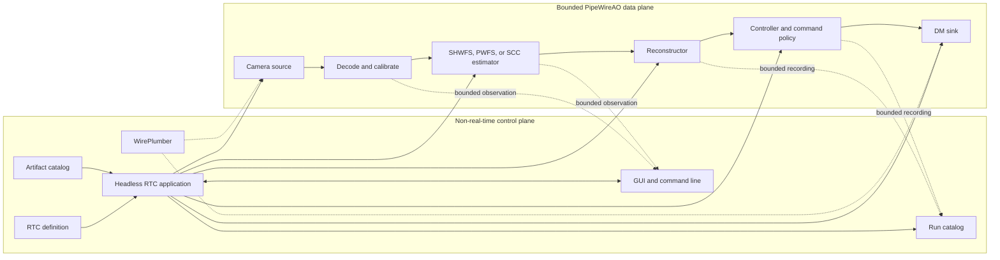
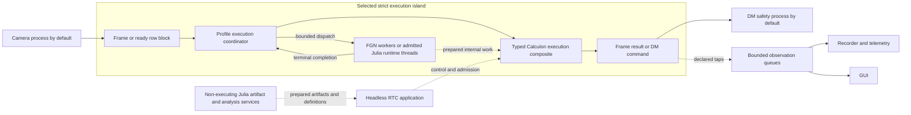
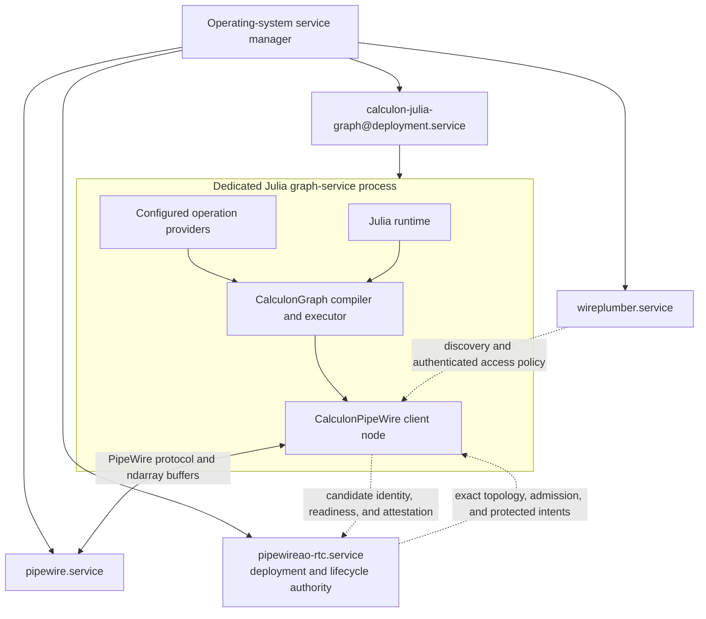

# PipeWireAO real-time controller architecture

Status: archived, inactive design snapshot

> This document is retained as design input for possible future capabilities.
> It is not part of the active development baseline. Its decisions and
> requirements remain reserved historical identities and must not be treated
> as selected until they are deliberately promoted into the active document
> set. See the [archive index](README.md).

Historical status: proposed system architecture; RTC-ARCH-001 through
RTC-ARCH-010 selected across the former full-RTC document set

Review date: 2026-08-31

## Executive recommendation

Calculon and PipeWireAO already contain most of the difficult real-time data
plane:

- transport-neutral scientific algorithms and declarations;
- a typed ndarray graph with bounded property and parameter publication;
- camera, decoder, calibration, graph, and deformable-mirror boundaries;
- an FGN-owned fixed-worker runtime for dense and progressive row-block
  processing;
- a developing standalone Julia client path for configuration-driven Calculon
  graphs; and
- a detachable graph inspector and ndarray viewer.

They do not yet form an operational real-time controller (RTC). The missing
center is an intentionally small, headless **RTC application**,
`pipewireao-rtc`, that owns the deployment in the same sense that a digital
audio workstation (DAW) owns its project. Its first useful form loads one
configuration, creates or discovers the required nodes, connects the graph,
applies initial properties and parameters, and exposes a small lifecycle. It
is the runtime control plane, not part of the frame-processing path.

Artifact admission, physical-device authority, recording, run reconstruction,
Julia execution, remote access, and target-host qualification extend that
center as independent services and capability gates. They are not
prerequisites for the first simulated or replay graph.

The recommended product boundary is:

| Owner or service | Responsibility | First required |
| --- | --- | --- |
| `pipewireao-rtc` headless application | Load one RTC definition, realize its required topology, apply initial state, expose lifecycle, and coordinate selected services. It gains physical correction and run-authority responsibilities only in profiles that select them. | `development` |
| PipeWireAO daemon and nodes | Negotiate formats, schedule the graph, move bounded buffers, execute native FGN operations when selected, connect separately hosted execution profiles, and publish runtime state. | `development` |
| Calculon execution composite | Execute one internally connected scientific graph and expose selected external PipeWire ports. Its execution profile can be `fgn-native` or a separately selected backend. | `development` |
| Calculon | Define scientific algorithms, ports, schemas, properties, parameter plans, and portable reference behavior without exposing PipeWire or its Simple Plugin API (SPA). | `development` |
| Source and sink services | Publish input ndarrays or consume outputs. Simulated and replay services support development; physical services add their device contracts independently. | `development` for simulated or replay; `operational` for physical devices |
| GUI, command-line observers, recorders, and telemetry exporters | Attach as ordinary clients through declared observation surfaces. Their absence or failure does not stop the loop unless the deployment explicitly makes one a required dependency. | Optional capability |
| WirePlumber | Discover devices, apply access policy, and provide narrowly assigned generic link policy. It does not own the RTC definition or lifecycle. | `operational` by default; optional in a local development runner |
| systemd or an equivalent service manager | Supervise selected process boundaries. The operational profile adds nonreused invocation identity and the RTC-OPS-002 single-RTC guard; qualified deployments also apply admitted scheduling and resource policy. | `operational` |
| Device plugins, hardware watchdogs, and external progress watchdogs | Own SDK-control and device-safety boundaries, publish observed physical state, and preserve actuator safety independently of the RTC process. | A selected physical-device or correction capability |

Do **not** fork WirePlumber or base the product on the replaced
`pipewire-media-session` example. Operational deployments use maintained
WirePlumber for generic PipeWire session policy. The headless RTC application
may use `libwireplumber` where its cached object model and asynchronous
utilities reduce client plumbing. The RTC application owns the project-like
deployment and explicit AO topology. When WirePlumber manages those objects,
it must exclude them from fallback, movement, and competing auto-link policy.

Hosting the RTC application as WirePlumber components remains a valid
appliance packaging option. In that arrangement, WirePlumber is the host; the
AO components and deployment bundle are still the RTC application. Stock
WirePlumber is no more “the RTC” than it is a DAW.

The intended middle ground is therefore achievable:

- easier to author and inspect than HEART, CACAO, or MagAO-X;
- more explicit, reproducible, bounded, and safe than an assembly of pyRTC
  processes and scripts; and
- neither a second scientific runtime nor a second frame transport layered on
  top of PipeWireAO.

## Capability profiles and incremental composition

A **capability profile** states what an RTC deployment is permitted to do and
what claim its evidence can support. It is distinct from a Calculon
**execution profile**, which selects how one execution composite runs. The
initial capability profiles are cumulative for the same selected topology:

| Capability profile | Intended use | Minimum boundary |
| --- | --- | --- |
| `development` | Algorithm development, simulation, recorded replay, open-loop graph construction, and inspection. | Simulated, replay, or non-actuating endpoints; no physical correction authority and no operational or real-time qualification claim. |
| `operational` | Commissioning and operation with selected physical services. | Adds the lifecycle, single-writer control, device identity, safe-state, protected-update, and audit requirements triggered by those services. Physical correction requires the complete correction-authority contract even when no deadline claim is made. |
| `qualified` | A named correction-critical topology on a named target host. | Adds maintained correctness, causality, overload, failure, recovery, and target-host timing evidence for every selected component and execution profile. |

Optional capabilities remain orthogonal. A recorder, Julia graph service,
row-block path, fixed-worker policy, remote GUI, WebRTC preview, or camera
co-location is required only when the deployment selects it. Qualification
does not require every optional capability; it requires complete evidence for
the exact capabilities that are selected.

This supports the SPIDERS-style development model: build and test one service
against a simulated counterpart, then attach it through PipeWire without
moving its lifecycle or transport machinery into scientist-authored code.

Every required service can be validated independently with a fake source,
sink, or controller. An optional observer must not become the pacing or
authority owner merely because it is attached. Configuration selects services
and their dependencies; it does not require a scientist to implement process
management, PipeWire callbacks, worker scheduling, or safety machinery.

Here, independent means a clear contract, owner, lifecycle, and standalone
test boundary; it does not mean one operating-system process per graph node.
The development runner may launch or reuse convenient local processes. A later
operational deployment chooses process isolation only at device, runtime,
storage, or failure boundaries that benefit from it.

This is decision **RTC-ARCH-010**: deliver PipeWireAO as cumulative
`development`, `operational`, and `qualified` capability profiles over
independently testable services. Keep `fgn-native`, `julia-runtime`, and future
execution backends as a separate selection axis. The first deliverable is the
small `development` graph; optional infrastructure and advanced placement are
added only by an explicit deployment selection and promotion gate. This
decision limits the applicability of existing requirements but does not weaken
any requirement once its physical-device, correction, recording, execution,
remote-access, or qualification capability is selected.

## Scope and non-goals

This document defines the missing system layer above the current Calculon,
PipeWireAO plugin, and GUI workspaces. Its companion
[assessment and delivery roadmap](roadmap.md) compares the local
RTC implementations and supporting projects and defines implementation order.
That comparison describes inspected snapshots, not every feature ever deployed
with those projects.

This proposal does not:

- claim that the current PipeWireAO stack is ready to command a physical DM;
- move configuration parsing, recording, or GUI work onto a real-time data
  loop;
- replace physical watchdogs or device-local safe-state behavior with a
  control process;
- require every RTC to use one archive format;
- require D-Bus, Aeron, or another control bus;
- make the GUI a required service; or
- require recording, Julia execution, row-block processing, remote access,
  systemd deployment, CPU pinning, or NUMA policy in the `development` profile;
  or
- require scientists to write SPA callbacks, graph plugin wrappers, process
  managers, or lifecycle state machines.

The first target should be a single-host RTC. Multi-host orchestration, NUMA
placement, failover, remote artifact transfer, and observatory integration are
valid later extensions, but they should not distort the first control-plane
contract.

This is the system-level companion to the
[ndarray filter-graph contract](https://github.com/DarrylGamroth/PipeWireAO/blob/master/doc/dox/internals/filter-graph-ndarray.md), the
[row-block ndarray contract](https://github.com/DarrylGamroth/PipeWireAO/blob/master/doc/dox/internals/row-block-ndarrays.md), the
[progressive wavefront-processing design](https://github.com/DarrylGamroth/PipeWireAO/blob/master/doc/dox/internals/progressive-wavefront-processing.md),
the [acquisition identity and timing contract](https://github.com/DarrylGamroth/PipeWireAO/blob/master/doc/dox/internals/acquisition-metadata.md), and the
[polling data-loop design](https://github.com/DarrylGamroth/PipeWireAO/blob/master/doc/dox/internals/polling-data-loops.md). Those documents remain
authoritative for their data-plane and ABI boundaries.

## Document set and authority

This file is the system architecture and decision index. It
should not also become the complete specification for every clock, scientific
quantity, device command, metric, and archive record. Detailed cross-cutting
contracts are maintained as focused companions:

| Document | Authority |
| --- | --- |
| This architecture | RTC system boundary, capability profiles, component ownership, target topology, execution placement, and selected-decision index. |
| [RTC operational architecture](operations.md) | Capability applicability, RTC-authoritative control membership and replacement admission, authority epochs, run allocation and closure, instrument lifecycle, execution-composite profiles and candidate activation, configuration and artifact admission, scientist workflow, control projection, telemetry, recording, GUI behavior, WirePlumber policy, and process supervision. |
| [RTC camera-session contract](camera-sessions.md) | Proposed normative per-camera deployment unit, source-profile identity, source-configuration and format generation, control reconciliation, acquisition scheduling, isolation-first exported SPA host, qualified daemon-side loading, transforms, recovery, and placement qualification. |
| [RTC assessment and delivery roadmap](roadmap.md) | Comparative evidence, current capability assessment, missing work, small delivery increments, capability gates, open decisions, and evidence baseline. |
| [RTC time, causality, and performance](time-and-performance.md) | Clock domains, causal ordering, completed-frame boundaries, deadline semantics, replay timing, managed-runtime admission, benchmark load, and performance evidence. |
| [RTC scientific data and command contracts](scientific-data-and-command-contracts.md) | Quantity and unit compatibility, normalization, DM command stages, correction-authority grant, constraint outcomes, and controller-result policy. |
| [RTC audit and reconstruction contract](audit-and-reconstruction.md) | Protected-operation progression, causal audit identity, execution-composite provenance, terminal disposition, durability isolation, run reconstruction, and safe replay. |
| [Acquisition metadata](https://github.com/DarrylGamroth/PipeWireAO/blob/master/doc/dox/internals/acquisition-metadata.md) | `SPA_META_Acquisition` ABI and the exact acquisition identity, exposure-time, and multi-host timing fields. |
| [FGN contract](https://github.com/DarrylGamroth/PipeWireAO/blob/master/doc/dox/internals/filter-graph-ndarray.md) | Plugin ABI, graph validation and execution, property and parameter publication, and fixed-worker ownership. |
| [Row-block ndarray contract](https://github.com/DarrylGamroth/PipeWireAO/blob/master/doc/dox/internals/row-block-ndarrays.md) | Row-block format, marker, discontinuity, assembly, and conditional-output behavior. |
| [Progressive wavefront-processing design](https://github.com/DarrylGamroth/PipeWireAO/blob/master/doc/dox/internals/progressive-wavefront-processing.md) | Frame-scoped progressive algorithms, worker partitioning, scientific commit, and serial equivalence. |

The main architecture states only the system-level consequences of those
contracts. New subsystem detail should go in its owning companion and be linked
here. This keeps each document independently reviewable and lets tools load the
relevant contract without consuming the complete RTC roadmap.

## What is the RTC application?

The phrase “RTC application” currently conflates four different things. The
recommended definitions are:

1. An **RTC definition** is a versioned, declarative description of the
   instrument profile, processing graph, artifacts, deployment policy, and
   operator views.
2. An **RTC deployment** is a resolved definition: every artifact, plugin,
   device, dimension, schema, scheduling class, and executable revision is
   concrete and recorded.
3. The **headless RTC application**, `pipewireao-rtc`, loads and realizes one
   deployment and owns its logical lifecycle. Its GUI may disconnect without
   ending the application.
4. A running **RTC system** is the headless application, WirePlumber,
   PipeWireAO daemon, admitted nodes, device boundaries, recorders, and
   operating-system supervision acting together.

Thus, `pipewireao-rtc` is the missing domain executable, but it is not by
itself the complete RTC system. WirePlumber is a session-policy service within
that system, not the owner of the scientific project or instrument lifecycle.

The graph is not the application, the GUI is not the application, and the
session manager is not the application. They are components of one resolved
deployment.

## DAW precedent and application boundary

Professional-audio applications establish the useful precedent. A DAW loads
its project, owns its internal track and plugin graph, registers external JACK
or native PipeWire ports, processes buffers, controls transport and recording,
and persists project state. PipeWire schedules its externally visible node and
ports. WirePlumber configures devices, permissions, and generic external
linking; it does not load the DAW project or manage the DAW's internal plugin
state.

PipeWire maps a JACK client to a PipeWire client plus node, and JACK ports to
PipeWire ports. A session manager is expected to be aware that JACK clients
may link their nodes directly. See the upstream
[PipeWire object mapping](https://pipewire.pages.freedesktop.org/pipewire/page_objects_design.html)
and [WirePlumber linking policy](https://pipewire.pages.freedesktop.org/wireplumber/policies/linking.html).

The RTC follows the same separation:

| Professional audio | PipeWireAO RTC |
| --- | --- |
| DAW project | versioned RTC deployment bundle |
| headless DAW engine | `pipewireao-rtc` headless application |
| internal tracks and plugins | Calculon execution composite |
| JACK or PipeWire external ports | camera, observation, and DM-facing ports |
| PipeWire scheduler | PipeWireAO deterministic data plane |
| WirePlumber | device discovery, permissions, and generic external policy |
| audio interface | camera and DM device boundaries |
| DAW user interface | detachable PipeWireAO GUI |
| recording session | RTC run catalog and scientific recorders |

This is decision **RTC-ARCH-001**: the headless RTC application owns the
deployment and instrument lifecycle. WirePlumber owns only explicitly assigned
generic session policy. A fixed appliance may host the AO application logic in
a dedicated WirePlumber profile, but doing so changes process packaging, not
domain ownership.

The initial single-host operational profile enforces that ownership with the
fail-closed RTC-OPS-001 control-holder contract and RTC-OPS-002 single-RTC
admission guard.
The RTC authority epoch correlates events but does not replace that guard or
fence an older PipeWire control client.

## Assessment and delivery status

The detailed comparison with pyRTC, HEART, CACAO, MagAO-X, TAO-RT, SPIDERS,
and the supporting local projects is maintained in the
[RTC assessment and delivery roadmap](roadmap.md). That companion
also records current Calculon and PipeWireAO assets, missing capabilities, the
dependency-ordered delivery tracks, capability gates, risks, and evidence
baseline.

The concise conclusion is that the scientific authoring and bounded ndarray
data plane are strong foundations. The `development` profile is missing only a
small configuration and lifecycle runner plus one maintained end-to-end
fixture. Correction and device authority, resolved operational admission,
telemetry, recording and replay, Julia execution, and target-host qualification
are separate capability gaps rather than one prerequisite product layer.

## Target architecture

### Cross-cutting RTC semantic contracts

PipeWire is the execution and transport substrate, but an adaptive-optics RTC
needs meanings that generic media scheduling cannot supply. In particular,
PipeWire does not decide:

- which physical acquisition caused a scientific product or DM command;
- whether two timestamps are comparable or which clock enforces a deadline;
- when all row blocks, workers, state updates, and outputs for one frame are
  terminal;
- whether equal-shaped arrays use compatible quantities, units, bases, or
  normalization;
- whether a DM vector is requested, constrained and demanded, merely accepted
  by an API, physically applied, or independently measured; or
- whether a latency distribution represents a fixed offered load without
  coordinated omission.

PipeWireAO assigns those responsibilities to existing boundaries rather than
creating another runtime:

| Semantic responsibility | PipeWireAO owner and carrier |
| --- | --- |
| Acquisition identity, bounded joins, and qualified exposure time | Source or device adapter through `SPA_META_Acquisition`; RTC-CAUSAL-001 fixed-capacity inline or adoption records preserve every correctness-relevant member of a multi-acquisition join. |
| Effective camera settings for an acquisition | Camera source through the RTC-CAM-006 source-configuration generation, immutable source-settings record, and acquisition-boundary mapping. |
| Scientific meaning and compatibility | Calculon declaration, execution-composite scientific schema, SPA ndarray format, and prepared artifact manifest. |
| Property and parameter generation | The admitted execution profile's bounded publication and adoption protocol; row-block consumers prevent a mixed-generation frame from becoming authoritative. |
| Frame and subordinate-work completion | The selected execution coordinator plus the frame-scoped algorithm or aggregator; a callback return alone is not automatically a completed frame. |
| RTC lifecycle deadlines and semantic event time | Serialized headless RTC application owner using typed timer and completion events. |
| DM composition, constraints, demand, and result | DM command authority and device plugin under the admitted instrument profile. |
| Audit and run reconstruction | RTC application event sequence, portable stream records, recorder index, and final run record. |
| Latency evidence | Instrumented owners on the measured path plus an isolated metrics collector and reproducible benchmark harness. |

The detailed [time, causality, and performance contract](time-and-performance.md)
requires declared clock domains, identity-based causation, explicit deadline
boundaries, coherent frame-scoped updates, safe replay, schedule-preserving
offered load, bounded local recording, and reproducible target-host evidence.
It adapts the completed-frame rule to the current row-block implementation:
an update may be deferred to a completed-frame boundary, or a graph-cycle
update may invalidate the partial frame before any output or scientific state
commit. It may never create an authoritative mixed-generation frame.

This is decision **RTC-ARCH-007**: treat time, causal identity, frame
completion, deadline meaning, replay pacing, and performance evidence as an
explicit PipeWireAO RTC contract. Use SPA acquisition metadata and the selected
execution profile's graph and plan generations as its carriers, including FGN
generations for `fgn-native`, but do not infer these semantics from PipeWire
scheduling or timestamps alone.

The detailed [scientific data and command contract](scientific-data-and-command-contracts.md)
makes quantity, unit, coordinate frame, basis, sign, and normalization part of
compatibility. It also preserves the distinction among direct correction,
requested, demanded, and fail-safe device commands, device-native submission,
device acceptance, qualified applied state, and independent measurement.
Submission or acceptance is not physical effect. The
[audit and reconstruction contract](audit-and-reconstruction.md) separately
distinguishes request admission from later authoritative activation and
physical observation.

This is decision **RTC-ARCH-008**: carry adaptive-optics scientific and command
meaning through versioned schemas, prepared manifests, DM authority results,
and causal audit records. Keep generic lookup, conversion, persistence, and
device interpretation outside scientist-authored algorithms and outside the
correction-critical callback.

### Control plane and data plane

Only the solid horizontal path is correction-critical. Control-plane work may
allocate, parse files, take locks, query databases, and perform I/O. It must
prepare immutable or bounded state and publish it through the existing graph
transaction mechanisms. It must never be called synchronously by the data
loop.

Observation edges are explicitly lossy or flow-controlled outside the strict
path. A slow GUI, database, or recorder must not hold a camera buffer or delay
a DM command.

### Ownership rules

| Resource or decision | Authoritative owner | Readers or other actors |
| --- | --- | --- |
| RTC target state and permission to request correction | headless RTC application | GUI, command line, nodes, recorder |
| Run identity, active interval, and ordinary closure | headless RTC application under RTC-OPS-005 | The independent recovery owner may seal or mark an abandoned run incomplete after RTC loss; it does not resume RTC authorship. |
| Camera SDK-control submission and observed physical-state publication | camera plugin in the admitted source process | Hardware, firmware, and external triggers can cause physical change; RTC application, WirePlumber, and monitors observe the plugin's read-back. |
| Source-configuration generation and effective-acquisition mapping | camera plugin in the admitted source process | RTC application, admitted execution composite, recorder, GUI, and audit reducer consume the source-owned mapping. |
| Device-enforced correction-authority grant, DM command submission, observed state, and safe fallback | DM device boundary, including its explicit watchdog arbitration | The RTC application requests a grant; the scientific graph proposes commands only under its observed active state; monitors observe qualified results. |
| Requested/demanded command composition and proposal result for one physical command domain | One admitted DM command authority at the deployment-selected graph or device-boundary placement | Scientific controllers and other sources provide identified contributions; the device boundary separately publishes truthful device results and retains fail-safe arbitration. |
| AO graph topology and module instances | headless RTC application | WirePlumber, GUI, and diagnostics |
| Execution-composite graph sequence, frame adoption, and output publication | owning admitted execution coordinator | profile-owned workers or runtime plus control-plane snapshots |
| One operation shard or partial accumulator during a dispatch | its assigned coordinator, helper lane, or runtime task under the admitted profile | coordinator only after terminal completion and acquire publication |
| Runtime scalar property plan | node publication protocol; RTC application is sole protected writer | GUI and telemetry |
| Large ndarray parameter plan | node publication protocol; RTC application is sole activation writer | GUI and telemetry |
| Artifact catalog | artifact service or immutable filesystem bundle | RTC application and GUI |
| Deployment manifests and RTC-authored event sequence | headless RTC application | recorder, GUI, export tools; independent audit producers own their event-author identities and sequences |
| Camera-source progress supervision | headless RTC application in an execution context outside the source and strict data loops | service manager performs requested termination; the DM device boundary independently expires correction authority if RTC/watchdog coverage is lost |
| Strict-island progress supervision | headless RTC application in an execution context outside the selected execution-island process, with device-local authority expiry independent of both | service manager terminates and restarts the selected daemon or Julia graph service; no actor reuses storage owned by nonterminal work |
| Generic device and access policy | WirePlumber | RTC application and diagnostics |
| Stream files | one recorder instance per recording target | catalog and analysis tools |
| Aggregate run-storage reservations and quota | one service- and deployment-identified storage-capacity authority per filesystem or storage-pool scope | RTC audit, catalog, artifact-staging, and recorder writers request capacity; unrelated writers are isolated or included in the admitted bound. |

There must not be two link-policy owners. The RTC application owns AO topology.
WirePlumber policy must exclude those objects from automatic movement,
fallback, and reconnection, or be disabled for them on the dedicated
PipeWireAO core. Device discovery does not imply authority to choose a
substitute camera or actuator.

### Headless application implementation language

Rust is the default implementation language for `pipewireao-rtc`. The
application is a long-lived, non-real-time control-plane service that combines
a state machine, asynchronous PipeWire object handling, configuration and
artifact validation, database and filesystem I/O, process recovery, and
operator-facing requests. Rust provides a stronger ownership and failure
boundary than C without placing a garbage-collected runtime at the center of
instrument authority.

This choice does not move strict processing into the RTC application:

- C remains appropriate for the existing SPA device boundaries, queue module,
  strict data-loop mechanisms, and a narrow `libwireplumber` or GObject shim if
  the Rust bindings lack a required operation;
- Rust owns the RTC domain state, graph transactions, recorder services, run
  catalog, and command-line tools; and
- Julia remains the preferred scientist-facing environment for graph
  construction, calibration and reconstructor generation, analysis, replay,
  FITS product generation, and ordinary out-of-process PipeWire clients. A
  separately supervised Julia graph service may also execute an admitted
  Calculon composite under RTC-ARCH-009. Warmed JIT and AOT packaging are
  distinct execution profiles, and neither is correction-qualified without
  the complete runtime, failure, and target-host evidence required by its
  admission gate.

Binding incompleteness is a reason to add a small generated or hand-audited C
boundary, not to implement the whole control plane in C. Julia's ability to
receive foreign-thread callbacks likewise does not require the authoritative
lifecycle service to share the Julia runtime.

This is decision **RTC-ARCH-002**: implement the first headless RTC application
and recorder services in Rust, retain C for strict or ABI-facing mechanisms,
and keep Julia as a first-class graph-authoring and scientific-service client.
Scientists use the same RTC definition and Calculon declarations regardless of
which language implements the control service. RTC-ARCH-009 refines only the
execution-placement options permitted by this decision; it does not place the
Julia runtime in the authoritative Rust RTC process or change the Rust control-
plane default.

### Recommended process placement

Process boundaries should follow trust and scheduling boundaries rather than
putting every node in a separate process or loading every library into the
daemon:

A **Calculon execution composite** is one internally connected scientific graph
that exposes only its selected external PipeWire ports. An **execution profile**
is the selected implementation and placement of that composite. The initial
profile namespace contains `fgn-native`, `julia-runtime`, and the reserved
future `julia-aot` name.

A **strict execution island** is one admitted correction-critical execution
coordinator, its owned workers or language runtime, and its process and
scheduling failure domain. It has one identified external progress watchdog as
part of its admission contract; that watchdog remains outside the island's
process and data loop. The island is not synonymous with an in-daemon FGN
instance. The selected execution profile determines its placement. For
`fgn-native`, the island is the PipeWireAO daemon process and
contains the FGN data-loop coordinator and fixed workers. For
`julia-runtime`, it is the dedicated Julia graph-service process and includes
every Julia, garbage-collector, BLAS, and helper thread that can affect graph
progress. A deployment may admit a qualified camera or DM boundary into the
`fgn-native` island under the existing placement rules. No current profile
admits either device SDK into the Julia process. The headless RTC application,
WirePlumber, recorders, and GUI never belong to a strict execution island.

| Component | Default placement | Reason |
| --- | --- | --- |
| `fgn-native` Calculon composite | One admitted FGN composite in the PipeWireAO daemon's strict execution island. Its data-loop coordinator and the FGN host's existing fixed helper workers execute the graph. | Preserve the current native, synchronous, typed baseline and avoid unnecessary scheduling crossings. |
| `julia-runtime` Calculon composite | One dedicated `calculon-julia-graph@deployment.service` process and ordinary PipeWire client node. It contains the Julia runtime, configured operation providers, compiled graph, and client bridge. | Permit configuration-driven scientist operations without embedding Julia in the daemon, RTC application, or WirePlumber. Functional availability does not imply strict admission. |
| Reserved `julia-aot` composite | No default placement or supported capability until its packaging and runtime contract is approved. If selected later, it remains a separately supervised client process unless a new architecture decision says otherwise. | Reserve a stable profile identity without treating AOT as evidence of bounded execution. |
| [Camera SDK boundary](camera-sessions.md) | A separate PipeWire client process by default; load it into the PipeWireAO daemon's strict island only when the SDK is qualified, the isolation-first profile fails a predeclared camera-availability-to-command acceptance limit, and the otherwise equivalent co-located profile passes every limit. | Camera row blocks can cross the boundary many times per frame, so isolation and earliest-possible processing must be measured together. |
| DM SDK and safety boundary | A separate device process by default; co-locate only after blocking, allocation, crash, and safe-state qualification. | A command normally crosses this boundary once per frame, while actuator failure containment is safety-significant. |
| Headless RTC application | Separate non-real-time process by default. It may use `libwireplumber` as its client library. | Project loading, file I/O, graph transactions, and recovery decisions cannot share the strict loop. The separate process also matches the DAW application boundary. |
| WirePlumber | Maintained session-manager daemon, normally with a minimal PipeWireAO policy profile. | Reuses device discovery, cached object state, access policy, and generic session machinery without making it the RTC application. |
| Non-executing Julia development or artifact service | Separate process and ordinary PipeWire client or offline job, distinct from an admitted Julia graph service. | Keep artifact generation, analysis, and unrelated JIT work outside the selected execution island. |
| Recorder and telemetry exporter | Separate clients, normally one per failure or storage domain. | Disk, network, compression, and databases must not share critical scheduling or failure fate. |
| GUI | Detachable client process. | Operator rendering and interaction must be irrelevant to loop survival. |
| Remote GUI gateway | Separate authenticated non-real-time client process. | Projects the same semantic client snapshots and intents used by the native GUI without exposing PipeWire file descriptors or becoming another RTC authority. |
| Optional WebRTC preview bridge | Separate media client process attached to a prepared observation output. | Contains conversion, encoding, signaling, TLS, network buffering, and preview backpressure outside the PipeWireAO daemon and correction graph. |

PipeWire already supplies the inter-process graph and buffer boundary, so
external device or recorder processes do not require a second transport.
Placement is an admission choice recorded in the deployment, not something a
scientist writes into an algorithm.

The operational unit behind the camera row is a camera session: one logical
instrument role bound to an identified physical, simulated, or replay source;
one default isolated SPA host for a physical SDK boundary; its explicit carrier
transforms; and its scoped source-configuration, format, and control
revisions. The
[camera-session contract](camera-sessions.md) adapts Camstack's useful
per-camera session model without adding another shared-memory or RPC system.

This is a hybrid placement: HEART-like co-location and fixed threading in the
native FGN profile, with CACAO- or SPIDERS-like process isolation at hardware,
control, recording, visualization, and Julia-runtime failure boundaries. It is
neither one process per Calculon algorithm nor one thread per algorithm.
Calculon operations remain logical internal stages of one selected execution
composite.

For `fgn-native`, the FGN worker group is current implementation, not a
proposed generic thread pool. The graph host creates persistent workers outside repeated processing;
the data-loop coordinator also computes one lane; workers operate on disjoint
shards; and completion uses bounded release/acquire publication. SHWFS row
processing delegates newly ready slope-column ranges, while PWFS row processing
delegates newly ready pupil-major normalized-pixel ranges. The scientist does
not create threads, queues, atomics, worker callbacks, or affinity rules.

The current worker operation is a synchronous bounded fork/join for each ready
dense or row-block batch. Asynchronous multi-batch pipelining, in which workers
can continue across several camera batches before a terminal frame fence, is a
separate proposed optimization. It must not be described as implemented.
Any such executor must dispatch the first ready work without waiting to fill a
batch, may include work that accumulated while a lane was busy, and must cap a
duty cycle by ready blocks, work units, time, and the finite frame scope needed
for fairness and deadline analysis. It must not add a batching timer merely to
manufacture a larger batch.
Likewise, the helpers are fixed persistent threads, but individual per-thread
pinning is not yet a universal FGN guarantee. CPU sets, scheduling class,
worker count, block size, and idle policy belong to deployment admission;
per-thread affinity requires its own implementation and target-host evidence.
The detailed execution contract remains in the
[progressive wavefront-processing design](https://github.com/DarrylGamroth/PipeWireAO/blob/master/doc/dox/internals/progressive-wavefront-processing.md).

The `fgn-native` deployment should support these explicit placement variants
over the same graph and scientific declarations. The `julia-runtime` profile
remains a separate process from camera and DM boundaries in the initial
architecture:

| Placement variant | Process boundary | Intended use |
| --- | --- | --- |
| Isolation-first | Camera process → strict FGN island → DM process | Default bring-up and production baseline; strongest containment and clearest failure attribution. |
| Row-block latency | Qualified camera boundary and FGN composite share the PipeWireAO daemon process; DM remains isolated | Use only when the isolation-first topology fails a predeclared camera-availability-to-command acceptance limit and this topology passes all limits. |
| Fully co-located strict island | Qualified camera, FGN composite, and DM boundary share the PipeWireAO daemon process | Exceptional target-specific profile admitted only against predeclared limits and after the larger crash, blocking, and actuator-safety failure domain is accepted and tested. |

Changing placement must not change the Calculon algorithm or its declaration.
The resolved deployment records the selected variant, process membership,
worker policy, CPU budget, vendor-library revisions, and qualification evidence.

This is decision **RTC-ARCH-005**: keep the correction graph and the FGN host's
fixed row-block workers in one strict execution island; isolate lifecycle,
recording, visualization, and JIT services; isolate vendor device SDKs by
default; and permit device co-location only as a recorded, measured, and
failure-qualified deployment variant. RTC-ARCH-009 preserves this as the
`fgn-native` placement decision and distinguishes a selected Julia graph
service from the unrelated JIT services excluded by this decision.

### Optional Julia execution profile

`julia-runtime` is a first-class, separately supervised Calculon execution
profile in the configuration, identity, property, parameter, lifecycle, audit,
and introspection contracts. First-class availability is not
correction-critical qualification.

This is decision **RTC-ARCH-009**: admit a configuration-driven Julia graph
service as the optional `julia-runtime` implementation of a Calculon execution
composite. The operating-system service manager owns its launch, nonreused
process identity, affinity, privilege, restart limit, and termination. The RTC
application owns its resolved candidate, exact links, admission, activation,
lifecycle, protected property and parameter intents, and correction authority.
WirePlumber may discover the service and apply authenticated access and
explicitly assigned generic policy, but it does not launch the service, select
its graph, or own its lifecycle.

The service must execute in a dedicated unit and process outside the PipeWireAO
daemon, authoritative Rust RTC process, and WirePlumber policy event loop. It
exposes one configured internal Calculon graph through selected external
PipeWire ports. The profile does not remove or weaken `fgn-native`, which
remains the qualification and comparison baseline until another profile
satisfies its complete functional, causal, failure, safety, and target-host
performance gate. That baseline status is not a claim that every current
native deployment is already target-host qualified. The
`julia-aot` name is reserved for a future profile; AOT packaging and warmed JIT
execution are neither necessary nor sufficient evidence of correction-critical
admission.

RTC-ARCH-009 explicitly refines the Julia execution-placement portions of
RTC-ARCH-002 and RTC-ARCH-005 and extends the generation-carrier applicability
of RTC-ARCH-007 to every admitted execution profile. It does not supersede
their Rust control-plane, native FGN, device-isolation, authority, time, or
causality decisions.

### Performance and overload contract

The [time, causality, and performance companion](time-and-performance.md)
is authoritative for measurement boundaries, open-loop versus closed-loop
load, coordinated omission, local histogram ownership, metric-interval gaps,
environment capture, and evidence promotion. This section identifies the
deployment values that must be resolved before those measurements can admit a
correction-critical graph.

For each correction-critical deployment, admission must record:

- frame or row-block rate and maximum accepted burst;
- end-to-end camera-availability-to-command deadline and percentile target;
- every long-lived runnable context in the strict island, including PipeWire
  loops, an FGN coordinator and helpers when selected, Julia runtime,
  garbage-collector, BLAS, and helper threads when selected, co-located SDK
  callback or helper threads, and device workers; the CPU set, scheduling class,
  idle policy, worker count, and expected execution budget for each;
- every bounded pool and queue capacity;
- each handoff's producer and consumer cardinality, ownership-transfer rule,
  service-rate or work bound, observable headroom, and the capacity rationale
  derived from the admitted arrival, burst, and latency model;
- behavior for missing, late, duplicate, corrupt, or incomplete input;
- whether overload drops the oldest incomplete frame, rejects new work,
  reuses a prior value, opens the loop, or faults; and
- how many consecutive or accumulated violations cause correction revocation.

Admission must not assign more latency-critical runnable contexts than the
genuinely available cores in the declared CPU budget. SMT siblings, interrupt
and device-queue placement, runtime helper threads, and operating-system work
remain part of that budget. Busy spinning is permitted only on an explicitly
reserved core with admitted power and thermal behavior; every other idle policy
requires target-host wake-latency evidence.
Queue admission must also show that capacity, arrival rate, and service bound
are compatible with the declared maximum residence time; increasing a queue to
hide overload does not satisfy a latency deadline.

Every end-to-end claim must name its source event, terminal command or physical
effect event, monotonic measurement clock, included queue and scheduling
stages, and offered-load model. Camera-rate claims preserve scheduled arrivals
when the system stalls and account for every arrival as completed, rejected,
dropped, or timed out. Service-time and unpaced saturation results remain
useful, but they are not camera-rate tail-latency evidence.

The repeated strict path remains preallocated, bounded, lock-free where its
current contract requires it, and independent of files, logs, GUI clients,
recorders, the RTC application, and WirePlumber. This is an admission contract,
not a claim that target-host latency is already qualified. Metrics recorded on
that path use preallocated single-writer storage; interval extraction,
aggregation, formatting, and persistence remain non-gating and expose every
missing interval.

## Operational architecture

The [RTC operational architecture](operations.md) owns the
instrument lifecycle and Statig implementation profile, configuration and
artifact bundle, scientist-facing graph workflow, RTC control object, telemetry
and dynamic observers, indexed recording and derived products, native and
WebAssembly GUI behavior, semantic remote access, WirePlumber policy, and
process supervision.

Those mechanisms implement the ownership and placement decisions above. They
do not enter scientist-authored algorithms or move filesystem, database, GUI,
policy, or lifecycle work onto the correction-critical path.

## Delivery roadmap and claim boundary

The [RTC assessment and delivery roadmap](roadmap.md) owns the
delivery increments, immediate REVOLT Classic development slice, capability
gates, open decisions, and evidence baseline. None of the proposed system
properties is promoted merely because its component implementation or this
architecture exists.
