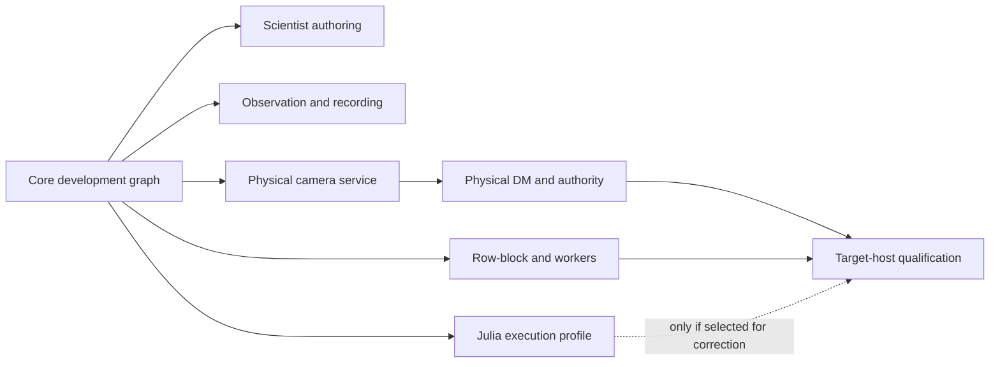

# PipeWireAO RTC assessment and delivery roadmap

Status: archived, inactive design snapshot

> This roadmap records the former full-RTC proposal. It is not the current
> delivery plan and its phases are not project commitments. See the
> [archive index](README.md) and the active [roadmap](../../roadmap.md).

Historical status: proposed assessment, implementation roadmap, and evidence
baseline

Review date: 2026-08-31

## Authority and scope

This document records the comparative evidence, current capability assessment,
missing work, implementation order, capability gates, open decisions, and
evidence baseline for the
[PipeWireAO RTC system architecture](architecture.md). It does not
replace the normative FGN, acquisition, row-block, time, scientific-data, or
command and audit contracts and does not promote an implementation claim.

## Comparative review of the local RTCs

### Execution and control architecture

| System | Scientific execution and transport | Lifecycle and process ownership | Main strength | Main cost or lesson |
| --- | --- | --- | --- | --- |
| pyRTC | Python components exchange arrays through shared memory. A soft RTC can assemble components in one process; a hard RTC launches hardware components as subprocesses and uses lightweight command sockets. | Components primarily expose `alive` and `running`; scripts and launchers coordinate the system. | Very low barrier for a scientist to assemble, modify, and inspect a loop. | The ease comes from weak system-wide contracts: no authoritative instrument state machine, correction authority, atomic deployment, or hard real-time admission boundary. |
| HEART | C blocks are grouped into pipes, commonly in one server process. Blocks have command and worker threads and exchange data through circular buffers. | Blocks follow explicit states from construction and readiness through running and correcting. Pipes coordinate block state and correction permission; systemd and scripts manage services. | Clear AO-specific lifecycle vocabulary and mature high-rate execution. | Scientists inherit block, circular-buffer, command, and configuration machinery. Same-process grouping and shared infrastructure increase coupling. |
| CACAO | C processes and `milk` commands communicate through ImageStreamIO shared-memory images and semaphores. | Shell tools, process-control interfaces, status files, locks, process lists, and terminal sessions form much of the operational control plane. | Proven AO stream workflows, calibration staging, and inspectable shared data. | Operational meaning is distributed across shell conventions, files, streams, and process state. Reconstructing exact intent and failure atomicity is difficult. |
| SCExAO Camstack | A native frame grabber publishes ImageStreamIO data while a Python camera personality owns control, camera modes, technical polling, and ordered dependent transforms or transports. | Each camera is an operational session, commonly comprising a control process, acquisition process, and several tmux-managed local or remote dependents exposed through Pyro and optional Redis state. | Strong per-camera identity, process isolation, configuration personality, and explicit dependent-service ownership. | The useful camera-session unit is spread across tmux, shell commands, Pyro, ImageStreamIO, Redis, and Python inheritance; PipeWireAO can retain the unit without importing those mechanisms. |
| MagAO-X | Individual `MagAOXApp` processes use INDI for control/status and ImageStreamIO for image data; CACAO supplies the main AO loop. | Each application has a substantial device lifecycle. Python and shell tooling launch process lists, commonly in terminal sessions, while operators supervise recovery. | Broad instrument operations: device control, telemetry, recording, metadata, and observatory integration. | Multiple control and data systems plus per-application boilerplate make the complete system powerful but operationally complex. |
| TAO-RT | C servers expose typed shared objects and arrays using System V shared memory, mutexes, and condition variables. Camera servers separate command/server ownership from worker execution. | Device run levels, command serials, and request/acknowledgement/completion counters provide disciplined single-writer device control. | Strong device ownership and command-completion semantics. | It is a low-level library and server framework, not a complete graph, application lifecycle, operator, or archive system. |
| Raven | A GStreamer pipeline composes camera and AO plugins. Standard element states and bus events expose generic lifecycle; a controller can inspect elements and properties. | A pipeline controller changes element state and properties; graph composition is naturally visible. | The closest historical precedent for an inspectable media-style AO graph. | The inspected implementation is an old prototype with a forked media stack and limited instrument-safety and artifact-provenance semantics. |
| SPIDERS and RtcFramework.jl | Julia services communicate through Aeron. `RtcFramework.jl` supplies hierarchical state machines, agents, properties, timers, and counters. | Services have explicit waiting, ready, processing, playing, paused, stopped, error, and exit behavior. | Typed Julia services and explicit state-machine patterns; archiving and replay are first-class services. | A second message runtime, distributed service configuration, and per-service framework concepts impose more software-engineering work than the desired scientist surface. |
| Calculon and PipeWireAO today | Typed scientific plans are generated into an ndarray filter graph. PipeWireAO supplies negotiated ports, bounded buffers, scheduling, row blocks, parameter publication, and device adapters. | PipeWire node state and module lifetime exist, but there is no AO-level owner of the instrument lifecycle or correction permission. | A small transport-neutral algorithm surface over a capable, introspectable, low-latency graph. | The data plane is ahead of the control plane. It can run a graph, but it cannot yet prove which complete instrument deployment is active or safely operate it. |

### Configuration, artifacts, telemetry, and recording

| System | Configuration and artifacts | Telemetry and recording | Reusable lesson |
| --- | --- | --- | --- |
| pyRTC | YAML component configuration and Python construction scripts; matrices and calibration values are loaded by components. | A lightweight telemetry helper captures finite raw samples, and Python tools display data. | Preserve the immediacy of script assembly and quick inspection. Add a resolved manifest and explicit activation semantics. |
| HEART | YAML configures blocks, circular buffers, and telemetry streams. Runtime configuration and status are visible through shared management structures. | Dedicated telemetry threads decimate and write circular-buffer streams to files or sockets, with loss and corruption reporting. | Lifecycle, stream identity, and loss accounting should be standard, not application-specific. |
| CACAO | Instrument trees contain many text files, stream links, FITS matrices, staged calibration directories, and explicit adoption steps. | ImageStreamIO makes internal arrays visible; downstream processes record or inspect selected streams. | Keep staging and adoption of calibration artifacts, but replace implicit directory conventions with typed manifests and transactions. |
| SCExAO Camstack | Python camera, frame-grabber, camera-model, and instrument-personality layers bind predefined modes, expected dimensions, hardware endpoints, scheduling, and dependent processes. | ImageStreamIO keywords, Redis projection, Pyro controls, technical polling, and shared-memory viewers expose camera data and state. | Preserve a camera session that binds physical identity, profile, acquisition, transforms, and recovery; express it through an admitted RTC deployment, SPA properties and metadata, PipeWire graph nodes, and service-manager supervision. |
| MagAO-X | Per-application configuration files and role-specific process lists are combined with CACAO loop configuration and calibration artifacts. | Binary telemetry, log managers, database ingestion, dashboards, XRIF stream recording, and FITS export cover operations well. | Separate low-rate telemetry, image recording, event logs, and export. Preserve acquisition identity across all of them. |
| TAO-RT | Typed device configuration is reflected through shared remote objects and command serials. | Shared arrays expose current data; a complete run archive is outside the core framework. | Requested, accepted, and active configuration must be distinguishable. |
| Raven | Pipeline definitions configure the graph; element properties configure nodes. | AMQP branches and data-management services record HDF5 or images. | Observation should be a branch from the graph, not work performed by the critical path. |
| SPIDERS and RtcFramework.jl | TOML/environment configuration identifies distributed services and streams. | The archive service dynamically subscribes to Aeron streams and writes each complete encoded message verbatim into rolling raw log files. A nightly SQLite database indexes message headers, source stream, log filename, and byte range; replay and FITS export query the index and memory-map the logs. | Keep payload logs separate from their searchable catalog. Recording needs a subscription model, recoverable byte index, replay contract, and explicit durability and loss semantics—not a database full of tensor payloads. |
| Calculon and PipeWireAO today | Graph configuration, typed properties, construction configuration, and ndarray parameter ports exist. Instrument profiles and generated graph examples exist, but no service resolves all inputs into one admitted deployment. | PipeWire metadata and streams make live observation possible; the GUI can inspect many of them. A general RTC event log, metrics contract, recorder, run catalog, and replay workflow are absent. | Retain the current configuration categories, then bind them with a deployment manifest and non-gating observation services. |

### Supporting projects in `RTC_planning`

Some directories are supporting layers rather than independent RTCs:

- ImageStreamIO is an important shared-image and notification substrate. It
  does not by itself define graph topology, correction authority, lifecycle,
  or deployment provenance.
- `ao3k_loop_confs` is evidence of the amount of instrument-specific geometry,
  calibration, tuning, and startup configuration a production RTC must bind.
- the MagAO-X handbook and setup repositories encode operational knowledge,
  host setup, process roles, and recovery procedures that are not visible in
  the algorithm graph;
- Lookyloo demonstrates that visualization, metadata association, and data
  export are user-facing systems in their own right; and
- the SPIDERS archive and performance services show why recording and timing
  should be designed as graph consumers with explicit identities and loss
  semantics. In particular, the archive's separation of verbatim rolling log
  files from a SQLite byte-range index enabled efficient selection,
  memory-mapped decoding, replay, and later FITS generation without putting tensor
  bodies in the database.

The important conclusion is not that one existing RTC should be copied. Each
one has solved a different part of the problem. PipeWireAO should retain
pyRTC's authoring ease, HEART's lifecycle clarity, CACAO's calibration
adoption discipline, Camstack's per-camera operational sessions, MagAO-X's
operational telemetry, TAO-RT's single-writer device semantics, Raven's
inspectable graph, and SPIDERS' typed services and replay—without importing
their transports or process conventions.

## Legacy Calculon decision disposition

The former Calculon architecture is evidence and design input, not another
active RTC architecture. Its decisions have these dispositions:

| Legacy decision family | Disposition in PipeWireAO | Owning document |
| --- | --- | --- |
| Explicit time domains, identity-based causation, completed-frame boundaries, deadline classes, and replay semantic time | Adapted. Use SPA acquisition metadata, execution-profile graph and plan generations, and RTC events rather than the former message headers and agent clocks. | [Time, causality, and performance](time-and-performance.md) |
| Fixed-range local latency histograms, off-path interval extraction, missing-interval visibility, open-loop load, and coordinated-omission protection | Adapted as implementation-neutral evidence requirements. HdrHistogram is suitable, but HdrHistogram.jl and Agrona are not system dependencies. | [Time, causality, and performance](time-and-performance.md) |
| Quantity, encoded unit, coordinate frame, basis, sign, normalization, and matrix input/output meaning | Adopted as schema and artifact compatibility. Dynamic unit systems remain outside the strict path. | [Scientific data and command contracts](scientific-data-and-command-contracts.md) |
| Direct correction plus requested, demanded, submitted, accepted, applied, and measured DM state | Adapted and strengthened so API acceptance cannot masquerade as physical application or measurement. | [Scientific data and command contracts](scientific-data-and-command-contracts.md) |
| Acceptance-versus-application, causal event progression, external recorder, reconstruction, and safe replay | Adapted to RTC events and portable logical SPA-buffer records. The SBE envelope and Snowflake identity format are not retained. | [Audit and reconstruction](audit-and-reconstruction.md) and [operational architecture](operations.md) |
| Raw-first archive with derived FITS and explicit temporal metadata joins | Adopted. FITS is an exporter or qualified backend, not the correction-path record format. | [Operational architecture](operations.md) |
| Deterministic operator reducer, immutable snapshots, logical view bindings, and no GUI-held data-plane leases | Adapted for the shared PipeWireAO client core. | [Operational architecture](operations.md) |
| Hierarchical program-by-difference, desired-versus-observed state, typed completions, quiescing, and cold recovery | Adapted at the instrument, device, and service authority levels. Pure Calculon algorithms do not acquire per-algorithm lifecycle machines. | [Operational architecture](operations.md) |
| Iceoryx2 as the machine-local data plane, SBE as the universal wire format, Agrona counters as the common observation plane, and custom service discovery | Rejected. PipeWire, SPA, FGN, metadata, properties, ports, and ordinary clients already own these roles. | [System architecture](architecture.md) |
| One process, execution agent, duty cycle, and lifecycle HSM per scientific block | Rejected. A Calculon execution composite contains ordinary scientific algorithms inside one bounded graph, while meaningful device and service authorities retain lifecycle. | [System architecture](architecture.md) and [operational architecture](operations.md) |
| Julia-first deployment, library-specific clock and counter mappings, QP/C selection, and mandatory PTP | Rejected as generic architecture. Language runtimes, HSM libraries, and synchronized-time services are qualified implementation or deployment profiles. | [System architecture](architecture.md) and [time contract](time-and-performance.md) |
| Fixed SCAO-240x277 topology and universal per-agent property-transaction protocol | Retained only as historical fixture evidence. Instrument dimensions are profile data; execution-profile publication and RTC deployment transactions own current activation. | [Operational architecture](operations.md) |
| WebAssembly-capable GUI boundary and semantic remote access | The shared egui client and reducer must remain browser-compilable now; native PipeWire remains the default backend. An authenticated gateway, exact remote observation channel, and optional WebRTC preview are later delivery slices over the same semantics. | [Operational architecture](operations.md) |
| Multi-host RTC orchestration and detailed accelerator profiles | Deferred until a concrete deployment need exists. They do not shape the first single-host RTC contract. | This roadmap |

## Current Calculon and PipeWireAO assets

### Scientific authoring

Calculon already makes the correct separation between scientific code and
transport. A scientist can implement an ordinary typed algorithm or plan and
add a local declaration that describes its ports, exact shapes and schemas,
properties, construction values, and large ndarray parameters. Generated
filter-graph ndarray (FGN) descriptors make declared algorithms available to
the ndarray graph without a handwritten SPA plugin or central per-algorithm
wrapper registry.

The current Rust/native FGN path is substantially ahead of the system
integration and remains the execution baseline. Julia has the portable
property and declaration concepts, a standalone PipeWire client probe, and
design work for graph-owned provider registration and a configuration-driven
compiled executor. The `julia-runtime` profile is therefore planned as a
separately supervised functional path rather than as an embedded FGN adapter.
It is not correction-qualified. Strict admission still requires declaration-
driven adaptation, complete and progressive execution, coherent property and
parameter adoption, process and callback failure containment, allocation and
runtime-service evidence, target-host tail latency, and bounded teardown.
AOT packaging is a reserved future profile and does not waive those
qualification obligations.

### Deterministic graph

The ndarray filter graph provides:

- exact typed and shaped ports with scientific schemas and optional per-port
  interpretation profiles;
- synchronous graph validation and execution;
- bounded two-slot publication for scalar property and large parameter plans;
- graph-cycle adoption with requested-versus-active revisions and row-block
  invalidation that prevents mixed-generation frame publication;
- chunk and row-block handling;
- an implemented, FGN-owned fixed-worker group used by dense reconstruction and
  by the SHWFS and PWFS progressive row-block adapters;
- C and Rust plugin boundaries with a versioned C ABI; and
- projection as an ordinary PipeWire node with discoverable ports and
  parameters.

It deliberately does not define instrument lifecycle, artifact qualification,
operator authorization, process supervision, or a recording catalog. It also
does not yet emit the RTC-FRAME-004 causal mapping from each scoped active
generation set to the exact acquisition or work-unit boundary that first used
it or the RTC-CAUSAL-001 bounded member record for an authoritative product
derived from several acquisition identities, and it does
not make every stateful feedback operation decomposable: operations that
require atomic rollback or unit-delay feedback may remain fused until the
graph has an explicit state/delay contract.

### Device boundaries

The plugin workspaces contain camera, descrambler, calibration, queue, and
ALPAO boundaries. These are the appropriate owners of SDK calls, hardware
formats, DMA or vendor buffers, and physical reset behavior. Hardware
qualification, canonical device identity, safe-state verification, and
failure-atomic layout changes still require instrument-specific closure. A
production generic process that loads one admitted SPA factory and exports its
node, plus RTC reconciliation of that per-camera session, is not yet complete;
see the [camera-session contract](camera-sessions.md).

### GUI

The GUI already has the beginnings of the right engineering client:

- a dedicated PipeWire thread and reconnect generations;
- registry snapshots for nodes, ports, and links;
- generated property editors from `PropInfo` and `Props`;
- bounded requests checked against a local adapter-lifetime generation that do
  not yet carry the target source's process, source-instance, and source
  connection key or active source-configuration generation;
- video and generic rank-two ndarray viewing with capacity-one handoff; and
- strict operator-view configuration with logical bindings.

Specialized Shack–Hartmann wavefront-sensor (SHWFS), pyramid wavefront-sensor
(PWFS), self-coherent camera (SCC), and DM views, graph editing, run catalog
browsing, artifact selection, and RTC lifecycle control are still future
capabilities. Reconciled `PropInfo` revisions, authoritative `Props` observation
sequences, and observed acquisition-command outcomes are likewise not yet a
qualified end-to-end contract. The GUI must remain restartable without changing
loop state.

There are also two graph levels. The PipeWire registry exposes the camera,
composite filter-chain, DM, recorders, and viewer clients as PipeWire objects.
The Calculon operations inside one execution composite are not each separate
PipeWire globals. Today the `fgn-native` definition is available from
configuration and its properties can be projected by the composite. The
planned `julia-runtime` service uses the same outer-node/inner-graph model.
Uniform cross-profile runtime introspection of internal ports, links, health,
and monitor taps is not a complete GUI contract.

### Capability position

This matrix makes the intended “middle space” explicit. “Current” describes
the inspected Calculon/PipeWireAO work, not the target in the
[system architecture](architecture.md).

| Capability | Useful precedent | Calculon/PipeWireAO current | Intended target |
| --- | --- | --- | --- |
| Scientist writes an algorithm without transport code | pyRTC and ordinary Julia/Python functions | Strong in Rust declarations; Julia declarations and standalone-client/compiler probes are partial | Strong and equivalent in Rust and Julia, with provider registration but no central adapter edit |
| Scientist composes a visible graph | pyRTC scripts and Raven pipelines | Standard config and generated examples exist; no shared script/GUI editor model or admitted Julia composite | Typed script builder and GUI over one standard graph model with selectable `fgn-native` and `julia-runtime` execution profiles |
| Bounded typed real-time data plane | HEART and specialized C loops | Strong proof-of-concept contracts and tests; target hardware qualification remains | Explicit deployment-specific latency and overload admission |
| Progressive row-block processing | HEART camera/pixel pipeline | Contract and fixed-worker SHWFS/PWFS paths exist; instrument sources, scheduling, and asynchronous multi-batch operation are not yet qualified | Per-camera declared readout model and measured camera-to-DM benefit |
| Camera-session isolation | SCExAO Camstack camera personalities and acquisition processes | Camera SPA factories and exported-node mechanism exist; no production generic host or RTC camera-session reconciliation | One admitted physical camera per default host, explicit dependent transforms, stable generations, bounded recovery, and measured co-location exceptions |
| Instrument lifecycle | HEART blocks and MagAO-X applications | Missing above individual PipeWire node/module state | One AO-level state machine with guarded requested and observed transitions |
| Correction authority and safe DM | HEART correction state and device applications | Device reset behavior exists in parts; system authority is missing | RTC lifecycle authorization plus one observed, bounded, device-enforced grant and independent expiry per admitted physical command domain |
| Device command completion | TAO-RT serial and completion counters | PipeWire control and property acknowledgements are component-specific | Uniform request, acceptance, active generation, timeout, and failure evidence |
| Calibration staging and adoption | CACAO calibration workflows | Parameter preparation/adoption exists inside the graph | Typed artifact resolver, qualification, digest, atomic activation, and rollback |
| Exact deployment provenance | Partial conventions across mature systems | Missing system-level resolved manifest | Immutable admitted manifest plus append-only changes and final run record |
| Live graph inspection | Raven, ImageStreamIO tools, and INDI clients | Strong registry/property basis; generic ndarray viewing exists | Complete engineering view plus AO-specialized visualizations |
| Operational GUI control | MagAO-X/INDI operator tools | Direct node/property controls only | RTC application lifecycle, artifact, graph-generation, and fault workflows |
| Telemetry and metrics | HEART telemetry and MagAO-X binary telemetry | Per-node data and metadata exist without a common RTC contract | Standard counters, acquisition identity, event log, and timing summaries |
| Continuous recording and run catalog | MagAO-X XRIF/Lookyloo and SPIDERS archive | No general recorder/catalog | Bounded non-gating recorders, loss accounting, catalog, and format adapters |
| Replay and regression | SPIDERS archive/replay and offline pyRTC workflows | Component and numerical tests, but no run-level replay | Reconstruct a deployment from a run and compare every selected boundary |
| Process supervision | HEART systemd and mature operational scripts | Daemon/modules can be launched, but no generated RTC service deployment | systemd owns processes; the RTC application owns logical readiness and correction |
| Simulation portability | pyRTC and Calculon's transport neutrality | Calculon algorithms remain independently testable | Same scientific graph model can be executed by PipeWireAO or AdaptiveOpticsSim |

## What is missing

### Blocking the development graph

1. **Small configuration runner.** Existing tools and generated examples can
   load parts of the graph, but there is no thin `pipewireao-rtc` command that
   validates one source–graph–sink bundle, realizes it, exposes basic lifecycle,
   and reports scientific diagnostics.
2. **Maintained end-to-end fixture.** The REVOLT configuration and component
   tests need one complete-frame development scenario with a simulated or FITS
   source, non-actuating sink, ordinary property and parameter updates, and a
   maintained direct or fused numerical oracle.

### Blocking operational physical correction

These gaps do not block the `development` capability profile. They block the
specific claim that an RTC can safely control selected physical devices.

1. **One lifecycle owner.** Nothing currently turns node discovery and
   low-level node states into an authoritative instrument state with guarded,
   idempotent transitions.
2. **Correction authority.** There is no single gate that distinguishes
   “frames are flowing” from “commands may reach the physical DM,” revokes
   that permission on every relevant failure, and records why it changed.
   The RTC-DM-007 command-stage carrier and RTC-DM-008 device-enforced grant
   contract are not yet approved or implemented.
3. **Resolved deployment admission.** There is no transaction that verifies
   device identity, dimensions, schemas, graph topology, plugin ABI, buffer
   budgets, artifacts, properties, and scheduling policy before declaring the
   RTC ready.
4. **Safe failure ownership.** The behavior for daemon loss, RTC application
   loss, camera staleness, malformed frames, DM disconnect, node error,
   parameter activation timeout, and deadline overload is not unified.
5. **Camera-session hosting.** There is no production generic process that
   loads one admitted camera SPA factory, verifies the selected source identity,
   exports the node, publishes the source-bound identity projection and ordered
   dynamic `PropInfo`, `Props`, and acquisition-state observations, and enables
   the RTC client to authenticate the process association, compose the scoped
   source key, observe the source-configuration and format generations, map
   each acquisition to its effective settings, and maintain its reconciliation
   revisions and sequences. The
   authoritative PipeWireAO acquisition-control SPA schema and mappings from
   current node and `genicam-command.*` controls are also not yet approved.
6. **Hardware-independent lifecycle tests.** A simulated camera and DM need to
   prove startup, open-loop operation, correction enable, fault revocation,
   reset, and shutdown before physical hardware is admitted.

### Blocking a durable reconstruction claim

These gaps apply when recording or reproducible-run reconstruction is selected.
They do not block a directly observable development graph.

1. **Artifact resolver and manifest.** A matrix pathname is not an activated
   calibration. The system needs typed roles, checksums, dimensions, units,
   coordinate frames, qualification state, requested and active generations,
   and an immutable record of what ran.
2. **Configuration layering.** Existing profile, graph, node, property, and
   deployment settings need one precedence and validation model without
   collapsing their distinct lifecycles.
3. **Event and audit log.** Lifecycle requests, accepted transitions, graph
   changes, artifact changes, protected property changes, faults, recoveries,
   and operator identity need one causally linked record with per-author
   sequences and explicit predecessor relations, not an inferred total order.
4. **Metrics contract.** Node health, sequence gaps, invalid data, deadline
   misses, drops, queue pressure, and active configuration revisions are not
   yet uniformly discoverable.
5. **Internal graph introspection.** The GUI needs a reconciled view of the FGN
   or Julia composite's operation IDs, labels, typed ports, links, properties,
   active revisions, health, execution profile, and declared monitor
   boundaries without promoting every operation into a separately scheduled
   PipeWire node.
6. **Run catalog and recorder.** There is no standard non-gating service that
   binds recorded streams to the manifest and event log and states exactly
   what was lost.
7. **Replay qualification.** Complete recorded inputs cannot yet be replayed
   through a resolved graph as a routine numerical and timing regression.

### Important operational capabilities that can follow

- a `julia-runtime` execution-composite service with the RTC-EXEC-001 through
  RTC-EXEC-005 identity, attestation, isolation, control, supervision, and
  restart behavior;
- fine-grained operator roles beyond the minimum RTC-OPS-001 exclusive-control
  policy;
- remote artifact upload and repository/catalog integration;
- observatory command and status adapters;
- multi-host clock, deployment, and failure semantics;
- live RTC authority handover or multi-active control, after the RTC control-
  authority fencing contract defines an exclusive lease or source-enforced
  fence;
- automated CPU placement and NUMA-aware buffer allocation;
- rolling update and warm-spare policy;
- searchable telemetry databases and dashboards; and
- optional hosting of the headless RTC application as WirePlumber components.

These are later capability decisions. The development interfaces should remain
extensible, but the first runner must not implement placeholder identities,
manifests, services, or policy merely to anticipate them.

## Incremental delivery model

Do not wait for the complete operational specification before running a useful
graph. Delivery begins with one small `development` profile and then adds
services behind explicit capability gates. Each service is tested against a
simulated counterpart before it becomes a dependency of another service.

The arrows are dependency boundaries, not a requirement to deliver every
branch. Observation, Julia execution, and progressive processing can mature in
parallel after the core graph works. A simple installation can stop at the
development gate indefinitely.

### Increment 0 — Minimum configuration and runner

- define the small development bundle described in
  [operations](operations.md#minimum-development-configuration);
- implement the `development` selection and required-versus-optional service
  behavior from RTC-OPS-006 and RTC-OPS-007; RTC-OPS-008 promotion remains a
  later operational and qualification concern;
- load it with one command using standard PipeWireAO configuration and objects;
- report errors using scientific node, port, property, parameter, shape, and
  schema names;
- expose `OFFLINE`, `CONFIGURING`, `READY`, `RUNNING`, and `FAULT` as the
  scientist-facing lifecycle, with startup and stopping visible only as
  transition progress; and
- retain local defaults for complete-frame scheduling, process placement,
  pools, and ordinary Linux scheduling.

**Exit evidence:** a malformed bundle fails before streaming with an actionable
diagnostic, and a valid three-node fixture reaches `RUNNING`, stops cleanly,
and can be inspected with ordinary PipeWire tools. No physical device,
recorder, service manager, remote API, Julia runtime, or real-time claim is
part of this increment.

### Increment 1 — REVOLT Classic development loop

- load the existing 277-actuator REVOLT Classic `fgn-native` graph with
  explicit subaperture origins;
- connect a simulated or FITS complete-frame source;
- publish the existing reconstructor, reference, origin, and controller
  parameters and apply ordinary scalar properties;
- connect a simulated non-actuating command sink;
- expose selected WFS, slope, coefficient, and command observations; and
- compare every accepted output with the maintained direct Calculon or fused
  reference for the same inputs and initial state.

**Exit evidence:** repeated start, stop, property update, parameter update, and
source-end tests are deterministic; outputs match the maintained oracle within
declared tolerances; and a read-only GUI or command-line observer can attach,
detach, stall, and exit without changing graph results or progress.

### Independent track A — Scientist authoring

- remove any central-registry edit from publishing a new Calculon algorithm;
- make one local Rust or Julia declaration describe ports, properties,
  parameters, shapes, schemas, and construction values;
- provide a typed graph builder over the same canonical graph model consumed by
  PipeWireAO and usable by AdaptiveOpticsSim; and
- publish small SHWFS, PWFS, SCC, reconstruction, and controller examples.

**Gate:** a scientist unfamiliar with PipeWire can implement, unit test,
compose, run, and inspect a new array algorithm without SPA callbacks, process
management, worker code, or a central adapter edit.

### Independent track B — Observation, recording, and replay

- begin with a read-only discovery and finite-capture command-line client;
- add bounded latest-value and continuous-recorder branches independently;
- implement the portable append-only stream log and byte-range index;
- add explicit loss accounting, crash-tail recovery, and FITS export; and
- promote to reconstructable runs only after RTC-RECORD-001 and the applicable
  audit contract are implemented and evidenced.

**Gate:** a recorder can be added, removed, stalled, filled, and crashed without
changing the required graph, while its own record states exactly what is
durable, lost, or unreconstructable.

### Independent track C — Physical camera service

- implement the generic exported SPA node host;
- validate it first with simulated and replay sources;
- add one physical camera and only then select the full camera-session contract;
- expose source identity, configuration, format, acquisition state, properties,
  health, and failure recovery through the standard node surface; and
- keep descrambling and other carrier transforms as explicit nodes.

**Gate:** the camera service starts, configures, streams, stops, fails, and
restarts independently against a fake consumer before it is admitted as a
required RTC service. Its GUI or recorder does not pace acquisition.

### Independent track D — Physical DM and operational control

- implement command stages and outcomes against a simulated DM first;
- add the small Rust RTC lifecycle owner and protected control path needed for
  the `operational` profile;
- implement RTC-OPS-001, RTC-OPS-002, RTC-DM-007, and RTC-DM-008 before any
  physical correction grant;
- qualify safe-state action, stale-command rejection, process loss, restart,
  and controller-history policy on one physical DM boundary; and
- add `CORRECTING` only after the complete authority path is observed active.

**Gate:** each declared single-process or data fault revokes or expires
correction authority and reaches the device's declared safe state within its
measured bound. This gate is mandatory for physical correction, regardless of
whether a hard real-time deadline is claimed.

### Independent track E — Progressive processing and performance

- add a source that reproduces the declared camera row-readout schedule;
- compare complete-frame, row-block, region-block, serial, and fixed-worker
  execution against the same numerical oracle;
- retain raw camera-availability-to-command distributions under
  schedule-preserving load; and
- introduce affinity, real-time scheduling, NUMA placement, multi-batch
  pipelining, or camera co-location only when measurement identifies the need.

**Gate:** the selected progressive topology is numerically equivalent,
bounded under admitted burst and overload, and faster at the declared
end-to-end boundary on the target where it is selected. A throughput increase
alone does not satisfy this gate.

### Independent track F — Julia execution profile

- launch one configuration-driven Julia graph service as a separately
  supervised ordinary PipeWire client;
- load scientist providers, compile and warm the graph, and publish a
  preparation attestation;
- establish port, property, parameter, generation, numerical, and lifecycle
  parity with `fgn-native`; and
- keep it development or open-loop until the exact runtime and target pass
  RTC-PERF-007.

**Gate:** the Julia profile can run the same supported graph without changing
the scientific implementation. Functional parity is a separate gate from
correction-critical qualification; AOT or warmup alone proves neither.

### Qualified deployment and later options

After an operational path exists, qualify only the selected deployment:

- retain target-host correctness, offered-load latency, overload, fault,
  recovery, restart, and long-duration evidence;
- generate service-manager and scheduling configuration from the resolved
  deployment when repeatable appliance operation requires it;
- reserve and verify the actual strict-path CPU budget without requiring NUMA
  or pinning when the target meets its contract without them; and
- consider remote management, WebAssembly clients, WebRTC preview,
  observatory adapters, multi-host orchestration, warm spares, or hosting RTC
  components in WirePlumber only in response to a concrete deployment need.

**Gate:** an identified instrument release has evidence for its exact graph,
devices, execution profile, optional services, host, workload, failure policy,
and operator recovery procedure. Evidence is not generalized to an untested
variant.

## Immediate recommended slice

The next concrete deliverable is only Increment 0 plus Increment 1:

1. One REVOLT Classic development bundle using the existing 277-actuator
   `fgn-native` graph and explicit subaperture origins.
2. One simulated or FITS complete-frame source and one simulated non-actuating
   command sink.
3. One small runner that validates the bundle, creates the nodes and links,
   applies initial properties and parameters, reaches `RUNNING`, and stops.
4. Read-only inspection through ordinary PipeWire tools and the existing GUI
   surface.
5. Numerical and state equivalence with the maintained direct Calculon or
   fused reference across repeated frames and property or parameter updates.

This slice explicitly excludes physical devices, `CORRECTING`, the
RTC-OPS-001/002 operational guard, a durable run catalog, continuous recording,
row-block execution, fixed-worker tuning, camera co-location, Julia execution,
remote access, WebAssembly, systemd generation, CPU pinning, NUMA policy, and
target-host latency qualification. Each becomes a later independently accepted
capability. None requires rewriting the REVOLT scientific graph.

## Capability gates

There is no single all-features definition of “complete.” Claims are promoted
one capability at a time:

| Gate | Claim unlocked | Minimum evidence |
| --- | --- | --- |
| Development graph | A configured Calculon/PipeWireAO graph is usable for simulation, replay, and open-loop development. | Bundle validation, lifecycle, deterministic execution, numerical oracle, property and parameter updates, observer isolation. |
| Scientist authoring | A scientist can add an algorithm without transport or runtime boilerplate. | Package-local declaration, array-level tests, graph discovery, actionable failures, and one end-to-end example. |
| Recorder | Selected streams can be recorded with declared durability and loss semantics. | Capacity, overload, crash-tail recovery, index consistency, replay, and format export for the selected recorder profile. |
| Physical camera | One identified camera service is operationally usable. | Device identity, control read-back, acquisition ownership, format and metadata validation, failure recovery, and observer isolation. |
| Operational correction | One selected physical command path can be authorized safely. | Complete RTC authority guard, command-stage and correction-grant contracts, physical safe-state and restart evidence. |
| Progressive execution | A selected row-block or worker topology improves the claimed boundary without changing accepted results. | Numerical equivalence, schedule-preserving latency, burst, overload, abandonment, and recovery evidence. |
| Julia functional | A separately supervised Julia service runs the same supported graph. | Provider and graph identity, preparation, port/property/parameter parity, numerical parity, failure isolation, and restart as an unadmitted candidate. |
| Qualified target | One exact operational topology satisfies its correction-critical contract on one target. | Complete correctness, causality, latency, overload, failure, recovery, long-duration, environment, and operator evidence. |

The current implementation is a strong foundation for the development graph.
It is not yet evidence for the later gates, and those later gaps do not prevent
the development profile from becoming useful first.

## Risks and open decisions

| Question | Recommended default | Decision trigger |
| --- | --- | --- |
| Which clocks are required? | A named local monotonic clock for deadlines and source-domain acquisition metadata everywhere; require PTP-qualified TAI only for a deployment that needs cross-host comparison or synchronized effects. | Instrument trigger topology, recorder query requirements, multi-host joins, and maximum admitted mapping uncertainty. |
| When does controller history commit? | Declare it per controller and command path; never imply applied-state feedback without a bounded matching result. Keep a stateful controller fused with command-result handling until an explicit FGN delay or feedback contract is qualified. | Control-law oracle, allowable pipeline depth, device-result latency, rollback semantics, and missing-result safety policy. |
| How should remote management work? | Local bundle selection plus PipeWire control object first. | Add a management transport when remote upload or transactional editing has a concrete deployment requirement. |
| What does WirePlumber own? | Device discovery, access, and explicitly assigned generic policy; never the RTC definition, instrument lifecycle, or AO fallback target. | Change only through a new ownership decision and conflict tests. |
| Should the RTC application be hosted inside WirePlumber? | No by default; keep the DAW-style headless process. | Revisit for a fixed appliance after the application API and blocking-work boundaries are proven. |
| Which scripting language defines graphs? | One versioned model serialized as standard SPA-JSON; Julia first for scientists, Rust as reference, Python as an optional operations client. | User studies and package maturity. |
| Can Julia execute a strict composite? | A separately supervised `julia-runtime` composite may become correction-critical only after RTC-PERF-007 passes for its exact graph, process placement, and target host. The future `julia-aot` profile has the same gate; AOT is neither required nor sufficient. Until then Julia remains available for development, simulation, replay, commissioning, open-loop graphs, and artifact generation, while `fgn-native` is the baseline. | Numerical/state parity, no processing-time compilation or invalidation, allocation and inference evidence, runtime/GC/thread interference, residency, complete and progressive tail latency, property/parameter adoption, crash/stall/watchdog/restart behavior, and authority-loss evidence. |
| Where should the camera and DM SDKs run? | Use one dedicated exported SPA host per physical camera by default and a separate DM process. Permit camera co-location only when isolation-first fails at least one predeclared camera-availability-to-command limit and the otherwise equivalent co-located topology passes every limit; keep the DM isolated unless a separately predeclared once-per-frame limit requires otherwise. | Blocking and allocation audit, crash recovery, safe-state evidence, and end-to-end latency distributions for both placements. |
| How should row-block worker threading be exposed? | Use the existing FGN host-owned fixed worker group. Scientists declare scientific ports and operations; deployments choose workers, row-block size, CPU set, scheduling, and idle policy. | Add a different executor only when measured synchronous fork/join or platform constraints require it; asynchronous multi-batch is a separately admitted capability. |
| Should Statig handlers perform asynchronous lifecycle I/O? | No. Use synchronous serialized HSM dispatch to emit typed effects, execute those effects asynchronously, and return correlated result events. | Revisit only for an operation proven bounded, cancellation-safe, and unable to delay shutdown or safety events; the public lifecycle contract remains unchanged. |
| Must recording be lossless? | No universal rule; declare it per stream and deployment. | Science and qualification requirements for a particular run. |
| Should graph changes occur while correcting? | Read-only clients may attach to pre-admitted observer-side queue outputs. Critical-side links, internal execution-composite exports, formats, algorithms, camera links, and DM links require revocation, transaction, and re-admission. | Broaden only with measured link/pool transition evidence or a proven dual-graph or atomic-swap design. |
| Which continuous stream encoding should follow the initial indexed log? | Preserve the self-framing exact-record contract first; treat XRIF, HDF5, Zarr, compression, and network replication as pluggable qualified backends or exporters. | A concrete science, bandwidth, portability, or retention requirement with recovery and latency evidence. |
| How is correction authority enforced? | Use the RTC-DM-008 bounded device-safety grant: RTC lifecycle authorization, authenticated demanded-command binding, monotonic renewal and independent expiry, and preprepared fail-safe action. | ALPAO and other hardware capabilities and measured safe-state bounds. |

## Evidence baseline

This review used these source snapshots and their adjacent documentation and
tests:

| Workspace | Revision or status |
| --- | --- |
| `RTC_planning/pyRTC` | `1c0a55e81433` |
| `RTC_planning/heart` | `4831cce49bd5` |
| `RTC_planning/cacao` | `ecfb694cb319` |
| `RTC_planning/camstack` | parent `RTC_planning` workspace at `0196c1b67591`; inspected camera session, control/acquisition split, dependent-process, shared-memory, Pyro, Redis, and tmux behavior |
| `RTC_planning/MagAOX` | `66a6087f7c4d` |
| `RTC_planning/tao-rt` | `4c376e745cf1` |
| `RTC_planning/RtcFramework.jl` | `09a5e4ac0dda` |
| `RTC_planning/ImageStreamIO` | `47c1b261a57a` |
| `RTC_planning/ao3k_loop_confs` | `478a13dd2bf3` |
| `RTC_planning/magao-x-setup` | `119adb864b8f` |
| `RTC_planning/lookyloo` | `8d8bbcdce185` |
| `RTC_planning/raven` | inspected workspace without an independent Git revision |
| `RTC_planning/spiders` | inspected linked workspace without an independent root revision; archive evidence includes `archiverservice/src/service.jl`, `replay.jl`, `select-messages.jl`, and the FITS dump tool |
| legacy Calculon architecture workspace | `886aa6b2aa55`; source-neutral time, causality, quantity, DM command, audit, replay, performance-measurement, and operator-client decisions were adapted without adopting its Iceoryx2, SBE, Agrona, per-agent lifecycle, or process topology |
| `calculon-algorithms` | `3d49237b3c9f`, including the standalone Julia PipeWire client proof |
| `calculon-julia-jit-island` | `12589141f8ba` plus uncommitted `configured-julia-graph-compiler.md`, `julia-pipewire-client-plan.md`, and untracked `julia-scientist-operation-extensions.md`; these are informative design inputs for RTC-ARCH-009 and RTC-EXEC-001 through RTC-EXEC-005, not normative authorities or implementation/qualification evidence |
| `pipewire` | clean `52bd8f5fb5c2`, including ABI-v8 per-port ndarray profiles and their exact link negotiation |
| `pipewireao-spa-plugins` | `f5666b87fd33` plus uncommitted ImageStreamIO integration work, which is not used as capability evidence here |
| `pipewireao-gui` | `bdfcf0074d12` plus its existing working-tree changes |
| [Statig](https://github.com/mdeloof/statig) | upstream `main` at `3780eecdbcf4`; [docs.rs crate 0.4.1](https://docs.rs/statig/0.4.1/statig/) inspected for hierarchy, state-local storage, actions, introspection, and blocking/async modes |

Working-tree observations in this table are contextual review input, not
reproducible promoted evidence. A capability that depends on one must be
revalidated at an identified commit or retained patch digest before admission
or release.

Passing component tests does not establish the proposed system properties.
Each capability gate above therefore names the system evidence needed before
its claim can be promoted.
