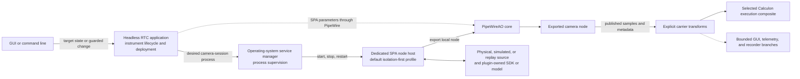
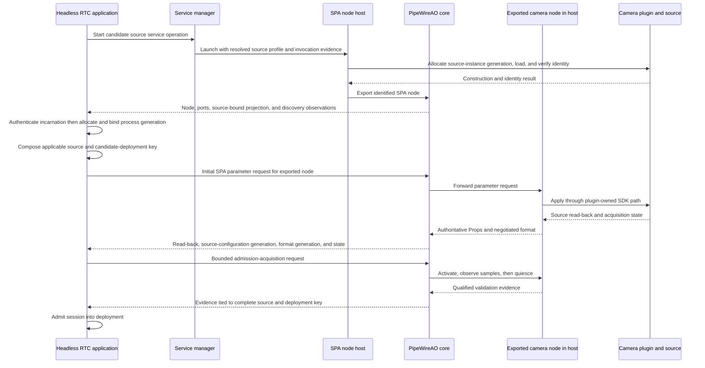

# PipeWireAO RTC camera-session contract

Status: proposed normative companion contract; not yet an approved
implementation baseline

Baseline: none; approval and implementation/evidence traceability belong to the
independent physical-camera delivery track

Approval blockers:

- RTC-CAM-005 and RTC-CAM-006 require a versioned PipeWireAO camera-source
  identity, source-configuration-generation, and format-generation projection
  plus an acquisition-boundary carrier that do not yet exist;
- RTC-CAM-007 requires a versioned source mutation-ordering-domain and no-
  later-application fence contract that does not yet exist; and
- RTC-CAM-010 requires an authoritative PipeWireAO acquisition-control SPA
  contract that does not yet exist.

Review date: 2026-08-31

Applicable capability: a selected managed camera session using a physical,
simulated, or recorded-replay source. The full camera-session capability is
optional in the `development` profile; a simple simulated or FITS source can be
an ordinary configured PipeWire source without claiming this contract.

## Authority and scope

This document defines the deployment and reconciliation contract that binds
one logical instrument camera role to one source, its SPA plugin, process
placement, required carrier transforms, acquisition scheduling, and lifecycle
observations. It is consumed by RTC, generic-host, daemon-side-loader,
device-plugin, GUI, supervision, and verification implementers.

Selecting a physical camera makes the applicable physical-host, identity,
control, safe-recovery, and admission clauses mandatory. Simulated and replay
camera sessions are useful conformance fixtures, but their evidence does not
qualify a physical SDK or detector. A deployment that does not select managed
camera-session behavior is outside this contract rather than partially
conformant.

Adjacent authorities remain:

| Document or repository | Authority |
| --- | --- |
| [System architecture](architecture.md) | System ownership, process and failure-domain placement, and selected architecture decisions. |
| [Operational architecture](operations.md) | Instrument lifecycle, deployment transactions, property clients, supervision, and correction authority. |
| [Time, causality, and performance](time-and-performance.md) | Acquisition identity, freshness, deadlines, row-block causality, and performance evidence. |
| PipeWireAO and the device-plugin repositories | Exported-node scheduling, SPA buffers, formats, metadata, properties, and individual source implementations. |

This contract does not define another transport, camera API, scientific
algorithm interface, or instrument lifecycle. It does not claim that the
planned generic host, daemon-side loader, or RTC reconciliation is implemented
or qualified.

## Normative language

Uppercase requirement terms use the meanings defined by BCP 14 (RFC 2119 and
RFC 8174). Lowercase forms are ordinary prose. Clauses identified by an
`RTC-CAM-*` heading are the normative requirements; the terms and generation
table define the words those clauses use. Verification intent, diagrams,
examples, precedent, implementation sequencing, and rationale are informative.

## Terms and generation model

A **camera session** is a stable deployment and reconciliation unit identified
by a camera-session identity. It binds one logical instrument camera role to
one selected source profile. Its identity does not change when its process,
connection, format, or properties change.

The logical role is a human-readable, canonical name in the RTC definition.
The camera-session identity is a UUIDv5 that definition tooling MUST derive
from the persistent RTC-definition namespace plus the canonical logical role,
source-profile kind, and stable selected-source binding fields in the table
below. Tooling MUST persist and verify it without requiring a scientist to
invent one manually. This makes script and GUI construction deterministic.
Editing admission evidence or configuration that does not change the role or
stable selected-source binding preserves it; replacing that binding creates a
new identity. Plugin build, process, connection, format, and property changes
remain separate generations or deployment fields and do not alter it.

The RTC-definition schema MUST define a versioned, length-delimited canonical
encoding for the UUIDv5 name bytes, including field order, explicit absent
values, string normalization, and provider-specific identity normalization. An
implementation MUST NOT derive the name by delimiter-based display-string
concatenation. The persisted camera-session record MUST retain the derivation-
profile version and complete stable binding and MUST reject a UUID that resolves
to different binding fields. A derivation-profile update requires an explicit
definition migration; it MUST NOT silently change an existing session identity.
The RTC-definition namespace itself is a persisted UUID assigned once to a
definition lineage; a pathname, display name, process identity, or save event
MUST NOT regenerate it. An explicit clone or fork operation MUST declare whether
it preserves that lineage or creates a new namespace.

| Source profile | Stable selected-source binding | Required admission evidence |
| --- | --- | --- |
| Physical camera | Expected immutable hardware identity, such as serial number, plus the constrained transport endpoint. | Admitted plugin build and SDK/firmware profile, observed hardware identity, endpoint, and control-exclusivity evidence. |
| Simulated camera | Simulator kind plus scenario or model identity. | Simulator implementation and build identity, configuration digest, and seed or seed policy. |
| Recorded replay | Run or recording identity plus logical stream and segment selection. | Payload/index digest and replay ordering and pacing policy. |

Simulation and replay fill a logical camera role for development and
verification. They do not impersonate a physical camera or provide evidence
about a vendor SDK or physical detector.

The **acquisition timing authority** decides when an exposure or replay sample
becomes due. It is distinct from the SDK mechanism that reports available data,
the PipeWire graph role and wake policy that schedule processing, and the RTC
lifecycle effect that activates operational acquisition.

A **source-settings record** is the immutable canonical representation of the
complete acquisition-affecting and scientific-interpretation-affecting source
settings read back for one source-configuration generation. It identifies
unknown or unsupported members explicitly and excludes telemetry-only values.
Its digest is meaningful only with the versioned canonical-record schema. A
configured exposure value in that record does not replace qualified per-
acquisition exposure timing in `SPA_META_Acquisition`, and vice versa.
The camera profile identifies required members; an unknown or unsupported
required member prevents an authoritative acquisition and admission.

A **source-process incarnation** is established by a nonreused service-manager
invocation identity together with authenticated operating-system process-start
evidence for the selected host process. A PID alone is not incarnation evidence
because it can be reused. The service manager supplies the association, and the
selected loader exposes it read-only with the source. For a co-located profile,
the process is the identified PipeWireAO daemon invocation. UUID-valued service-
invocation identities use the RTC-OPS-004 representation.

The generation scope graph is explicit but is not one linear chain. The **RTC
authority epoch** defined by RTC-OPS-004 changes on every RTC application
restart and is the root of the active deployment branch and every camera-session
source branch. A deployment generation can change while a source process
continues, and an observing client can reconnect while both remain unchanged.
Those identities are therefore separate axes in a complete reconciliation key.

The RTC authority epoch provides correlation and stale-event rejection only.
It does not grant authority, revoke a prior RTC writer, or fence ordinary SPA
parameter writes, which do not carry the epoch to their source. The initial
single-host profile does not support live RTC authority handover. A future
handover or multi-active profile requires a separately approved
**RTC control-authority fencing contract**, implemented by an exclusive lease
or source-enforced fence, before a new RTC application can accept target state.

The initial profile's RTC-authoritative process membership and fail-closed
single-RTC admission guard are defined by RTC-OPS-001 and RTC-OPS-002 in the
[operational architecture](operations.md). This camera contract defines only
their camera-session consequences.

A child counter is comparable only within the identity key of its declared
parent scope. Counters are unsigned 64-bit values; zero means unknown or not yet
assigned, and the first allocated value is one. An owner increments without
wrap. Before exhaustion, it creates and publishes a new parent identity and
readmits every affected child, or it fails closed. A child counter can therefore
restart when its parent changes, but its complete key cannot be reused.

An **applicable identity key** is the union of the branches required at a
boundary, including every parent on each selected branch. A source key contains
the RTC authority epoch, camera-session identity, process generation,
source-instance generation, and, for an isolation-first exported source, source
connection generation. A deployment-scoped request also contains the active or
candidate deployment generation. A property reconciliation key additionally
contains the observing adapter's adapter-connection identity, `PropInfo`
revision, and `Props` observation sequence as applicable. A co-located source
has no source connection generation; the field is explicitly absent rather than
zero. Child values alone are never compared across different complete keys.
The complete source-state key for a scientific acquisition adds the active
source-configuration generation and format generation. Source-configuration
generation is owned beneath the source-instance branch and survives a harmless
source export reconnect; format generation also includes the applicable source-
connection scope because it binds connection-specific formats and buffer pools.
An acquisition-scheduling, freshness, or progress key also contains the timing-
authority identity and generation when that authority is not intrinsic to the
camera source, plus the declared mapping to the acquisition domain and
generation carried by `SPA_META_Acquisition`.

A direct client in the explicitly unreconciled engineering profile permitted by
RTC-OPS-001 has no RTC authority epoch, deployment generation, or RTC-assigned
camera-source key. Its **unreconciled engineering key** contains the adapter-
connection identity and the exact PipeWire `object.serial` observed
for the source on that connection, followed by the adapter's per-source
`PropInfo` revision and `Props` observation sequence as applicable. The absent
RTC fields are represented as absent, not zero or invented values. This key can
prevent a local editor from applying stale state to a replaced PipeWire object;
it does not reconcile a camera session, qualify a source, or provide RTC audit
or admission evidence. `object.serial` is scoped by the adapter connection; it
is not treated as globally unique. If the source has no usable `object.serial`,
the direct editor MUST remain read-only rather than substitute a node name or
reusable global ID.

| Identity or revision | Owner and increment rule | Invalidates |
| --- | --- | --- |
| RTC authority epoch | RTC-OPS-004 allocates a new UUID before each RTC application instance accepts target state. It changes on RTC restart, is never resumed, and provides correlation rather than source-side fencing. | Every request, observation, deployment, and camera-session source generation under the prior epoch. |
| Camera-session identity | A deterministic UUIDv5 assigned and verified by RTC definition tooling for one canonical logical-role and stable selected-source binding. It is stable across deployments and is not a generation. | Replacement of the logical role, source-profile kind, or stable selected-source binding fields creates a different session identity. |
| Plugin build identity | Immutable library/package build identity recorded in the deployment. It is not a generation. | A different build requires a new deployment generation. |
| Deployment generation | The RTC application allocates the next value before a deployment candidate can have an external preparation effect. A candidate later proven canonically unchanged terminates without activation; unchanged, failed, and cancelled values are not reused. The candidate becomes active only after successful admission and the authoritative activation commit defined by RTC-OPS-003. | Only successful activation invalidates requests and observations addressed to the prior active deployment. Allocation, unchanged resolution, and preparation do not invalidate it. |
| Process generation | Before accepting observations, the RTC application allocates the next value when it first binds previously unbound, verified source-process incarnation evidence to the camera session beneath the current RTC authority epoch. The binding record retains that evidence. Every deployment candidate that references the same incarnation reuses the value; preparing a candidate alone does not create a new process generation. A launch or restart creates a different incarnation and value. An RTC restart assigns a value beneath the new epoch even when an independently supervised source process survives. For a co-located profile, this identifies the containing PipeWireAO daemon process incarnation for that camera session. | Process exit makes that branch unavailable immediately. A replacement branch does not invalidate a still-live active branch until RTC-OPS-003 activation retires it. Every source-instance generation remains scoped to its identified process branch. |
| Source-instance generation | The selected loader allocates the next source-process-incarnation-scoped value before each source-plugin instance is constructed or replaced. The RTC includes that value beneath its current process-generation binding. If an RTC restarts while the authenticated source process and exact plugin instance survive, the loader republishes its current value and the RTC binds it beneath the new epoch and process generation; it does not invent a reconstruction. | Prior plugin-instance state, node publication, controls, formats, and source observations, including a daemon-local replacement without process restart. |
| Source connection generation | An isolation-first host allocates the next value before every PipeWire core connection and export epoch within a source-instance generation. It is not applicable to a co-located daemon-side source. | Prior exported globals, subscriptions, port observations, and child format/control observations for that export. |
| Source-configuration generation | The source allocates the next value within a source-instance generation before a coherent set of acquisition-affecting or scientific-interpretation-affecting settings can become effective. It publishes the value as active only with authoritative read-back and an exact acquisition-boundary mapping. A source export reconnect republishes rather than increments an otherwise unchanged value. A telemetry-only observation does not increment it. | Admission evidence and scientific samples that depend on the prior effective source settings. It does not by itself invalidate the source instance, connection, format, or telemetry-only state. |
| Format generation | The source allocates the next value before a changed carrier format, shape, layout, schema, required metadata contract, or compatible-buffer-pool contract becomes active within the current source-instance and applicable source connection scope. | Buffers, leases, links, subscriptions, and format-dependent validation from the prior format generation. |
| Timing-authority identity and generation | The deployment binds one stable identity for a timing authority outside the camera source. That authority's owner allocates the next generation beneath the stable identity before a timing-service incarnation, schedule, trigger interpretation, or other due-sample semantics can change. A free-running camera source uses its source key plus source-configuration generation and has no separate timing-authority generation. | Due-sample expectations, acquisition-domain mappings, health evidence, and admission records under the prior timing-authority generation. |
| Adapter-connection identity | A reconciliation adapter allocates a fresh UUIDv4 from the operating system's cryptographically secure random source before each PipeWire core connection and rejects a collision with any retained adapter scope. It is independent of the source connection and cannot be resumed after adapter reconnect or restart. | The adapter's proxies, enumeration assemblies, authoritative property bases, `PropInfo` revisions, `Props` observation sequences, in-flight requests, and drafts from the prior connection. |
| `PropInfo` revision | A reconciliation adapter increments a per-source counter within its adapter-connection identity when an ordered source observation changes or replaces any property descriptor, group, type, constraint, enumeration, visibility, or writability. | Property drafts and requests prepared against the adapter's prior control surface. |
| `Props` observation sequence | A reconciliation adapter increments a per-source counter within its adapter-connection identity for each ordered authoritative `Props` observation from the source. | The fields present in that observation supersede prior observed values according to its sparse-update or complete-snapshot kind, but do not by themselves change the `PropInfo` contract. |

UUID identities and unsigned 64-bit generations, revisions, and sequences use
the RTC-OPS-004 representations. Assigned zero, non-canonical representation,
overflow, and reuse beneath the same parent key are invalid.

The term **property generation** is not used by this contract. A client model
uses its adapter-connection-scoped, per-source `PropInfo` revision and `Props`
observation sequence; those counters are not compared across adapter-connection
identities and need not be encoded into a standard SPA parameter write.
Scientific execution-composite property and parameter generations remain the
separate profile-independent publication contract in RTC-EXEC-004; the FGN
contract owns its `fgn-native` implementation.

An authoritative `Props` observation has one of two client-model kinds:

- A **sparse update** replaces only the values that it contains. An omitted
  property retains its prior authoritative value.
- A **complete snapshot** replaces all values in an explicitly identified
  property set. An omitted member of that set becomes unavailable; omission
  does not imply the property's default value.

The adapter determines the kind from the source contract and enumeration
boundary, not from fabricated device metadata. An ordinary property-change
notification or a filtered/incomplete enumeration is a sparse update. Only a
successfully completed, unfiltered enumeration of a source-declared property
set can be a complete snapshot, and only when the source contract provides
snapshot-consistency evidence. The adapter MUST verify that the source identity,
property-set identity, `PropInfo` surface, and applicable source parameter-
change marker or ordered change-notification state remain coherent from
enumeration start through completion. If the
source cannot provide that evidence, or if any applicable change is observed
during assembly, the adapter MUST abandon the complete-snapshot claim and
either publish only contract-valid sparse observations or discard the assembly.
The adapter assembles a bounded multi-result enumeration and publishes it to its
reducer as one observation only after the enumeration completes; a gap, error,
cancellation, reconnect, or concurrent change cannot publish a partial or
incoherent result as complete. A standard `SPA_PARAM_Props` write is a request,
not an authoritative observation.

For each property, the shared client model keeps three distinct values: the
**authoritative observed base**, at most one **in-flight request**, and an
optional **newer draft** created after that request was issued. A source
observation that matches the active camera-session identity, applicable
identity key, and control surface updates the base; an observation for a stale
identity key or `PropInfo` revision is retained as diagnostic
evidence but does not update the active base. Issuing a request moves the value
it represents out of the draft slot and into the in-flight record; a later edit
creates a new draft with its own local edit identity.

When the applicable source key or adapter-connection identity changes, every
property base in the new scope starts as unknown. The prior base remains
diagnostic evidence only. A sparse update in the new scope makes only its
present fields known; an omitted field remains unknown and MUST NOT inherit the
prior scope's value. A complete snapshot establishes the known or unavailable
state of its explicitly identified property set.

A property observation crosses the **post-submission observation fence** for an
in-flight request only when all of these conditions hold:

- its identity matches the request: a reconciled operational request requires
  the same camera session, RTC authority epoch, deployment generation, process
  generation, source-instance generation, applicable source connection
  generation, adapter-connection identity, and `PropInfo` revision; an
  unreconciled engineering request instead requires the same adapter-connection
  identity, PipeWire `object.serial`, and `PropInfo` revision;
- its `Props` observation sequence is later than the request's base sequence;
- it contains that property's authoritative value; and
- the source enumeration that produced it was initiated after submission, or
  the source confirmed after submission that a fresh value observation was
  available.

Only an observation beyond that fence can resolve the in-flight request, and it
does not erase a newer draft that was never represented by the request. A
**proven rejection** is an error correlated to that exact request and applicable
identity key whose source contract guarantees that the request was not
submitted or applied.
A fenced value terminalizes the client request as an observed-after-submission
result that retains the exact value and whether it equals, adjusts, or differs
from the request. Without a source-correlated operation outcome, equality is not
proof that this request caused or applied the value; another client, hardware,
or firmware may have produced it.
A generic error, disconnect, or timeout is not a proven rejection. If neither a
fenced observation nor a proven rejection arrives by the request deadline, the
adapter marks the request indeterminate and never reports it rejected, applied,
or active.

## Normative camera-session requirements

### RTC-CAM-001 — Identified source profile

Every resolved camera session MUST declare exactly one source profile kind and
all identity fields required for that kind. It MUST also declare the lifecycle
states in which source availability, qualification, or fresh data is an
admission dependency and the exact unavailable, revoke-correction, stop, or
fault consequence in each state. A camera that is optional in a state MAY
degrade health without changing that state, but it MUST NOT satisfy a required-
camera guard or silently become a timing or acquisition dependency. A physical
camera session MUST fail its own admission when the observed immutable hardware
identity or constrained endpoint does not match. An optional session MAY remain
explicitly unavailable under its declared deployment policy, but a missing or
mismatched source MUST NOT be published under the logical role or treated as an
admitted camera. A simulated or replay profile MUST publish its actual source
identity and MUST NOT claim a physical hardware identity.

Verification intent (informative): inspect resolved manifests and exercise
missing, duplicate, mismatched, simulated, and replay identities; observe a
closed admission failure without publication under the admitted physical role.
Exercise correction-required, running-required, and optional diagnostic
dependency policies in every lifecycle state and verify only their declared
health and lifecycle consequences.
Generate the same session through the script and GUI with Unicode, absent,
delimiter-containing, and provider-normalized fields; require identical UUID
bytes, reject ambiguous encodings and a same-UUID/different-binding record, and
test an explicit derivation-profile migration.

### RTC-CAM-002 — One lifecycle authority and SDK-control writer

The headless RTC application MUST remain the sole owner of instrument target
state and deployment admission. A camera-session reconciliation boundary MUST
accept an operational lifecycle, deployment, acquisition, or device-control
request only from the RTC-authoritative process admitted under RTC-OPS-001 and
RTC-OPS-002. It MUST reject an operational request from an engineering client,
an observer, a device producer, or another process before that request reaches
the admitted SDK-control path.

For a physical profile, the source SPA plugin MUST be the sole writer through
the admitted camera SDK control path and the authoritative publisher of observed
physical camera state. Hardware, firmware, and external triggers can change
physical state without a plugin request; the plugin MUST observe and publish
such changes rather than claim exclusive physical-state ownership. The
deployment MUST define the software-control exclusivity domain and the evidence
that closes it. Operating-system permissions, vendor exclusive-control mode,
transport access control, and network policy as applicable MUST together
prevent every other local or remote software client from opening a writable
vendor SDK, transport, or device-control path to that camera while the session
is operational. If exclusivity over the declared domain cannot be proven, the
physical session MUST fail operational admission. A separately qualified
read-only hardware monitor MUST NOT acquire a control-capable handle. The generic
host, daemon-side loader, WirePlumber, GUI, and engineering clients MUST NOT
create another lifecycle authority, bypass the admitted SDK-control path, or
infer source application from request submission. An engineering device write
permitted while no operational authority is admitted remains subject to
RTC-OPS-001 and MUST NOT be reported as operational RTC control.

A resolved deployment MUST reject two physical camera sessions, source hosts,
or concurrently prepared candidates that would create more than one control-
capable handle in the same camera software-control domain. A serialized
candidate MAY reference and reconfigure the already admitted source instance
under RTC-OPS-003 and RTC-CAM-012; it does not create a second writer.

Verification intent (informative): inspect every control path and inject
concurrent RTC, GUI, reconnect, service-manager, external-trigger, and simulated
firmware events; prove that only the RTC admits lifecycle state, only the plugin
submits SDK controls, and plugin read-back publishes changes regardless of who
or what caused the physical state. Attempt to open the camera's writable SDK or
device endpoint from an unrelated local process, a remote software client, and
a purportedly read-only monitor. Resolve two roles and two concurrent candidates
to the same physical control domain and reject the duplicate writer before it
opens a handle. Exercise RTC-OPS-001 and RTC-OPS-002
holder and replacement cases and prove that an unadmitted request is rejected
before the camera SDK-control writer observes it.

### RTC-CAM-003 — Isolation-first physical host

In the isolation-first profile, each physical camera SDK boundary MUST execute
in a dedicated PipeWire client process that loads one camera factory and
contains one SDK-control writer. The source MUST execute outside the PipeWireAO
daemon and outside any Julia graph-service process. RTC-CAM-018 is the sole
exception: its admitted `fgn-native` co-located profile loads the camera source
and SDK into the same PipeWireAO daemon process that owns the strict execution
island and FGN composite. It does not permit camera-SDK co-location in a
`julia-runtime` service.

Verification intent (informative): inspect the resolved process topology and
runtime process membership; crash the isolated host and prove that the daemon
and other camera sessions remain observable; inspect a co-located profile and
prove that no intermediate generic-host process contains the camera source.

### RTC-CAM-004 — Admitted source-loader boundary

For the isolation-first profile, the generic host MUST load exactly the admitted
plugin library, factory, build identity, and resolved construction values and
MUST verify source identity before exporting the logical role. For an
RTC-CAM-018 profile, an admitted daemon-side loader MUST load that same resolved
source directly into the strict execution island without an intermediate
generic-host process. Each loader MUST create the declared main/data-loop
resources and resource policy, fail closed on construction, identity, SDK,
connection, or node-publication failure, and release its node and source on
requested shutdown. Each loader MUST NOT accept an arbitrary remote library
path or unchecked construction override.

Verification intent (informative): test each construction stage, malformed and
unapproved input, identity mismatch, partial export, core loss, repeated
start/stop, and cleanup in both placement profiles while checking process,
resource, and device ownership.

### RTC-CAM-005 — Scoped identity and generation reconciliation

The owner named in the generation table MUST allocate each identity, generation,
revision, and sequence according to the representation, increment, exhaustion,
and invalidation rules in this contract. The RTC, host, source, and adapters
MUST preserve and publish the parts of the scope graph applicable at their
boundaries. Before allocating or reusing a process-generation binding, the RTC
MUST authenticate and compare the complete source-process incarnation evidence;
it MUST NOT infer continuity from a PID or node name. A receiver MUST reject
zero where an assigned counter is required,
a malformed or non-canonical representation, overflow, reuse beneath the same
parent key, or an omitted applicable parent. Every RTC reconciliation request
and observation for a camera session MUST carry the applicable identity key,
and the receiving reconciliation boundary MUST reject a stale request with an
explicit stale result and MUST retain or ignore a stale observation without
changing authoritative state. In accordance with RTC-OPS-003, allocating or
preparing a deployment candidate MUST NOT invalidate the active deployment or
its requests and observations; only the successful authoritative activation
commit can do so. A loader MUST allocate a new source-instance generation when
it reconstructs a source without restarting its containing process, and a
reconciliation adapter MUST allocate a new adapter-connection identity before
each connect or reconnect. If an independently supervised process and source
instance survive an RTC restart, the RTC MUST authenticate the unchanged
process incarnation and source-instance projection before rebinding the
loader's current source-instance generation beneath the new epoch-scoped
process generation. The new complete key is distinct even when the loader's
process-local child value is unchanged; neither side may describe the rebind as
source reconstruction or reuse an observation from the prior epoch.

RTC-CAM-005 and RTC-CAM-006 are not ready for approval until the physical-
camera delivery track approves a
versioned PipeWireAO camera-source identity projection and these requirements
link to it. The lower-level contract belongs in the PipeWireAO repository and
MUST define the exact node, parameter, or property locations and stable keys for
the source-bound projection: source-profile kind and its observed identity
fields or versioned identity-record digest, source-process incarnation evidence,
source-instance generation, optional source connection generation, active
source-configuration generation and its complete authoritative source-settings record
or digest, format generation, and plugin build identity. It MUST define how a reconciliation
adapter binds that projection to the RTC-owned camera-session identity,
authority epoch, process generation, and applicable deployment generation
without treating deployment identity as intrinsic state of a source shared by
more than one candidate. It MUST also define binary and text types, absent-field
representation, each field's read-only owner, authenticated association with
the exporting client, atomic observation/change ordering, the binding between
each source-configuration generation and its exact settings and acquisition-
adoption boundary, the binding between each format generation and its exact
negotiated format and pool contract,
co-located applicability, and the client behavior for an older or partial
projection. It MUST NOT require a
scientist-authored algorithm or device plugin to invent transport-specific
wrappers for these host/session fields.

Verification intent (informative): exercise failed candidates, host restart,
RTC restart, source reconstruction with and without process restart, source-core
reconnect, adapter reconnect and restart, reordered observations, stale
completions, PID reuse under a new service invocation, forged invocation
metadata, injected duplicate epochs, counter reset under a new parent, and
counter exhaustion;
prove that no complete key is reused or wrapped and no stale event changes
authoritative state. Resolve an allocated candidate as canonically unchanged
and prove that it becomes terminal without changing active identity or applying
an external effect. Reuse one surviving process incarnation across active and
candidate deployments and prove that its process generation does not change
merely because the candidate exists. Keep the prior active generation live
through failed and cancelled candidate preparation when the topology permits
coexistence; when it requires quiescence, retain the prior identity and report
rollback failure without activating the candidate. Restart the RTC while an
independently supervised source process survives and verify its new epoch-
scoped process key. Verify by inspection and a two-client test
that the epoch does not fence an old writer and that live authority handover is
not admitted. Restart the RTC while the source process and plugin instance
survive; prove that the loader republishes the same process-local source-
instance generation, the RTC authenticates it beneath a distinct complete key,
and no prior-epoch observation is accepted or false reconstruction reported.

### RTC-CAM-006 — Source-configuration and format-generation ownership

Each camera profile MUST classify every source control as acquisition-affecting,
scientific-interpretation-affecting, format-affecting, admission-relevant,
telemetry-only, or an explicitly declared combination. Before changed
acquisition-affecting or scientific-interpretation-affecting settings can
produce an authoritative sample, the source MUST allocate a source-
configuration generation, obtain authoritative read-back of the complete
effective settings set, and publish either that canonical set or a digest that
resolves to an immutable canonical record. It MUST map the generation to the
exact first acquisition for which the settings are known to be effective and
to the prior generation's last complete acquisition or invalidated partial
acquisition. Adapter-local `Props` observation sequences and request-submission
order MUST NOT substitute for this source-owned mapping. If the hardware or SDK
cannot identify the effective acquisition boundary, every acquisition in the
ambiguous interval MUST be non-authoritative and the interval MUST remain
explicit in audit evidence.

Every block of one row-block acquisition MUST resolve to the same source-
configuration generation. A settings change during a partial acquisition, or
an unprovable transition between blocks, MUST invalidate that partial
acquisition rather than publish a mixed-configuration frame. An externally
originated effective settings change MUST follow the same generation and
mapping rules even when no RTC property request caused it. A source export
reconnect MUST republish the current generation and source-settings record; it MUST NOT
invent a change when authoritative read-back proves the effective settings
unchanged.

The profile MUST bound source-configuration transition rate, in-flight records,
and retained unresolved mappings. A setting that can vary autonomously at
acquisition rate MUST use a preallocated, fixed-size per-acquisition field or a
bounded generation-to-record facility approved by the lower-level contract; it
MUST NOT allocate, format an unbounded record, or wait for catalog I/O in the
source callback. If that provenance cannot be represented within the admitted
bounds, the autonomous mode MUST remain unavailable for authoritative
operation.

When a source-configuration change belongs to a deployment candidate, the RTC
MUST first revoke correction and make every incompatible prior-deployment
source path unavailable. The RTC reconciliation boundary and candidate record
MUST bind the requested change, resulting source projection and settings
record, generation, and validation acquisitions to that candidate. The loader
and source MUST continue to publish their source-owned identity and state
without claiming an intrinsic deployment generation. The RTC MUST NOT present
candidate settings or samples as authoritative under the prior active
deployment. RTC-OPS-003 activation is the only operation that binds the
prepared source-state key to the candidate as the active deployment. Rollback
MUST allocate and map another source-
configuration generation when restoring the prior effective settings; it MUST
NOT relabel the candidate generation as the prior one.

Before publishing a changed buffer interpretation or pool contract, the source
MUST allocate a new format generation, negotiate and validate the complete
format and required metadata, and prevent buffers or partial frames from the
prior generation from becoming authoritative under the new generation. When
that format belongs to a deployment candidate, the RTC reconciliation boundary
and candidate record MUST bind each validation observation to the candidate,
while the loader and source retain their deployment-neutral source projection.
The RTC MUST NOT publish the candidate format as authoritative under the prior
active deployment. The RTC-OPS-003 activation commit MUST make the deployment
and its prepared format key authoritative as one coherent state change.

The versioned lower-level PipeWireAO contract required by RTC-CAM-005 MUST
define the source-configuration projection and a bounded sample metadata or
adoption-record carrier that maps each acquisition to its active source-
configuration generation. It MUST define initial publication, delayed device
adoption, external changes, reconnect republication, partial-frame
invalidation, loss, and unknown-state behavior. Until that carrier and
projection are approved and implemented, a `Props` read-back plus an
acquisition timestamp is not evidence of the settings that produced a frame.
The carrier MUST NOT repurpose the `SPA_META_Acquisition` generation, which is
part of acquisition identity and can be shared by multiple triggered sources,
as a camera-settings generation.

Verification intent (informative): change every layout-defining field during
complete-frame and row-block operation; exercise queued and leased buffers,
partial frames, old subscriptions, overflow, and rollback; reject every mixed-
generation sample. Change gain, exposure, trigger configuration, and another
scientific source control without changing format; inject delayed hardware
adoption, a device-originated change, reconnect, missing read-back, and an
unreported mid-frame transition; reconstruct the exact effective settings for
every accepted acquisition or mark its interval unknown. Drive autonomous
settings at and beyond the admitted transition rate; verify fixed capacity,
visible overflow or mode rejection, and no callback allocation or catalog wait.
Prepare and reject a candidate source configuration and format; verify that the
source projection remains deployment-neutral, candidate validation evidence is
bound only by RTC reconciliation, and no candidate observation is published as
authoritative under the prior deployment.

### RTC-CAM-007 — Property revision and observation reconciliation

The RTC-owned operational reconciliation adapter and each permitted direct
engineering client adapter MUST assign an adapter-connection identity, per-
source `PropInfo` revisions, and per-source `Props` observation sequences
according to the scoped rules in this contract. Only the adapter executing in
the RTC-authoritative process admitted by RTC-OPS-001 and RTC-OPS-002 MAY
submit a reconciled operational property request to the protected source. An
operator client submits its identified intent to the RTC-owned frontend and
consumes that adapter's projected base; it MUST NOT substitute a separate
read-only PipeWire observation sequence as the operational request base. At
the source-write boundary, a reconciled operational property request MUST
identify the camera session, RTC authority epoch,
applicable deployment generation, process generation, source-instance
generation, applicable source connection generation, base source-configuration
generation, base format generation, adapter-connection identity, `PropInfo`
revision, base `Props` observation sequence, property key,
and request identity. A direct engineering client that claims reconciled edit
status under RTC-OPS-001 MUST instead declare the unreconciled engineering
profile and carry its adapter-connection identity, PipeWire `object.serial`,
`PropInfo` revision, base `Props` observation sequence, property key, and
request identity. It MUST NOT
fabricate an RTC authority epoch or deployment or source generation, update an
operational authoritative base, or become camera-session admission evidence.

The source contract MUST partition writable properties and commands into a
finite set of mutation-ordering domains and define the correlated terminal,
ordered source-application fence, or reset that proves an earlier submitted
effect in a domain cannot apply later. If it declares no safe partition, the
complete source is one domain. The RTC adapter MUST own one bounded mutation
scheduler for each domain. The default maximum is one submitted operation whose
later application remains possible. A source contract MAY admit a larger
finite window only when it supplies distinct correlated operation identities,
an application order and no-later fence for every member, and evidence that
every permitted application order is safe for that command family; ordinary
SPA submission order is insufficient. The scheduler MAY retain only its
declared finite number of unsubmitted intents; before submitting the next one, it MUST
revalidate that intent against the latest complete identity key, control
surface, authoritative base, lifecycle policy, and predecessor result. A
queued intent that is rejected or superseded before source submission MUST
receive one identified terminal disposition and MUST NOT later reach the
source. A client-side property lock, a PipeWire call return, or a post-
submission `Props`
observation that lacks the source's no-later-application guarantee MUST NOT
release the domain. Capacity exhaustion MUST reject before source submission.
Direct engineering writers remain unreconciled and do not share this RTC
scheduler, which is why RTC-OPS-002 must exclude their unresolved work before
operational admission.

Before accepting an operational intent, the RTC adapter MUST allocate and
publish its RTC-AUDIT-002 operation identity and request binding and reserve the
mutation-domain and result capacity. It MUST expose queued, submitted, client-
terminal, and no-later-application-fence stages separately. A fenced `Props`
value can terminalize the client request as observed after submission without
releasing the source mutation domain when the source contract does not prove
that the operation can no longer apply. Any distinct source-owned operation
identity remains linked rather than replacing the RTC operation.
A permitted raw PipeWire tool that cannot carry those client-model fields MAY
still issue an ordinary SPA write in engineering mode, but that action is
submission-only and uncorrelated: it MUST NOT receive a reconciled applied or
terminal claim, and a later `Props` observation remains independently observed
state rather than proof of that write. Such a write and any unresolved outcome
MUST prevent reuse of prior qualification evidence; later operational admission
requires fresh authoritative read-back and RTC-CAM-011 qualification.
The reconciliation adapter MUST identify each source observation with that same
applicable parent identity key and the observed active source-configuration
generation when available, and MUST classify it as a
sparse update or complete snapshot. It MUST update the authoritative observed
base only when the observation matches the active camera-session identity,
applicable identity key, and `PropInfo` revision; it MUST
retain or reject a stale observation as diagnostic evidence without changing
the active base.
Before submission, it MUST reject a request when its observed base source-
configuration or format generation is no longer active in the adapter's
serialized client model. These base fields provide conflict detection against
state already observed by the adapter; an ordinary `SPA_PARAM_Props` write does
not make them a device-side compare-and-swap and cannot exclude an unobserved
or concurrent hardware change. Such a race is resolved only by later
authoritative read-back, source-configuration adoption evidence, or a correlated
source result, and can remain indeterminate. An observation that changes the
source-configuration generation can cross the post-submission fence only when
it is bound to an authoritative settings read-back
and source-owned adoption mapping under RTC-CAM-006; equality of a requested
value and later `Props` value alone does not prove which acquisition adopted it.
On a new applicable source key or adapter-connection identity, it MUST create an
unknown base and MUST NOT seed it from the prior scope.
Only an observation that crosses the post-submission observation fence or a
proven rejection can resolve an in-flight request. Neither may erase a newer
draft created after that request. A `PropInfo` revision change invalidates
drafts and requests prepared against the prior control surface; an already
submitted request becomes indeterminate unless a correlated result proves a
terminal outcome. A deadline without a fenced observation or proven rejection
also becomes indeterminate. The standard SPA parameter write from the RTC
process remains the source's device-control transport; the client-to-RTC intent
path does not create a second device RPC or authorize the client to write the
source. A fenced value without a correlated source outcome MUST be
reported only as observed after submission, with its exact comparison to the
request, and MUST NOT be promoted to proof that the request caused device
application. RTC-GUI-006 through RTC-GUI-010 define the shared client
behavior.

RTC-CAM-007 is not ready for approval until the physical-camera delivery track
approves a versioned
source-side mutation-ordering contract. That lower contract MUST define each
property or command's ordering-domain identity, maximum concurrent and retained
operations, whether SDK return or authoritative read-back establishes an
application fence, the exact no-later-application evidence, correlated error
semantics, reset and reconnect behavior, and how those facts are projected to
the RTC adapter without pretending that ordinary SPA provides compare-and-swap.

Verification intent (informative): test two clients, dynamic metadata,
clamping, normalization, rejection, reconnect, stale revisions, reordered
observations, sparse omission, complete-snapshot removal, a request that races a
device-originated value change, and an older request acknowledgement arriving
after the user creates a newer draft. Exercise every observation-fence
condition, a host restart whose new process reuses the prior connection,
revision, and sequence values, a source-instance replacement within the same
process, an adapter reconnect or restart whose counters repeat, a pre-submission
enumeration that completes late, correlated and uncorrelated errors, and
timeout; issue a sparse first observation after reconnect and prove omitted
values remain unknown rather than carrying over; accept only the specified
observed, proven-rejected, or indeterminate result. Exercise a direct
engineering edit before RTC admission, replace the
PipeWire object while retaining the adapter connection, and then admit the RTC;
reject the stale object serial, preserve explicit absence of RTC identity, and
prove that engineering state is not promoted to reconciled or admission
evidence. Repeat the edit with an ordinary PipeWire tool that supplies no
client request identity; permit submission only in engineering mode, expose no
false terminal result, and require fresh read-back and qualification before
operational admission. While the operational guard is held, attempt the same
edit from a GUI connection and prove that it can submit an intent to the RTC
frontend but cannot write the protected source directly or substitute its own
observation sequence for the RTC adapter's base. Delay one write from each of
two clients within one mutation domain, then use separately declared independent
domains; prove whole-domain serialization by default, bounded rejection,
pre-submit revalidation, a larger same-domain window only with complete
correlation and ordering evidence, admitted independence only when declared, and no
domain release from an observation that lacks no-later-application evidence.

### RTC-CAM-008 — Acquisition timing and scheduling ownership

Every camera-session profile MUST declare the acquisition timing authority
(free-running device, external hardware trigger, RTC software trigger, or
downstream pull), SDK delivery mechanism (callback/event, blocking read, or
poll), PipeWire graph role and wake policy (including whether
`SPA_NODE_FLAG_POLL_DRIVER` and a polling data loop are selected), owning data
loop or execution context, and the RTC lifecycle effect that activates and
deactivates operational acquisition. An observer, GUI, recorder, or observation
queue MUST NOT pace operational acquisition.

The declaration MUST also bind the timing authority to its applicable stable
identity and generation, configured and observed timing state, expected-arrival
or trigger semantics, health evidence, and loss policy. For an external trigger,
those fields identify the trigger source or the separately admitted timing
service; for a free-running source they belong to the camera source key and
active source-configuration generation; for an
RTC software trigger they identify the operation stream; and for downstream
pull they identify the admitted graph owner. A watchdog MUST be able to
distinguish an interval in which no acquisition was due from a due acquisition
that failed to progress. An unobserved change of timing authority or its
admission-relevant configuration MUST invalidate camera-session admission.

Admission MUST authenticate the timing authority against its declared process,
device, wiring, or hardware-trigger incarnation and control-exclusivity
evidence as applicable. A self-reported acquisition domain, generation, service
name, or healthy flag is not sufficient by itself. A sample or progress event
from an unbound, replaced, wrong-domain, or wrong-incarnation authority MUST NOT
satisfy admission, due-sample, freshness, or correction-path evidence.

For a timing authority outside the camera source, the identified owner MUST
allocate and publish its generation according to the generation table before
new due-sample semantics become effective. The RTC MUST observe the complete
new timing-authority key, configuration, health, and acquisition-domain mapping
before readmission. A free-running camera MUST instead bind its effective
timing settings to the source-configuration generation under RTC-CAM-006. A
provider that cannot expose this identity and change boundary cannot be
admitted as an operational timing authority.

Verification intent (informative): inspect every selected scheduling profile;
attach, stall, detach, and reconnect observers while verifying unchanged
acquisition timing and source progress; replace, reconfigure, and disconnect
each timing-authority kind; inject a forged, wrong-domain, and wrong-incarnation
authority; distinguish no-trigger intervals from missing due samples; and test
activation only through the declared lifecycle effect.

### RTC-CAM-009 — Complete dynamic SPA control surface

The source plugin MUST export, and the selected source loader—the generic host
or RTC-CAM-018 daemon-side loader—MUST preserve without a second RPC
representation, the complete applicable SPA node, port, format, parameter, and
property surface. For every dynamic `PropInfo`, each layer MUST preserve every
field that the source advertises, including names, descriptions or tooltips,
category/group paths, visibility, types and storage constraints, defaults,
enumeration values and labels, and current source writability. The client model
MUST distinguish an absent optional field from an advertised empty or default
value. A plugin, loader, adapter, or gateway MUST NOT fabricate device metadata
that the provider did not supply. A client MAY render a clearly local fallback
label from the property key, but MUST keep the advertised field absent and MUST
NOT republish the fallback as provider metadata. `PropInfo` MUST be revised when
any advertised field, presence, constraint, enumeration, visibility, or
writability changes, as required by RTC-GUI-006 through RTC-GUI-011.

Verification intent (informative): compare local plugin and exported-node
enumeration through both source loaders before and after selector, access-mode,
acquisition, and reconnect changes; exercise absent descriptions, groups,
defaults, and labels; prove that every advertised field and writability change
is retained and none is invented.

### RTC-CAM-010 — Observed acquisition state

An acquisition command MUST have a request identity and, after the source
accepts it as an operation, an operation identity or an explicit contract that
uses the request identity as both. The source MUST publish their binding,
separately observed acquisition state, and the latest outcome for that
operation through its SPA surface. Command validation or submission, PipeWire
node state, and the presence of a callback MUST NOT be reported as proof that
the source has started or stopped acquisition.

RTC-CAM-010 is not ready for approval until the physical-camera delivery track
approves an authoritative,
versioned PipeWireAO acquisition-control SPA contract and this requirement
links to it. That lower-level contract belongs in the PipeWireAO repository,
not in this RTC document. It MUST define:

- the acquisition-state enum and the evidence required for each state,
  including unknown, inactive, trigger-armed, actively acquiring, transition,
  and fault cases;
- atomic request fields for start and stop and request identity; operation-
  identity allocation and request binding; outcome stages, terminality, and the
  distinction between validation, SDK submission, source
  read-back, and observed sample progress;
- stable machine-readable reason codes and optional diagnostic text that is not
  used for control logic;
- state and operation ordering, bounded concurrency or busy behavior, and
  outcome-retention or acknowledgement rules that prevent an accepted
  operation from being silently overwritten before it is terminalized under
  RTC-AUDIT-003;
- connection-loss terminalization, fresh-state discovery after reconnect, and
  prohibition of automatic retry after an ambiguous outcome; and
- exact mappings from standard SPA node start, pause, and suspend commands and
  the current `genicam-command.AcquisitionStart`,
  `genicam-command.AcquisitionStop`, and `genicam-command.TriggerSoftware`
  compatibility controls.

Until that contract is approved, a successful standard node command or Boolean
`genicam-command.*` parameter call proves no stage later than submission,
supplies no source-correlated terminal outcome, and does not satisfy
RTC-CAM-010. Other `genicam-command.*` controls remain momentary RTC-GUI-009
source commands; any physical state change that they cause is observed
independently.

Verification intent (informative): delay, reject, fail, cancel, lose, and
ambiguously disconnect start/stop commands; compare submitted commands with
source read-back, sample progress, and observed acquisition state without
automatic retry;
verify every approved state, stage, reason class, ordering rule, atomic request
failure, reconnect transition, standard node-command mapping, and legacy
compatibility mapping.

### RTC-CAM-011 — Admission evidence and live-stream freshness

To admit a camera session as available during `CONFIGURING`, the RTC MUST
execute a bounded admission-acquisition procedure whose minimum valid-sample
count, maximum sample count, deadline, and cleanup are declared by the profile.
The minimum MUST be at least one complete valid acquisition. Admission samples
MUST NOT authorize correction. Before reporting that session ready for its
declared dependency, the RTC MUST stop operational publication and place the
source in its declared ready or armed state. An optional session that does not
complete this procedure remains explicitly unavailable and MUST NOT contribute
qualification evidence. For an admitted session, the RTC MUST retain a
qualification record tied to the camera-session identity, admitted authority
epoch, deployment generation, process generation, source-instance generation, applicable source
connection generation, source-configuration generation, and format generation;
the immutable effective source-settings record or digest; the exact admission-
relevant source-control values; the applicable timing-authority identity, generation,
observed configuration, health evidence, and acquisition-domain mapping; the
procedure and sample identities; and its result and observation time. The
profile MUST declare whether that record remains admission-valid indefinitely
while its dependencies remain unchanged or expires after a maximum age. The
observation time MUST identify its time domain, and the RTC MUST evaluate a
maximum age and its terminal expiry with the profile's named monotonic clock
under RTC-TIME-002. An epoch-clock correction MUST NOT extend or shorten it. A
later change to an admission-relevant value or generation MUST invalidate the record
for admission, and expiration MUST mark it expired; neither action removes the
retained audit record. A session in `READY` whose record becomes invalid or
expires MUST return to `CONFIGURING` for requalification or enter `FAULT`; it
MUST NOT start operational acquisition from that stale admission. An unrelated
telemetry-only `Props` observation MUST NOT invalidate the record. The RTC MUST
NOT describe a retained qualification record as a currently fresh `RUNNING`
stream. Before reporting `RUNNING`, the RTC MUST activate operational
acquisition and observe a new valid acquisition within the declared freshness
deadline.

If the record becomes invalid while the session is `RUNNING` or `CORRECTING`,
the RTC MUST mark the session unavailable and apply its RTC-CAM-001 dependency
policy. When qualification is required for the current state, it MUST make
affected samples ineligible for the required data-validity and freshness
evidence, revoke correction when applicable, quiesce operational acquisition
and publication, and enter `CONFIGURING` for complete requalification or
`FAULT`. An optional diagnostic session MAY remain active only with explicit
unqualified or degraded status and MUST NOT retain or satisfy a required guard
on the prior qualification record. An expected live control change avoids this
path only when its declared policy says it is not admission-relevant and RTC-
CAM-006 still maps its exact effective source configuration to each
acquisition.

Verification intent (informative): enter `READY` after bounded validation and
prove publication is quiescent and the qualification record is retained; test
both non-expiring and maximum-age profiles; wait until a record expires; then
step the synchronized epoch clock without changing its monotonic expiry; then
reject a `RUNNING` request until requalification and a new valid operational
acquisition, and reject stale, wrong-generation, admission-relevant property-
change, timeout, and cleanup-failure cases without deleting audit history or
invalidating a record for telemetry-only observations. Invalidate an admission-
relevant dependency in `RUNNING` and `CORRECTING`; verify bounded correction
revocation, sample ineligibility, quiescence, and complete requalification or
fault for a required session, then verify explicit degraded status without a
false guard contribution for an optional diagnostic session.

### RTC-CAM-012 — Failure-atomic layout changes

Before applying a property whose declared change policy requires quiescence, or
any control that can change carrier interpretation, schema, compatibility
identity, buffer layout, or buffer-pool compatibility, the RTC MUST revoke
correction and quiesce affected acquisition. Exposure, gain, and another
ordinary runtime control do not require quiescence solely because they affect a
scientific result; their declared property policy governs them. The source MUST
read back and validate the resulting source configuration, including the
physical configuration for a physical profile, before the RTC activates a new
source-configuration, format, or deployment generation. When a change can be
performed live, RTC-CAM-006 still requires exact effective-acquisition mapping;
quiescence is not a substitute for or exception to that mapping. On failure,
the source MUST restore and
revalidate the prior source configuration or the RTC MUST leave the session
non-correcting and faulted; cached SPA format state MUST NOT remain
authoritative when it disagrees with source read-back.

Verification intent (informative): inject failure after each device write,
read-back, format negotiation, pool rebuild, transform rebuild, and self-test;
exercise each declared change-policy class, including live exposure and gain;
accept only a fully restored prior deployment or a safely faulted session, and
prove that a carrier-interpretation or compatibility change cannot bypass the
transaction.

### RTC-CAM-013 — Published-sample ownership

The producer MAY mutate a PipeWire buffer only while it owns the buffer before
publication or after all consumers release it for reuse. From publication until
the final release, every consumer MUST treat the published sample contents and
associated metadata as immutable. Shutdown, cancellation, or observer loss
MUST return every lease or account for it through the declared failure policy.

Verification intent (informative): exercise multiple consumers, cancellation,
disconnect, pool exhaustion, and buffer reuse while checking contents,
metadata, lease counts, and capacity recovery.

### RTC-CAM-014 — Explicit carrier transforms

A transform required to interpret a source carrier MUST be an identified graph
node with declared input/output format, scientific sample or product meaning,
placement, generation, and failure policy. Required descrambling, decoding,
unpacking, CDS/UTR, or geometric reordering MUST NOT be hidden in an
unrepresented subprocess pipeline or added to a scientist-authored Calculon
algorithm solely because it is camera-specific.

Verification intent (informative): inspect the resolved graph; independently
test each transform's numerical oracle, restart, format change, discontinuity,
and missing-transform admission failure.

### RTC-CAM-015 — Bounded publication and observer isolation

Every source pool, in-flight device slot, partial row-block frame, retry,
observer handoff, and restart attempt MUST have finite admitted capacity, a
declared producer and consumer cardinality, observable headroom, a capacity
rationale tied to the admitted arrival, burst, service, and latency model, and a
declared full or timeout action and recovery path. Observer, GUI, telemetry,
network, and recorder branches MUST NOT retain control-path capacity
indefinitely or change acquisition service rate.

Every property-enumeration assembly MUST have deployment-declared maximum item
and encoded-byte capacities and a monotonic completion deadline. If any bound is
exceeded, the adapter MUST abandon the entire assembly, retain the prior
authoritative snapshot, increment an observable failure counter, and publish a
visible failure reason outside the strict path. It MUST NOT publish or apply a
partial assembly as a complete snapshot.

Verification intent (informative): saturate each capacity independently and in
combination; verify declared drops, abandonment, coalescing, rejection,
timeouts, counters, lease recovery, and unchanged critical-path progress. Test
property enumeration at, below, and above its item, byte, and deadline bounds,
and change the source key, property set, `PropInfo`, and current values at every
assembly boundary; verify prior-snapshot retention and no partial or incoherent
complete-snapshot publication.

### RTC-CAM-016 — Crash and connection-loss recovery

When an isolation-first host exits, crashes, or loses its exported PipeWire
connection, the RTC MUST mark the session unavailable, retain the first-failure
and generation evidence, and apply the profile's RTC-CAM-001 state-specific
dependency policy. If the session is a correction dependency, the RTC MUST
revoke correction within its camera-loss deadline. A process restart MUST use
a new process generation and a new source-instance generation; an export
reconnect MUST use a new source connection generation.
Each path MUST repeat complete identity, control, format, transform, health, and
stream admission and MUST NOT restore correction authority automatically. Under
RTC-CAM-018, source or SDK loss caused by daemon exit or crash is PipeWireAO
daemon loss and invalidates the complete deployment rather than one exported
camera boundary.

When an isolation-first host and source remain alive after their local PipeWire
connection is lost, they MUST act without waiting for the RTC: stop or quiesce
acquisition according to the source profile, stop publication, abandon partial
samples, and recover or account for every locally owned buffer, device slot, and
lease within declared deadlines. They MUST then reconnect and export under a
new source connection generation or terminate. A co-located loader has no
independent exported connection; loss of its daemon or core is daemon loss. If local SDK
cleanup blocks, RTC-CAM-017 governs external termination. A crashed process is
instead covered by device-local safety and external recovery because it cannot
execute cleanup.

If either selected loader replaces a source instance while its containing
process remains alive, the RTC MUST mark the camera session unavailable, the
loader MUST allocate a new source-instance generation, and the RTC MUST repeat
complete admission through a new deployment candidate before correction can be
authorized.

Verification intent (informative): inject process exit, signal crash, core
loss, export failure, and restart-limit exhaustion in every lifecycle state;
observe bounded revocation, retained diagnosis, complete readmission, and no
automatic correction. Disconnect the RTC and source host from the same core,
keep the host alive, and verify independent bounded acquisition shutdown,
publication stop, partial-sample abandonment, capacity accounting, and either a
new source connection generation or process exit. Replace a source inside a
surviving isolation-first host and co-located daemon and verify the new source-
instance generation and complete readmission.

### RTC-CAM-017 — Blocked-host watchdog and termination

A watchdog outside the admitted source process and its data loop MUST supervise
declared progress predicates and deadlines for the current instrument lifecycle
state. In a co-located profile, the watchdog MUST therefore execute outside the
PipeWireAO daemon process. The camera-session profile MUST identify the
watchdog owner, declared service unit and executable, authenticated runtime
process-incarnation evidence, execution context, monotonic clock, observation
sources, progress sequences, authenticated fail-safe
revocation path for every correction-dependent state or explicit
nonapplicability otherwise, and service-manager escalation path. Its deadline
clock and
comparison MUST satisfy RTC-TIME-002. The watchdog MUST NOT depend on the
watched source or daemon data loop to deliver its timeout. Its watchdog role
MUST exercise only fail-safe correction-authority revocation or expiry and the
declared termination request. When that role runs
inside the admitted RTC process, it shares the process-wide capability defined
by RTC-OPS-001 and is not a separately isolated holder; its handler and
outbound interfaces MUST nevertheless expose only those watchdog actions. A
standalone watchdog process MUST receive only the authenticated fail-safe and
termination-request capabilities and MUST NOT receive an RTC-authoritative
PipeWire connection or protected mutation endpoint. The camera-session profile
MUST define its predicates and deadlines according to this minimum matrix:

| Lifecycle state | Required watchdog scope |
| --- | --- |
| `STARTING` and construction in `CONFIGURING` | Process launch, core connection, node export, identity, configuration, and bounded validation-operation progress, as applicable. Acquisition progress applies only while the declared validation acquisition is active. |
| `READY` | Host liveness, core connection, required source health, and control read-back. Quiescent sample publication MUST NOT be treated as an acquisition stall. |
| `RUNNING` | Host liveness, connection, and the acquisition-progress predicate appropriate to the declared timing authority. Source-sequence or sample freshness applies only while that profile expects a sample. |
| `CORRECTING` | Every `RUNNING` predicate plus correction-path freshness and the stricter camera-loss or correction-revocation deadline. |
| `STOPPING` | Correction revocation, acquisition stop, lease return, disconnect, and process-exit progress within bounded shutdown deadlines. Acquisition freshness no longer applies after stop is requested. |
| `FAULT` | Required safe-state, diagnostic-retention, termination, or recovery progress. Acquisition freshness does not apply unless an explicit diagnostic acquisition is active. |
| `OFFLINE` | No camera-host progress predicate; retained supervision records remain observable. |

Before process-generation binding, a `STARTING` or construction-progress
observation MUST instead identify the camera session, current authority epoch
and candidate deployment when allocated, source-service operation, service unit,
and service invocation or explicit not-yet-launched state. Process generation,
source-instance generation, and source connection generation remain absent
until their owners allocate them; pre-binding evidence MUST NOT refresh a post-
binding predicate.

After binding, every progress observation used to refresh a deadline MUST
identify the exact source-process incarnation, applicable source key, and
applicable timing-authority key plus a predicate-specific, nonwrapping progress
sequence. The watchdog MUST authenticate its source,
reject a stale, duplicate, reordered, wrong-key, or malformed observation, and
record eligible progress arrival on the watchdog's own monotonic clock. Only a
strictly newer eligible value for the active predicate MAY refresh that
predicate's deadline. A process, source-instance, or applicable source-
connection replacement MUST reset the corresponding predicate state before new
progress can be admitted.

An acquisition or sample-freshness observation MUST additionally carry or
resolve the complete source-state key, including source-configuration and
format generations. A sample with an unknown or mixed configuration MUST NOT
refresh a scientific-data-validity or correction-path predicate.

If the admitted source process remains alive but fails an applicable predicate,
the watchdog MUST capture first-failure, predicate, deadline, and applicable
generation evidence in pre-admitted bounded state and publish an authenticated
failed-progress observation. The RTC MUST consume that observation, mark the
session unavailable, and apply its RTC-CAM-001 dependency policy when the RTC
is responsive. The watchdog MUST NOT publish or mutate instrument lifecycle
state itself. When the failed predicate is a correction dependency, the
watchdog MUST cause the independent device boundary to revoke or expire
correction authority within its admitted bound without waiting for the RTC. It
MUST publish the captured evidence through the bounded audit path without
delaying that safety action, and it MUST request bounded graceful termination.
If the grace deadline expires, the service manager MUST forcibly terminate
that process, record the outcome, and apply the bounded restart policy. For a
co-located profile this terminates the PipeWireAO daemon and complete strict
island. Loss or ambiguous health of watchdog coverage required for correction
MUST prevent entry to `CORRECTING`; while correction is authorized, it MUST
cause independently bounded device-authority expiry or revocation. The
watchdog MUST NOT wait for the blocked SDK context to report its own failure.

Verification intent (informative): block construction, control, acquisition,
and shutdown calls separately in every applicable lifecycle state; keep `READY`
intentionally quiescent beyond the `RUNNING` freshness deadline; prove the
external watchdog still runs, only the applicable predicate fires, revocation
and escalation meet their deadlines, diagnostics survive forced termination,
and restart requires readmission. Kill and disconnect the watchdog itself;
prove that correction cannot be entered or retained and that neither the
source nor daemon data loop is required for the safety action. Delay, duplicate,
reorder, and forge pre-binding, prior-process, and wrong-key progress
observations and prove that none refreshes an inapplicable active deadline.
Repeat with an optional diagnostic camera and prove unavailable/degraded health
and bounded host termination without an undeclared correction revocation.

### RTC-CAM-018 — Qualified co-location exception

A physical camera source and SDK MAY execute in the same PipeWireAO daemon
process as the `fgn-native` strict execution island and FGN composite only when
the resolved deployment selects a named co-located profile. This is the sole
exception to RTC-CAM-003 and eliminates the intermediate exported-node host
process. A `julia-runtime` execution profile MUST keep the camera SDK in its
dedicated camera host and MUST NOT use this exception to load it into the Julia
graph service.

Before measurement, that profile MUST declare the camera-availability-to-
command start and terminal events, target percentile or maximum, terminal
deadline, permitted miss and drop rates, sample-count support, and repetition
criteria required by RTC-DEADLINE-001 and RTC-PERF-001 through RTC-PERF-006.
Co-location MAY be admitted only when a schedule-preserving target-host
comparison shows that the isolation-first topology violates at least one of
those predeclared acceptance limits and the otherwise equivalent co-located
topology satisfies all of them. Admission MUST also record the larger daemon
crash and blocking failure domain and include fault-injection, overload,
numerical-equivalence, and recovery evidence for that exact topology.

Verification intent (informative): compare isolation-first and co-located
topologies with identical source schedule, row-block size, graph, workers, CPU
budget, artifacts, and oracle; retain raw tails, drops, deadline outcomes, and
the result of taking the complete strict island down with the SDK. Reject
co-location when both profiles pass, both fail, the threshold was chosen after
measurement, or the co-located profile fails any predeclared limit.

### RTC-CAM-019 — Provider-specific evidence limits

Verification evidence MUST identify whether its provider is physical,
simulated, or replay and MUST NOT promote a claim beyond the exercised provider,
topology, timing, model, control, and recovery axes. Simulated and replay
profiles MAY qualify lifecycle, schema, numerical, and bounded-delivery
behavior within their declared fidelity, but MUST NOT qualify physical detector
identity, vendor-SDK behavior, device timing, or hardware fault recovery.

Verification intent (informative): audit every camera-session evidence record
and promoted claim against its provider profile and declared claim axes; reject
hardware or physical-timing claims supported only by simulation or replay.

## Informative decision summary

Use a dedicated PipeWire client process for each physical camera SDK boundary
by default. A generic SPA node host loads one admitted camera factory locally
and exports its node to the PipeWireAO core. The RTC application starts and
reconciles the camera session as part of a deployment; the operating-system
service manager owns process supervision; the camera plugin owns admitted
camera SDK control submissions and authoritative physical-state publication;
and WirePlumber can discover the exported node without selecting a substitute
device.

Required carrier decoding, descrambling, correlated-double-sampling,
up-the-ramp processing, or similar transforms remain explicit graph nodes in
the camera session. They are not hidden subprocess conventions and do not
become part of scientist-authored Calculon algorithms merely because they are
camera-specific.

Co-locating a correction camera with the strict FGN execution island is the sole
exception to the outside-daemon default. The daemon-side loader loads the
camera factory and SDK into the same PipeWireAO daemon process as the FGN
composite. RTC-CAM-018 admits this topology only when the isolation-first
topology fails at least one predeclared camera-availability-to-command limit and
the otherwise equivalent co-located topology passes every limit, with explicit
acceptance of the larger vendor-SDK crash and blocking failure domain. This is
most relevant to high-rate CBLUE 1, CRED2, and similar row-block deployments
where one process boundary can be crossed many times per frame.

## Informative Camstack precedent and PipeWireAO adaptation

SCExAO Camstack treats a camera as an operational session rather than a bare
frame-grabber call. A Python control process configures one camera personality,
starts a native acquisition process, manages ordered dependent transforms and
transports, polls technical state, exposes remote controls, and publishes image
and keyword state. This is valuable precedent for camera identity, process
isolation, mode changes, and dependent-service ownership.

The PipeWireAO adaptation retains that operational unit without importing
Camstack's tmux, Pyro, ImageStreamIO, Redis, or command-injection mechanisms:

| Camstack role | PipeWireAO RTC realization |
| --- | --- |
| Camera personality and deployment entry point | Admitted instrument camera profile bound to one logical role and expected hardware identity |
| Python camera control object | Camera SPA plugin properties, SDK-control submissions, and authoritative physical-state observations |
| Native frame-grabber process | Camera SPA source loaded in a dedicated exported-node host by default; RTC-CAM-018 is the qualified daemon-side exception |
| ImageStreamIO data and keywords | PipeWire buffers, exact formats, acquisition metadata, `PropInfo`, and `Props` |
| Decoder, CDS/UTR, transmitter, or other dependent process | Explicit graph node with declared ports, formats, placement, and failure policy |
| Pyro remote control | Guarded RTC requests for operations and ordinary PipeWire property access for admitted engineering use |
| tmux and `badsystemd` supervision | Operating-system service manager plus RTC desired-versus-observed reconciliation |
| Redis technical state | Standard node health and telemetry observations consumed by detachable clients |
| Pygame shared-memory viewer | `pipewireao-gui` or another bounded ordinary PipeWire client |
| Camera mode restart and SHM recreation | Guarded configuration and format-generation transaction with correction revoked before incompatible change |

Camstack commonly uses more than one process per camera session: control,
frame grabbing, and dependent transforms can be distinct. The PipeWireAO rule
is therefore not rigidly “one camera equals exactly one process.” It is “one
physical SDK boundary and one SDK-control writer per default camera host, with
every additional process and transform represented explicitly.”

## Target component and authority model

The following isolation-first flow shows control authority separately from
correction data.



| State or action | Authoritative owner | Observers or executors |
| --- | --- | --- |
| Instrument target and observed lifecycle | Headless RTC application | GUI, command line, recorder, and service manager |
| Admitted source-process existence and restart limit | Operating-system service manager | RTC application and diagnostics |
| Lifecycle-specific camera progress supervision | Headless RTC application in the independent execution context identified by RTC-CAM-017 | The device boundary performs fail-safe authority revocation or expiry; the service manager performs requested termination |
| SDK-control submission and authoritative publication of source read-back, including externally caused physical camera changes | Source SPA plugin in the admitted source process | Hardware, firmware, and external triggers can cause physical change; RTC application, GUI, and telemetry observe it |
| Logical camera role and admitted source-profile identity | Resolved RTC deployment | Selected loader validates; RTC application reconciles |
| Source node and transient PipeWire global identity | Isolation-first: dedicated SPA node host and PipeWireAO core; co-located: daemon-side loader and PipeWireAO core | RTC application, WirePlumber, and graph clients |
| Graph topology and transform placement | Headless RTC application | WirePlumber observes but does not substitute |
| Frame or row-block publication | Source SPA plugin and PipeWireAO scheduler | Transform and admitted execution-composite nodes |
| Process scheduling and resource limits | Resolved deployment applied by the service manager and selected loader | RTC admission and performance tooling |

RTC-CAM-002 assigns one writer through the admitted SDK-control path, not sole
causation of physical state. The RTC application validates and requests a camera
change, while the camera plugin submits it and publishes authoritative read-
back. The same plugin publishes changes caused by hardware, firmware, or
external triggers. A client-side property submission is not evidence that the
camera applied the change.

## Generic exported SPA node host

This section describes the default isolation-first loader. It does not apply to
the RTC-CAM-018 process placement: that profile uses the admitted daemon-side
loader in the same PipeWireAO daemon process as the strict island and has no
intermediate generic-host process.

PipeWire already demonstrates the required low-level mechanism in its
[`export-spa.c`](https://github.com/DarrylGamroth/PipeWireAO/blob/master/src/examples/export-spa.c)
example: a client context loads a local SPA factory and exports the resulting
node through `pw_core_export()`. PipeWireAO exported nodes use ordinary shared
buffers and activation records; no camera-specific IPC protocol is required.

The example is evidence for mechanism, not a production camera service. The
planned isolation-first host design allocates RTC-CAM-003, RTC-CAM-004,
RTC-CAM-005, RTC-CAM-009, RTC-CAM-010, RTC-CAM-016, and RTC-CAM-017 as
follows:

- load exactly one admitted plugin library and factory;
- accept resolved construction configuration rather than arbitrary remote
  library paths or unchecked client properties;
- verify the selected source identity before publishing an admitted logical
  camera role;
- expose the source-bound identity projection and authenticated exporting-
  process association from which the RTC adapter composes the applicable source
  key; preserve the active source-configuration and format projections and
  their adoption mappings; and preserve the ordered dynamic `PropInfo` and
  `Props` publications from which a
  reconciliation adapter derives its revisions and observation sequences;
- create the main and data-loop resources required by the plugin and apply the
  admitted scheduling, CPU, memory-locking, and idle policy;
- export the complete dynamic SPA node control and parameter surface, including
  the RTC-CAM-010 acquisition request, state, and outcome entries, without
  inventing a second RPC API;
- fail closed on construction, identity, SDK, core-connection, or unrecoverable
  device errors;
- report structured startup and termination evidence outside the strict data
  path; and
- cleanly release the source and exported object on requested shutdown.

The generic host belongs with PipeWireAO infrastructure because it can host any
admitted SPA node and implements exported-node mechanics once. Camera
factories and their property contracts remain in the device-plugin repository.
Camera-session manifests, desired state, and admission belong to
`pipewireao-rtc`.

The daemon-side loader is PipeWireAO infrastructure as well, but it is not a
second generic-host process. It applies the same resolved construction,
identity, SPA-surface, resource-policy, and cleanup contract inside the daemon
and inherits the strict island's complete process failure fate.

The host does not become a second lifecycle service. It reports construction,
connection, node, and source observations and accepts bounded local
commands. The RTC application interprets those observations as guards in the
instrument lifecycle.

## Camera-session configuration

The resolved deployment described by RTC-CAM-001, RTC-CAM-008,
RTC-CAM-014, RTC-CAM-015, and RTC-CAM-018 includes:

- stable logical camera role, camera-session identity, RTC authority epoch, and
  source profile kind;
- per-lifecycle-state availability, qualification, and freshness dependencies
  with their health and lifecycle consequences;
- admitted plugin library, factory, build identity, and construction values;
- the selected profile's physical, simulation, or replay source-identity
  fields;
- required complete-frame and row-block formats, schemas, detector geometry
  and compatibility identity, acquisition domain, and metadata contract;
- the canonical acquisition-affecting and scientific-interpretation-affecting
  source-settings set, source-configuration-generation policy, source-settings-record
  representation, effective-acquisition mapping, and unknown-transition policy;
- acquisition timing authority, SDK delivery mechanism, PipeWire graph role
  and wake policy, owning execution context, lifecycle activation source,
  applicable timing-authority identity and generation, observed timing state,
  expected-arrival or trigger semantics, health evidence, and loss policy;
- initial properties and, for each dynamic property, whether a change is
  observation-only, follows the ordinary runtime policy, invalidates admission
  evidence, revokes correction, pauses the stream, renegotiates format, or
  rebuilds the complete graph;
- required carrier transforms and their exact order, formats, and placement;
- selected service unit and executable/loader identity from which runtime
  source-process incarnation evidence must be authenticated, plus process user,
  device permissions, CPU set, scheduling class, priority, idle policy, memory
  policy, and buffer-pool bounds;
- maximum property-enumeration item count, encoded-byte capacity, monotonic
  completion deadline, assembly-failure counter, and externally visible
  failure-reporting policy;
- lifecycle-state-specific independent-watchdog owner, declared service unit
  and executable from which runtime process-incarnation evidence is
  authenticated, execution context, monotonic clock, observation sources, progress
  sequences and predicates, authenticated fail-safe revocation when applicable,
  service-manager escalation paths, deadlines, graceful-termination deadline,
  forced-termination action, diagnostic-retention policy, and restart limit;
- default isolation-first or qualified co-located placement variant, exact
  process membership, predeclared placement-comparison limits, and retained
  qualification evidence; and
- health, stale-frame, discontinuity, deadline, and loss policies used by RTC
  admission.

These values are resolved into the immutable deployment manifest. Environment
variables and operator commands can select an admitted profile, but do not
silently replace hardware identity, scientific schema, or strict scheduling
policy after admission.

## Lifecycle and configuration changes

The isolation-first camera session participates in instrument startup as
follows. A co-located profile performs the same source operations through its
daemon-side loader and does not launch or export from a separate host process.



Process start is not camera readiness. Under RTC-CAM-011, the configured
observation includes the camera-session identity, RTC authority epoch,
deployment generation, expected logical and source identities, plugin build,
process generation, source-instance generation, applicable source connection
generation, source-configuration generation, format generation, authoritative
`PropInfo`/`Props` state, effective source-settings record, required metadata,
links, health, and the retained, currently admission-valid qualification record
required by RTC-CAM-011. That record is not a currently fresh operational
stream; `RUNNING` requires a new valid acquisition after operational activation.

A camera control follows a guarded deployment transaction when its declared
property policy requires quiescence or it can change carrier interpretation,
schema, compatibility identity, buffer layout, or buffer-pool compatibility:

1. revoke correction authority and stop or quiesce affected acquisition;
2. record the requested change and expected generation;
3. apply the source control through its authoritative plugin;
4. read back and validate the source configuration, including physical state
   when applicable;
5. renegotiate formats and rebuild affected links, transforms, pools, and
   execution-composite state when required;
6. prepare the new source-configuration, format, and deployment generations
   under the candidate key as applicable;
7. run the declared self-test, admission acquisition, and data-validity checks
   without making candidate observations authoritative under the prior
   deployment;
8. write the immutable resolved manifest and use the RTC-OPS-003 authoritative
   activation commit to make the deployment and complete source-state key active
   together; and
9. remain quiescent for a `READY` target, or activate operational acquisition
   and observe the first valid sample under the new complete key before a
   `RUNNING` target is reported; and
10. publish the resulting `READY` or `RUNNING` state without restoring
    correction automatically.

If any step fails, the prior deployment remains active only when the source and
graph were restored and revalidated. Otherwise the RTC marks the camera session
unavailable and applies its declared RTC-CAM-001 dependency policy. A required
session enters the specified non-correcting, stop, or `FAULT` path; an optional
diagnostic session may leave lifecycle state unchanged only with explicit
degraded health and without satisfying any required-camera guard.

## Data, transforms, and observation

Complete frames and row blocks cross the exported-node boundary in ordinary
PipeWire buffers with exact format and metadata. The producer can mutate a
buffer before publication and after its consumers release it for reuse; the
published sample contents and metadata are immutable while observed, as
specified by RTC-CAM-013. No auxiliary shared-memory ring, Redis payload, or
camera-specific data socket is introduced between PipeWireAO session
components.

A transform required to interpret the camera carrier is explicit. Examples
include Nüvü/HNü frame descrambling, Camera Link decoding, CDS/UTR, packed-pixel
unpacking, and a camera-owned geometric reordering. Its output schema identifies
the new scientific sample or product meaning. The term artifact remains
reserved for admitted calibration and configuration assets. Pixel calibration
and wavefront reconstruction remain scientific graph operations unless a
separately documented device-boundary contract owns them.

A transform shares the camera host only under an admitted process-placement
profile that includes its factory lifecycle and failure behavior. Otherwise it
is an exported node or an operation in the selected execution composite when
that profile admits it. This does not permit a camera SDK in a Julia graph
service. In every placement, the resolved graph shows the transform's order and
consumers; a hidden subprocess pipeline is not the authoritative topology.

GUI, telemetry, network transport, and recording attach only through prepared,
bounded observer branches. A slow observer cannot retain camera or strict-graph
buffers indefinitely or change acquisition service rate.

## Failure, overload, and recovery

| Event | Immediate behavior | Recovery condition |
| --- | --- | --- |
| Expected source identity is absent or mismatched | Do not export an admitted logical role; fail startup closed. | The selected physical hardware, simulation, or replay source and profile are present, followed by a fresh deployment attempt. |
| Isolation-first camera host exits or crashes | Mark the session unavailable, preserve first-failure and generation evidence, and apply its state-specific dependency policy; revoke correction within the camera-loss deadline when it is a correction dependency. | Service restart is within its limit and the complete camera session is reidentified and readmitted under a new process generation. |
| Co-located camera SDK crashes or blocks the daemon | Treat the event as PipeWireAO daemon loss, revoke correction, retain external evidence, and apply device-local safety. | Restart the daemon and readmit the complete deployment; correction never resumes automatically. |
| Isolation-first camera SDK or host blocks | The host remains alive. The independent watchdog publishes failed-progress evidence, causes fail-safe correction revocation when applicable, requests bounded termination, and asks the service manager to force termination after the grace deadline. The responsive RTC owns the unavailable lifecycle result. | Externally available diagnostics and the forced-termination outcome are retained; any restart uses a new process generation and complete readmission. |
| Isolation-first PipeWireAO connection is lost while the host remains alive | Without waiting for the RTC, stop or quiesce acquisition as declared, stop publication, abandon partial samples, and recover or account for every local buffer, device slot, and lease within its deadline. | Reconnect and re-export under a new source connection generation or terminate; repeat complete admission and never silently resume correction. |
| Output pool is exhausted | Apply the source's bounded loss policy, abandon incomplete row-block frames, and publish discontinuity evidence. | Pool pressure returns below its admitted bound and a complete valid frame is observed. |
| A required transform exits | The session is not data-valid; revoke correction and prevent downstream partial samples or products from becoming authoritative. | Transform and graph generations are rebuilt and readmitted. |
| Mode change cannot be read back or renegotiated | Reject the transaction and remain non-correcting. | Restore and validate the prior mode or admit a new complete deployment. |
| Service restart limit is reached | Hold the session failed and require an explicit operator or higher-level recovery decision. | Cause is resolved and a new operation identity authorizes another attempt. |

Restarting a process never restores correction authority. Stable logical camera
identity is reconciled against a new applicable source key before the
instrument can return to an operational state. A blocked host follows the
external-watchdog and forced-termination path in RTC-CAM-017; it is not treated
as already lost merely because its data loop stopped making progress.

Every pool, in-flight camera slot, row-block sequence, host restart attempt, and
observer handoff is bounded. The deployment records its full behavior: back
pressure, frame abandonment, drop, coalescing, fault, or explicit rejection.

## Placement and performance qualification

The isolation-first path is:

```text
camera host process -> exported PipeWireAO node -> PipeWireAO daemon strict FGN island -> DM process
```

It is the default because it contains vendor SDK failure and makes process,
device, and graph loss independently observable. Complete-frame DMA-BUF or
shared-buffer operation can retain its negotiated ownership behavior across
that boundary when supported.

Row-block acquisition can cross the camera-to-FGN boundary many times per
frame. Existing exported-node scheduler benchmarks establish mechanism and
wake-policy evidence, but they do not establish camera-availability-to-command
latency: the current benchmark uses synthetic nodes in one client process and
excludes a camera, an inter-client boundary, the scientific graph, and the DM
result.

A co-located camera placement is admitted only under RTC-CAM-018. Its schedule-
preserving target-host comparison holds camera input, row-block size, graph,
FGN workers, CPU budget, scheduling, artifacts, and numerical oracle constant
and reports raw tail distributions, drops, discontinuities, deadline outcomes,
and post-overload recovery. Separate fault injection shows the consequence of
a vendor SDK crash taking down the complete strict island.

## Dependency-ordered implementation

1. **PipeWireAO source contracts.** Approve and implement the RTC-CAM-005/006
   identity, source-configuration-generation, and format-generation projection
   and acquisition-boundary carrier, plus the RTC-CAM-010 acquisition-
   control SPA schema before claiming reconciled camera-session readiness.
2. **Generic host spike.** Turn the PipeWire exported-SPA example into a small
   maintained host for one simulated or FITS source. Prove construction,
   property enumeration and updates, format negotiation, buffer processing,
   core loss, signal shutdown, and repeated cleanup.
3. **RTC camera-session integration.** Add the resolved camera-session model,
   stable identities and generations, service-manager effect, startup guards,
   and fault reconciliation after the core development graph is stable.
4. **Explicit transform session.** Add one required transport transform, such
   as the existing Nüvü/HNü decoder, and prove that restart, format change, and
   discontinuity propagate through the declared graph.
5. **Physical camera qualification.** Admit one eGrabber or BGAPI2 camera in a
   dedicated host, including hardware identity, dynamic `PropInfo`, layout
   rollback, pool validation, disconnect, and repeated start/stop evidence.
6. **Row-block placement campaign.** Compare isolation-first and camera-
   co-located variants for a CBLUE 1, CRED2, or faithful simulated readout and
   retain the predeclared limits, result classification, failure evidence, and
   performance evidence required by RTC-CAM-018.

The first four steps establish the optional managed camera-session capability.
Step 5 promotes one physical camera for operational use. Step 6 belongs to the
independent progressive-processing and target-host qualification tracks.

## Acceptance evidence

The camera-session capability is ready for first instrument use only when all
RTC-CAM-001 through RTC-CAM-019 requirements and their RTC-OPS-001 through
RTC-OPS-005 dependencies have retained evidence and:

- a camera profile selects one expected physical device unambiguously, an
  identity mismatch fails that camera session closed, and an optional role can
  remain unavailable without binding the mismatched source;
- an admitted isolation-first source runs outside the PipeWireAO daemon and exports its
  complete standard property, parameter, port, format, buffer, and metadata
  behavior; an RTC-CAM-018 source instead runs only in the identified daemon
  strict-island process and satisfies its predeclared qualification limits;
- the complete versioned source-bound identity, source-configuration-generation,
  and format-generation projection is authenticated against its exporting
  process, effective settings, and pool/format state; every accepted
  acquisition resolves to its exact effective settings, and a
  missing, partial, stale, or older projection fails admission;
- the selected acquisition timing authority, due-sample semantics, health, and
  loss policy are identified and an observer cannot become its pacing owner;
- physical-camera control exclusivity is proven across the declared local and
  remote software-control domain;
- a new RTC authority epoch is published after restart, every generation and
  client identity or counter is represented losslessly without reuse or wrap,
  and stale identity-key events are rejected;
- a second RTC cannot accept target state while the prior RTC service process
  group is alive or stalled, any authenticated RTC-authoritative connection for
  that startup attempt remains connected, or either absence cannot be proven;
- the RTC-CAM-010 acquisition-control schema reports correlated observed state
  and terminal outcomes; legacy `genicam-command.*` submission alone is not
  accepted as evidence;
- the RTC distinguishes process alive, source instantiated, node exported when
  the isolation-first profile requires export, source configured,
  a retained qualification record, its current admission validity, currently
  fresh `RUNNING` samples, and deployment admitted;
- repeated start, stop, mode change, daemon restart, host crash, blocked SDK,
  forced termination, SDK failure, buffer exhaustion, and required-transform
  loss have explicit tested results;
- correction cannot survive or resume after loss invalidates a correction-
  required camera session; optional-camera loss has only its declared
  unavailable/degraded consequence;
- every queue, pool, retry, and observer boundary has finite capacity,
  observable pressure, full behavior, and recovery;
- blocked-host supervision uses the lifecycle-specific progress predicate and
  does not fault an intentionally quiescent `READY` source for absent samples;
- loss of required watchdog coverage prevents or revokes correction without
  depending on the watched source or daemon data loop;
- a camera-specific transform is visible in the resolved graph and can be
  tested independently;
- isolation-first and any admitted co-located placement produce equivalent
  accepted scientific results; and
- target-rate camera-availability-to-command evidence meets the declared
  latency, overload, loss, scheduling, and hardware contract.
