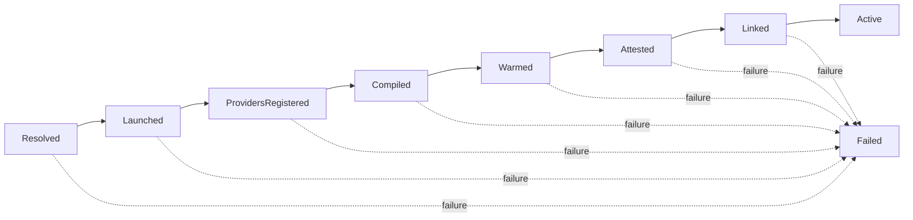
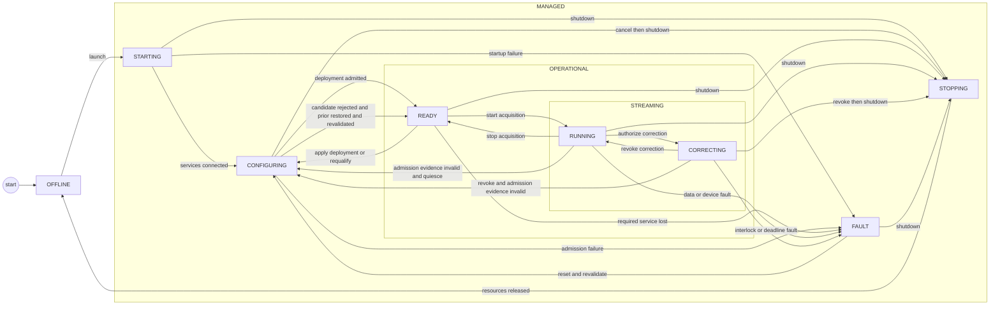
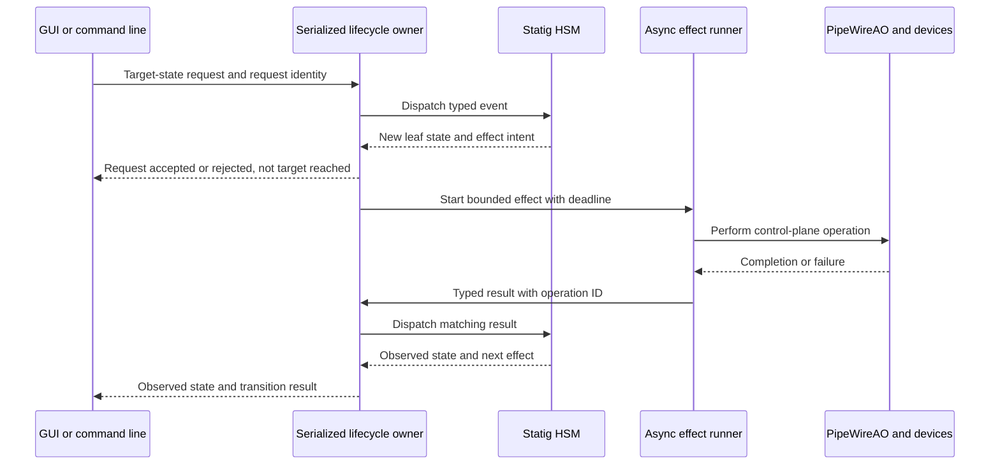
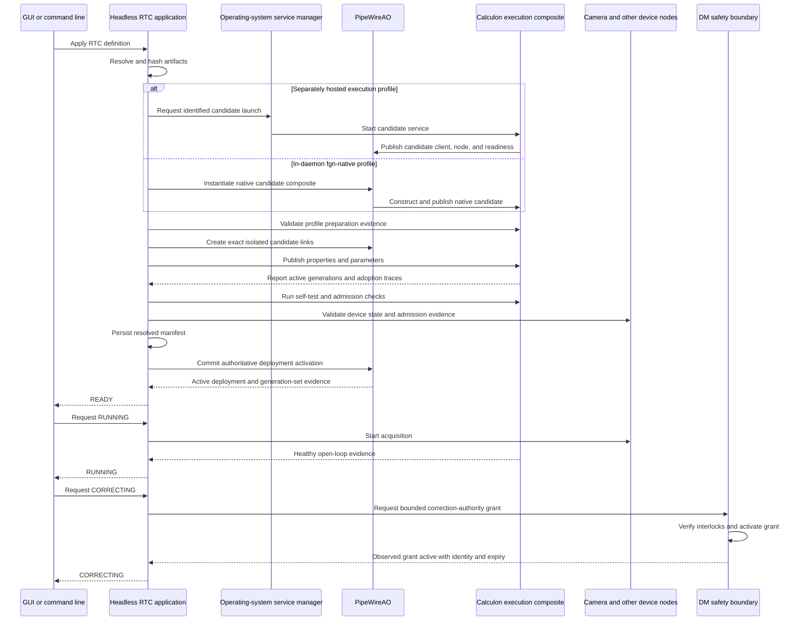
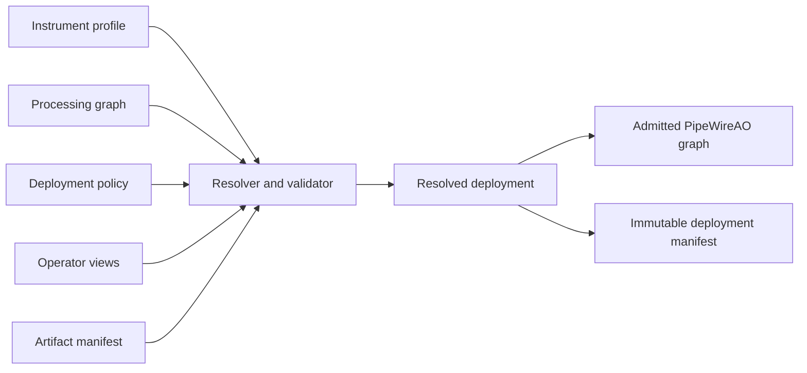
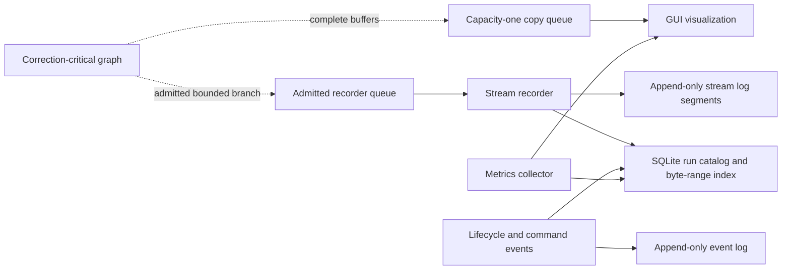
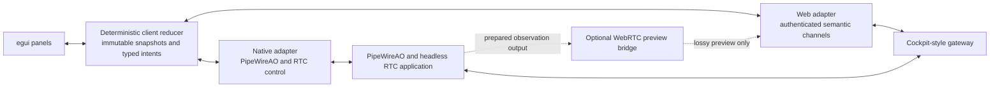
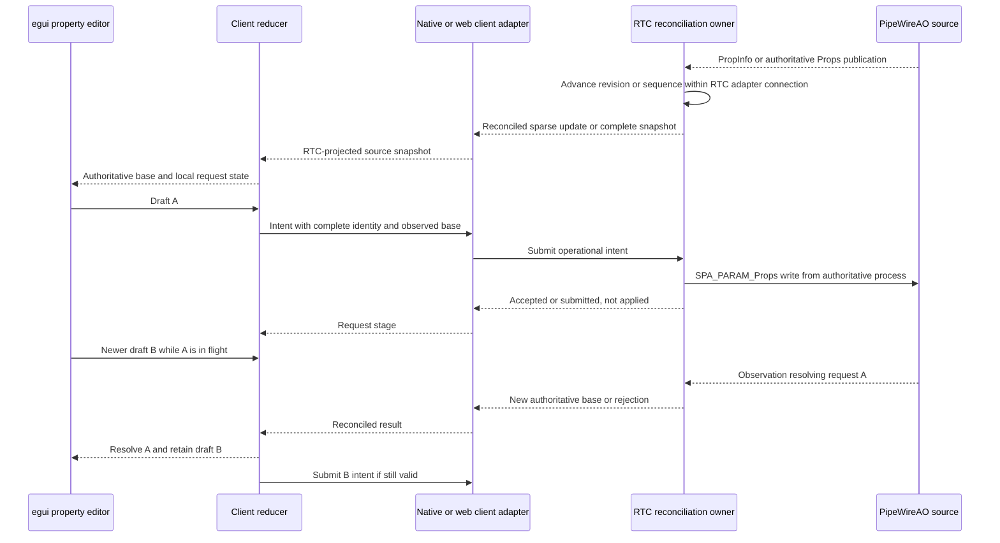
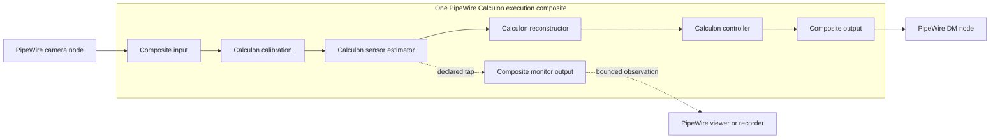

# PipeWireAO RTC operational architecture

Status: proposed operational companion architecture and normative contract;
RTC-ARCH-003, RTC-ARCH-004, RTC-ARCH-006, and RTC-ARCH-009 selected

The `development` capability profile can be implemented without the following
operational extensions. Physical-device operation and correction remain
blocked on the versioned, server-owned PipeWire connection-membership,
protected-access-grant, ordered-removal, and service-manager observation
contract required by RTC-OPS-001 and RTC-OPS-002. Selecting a separately hosted
execution profile remains blocked on the versioned Calculon execution-
composite discovery, control, preparation-attestation, active-generation, and
incarnation-bound output-eligibility projection required by RTC-EXEC-001
through RTC-EXEC-005. Neither lower contract exists yet.

Review date: 2026-08-31

## Authority and scope

This document owns the operational realization of the
[PipeWireAO RTC system architecture](architecture.md): instrument
lifecycle, configuration and artifact admission, scientist graph workflow,
control projection, telemetry and recording, GUI behavior, WirePlumber policy,
and process supervision. The system architecture remains authoritative for
component ownership and target topology. The
[time, causality, and performance contract](time-and-performance.md)
and [scientific data and command contract](scientific-data-and-command-contracts.md)
own the cross-cutting timing and scientific semantics used here. The
[audit and reconstruction contract](audit-and-reconstruction.md) owns protected
operation progression and run reconstruction. The
[camera-session contract](camera-sessions.md) owns the per-camera
deployment unit, source-profile identity, isolation-first exported SPA host,
qualified daemon-side loading, required transport transforms, process
isolation, and placement qualification.

## Capability-profile applicability

The [system architecture](architecture.md#capability-profiles-and-incremental-composition)
defines three capability profiles. They describe the permitted system claim,
not how a Calculon composite executes:

| Capability profile | Required operating model | Explicit exclusions |
| --- | --- | --- |
| `development` | Load one configured graph, connect simulated, replay, or non-actuating endpoints, apply initial values, expose basic lifecycle and observed state, and permit ordinary PipeWire inspection. | No physical correction authority, operational availability claim, durable reconstruction claim, or real-time qualification claim. |
| `operational` | Add the applicable protected-control, lifecycle, device, safe-state, and audit contracts for every selected physical service. | No target-host deadline or tail-latency claim without `qualified` promotion. |
| `qualified` | Preserve the operational contracts and add maintained correctness, causality, overload, failure, recovery, and target-host evidence for the exact selected topology. | Evidence for one topology, host, execution profile, or optional capability does not qualify another. |

Capabilities are selected independently. Their detailed contract applies only
when selected or when another selected capability depends on it:

| Selection | Additional applicable contract |
| --- | --- |
| Protected operational lifecycle, deployment, or device control | RTC-OPS-001 through RTC-OPS-004 and the applicable audit requirements. |
| Full camera-session management or a physical camera | [Camera-session contract](camera-sessions.md); physical-host and co-location clauses apply only to physical sources. |
| Physical DM commands or correction | RTC-DM-001 through RTC-DM-008 and the operational authority, audit, failure, and safe-state requirements they reference. |
| Durable recording or reconstructable runs | RTC-OPS-005, RTC-RECORD-001, and the [audit and reconstruction contract](audit-and-reconstruction.md). |
| Managed operational execution-composite admission, `julia-runtime`, or another separately hosted composite | RTC-EXEC-001 through RTC-EXEC-005 as applicable; RTC-PERF-007 additionally applies before correction-critical managed-runtime admission. A directly constructed `fgn-native` development graph remains governed by the lower FGN contract without selecting this management capability. |
| Row-block or region-block processing | The applicable RTC-FRAME requirements and the lower PipeWireAO progressive-processing contracts. |
| A latency, deadline, or qualified-runtime claim | The applicable RTC-DEADLINE and RTC-PERF requirements for the exact claimed path. |
| Native or remote GUI control | Only the RTC-GUI requirements for the selected adapter, control, observation, or remote surface. A read-only local inspector does not select the web gateway. |

The absence of an optional service is not a conformance gap. It becomes a gap
only when the resolved deployment selects that service or claims a capability
that depends on it. Conversely, selecting a lower capability profile does not
waive a requirement triggered by a physical actuator or another safety-
significant surface.

## Normative operational requirements

In the `RTC-OPS-*`, `RTC-EXEC-*`, and `RTC-RECORD-*` requirements below,
uppercase requirement terms use the meanings defined by BCP 14 (RFC 2119 and
RFC 8174). Lowercase forms are ordinary prose.

An **RTC-authoritative control capability** is permission to perform any of
these operational actions: accept instrument target state; admit, activate, or
retire a deployment; mutate the admitted AO graph or its protected artifacts,
properties, and parameters; issue lifecycle or device-control requests on
behalf of the RTC; or authorize and request correction. Here, device control
means a protected control-plane configuration or lifecycle request, not the
admitted per-frame DM submission or an independent fail-safe action. Publishing
camera or device samples, observed state, health, or command results; executing
an admitted scientific graph or device-safety policy; recording or observing
data; and applying generic WirePlumber policy do not by themselves confer this
capability.

A **Calculon execution composite** is one internally connected scientific
graph exposed through selected external PipeWire ports. An **execution
profile** is the selected implementation of that composite. The initial names
are `fgn-native`, `julia-runtime`, and the reserved future `julia-aot`. An
unimplemented reserved profile is not selectable for an admitted deployment.

A **Julia graph service** is the dedicated, separately supervised process that
contains the Julia runtime, configured scientist operation providers, compiled
Calculon graph executor, and CalculonPipeWire client node. An **operation
provider** is a configured Julia module entry point named
`calculon_operation_provider()` that returns an `OperationProvider` containing
a finite tuple of `AbstractAlgorithmDeclaration` types. These names describe
the intended Calculon interface; its owning repository remains authoritative
for exact language-level types and methods.

A **preparation attestation** is the Julia graph service's identified,
immutable report of the providers and operation identities it loaded, the
resolved graph and external surface, Julia runtime environment, compilation and
lowering result, property and parameter surfaces and prepared expectations,
and warmup result. It is candidate evidence for RTC validation, not a claim of
active property or parameter adoption, self-admission, or proof of strict
performance.

An **execution-service process incarnation** combines the service manager's
nonreused invocation identity with authenticated operating-system process-start
evidence for the process that owns an execution composite. A PID, node name,
client property, Julia module name, or compiled-graph digest alone is not
incarnation evidence.

The **RTC-authoritative writer set** is the admitted headless RTC process, its
exact authenticated PipeWire client connections that have write permission on
an enumerated protected surface, and its authenticated sessions to any
enumerated non-PipeWire protected endpoint. It does not include a camera or DM
producer merely because that producer publishes data or executes an already
admitted device policy. In the initial systemd profile, process membership means
membership in the guarded service unit's non-delegated control group, not a
POSIX process-group number, PID file, executable name, or client-supplied role.
The unit MUST prohibit member migration and delegation and MUST use whole-
control-group termination. The permitted writer set still contains only the
one headless process; discovery of another process in that control group is a
conformance fault, not permission to treat it as another writer.

### RTC-OPS-001 — One RTC-authoritative control holder

In the initial single-host operational profile, the headless RTC application
process MUST be the only process permitted to hold the RTC-authoritative
control capability. Every PipeWire client connection that exercises that
capability MUST be created, retained, and closed by that process; MUST have a
registry-visible association with the process's service invocation, whose
nonreused identity is its RTC startup-attempt identity; and, after allocation,
MUST identify its RTC authority epoch. PipeWire access policy MUST authenticate
the association from
operating-system peer credentials and service-invocation membership rather
than trust client-supplied identity or role fields by themselves. The RTC
process MUST NOT pass an authoritative connection or its file descriptors to
another process or delegate the capability to a helper.
The guarded RTC service unit and its service-manager control group MUST contain
only that headless RTC process; camera and DM hosts, recorders, gateways,
artifact jobs, Julia graph services, and other non-authoritative services use
separate units. Threads
inside the RTC process do not create another holder, but a subprocess is not
admitted in this initial profile.

PipeWire native transport authenticates the peer that creates a connection; it
does not re-authenticate the calling process for every later message on an
already connected file descriptor. The initial profile therefore treats the
admitted RTC process as a trusted capability holder and treats descriptor
transfer as a conformance violation, not as something ordinary PipeWire access
policy can detect or fence after transfer. A profile that must contain a hostile
or compromised admitted RTC requires separately approved mandatory-access-
control confinement or source-enforced per-request authority fencing.

The PipeWire core or its access-policy component MUST retain a non-forgeable
connection-membership ledger created when each connection is authenticated. It
MUST associate the connection identity, peer process, guarded service unit and
startup-attempt identity, granted protected surfaces, grant and removal
sequences, and core service invocation. Ordinary registry properties are a
projection of that ledger, not its authority. RTC-OPS-002 and the service
manager MUST use this ledger's ordered removal or a proven new-core invocation
when deciding that no prior authoritative PipeWire writer survives. The ledger
MUST have admitted finite active and retained-removal capacities, reserve an
entry before granting protected access, deny a new grant on exhaustion, and
MUST NOT evict an active entry or a removal record still needed by a guard
evaluation. A complete snapshot MUST carry an ordered enumeration fence so an
empty result cannot race an unobserved connection or removal.

Every backend endpoint outside PipeWire that can directly mutate a protected
target MUST enforce the same current-holder rule with an authenticated calling-
process and service-invocation association and default-deny behavior.
Filesystem ownership, a bearer token, localhost reachability, or knowledge of
an RTC authority epoch is not sufficient authority. If a future artifact,
definition, or topology backend cannot bind an activating request to the
admitted RTC process, that operation MUST remain read-only or unavailable while
the operational guard is held. This does not prohibit an authenticated operator
from submitting an intent to an RTC-owned frontend: the RTC validates that
intent and remains the process that performs any protected backend operation;
the frontend MUST NOT return or delegate the underlying capability.

The protected operational control surface MUST be default-deny. Absence,
restart, reconfiguration, or uncertainty of WirePlumber or another access-
policy component MUST NOT widen write permission. A policy component MAY
restore a grant only after re-authenticating the current RTC-OPS-002 holder and
the exact client association; a client label, cached role, PID file, or prior
grant is insufficient.

Each resolved deployment MUST enumerate every protected PipeWire global and
parameter/property family, and every lifecycle endpoint, artifact or graph
mutation path, and device-control endpoint; its owning process or source; the
authenticated enforcement rule that protects it; and the terminalization,
drain, or reset evidence used by RTC-OPS-002. An unenumerated mutable path to
operational camera, graph, or DM state MUST prevent admission.

Camera and DM producers, device-plugin SDK-control writers, the PipeWireAO
daemon, native FGN and Julia execution-composite services, scientific nodes,
recorders, observers, the GUI, and ordinary
WirePlumber policy are outside this holder set. They retain their separately
defined data, device, safety, observation, or policy responsibilities. An
engineering client MAY receive direct device-write permission only while no
operational RTC-authoritative control holder is admitted; its writes remain
engineering actions and do not grant lifecycle, deployment, or correction
authority. Before admitting an RTC-authoritative holder, PipeWire access policy
MUST revoke every direct engineering permission on the protected operational
surface and the service manager MUST observe that revocation. Any engineering
request already submitted remains subject to its own observed or indeterminate
outcome and the normal device-state read-back and deployment admission checks.

Verification intent (informative): inspect the access-policy and process
topology; authenticate every permitted connection against its operating-system
process and service invocation; inspect the server-owned membership ledger;
attempt control-group migration, delegation, a surviving child, and forged
registry fields; exhaust active and retained-removal entries and race a
connection with the complete enumeration fence; reject self-labelled,
independently connected, GUI,
engineering, camera-producer, and helper-process writes; audit the admitted RTC
for descriptor transfer or delegated helpers; and classify a deliberately
transferred authenticated descriptor as a detected test-profile violation, not
as an access-policy rejection guarantee. Prove that exactly the headless RTC
process and the connections it retains can exercise the operational capability
while the guard is held. Stop, restart, and reconfigure
the access-policy component while hostile and stale clients attempt writes and
prove that permission never widens. Add an unenumerated mutable endpoint and
prove admission fails. Exercise one protected non-PipeWire endpoint and prove
that filesystem access, a bearer token, localhost origin, and an epoch value do
not replace current-holder authentication. Revoke engineering access with
a request in flight and prove that permission removal precedes guard admission
and that later device admission uses authoritative read-back rather than an
assumed request outcome.

### RTC-OPS-002 — Fail-closed single-RTC admission guard

The operating-system service manager MUST own a host-local single-RTC
admission guard and MUST serialize replacement admission. Each guard evaluation
MUST use the fresh RTC startup-attempt identity assigned under RTC-AUDIT-002. A
replacement process MAY start with read-only discovery permission, but it MUST
NOT receive RTC-authoritative control permission, accept target state, or issue
an operational write until all of these facts are proven:

- the prior service invocation has terminated and its service-manager control
  group contains no surviving process under the membership rule in
  RTC-OPS-001;
- the PipeWire registry has reported removal of every authenticated
  RTC-authoritative client connection associated with the prior service
  invocation/startup-attempt identity, or the service manager has proven
  that the prior PipeWire core service invocation terminated and the observed
  registry belongs to a newly started core invocation; and
- no other process currently holds the guard or has authenticated
  RTC-authoritative control permission; and
- no client retains direct engineering write permission on the protected
  operational surface; and
- every RTC-DM-008 correction-authority grant bound to the prior authority
  epoch is observed revoked or expired, its admitted command publisher can no
  longer submit under that grant, and the device boundary has entered its
  declared non-correcting or fail-safe state; and
- every protected control endpoint has either proven that no request submitted
  by the prior RTC or a revoked engineering client remains capable of later
  application, with each accepted operation terminalized or marked
  indeterminate under RTC-AUDIT-003, or has completed a declared reset or
  restart that establishes the same condition.

The service manager MUST retain the guard for the complete lifetime of the
admitted process and its authoritative connections and MUST grant it to at
most one process. Process exit without the corresponding same-core removal or
new-core evidence, registry evidence without control-group termination, an
unavailable PipeWire core or registry observer, an ambiguous service
invocation, unresolved prior endpoint work, or any other incomplete proof MUST
leave the replacement non-authoritative and fail startup closed. The guard
prevents overlapping authority in this profile; it is not a source-side fence
and does not permit live handover.

The guard MUST be bound to one deployment-declared service unit and invocation,
not to an in-memory Boolean or reusable PID. After service-manager reload,
re-execution, or recovery, the manager MUST reconstruct guard state from its
authenticated unit invocation and control group plus the PipeWire registry
evidence required above. Until that reconstruction completes, it MUST retain
the current protected access policy and MUST NOT admit a replacement. If the
evidence is inconsistent or unavailable, replacement remains fail-closed.

Verification intent (informative): attempt replacement while the prior RTC is
running, stalled, exiting, or has a surviving process or PipeWire connection;
reload or re-execute the service manager and lose and restart the registry
observer and PipeWire core at each proof stage;
delay a protected camera, property, and DM request and an active correction-
authority grant beyond prior-process exit;
and show that the replacement remains read-only until control-group and registry
evidence identify an empty prior holder set and every delayed request is
terminal, or indeterminate and unable to apply, or cleared by a proven endpoint
reset, and the old grant and command path are inactive. Then verify that the
guard is granted exclusively.

### RTC-OPS-003 — Deployment-candidate isolation and activation

The initial profile MUST have at most one nonterminal deployment candidate. A
candidate MUST bind the exact active deployment generation, or explicit absence
of one, that formed its resolution and admission base. Before accepting a
candidate-creating request, the RTC MUST reserve the candidate record,
preparation, rollback, and terminal-result capacity required for its declared
path. A later target intent MAY remain unaccepted, be rejected as busy, or
supersede a candidate that is proven to have no external effect and is
terminally cancelled; it MUST NOT create a second effectful candidate. The
activation commit MUST compare the candidate's base with the then-active
deployment and revalidate every admission dependency. A mismatch or invalidated
dependency MUST terminate the candidate as stale or failed without activation;
re-resolution uses a newly identified candidate and MUST NOT mutate the stale
record. Cancellation, timeout, or loss of a preparation worker is not proof
that its external effect stopped. A candidate MUST NOT release the single-
candidate slot until every accepted subordinate operation has the RTC-AUDIT-003
terminal disposition and no-later-application evidence required by its endpoint,
or the candidate has transferred to the declared recovery path.

The RTC application MAY allocate a deployment generation when it accepts a
request that can require a different resolved deployment and before any
candidate preparation has an external effect. Resolution can prove that the
candidate is canonically unchanged from the active deployment only when its
admission-relevant target projection is identical and every active admission
dependency remains valid. That comparison excludes newly allocated request,
candidate, run, epoch, and observation identities; it does not ignore artifact,
software, device, source, format, placement, or policy differences. In the
unchanged case the candidate MUST terminate as `unchanged`, MUST NOT activate,
and its generation MUST NOT be reused. Allocation, resolution, preparation,
validation, cancellation, or rejection of that candidate MUST NOT change the
active deployment generation or invalidate requests and observations addressed
to it. Only successful admission followed by one authoritative activation
commit MAY make the candidate generation active and invalidate the prior
generation. Every non-activated candidate generation MUST become terminal
without reuse. Before preparation can have an external effect, every allocated
candidate generation MUST open an append-only candidate record with its
originating request, definition and configuration identities, and current
operation identity. Resolution, preparation, validation, rollback, and
activation MUST append identified entries containing the applicable artifact
and software digests, intended or observed process/source bindings, results,
and evidence. After successful admission and before activation, the RTC MUST
write the candidate's immutable resolved deployment manifest and the activation
commit MUST reference its digest. One terminal entry after activation success,
an unchanged result, rejection, cancellation, rollback, or preparation failure
MUST seal the candidate record and link any prewritten manifest and activation
result.
Only successful activation makes that manifest authoritative; every other
outcome leaves the candidate and any prewritten manifest non-authoritative
without relabelling either as admitted or active. A declared transaction MAY
quiesce a prior deployment after
correction is revoked when old and candidate resources cannot coexist; that
changes availability but MUST NOT change the prior generation's identity or
make candidate state authoritative. If a failed candidate cannot restore the
prior deployment, the RTC MUST publish the resulting unavailable or faulted
lifecycle state without activating the candidate.

Verification intent (informative): fail and cancel each candidate stage while
requests and observations remain active under the prior deployment, then delay
the activation commit and reorder old and candidate observations; prove that
the active identity changes once and only after successful commit, and that no
failed candidate invalidates or reuses the prior identity. Exercise both
coexisting and quiesced-prior transactions and verify an explicit fault when
rollback cannot restore availability. Reconstruct every failed, cancelled,
unchanged, and activated candidate from its sealed candidate record and prove
that only an activated record is bound into an authoritative resolved manifest.
Repeat an identical target request and prove an unchanged candidate cannot
change active identity or repeat an external effect. Race two candidate-
creating requests, invalidate one dependency immediately before commit, and
activate an unrelated successor before delivering a stale commit; verify one
nonterminal candidate, pre-effect rejection or identified supersession, exact
base comparison, no stale activation, and new identity on re-resolution.

### RTC-OPS-004 — RTC identity representation and authority epoch allocation

After receiving the RTC-OPS-002 guard and before accepting target state, each
headless RTC application instance MUST generate a fresh RTC authority epoch as
a UUIDv4 from the operating system's cryptographically secure random source. It
MUST reject an epoch equal to any retained catalog entry, MUST NOT resume an old
epoch after restart, and MUST fail startup closed if generation or the retained-
catalog check fails. The successful allocation event MUST bind the epoch to the
current RTC startup-attempt identity under RTC-AUDIT-002.

Every UUID identity defined by the RTC document set MUST be encoded as 16 octets
in a typed binary schema and as the canonical lowercase, hyphenated UUID string
in a text schema. A receiver MUST reject a malformed or non-canonical
representation. The RTC authority epoch supplies correlation and stale-event
rejection; it MUST NOT be represented as a source-side write fence or as
evidence that the guard was acquired.

Every unsigned 64-bit generation, revision, sequence, or counter that
participates in RTC identity, ordering, reconciliation, or reconstruction MUST
use a lossless unsigned 64-bit field in a typed binary schema and its canonical
base-10 digit string in a text or JSON schema. A receiver MUST reject a signed,
fractional, exponent, leading-zero, out-of-range, or otherwise non-canonical
text representation. It MUST NOT pass such a value through an IEEE-754 JSON
number. The owning requirement defines whether zero means absent/unknown or is
invalid.

A trusted service adapter MAY receive a provider-native representation of the
same 128 bits, such as systemd's 32-hex-digit `INVOCATION_ID`. It MUST preserve
those bits and normalize them to the RTC binary and canonical text schemas
before publication. The provider-native environment or service-manager API is
not itself an RTC text schema, and normalization does not assert that a
provider-assigned invocation identifier is UUIDv4; only identities whose
allocation requirement says UUIDv4 carry that version claim.

Verification intent (informative): inject random-source and catalog failures,
duplicate and malformed epochs, process restart, and an epoch allocation before
guard acquisition; prove non-reuse, canonical round trips, causal linkage to
exactly one startup attempt, and fail-closed startup without authority. Round-
trip every integer boundary through binary, native text, and browser JSON
adapters and reject lossy or non-canonical encodings.

### RTC-OPS-005 — Run allocation and closure

In the initial profile, the RTC application MUST allocate at most one active
run at a time beneath an RTC authority epoch. It MUST generate a fresh UUIDv4 run
identity from the operating system's cryptographically secure random source,
reject a collision with any retained run or retention tombstone, and create the
run catalog, immutable RTC-AUDIT-005 recovery-owner service binding, and its
RTC-RECORD-001 storage reservation before it allocates the first deployment
candidate or accepts any run-scoped protected operation. A
failure at any of those steps MUST leave the startup attempt pre-run and MUST
NOT permit a run-scoped external effect. The allocation event MUST bind the run
identity to the startup-attempt identity, authority epoch, originating request
or explicit automatic-start policy, recovery owner, and catalog location.
Representation follows RTC-OPS-004.

One run contains every candidate record, activated deployment manifest,
lifecycle and command event, recording interval, and loss record from its
allocation until closure. Entering and leaving `RUNNING`, enabling or disabling
an optional recorder, or activating a successor deployment does not create a
new run. A completed transition to `OFFLINE` closes the active run only after
accepted protected operations are terminalized, recorders are stopped, and
every candidate, segment, index, loss summary, and final-run dependency is
sealed or explicitly marked unavailable. If that evidence cannot be made
durable, the run MUST remain visibly unsealed for RTC-AUDIT-005 recovery and
MUST NOT be reported as normally closed.

Here, an active run is one for which the RTC application still holds ordinary
run authorship; sealing status is separate. If bounded shutdown cannot seal the
run, the RTC MAY relinquish that authorship only to the immutable recovery-owner
service selected at allocation. The transfer MUST be established by an
immutable handoff record or by authenticated RTC process-loss evidence that the
recovery owner consumes before a later run in the same surviving RTC process is
allocated. After relinquishment, the RTC MUST NOT append as that run's author;
the object is inactive but remains visibly unsealed until RTC-AUDIT-005
recovery. Failure to record a normal close MUST NOT delay device-safe action,
but the RTC MUST NOT report a completed `OFFLINE` transition or allocate a
successor run while it still owns an unsealed predecessor.

An RTC application restart MUST allocate a new authority epoch and MUST NOT
resume or append as the prior run's author. The recovery owner may seal or mark
the prior run incomplete under RTC-AUDIT-005, while a new run uses a new
identity and catalog. A surviving source process or unchanged RTC definition
does not preserve run identity. A later run under the same application process
is permitted only after the prior run is closed or transferred to recovery and
the lifecycle has returned to `OFFLINE`; its identity is newly allocated and
not reused.

Verification intent (informative): fail random generation, collision checking,
catalog creation, and storage reservation at every boundary; crash before and
after run allocation, candidate creation, deployment activation, recorder
start, and final sealing; cycle `RUNNING`, replace deployments, and toggle
optional recorders without changing the run; then return to `OFFLINE` and start
another run in the same process. Fail ordinary closure and recovery handoff
independently while verifying that device-safe shutdown is not delayed, an
owned unsealed run cannot report completed `OFFLINE` or admit a successor, and
the RTC cannot append after transfer. Verify one active run per epoch, no pre-
run external effect, no identity reuse or old-author append after restart, and
only a normally sealed or visibly unsealed/recovered terminal record.

### RTC-OPS-006 — Capability-profile declaration and applicability

Every resolved deployment MUST declare exactly one `development`,
`operational`, or `qualified` capability profile and MUST enumerate its
selected physical-device, correction, recording, execution, progressive-
processing, client, and remote-access capabilities. The resolver MUST derive
and retain the applicable RTC requirement set from that declaration and MUST
reject a deployment whose selected capability lacks a required contract,
implementation, or evidence at the requested profile. It MUST NOT require an
unselected optional capability merely because its specification exists.

A `development` deployment MUST NOT obtain a physical correction-authority
grant or present itself as operational or real-time qualified.

Verification intent (informative): resolve minimal development, physical-
camera, physical-correction, recorder, row-block, native-GUI, remote-GUI, and
Julia configurations. Inspect the derived requirement set; reject every
missing triggered dependency; prove that omitted optional capabilities do not
block the development graph; and reject a physical correction grant in the
development profile.

### RTC-OPS-007 — Explicit service dependencies and isolation

Every resolved deployment MUST classify each configured source, execution
composite, sink, observer, recorder, telemetry exporter, GUI gateway, and
artifact service as required, optional, or inactive for each lifecycle state.
The RTC MUST derive readiness and failure transitions from that declaration,
not from the mere presence or discovery of a service. An optional service's
absence, restart, overload, or failure MUST NOT block a required data path or
change correction authority unless the active deployment explicitly promotes
that service to a required dependency through a new admission transaction.

Every observer or recorder selected as non-gating MUST attach through a
bounded observation boundary whose backpressure and failure cannot consume
capacity required by the source, execution composite, or sink. Service-local
lifecycle and diagnostics remain owned by that service; the RTC aggregates
their declared observations instead of embedding a private lifecycle protocol
in every Calculon algorithm.

Verification intent (informative): validate each service with simulated
counterparts; start, stop, crash, stall, detach, and overload every optional
service independently; and prove that the resolved required-dependency set,
not discovery order, controls readiness, fault, and correction behavior.

### RTC-OPS-008 — Capability promotion and claim scope

Promotion from `development` to `operational` or `qualified` MUST occur through
a newly resolved and admitted deployment. Relabelling a running deployment or
attaching an unvalidated service MUST NOT promote it. A qualification result
MUST apply only to the exact selected topology, execution profile, host,
workload, and optional capabilities named by its retained evidence; another
variant requires its own applicable evidence.

Verification intent (informative): attempt promotion by changing only the
profile label, attaching a service after activation, reusing evidence from
another execution profile or host, and omitting one selected optional service
from the evidence scope. Require a new resolved deployment and reject every
unsupported claim.

### RTC-EXEC-001 — Identified execution composite and service

When RTC-OPS-006 selects managed execution-composite admission, every resolved
deployment candidate MUST select exactly one supported
execution profile for each Calculon execution composite and MUST identify the
composite's stable logical name, canonical graph configuration and digest,
selected external ports, expected operation identities, artifacts, initial
properties and parameters, scheduling policy, and expected profile-specific
implementation. `fgn-native` remains the baseline profile. `julia-runtime` is
an optional functional profile until RTC-PERF-007 evidence admits it for the
selected correction-critical target. The reserved `julia-aot` name MUST NOT be
selected until its runtime and packaging contract is approved and implemented.

The immutable resolved part of the candidate MUST bind its candidate identity,
generation, active-deployment base, and every expected value known before
launch. As preparation proceeds, its append-only candidate record MUST add the
observed service invocation, authenticated execution-service
process incarnation, PipeWire core invocation, client and node identities,
compiled graph identity, runtime executable and environment, operation
providers, registered operation identities, and profile-specific preparation
evidence. A binding that does not yet exist MUST be represented as absent at
its current candidate state rather than predicted or fabricated. Every
applicable binding MUST be complete before the candidate enters `Linked` or
its resolved deployment manifest is written. For `fgn-native`, the process
incarnation is the admitted PipeWireAO daemon invocation and the profile binds
the FGN composite, descriptor identity, and native preparation result. For
`julia-runtime`, the evidence includes its preparation attestation and the
operating-system service manager MUST launch one dedicated
`calculon-julia-graph@deployment.service`-style unit, assign its nonreused
invocation identity, apply the resolved privilege and scheduling policy, and
authenticate the resulting Julia process. The service MUST create and retain
its own ordinary PipeWire client and node; the RTC MUST verify their
association with that process rather than trust client-supplied properties.
The initial `julia-runtime` profile MUST have exactly one node-owning Julia
process during repeated execution. A transient preparation helper process MUST
remain in the same service-manager unit, be identified in preparation evidence,
and terminate before `Attested`; an execution-time helper process requires a
separately approved multiprocess profile and failure contract.

The Julia graph service MUST be outside the PipeWireAO daemon, the guarded RTC
service unit and process, and WirePlumber's policy event loop. It MUST NOT
receive an RTC-authoritative PipeWire connection, credentials that permit it
to originate protected writes, or a capability to grant correction authority.
Its own composite-control endpoint MAY accept only the identified RTC-owned
requests defined by RTC-EXEC-004. It owns execution and publication of its
admitted node, introspection, and observed state only. The RTC application
remains the sole protected topology, lifecycle, property, parameter, artifact-
activation, and correction-
authority writer. WirePlumber MAY discover the node and apply authenticated
access or explicitly assigned generic policy, but MUST NOT launch the service,
select its graph, create its operational links, or interpret readiness.

Verification intent (informative): resolve every supported and reserved profile;
reject unknown or unavailable selections, forged client properties, PID reuse,
wrong service invocation, wrong executable, graph or descriptor mismatch, and
a Julia process placed in the daemon, RTC unit, or WirePlumber event loop.
Leave an undeclared preparation child or execution helper process alive and
reject preparation.
Inspect the protected writer set and prove that the service can publish only
its node execution results, readiness, introspection, attestation, and observed
state while the RTC alone performs every protected write.

### RTC-EXEC-002 — Julia provider registration and preparation attestation

Before launching a `julia-runtime` candidate, the RTC MUST resolve an immutable
candidate containing the graph configuration, pinned Julia environment
identity, configured providers, their exact module identities, expected
operation identities, artifacts, initial property and parameter assignments,
external ports, and scheduling policy. Every provider specification MUST name
the `calculon_operation_provider()` entry point in that module. A development
provider MAY be a trusted Julia source file only when the
candidate records its canonical path, expected module, content digest, and
trust policy. A production deployment SHOULD prefer a provider identified by
package name, UUID, version, and pinned `Project.toml` and `Manifest.toml`
digests. A production source-file exception MUST retain the development-
provider fields plus its approved exception reason. Scientist source
is trusted executable code with the authority of the Julia service process; it
MUST NOT be described as sandboxed configuration.

During preparation, the Julia graph service MUST perform this sequence before
it reports readiness:

1. verify the pinned environment and each source digest or package identity,
   then load those exact configured bytes or package versions from the resolved
   candidate;
2. resolve the exact configured Julia module;
3. call that module's `calculon_operation_provider()` entry point;
4. require an `OperationProvider` containing a finite tuple of
   `AbstractAlgorithmDeclaration` types;
5. validate each complete declaration and its versioned `OperationIdentity`;
6. admit Calculon built-in declarations through the same provider mechanism;
7. reject every missing, duplicate, incomplete, malformed, or unexpected
   operation identity;
8. resolve configured operations through a registry owned only by that graph
   compilation;
9. complete semantic analysis, lowering, compilation, graph allocation,
   warmup, and the selected functional admission checks; and
10. retain a concrete prepared executor whose repeated processing performs no
    registry, module, string, dictionary, provider, or declaration lookup.

After that sequence, the service MUST publish one identified preparation
attestation containing the service invocation and process incarnation; Julia
executable, runtime version, project and manifest digests, and sysimage identity
when used; every loaded package UUID and version; every configured source path
and digest; provider module and entry-point identity; registered and expected
operation identities; canonical graph configuration and compiled-graph digest;
exact external port surface; property, parameter, artifact, and construction
bindings; lowering and backend explanation; runtime and helper-thread
inventory; every transient preparation helper process and its terminal
evidence; warmup procedure and result; and every incomplete check or unsupported
claim. The attestation MUST be bound
to the candidate and immutable. The RTC MUST compare every admission-relevant
field with the resolved candidate and MUST reject a missing, unexpected,
partial, stale, or mismatched report. Attestation is not evidence that Julia is
allocation-free, deadline-safe, or correction-qualified.

Verification intent (informative): exercise source and package providers,
source-digest, module, package UUID or version mismatch, missing entry point,
unbounded or non-tuple provider result, duplicate and unexpected identities,
built-in/provider collision, changed project or manifest, stale attestation,
changed external ports, failed
lowering, compilation, warmup, and thread discovery. Inspect the prepared hot
path and prove that successful processing does not consult provider or registry
state.

The local notes
`calculon-julia-jit-island/docs/julia-scientist-operation-extensions.md`,
`calculon-julia-jit-island/docs/configured-julia-graph-compiler.md`, and
`calculon-julia-jit-island/docs/julia-pipewire-client-plan.md` are informative
design inputs. They are
not normative RTC authorities and do not replace RTC-EXEC-001 through
RTC-EXEC-005, the maintained Calculon declaration contracts, or the PipeWireAO
transport contracts.

### RTC-EXEC-003 — Execution-composite candidate isolation and activation

An execution-composite candidate selected under RTC-EXEC-001 MUST progress
through the identified states
`Resolved`, `Launched`, `ProvidersRegistered` when applicable, `Compiled`,
`Warmed`, `Attested` when applicable, `Linked`, and `Active`, or through an
identified terminal failure from its current state. A `fgn-native` candidate
MAY satisfy profile-inapplicable states as explicitly not applicable; it MUST
NOT fabricate Julia evidence. State progression and every subordinate
operation MUST be retained in the RTC-OPS-003 candidate record.

The selected profile MUST preserve the canonical distinctions among complete-
frame, block-row, region-block, terminal-output, partial-frame-abandonment,
discontinuity, graph-cycle, and fully completed frame-boundary semantics and
MUST satisfy RTC-FRAME-001 through RTC-FRAME-004 for every delivery form
declared by the candidate. An unsupported delivery form MUST fail preparation;
the profile MUST NOT silently lower it to a weaker completion or adoption
model. A Julia, FGN, or foreign callback return alone MUST NOT establish a
completed frame unless it proves the RTC-FRAME-001 terminal conditions.

Before activation, a candidate MUST have no RTC-authoritative control
capability, no DM correction-authority grant, and no automatically created
operational link to the active graph or physical command path. It MAY publish
on PipeWire only its candidate node, bounded introspection, applicable
preparation attestation, and identified readiness state.
Its ports, buffers, property and parameter state, callbacks, workers, runtime,
and outputs MUST remain isolated from the active deployment. Candidate launch,
provider registration, compilation, warmup, attestation, or link preparation
MUST NOT mutate or invalidate the prior active deployment.

A link created during the `Linked` state MUST be candidate-scoped and remain
inactive, or connect only to admitted validation sources and sinks, until the
activation commit. It MUST NOT renegotiate an active port, pace an operational
producer, consume an active deployment's finite buffer reserve, create
backpressure, or alter active scheduling before that commit.

The RTC MUST validate the applicable profile preparation evidence, including
the RTC-EXEC-002 attestation for `julia-runtime`, and complete process/client/
node binding. It MUST create only the exact candidate links declared by the
immutable resolved candidate, publish the initial property and ndarray-
parameter transactions, observe their active values and generations, run the
declared admission checks, and verify
the applicable RTC-FRAME-004 generation-set and adoption traces before the
RTC-OPS-003 activation commit. Only that commit MAY mark the composite and its
links active, permit its output to participate in the admitted command path,
and retire the predecessor. A failed, cancelled, timed-out, stale, or replaced
candidate MUST be unlinked and terminalized without changing the prior active
deployment when that deployment remains valid. If prior resources were
quiesced and cannot be restored, RTC-OPS-003 requires an unavailable or faulted
result rather than candidate activation.

Verification intent (informative): fail and delay every state and subordinate
operation, publish candidate data before linking, forge an attestation, reorder
active-generation observations, and race a predecessor replacement with the
activation commit. Verify no candidate-to-active data or command path before
one successful commit, no mutation of a valid predecessor, exact initial
property and parameter adoption, and complete cleanup or visible quarantine of
nonterminal work.



### RTC-EXEC-004 — Protected composite control and coherent adoption

Every managed execution profile selected under RTC-EXEC-001 MUST expose a
versioned profile-independent control
and introspection projection containing node-scoped scalar property descriptors,
requested and active values and generations, atomic multi-property
transactions, sparse ndarray parameter preparation and adoption, graph-rebuild
properties, the RTC-FRAME-004 first-work-unit or first-acquisition adoption
trace, and the configured internal graph's operations, ports, and links. The
projection MUST preserve the Calculon declaration's stable local and
namespaced identities, type, constraint, update class, default, unit,
description, schemas, artifact roles, and operation identity without requiring
scientist-authored PipeWire or backend wrapper metadata.

An operational assignment MUST pass through the RTC-owned frontend. The RTC
MUST remain the sole protected property, parameter, topology, and lifecycle
writer and MUST identify each request, transaction, target composite,
deployment generation, and observed active base. The execution service MAY
validate, prepare, adopt, execute, and publish results for that request, but it
MUST NOT accept a protected operational write from another client or invent a
second RTC control authority.

Assignments submitted together for several internal operations MUST form one
bounded graph transaction. The profile MUST validate and prepare the complete
assignment set before publication, adopt all affected replacements at one
declared graph-cycle or fully completed frame boundary, publish the actual
active generation and values, and prevent an authoritative frame or state
commit from containing mixed generations. A rejected assignment, stale base,
busy publication slot, failed preparation, disconnect, or missing active-value
republication MUST fail the complete transaction without an active claim.
Large matrices, masks, calibration planes, reference vectors, and
reconstructors MUST remain ndarray parameters or admitted artifacts rather
than scalar properties. A change of shape, schema, topology, storage contract,
or graph-rebuild property MUST use RTC-OPS-003 replacement admission.

Verification intent (informative): run identical single- and multi-property,
parameter, and graph-rebuild fixtures through `fgn-native` and
`julia-runtime`; compare descriptors, requested and active generations, values,
boundary traces, and numerical outputs. Inject every partial failure and
concurrent edit, then verify bounded whole-transaction rejection, no mixed-
generation authoritative frame, and no direct protected write from the Julia
client.

### RTC-EXEC-005 — Execution-island failure, supervision, and restart

Every correction-critical execution profile MUST have an external progress
watchdog outside its execution-island process and data loop. The resolved
deployment MUST identify the watchdog owner, authenticated process
incarnation, observation sources, monotonic clock, lifecycle-specific progress
predicates, deadlines, fail-safe correction-authority revocation or expiry
path, service-manager termination path, diagnostic capacity, and restart
limit. The watchdog MUST account for every profile-owned execution context that
can delay terminal progress.

Upon an eligible loss observation or applicable progress-deadline expiry, the
RTC MUST retire the affected active composite's output eligibility within the
admitted detection-and-response bound, preserve first-failure and applicable
identity evidence, and apply the deployment's open-loop, stop, or fault policy.
Each PipeWireAO consumer or admission boundary MUST reject output from the
retired process, client, node, graph, deployment, or grant identity without
relying on the failed coordinator. When the composite is a correction
dependency, the external watchdog and device boundary MUST revoke or expire
correction authority within the admitted bound without waiting for either the
RTC or failed coordinator. The host and RTC MUST NOT reuse
buffers, state, shards, tasks, or runtime-owned storage while nonterminal work
can still access it; process termination MAY be the required recovery fence.

For `julia-runtime`, the watchdog and resource budget MUST include Julia,
garbage-collector, BLAS, package, and helper threads. The service manager MUST
terminate a stalled service after its declared grace deadline. Any automatic
service restart MUST receive a new service invocation and process incarnation,
create new PipeWire client and node bindings, compile and warm a new graph,
publish a new preparation attestation, and enter RTC-EXEC-003 as a candidate.
Restart, reconnect, a matching graph digest, or prior warmup MUST NOT restore
operational links, active deployment status, or correction authority
automatically.

Verification intent (informative): crash, disconnect, deadlock, allocate,
trigger garbage collection, oversubscribe helper threads, and stall the active
service before and after every publication boundary. Verify bounded authority
loss, rejection of every late old-incarnation output, no unsafe storage reuse,
forced termination with retained diagnostics, new complete identity on
restart, and explicit re-admission before any operational link or correction.

## Instrument lifecycle

PipeWire node states describe whether individual graph objects are idle,
paused, streaming, or in error. They are evidence for the RTC lifecycle, not a
replacement for it. The RTC state must cover the whole instrument and include
the safety-significant distinction between processing data and applying
corrections.

The scientist-facing `development` path is deliberately small:
`OFFLINE → CONFIGURING → READY → RUNNING`, with any failed transition leading
to `FAULT`. `STARTING` and `STOPPING` report bounded transition progress, but a
scientist does not implement handlers for them. `CORRECTING` is unavailable in
the development profile. The full hierarchy below is retained so physical
devices and correction can be added without changing the graph or algorithm
surface.



The candidate-rejection transition can return to `READY` only when the prior
deployment and every admission dependency were restored and revalidated. If no
prior deployment exists or rollback cannot re-establish its admission evidence,
the transition ends in `FAULT` without activating the candidate, as required by
RTC-OPS-003.

| State | Required meaning |
| --- | --- |
| `OFFLINE` | No deployment is owned. Physical device boundaries remain independently safe. |
| `STARTING` | Required processes and the PipeWire core are being discovered or launched. No scientific graph is authoritative. |
| `CONFIGURING` | The RTC application resolves configuration and artifacts, creates an isolated execution-composite candidate, negotiates formats, publishes parameters, and runs profile-specific admission checks. Each camera session being admitted as available performs bounded validation acquisition under RTC-CAM-011; an optional failed session remains explicitly unavailable. |
| `READY` | The exact deployment is admitted and recorded. Devices are configured and safe, and operational acquisition publication is quiescent. The qualification record is retained and remains admission-valid only under its camera-session profile policy; it is not a currently fresh stream. |
| `RUNNING` | Acquisition and processing are active in open loop. Commands cannot reach the physical DM as corrections. |
| `CORRECTING` | All guards are satisfied and the matching RTC-DM-008 correction-authority grant is observed active, so the physical command boundary accepts commands from the admitted demand publisher. This is the only correction-authorized state; it does not imply that any particular proposal was demanded, accepted by the device, physically applied, or measured. |
| `STOPPING` | Correction permission is revoked first; acquisition, recorders, graph, and devices are then stopped in dependency order. |
| `FAULT` | Correction is revoked, the device boundary is safe or attempting its independent safe policy, and diagnostic state is preserved. Reset means revalidation, not merely clearing a flag. |

Health should be an orthogonal status—`OK`, `WARNING`, `DEGRADED`, or
`FAULT`—rather than multiplying lifecycle states. A dropped observation frame
can make recording degraded while correction remains valid; a stale WFS frame
must instead revoke correction according to policy.

Correction authorization and command outcome are separate. The RTC application
owns the lifecycle decision to request correction; the RTC-DM-008 device-safety
boundary owns the observed, time-bounded correction-authority grant. The DM
command authority owns composition, constraints, the demanded physical command,
and its terminal result; the device plugin owns truthful submission,
acceptance, application, read-back, fail-safe-command intervention, and fault
observations. The
[scientific data and command contract](scientific-data-and-command-contracts.md)
defines those stages and prohibits treating API acceptance as measured
physical effect.

HEART's block lifecycle is a useful model for system coordination, but
PipeWireAO should not require every pure Calculon algorithm to implement that
state machine. Device and service nodes own meaningful local lifecycle;
scientific filter instances follow graph construction, activation, reset, and
cleanup. The RTC application aggregates those observations into the instrument
state and keeps lifecycle machinery out of scientist code.

### Hierarchical lifecycle implementation

The Rust headless application's `operational` profile should implement this model with
[Statig](https://github.com/mdeloof/statig), while keeping the normative RTC
states, events, guards, and observable results independent of that crate.
Statig directly provides nested superstates, state-local storage, entry and exit
actions, dispatch and transition introspection, and blocking and asynchronous
handlers. It is MIT licensed. The dependency version is pinned by the Rust lock
file and recorded in the deployment software manifest; it is not part of the
public RTC protocol.

The development runner may reuse the same state names and implementation, but
the complete protected-operation queueing, idempotence, rollback, and recovery
machinery is not a prerequisite until a selected capability triggers it. This
keeps the development surface small without creating a different scientific
graph or an incompatible operational lifecycle.

The hierarchy removes repeated transition logic:

| Superstate | Leaf descendants | Shared policy |
| --- | --- | --- |
| `MANAGED` | `STARTING`, `CONFIGURING`, `READY`, `RUNNING`, `CORRECTING`, `FAULT`, and `STOPPING` | Own shutdown requests and the rule that correction authority is revoked before teardown. |
| `OPERATIONAL` | `READY`, `RUNNING`, and `CORRECTING` | Own required-service or admission-evidence loss, replacement-deployment preparation, and the successful activation or retirement of an admitted deployment. |
| `STREAMING` | `RUNNING` and `CORRECTING` | Own acquisition stop, stale or incomplete input, sequence and deadline policy, and camera-stream loss. |
| `CORRECTING` leaf | `CORRECTING` only | Own explicit correction revocation and correction-only interlock or authority events. |

A child handler processes its state-specific event or returns `Super` so its
parent applies the shared rule. The externally visible leaf names and meanings
remain those in the table above. `OPERATIONAL`, `STREAMING`, and `MANAGED` are
implementation superstates, not additional operator-visible states. Health
remains orthogonal to the hierarchy.

The first implementation should use Statig's blocking dispatcher inside one
serialized control-plane owner task, even if the surrounding application uses
an asynchronous runtime. A state handler or entry/exit action may validate an
event, update bounded in-memory lifecycle state, and emit an effect intent. It
must not await PipeWire, WirePlumber, device, filesystem, database, or network
I/O. An asynchronous effect runner performs that work and submits a typed
completion, failure, cancellation, or timeout event back to the owner task.

The serialized owner queue, timer set, effect-submission queue, per-family and
global in-flight effect windows, blocking-I/O worker pool, and result queue must
all have deployment-declared finite capacities and full behavior. Before an
effectful request is accepted, the serialized owner and runner must reserve its
RTC-AUDIT-002 idempotence entry, operation binding, effect slot, and one
terminal-result slot. If any reservation is unavailable, the owner rejects the
request before changing requested intent or starting an effect. Repeated target
intent should be reduced or coalesced by identity rather than spawn duplicate
effects.
Filesystem, database, SDK, and other blocking work
must execute on admitted bounded workers rather than an asynchronous runtime's
non-blocking executor threads. Cancellation of a task is not evidence that its
external effect was cancelled; its operation remains subject to RTC-AUDIT-003.
Dispatch fairness must reserve prompt handling for shutdown, safety, timeout,
and effect-result events even under an ordinary-request flood.



Transient leaves carry the application-owned RTC authority epoch and applicable
deployment generation; they own the operation ID, deadline, and rollback
context for their current work. Completion events with an old authority epoch,
operation ID, or generation are recorded and ignored. Shutdown and safety events
must have reserved bounded delivery capacity so a queue filled with ordinary
requests cannot delay them. Device-local watchdogs remain the ultimate safety
boundary if the application or its event loop fails.

Statig is the transition engine, not the lifecycle protocol, durable event log,
async executor, timeout facility, or safety mechanism. In particular:

- Statig's internal `Handled` outcome is not an external acknowledgement. Every
  client request receives a domain result such as accepted, rejected with a
  reason, or ignored as stale.
- Generated `State` and `Superstate` types remain private. Public IPC and stored
  records use explicitly versioned RTC state, event, reason, and correlation
  types so a Statig or macro update cannot change the wire or archive schema.
- Introspection hooks enqueue structured transition evidence; they do not write
  logs synchronously from a handler.
- Restart does not deserialize the private state-machine representation. The
  application starts without correction authority, reconciles observed system
  state, and proceeds through `STARTING` and `CONFIGURING` before it may return
  to an operational leaf.
- Illegal and unexpected events are tested and explicitly rejected. They must
  not disappear into an implicit top-state fallback.

This is decision **RTC-ARCH-006**: define the operational instrument lifecycle
as a library-independent hierarchical state machine and implement its first
Rust operational owner with Statig. Use synchronous, serialized dispatch plus
asynchronous typed effects; keep Statig types private; and keep the complete
lifecycle mechanism outside the correction data path and scientist-authored
algorithms. A development runner exposes the compatible subset without having
to implement unselected operational capabilities.

### Transition semantics

- Clients request a **target state**, not an imperative sequence of button
  presses. Repeating a request is idempotent.
- A target-state request updates requested intent and starts reconciliation; it
  never forces the private HSM into a leaf. Only typed observation, completion,
  failure, cancellation, and timeout events can advance observed state through
  legal transitions.
- Every target-state request accepted after epoch allocation has the current RTC
  authority epoch and a request identity under RTC-AUDIT-002. It identifies the expected
  active deployment generation when one exists and represents it as absent when
  no deployment is active; it does not invent the candidate generation that the
  RTC may allocate after acceptance. Before starting an effect, the RTC
  allocates and publishes the operation identity, binds it to the request and
  any resulting candidate generation, and applies duplicate-delivery rules from
  RTC-AUDIT-002. An optional correlation identity can group related operations
  but does not replace them. The RTC application publishes requested, accepted,
  and observed state separately.
- A transition has guards, a deadline, compensating rollback, and one identified
  terminal result. Partial success cannot be reported as `READY` or
  `CORRECTING`.
- Only the RTC application can authorize and request correction. Only the
  RTC-DM-008 device-safety boundary can publish the active grant, and it can
  always revoke or expire that grant locally.
- A graph or artifact change creates a new deployment generation. It cannot
  silently alter the admitted generation.
- An RTC application restart never automatically resumes `CORRECTING` unless a
  separately qualified policy, physical watchdog, and complete state recovery
  make that safe. The conservative first behavior is to remain open-loop.

The RTC authority epoch in these requests is a correlation and stale-event
rejection key. It does not fence ordinary SPA writes from an older client. The
initial profile therefore uses RTC-OPS-001 and RTC-OPS-002 to admit one
RTC-authoritative process, reject overlapping authority, and prohibit live
authority handover. A multi-active or live-handover profile requires the
separately approved RTC control-authority fencing contract, implemented by an
exclusive lease or source-enforced fence.

### Startup and correction sequence



Graph creation should be isolated from the active physical DM. Where an old
and new graph cannot coexist, the RTC application first revokes correction,
stops acquisition, applies the transaction, and returns only after complete
admission.

Camera startup, mode changes, host loss, and source-identity reconciliation
are deployment subtransactions defined by the
[camera-session contract](camera-sessions.md). Starting a camera process is
only an asynchronous effect. Under RTC-CAM-011, `CONFIGURING` acquires a
bounded set of validation samples and quiesces operational publication before
admission. `READY` requires the selected source identity, authoritative
read-back, negotiated format, required transforms, health, and a retained,
currently admission-valid qualification record tied to the camera-session
identity, active RTC authority epoch, deployment generation, process generation,
source-instance generation, applicable source connection generation, and
source-configuration and format generations. An expired or
invalidated record remains audit evidence but no longer satisfies admission. A
`READY` session does not require or imply a currently fresh stream.
`RUNNING` is reported only after operational acquisition starts and a new valid
sample arrives within the declared freshness deadline.

## Configuration and artifact model

### Minimum development configuration

The first configuration surface needs only to identify:

1. one simulated, replay, or non-actuating source and its node configuration;
2. one canonical Calculon graph and its `fgn-native` execution profile;
3. one simulated or non-actuating sink;
4. initial scalar properties and references to required ndarray parameters;
5. declared external observation ports; and
6. the `development` capability profile.

One command should validate and run that bundle. Local defaults may choose
process launch, pool sizes, complete-frame scheduling, and ordinary Linux
scheduling. The scientist does not need to specify service-manager identity,
CPU affinity, NUMA placement, worker topology, recorder policy, remote access,
or Julia runtime state. Those fields enter the resolved deployment only when a
later capability selects them.

The minimum runner reports scientific names for missing nodes, ports,
parameters, incompatible shapes or schemas, and failed links. It exposes the
resulting PipeWire objects to ordinary inspection tools and the GUI; it does
not require a second application-specific transport.

### One bundle, separate semantic documents

Instrument profile and graph configuration are related, but they are not the
same object. Keeping them separate prevents a reusable scientific topology
from being copied for every camera serial number, and prevents device identity
from leaking into each algorithm node. They should be bound by one immutable
bundle manifest.

A practical deployment bundle is:

```text
revolt-classic/
  bundle.toml
  instrument.toml
  graph.conf
  deployment.toml
  views.toml
  artifacts.toml
```

The complete layout is illustrative; the semantic boundaries are the decision.
A development bundle does not create empty operational files. It may consist of
one profile containing source, sink, geometry, artifact references, and initial
values plus the canonical `graph.conf`, or of an equivalent generated
configuration accepted by standard PipeWire tools. The additional instrument,
deployment, view, and catalog documents appear only when their capabilities
need independent ownership and lifecycle.

`graph.conf` can remain standard PipeWire relaxed SPA-JSON and can be emitted
by the current config generator. TOML is suitable for the surrounding profile
and manifest files. A script builder and GUI edit the same typed model and
produce the same resolved graph rather than introducing another graph
runtime.

More specifically, the canonical persisted graph should remain the SPA-JSON
accepted by `module-ndarray-filter-chain`. The shared typed model is an
abstract-syntax-tree and validation library over that format, not a second
serialization or executor. Script builders construct that tree, the GUI edits
it, and ordinary PipeWire tools can still load the emitted file.

Execution-profile selection is deployment policy over that same scientific
graph model, not permission to create a divergent Julia-only topology or
scientific schema. The resolver may lower the canonical model into a profile-
specific prepared representation or compiler input, but the manifest records
that lowering and its digest. A `julia-runtime` compiler that cannot represent
an operation, port, link, progress mode, property, parameter, or semantic
contract in the canonical graph must reject the profile during preparation;
it must not silently reinterpret or omit it.

The term **instrument profile** here means the system-level document that
binds physical device identity and geometry. It is not a node-wide ndarray
format field and must not weaken the exact per-port schema and device-boundary
identity checks.



### Configuration classes

| Class | Examples | Correct transport | Activation point |
| --- | --- | --- | --- |
| Per-frame data | pixels, slopes, modal coefficients, commands | typed data ports | each frame or row block |
| Large or structured updates | reconstructors, interaction matrices, masks, reference slopes, subaperture origins | execution-composite ndarray parameter ports | prepared off-loop, then adopted atomically at the declared graph-cycle or fully completed frame boundary |
| Scalar runtime properties | loop gain, leak, threshold, enable flags, limits | typed execution-composite descriptors plus `PropInfo` and `Props` projection | bounded publication at the same declared coherent-adoption boundary |
| Construction configuration | fixed port count, algorithm variant, static workspace size | node construction config | before instance creation |
| Graph-rebuild configuration | shapes, schemas, topology, worker partition, negotiated format | RTC definition and topology transaction | after correction is revoked and the new graph is admitted |
| Device configuration | camera ROI, exposure, trigger mode, DM identity | instrument profile and device API | guarded device transition, with read-back and rollback |
| Deployment policy | CPU set, priority, pool sizes, drop policy, restart policy | RTC application and service-manager config | deployment admission |
| Operator presentation | selected views, color maps, logical node bindings | GUI view config | GUI session only |

Resolution should be deterministic. Descriptor defaults are applied first;
the versioned graph and instrument bundle then supply explicit scientific and
device values; the deployment file supplies host placement and resource
policy; and a small allowlist of launch-time overrides may select paths,
devices, or a deployment identifier. Environment variables and command-line
flags must not silently replace scientific values. Every permitted override is
expanded into the resolved manifest before admission. Runtime property changes
occur after admission and therefore belong in the causally identified event log rather
than rewriting that manifest.

A pathname or artifact catalog identifier is a construction input to the
resolver, not a data-loop property. The resolver loads and validates large
objects outside the data loop and builds the prepared representation under an
RTC-OPS-003 deployment candidate. The immutable pre-activation manifest records
the expected artifact and prepared/requested generations. It does not claim the
artifact active. Only the successful activation event and RTC-FRAME-004 adoption
trace record the actual active generation and boundary.

### Required artifact identity

Every correction-relevant artifact should record at least:

- stable artifact identifier and semantic role;
- content digest and byte size;
- element type, shape, and scientific schema;
- units, coordinate frame, indexing convention, and relevant detector or DM
  geometry identities;
- producing software revision and source data lineage when known;
- qualification state and applicable instrument profile;
- requested, prepared, and active generation; and
- any conversion performed during loading.

The [scientific data and command contract](scientific-data-and-command-contracts.md)
makes these semantic fields operational compatibility requirements. Equal
element type and dimensions do not make a reconstructor, modal basis, detector
calibration, or DM vector interchangeable. Coefficient replacement may use a
large parameter transaction only when its exact input and output quantity,
unit, coordinate frame, basis, sign, normalization, layout, and schema remain
unchanged. Changing any of those meanings is structural reconfiguration.

This is where CACAO's useful “stage, inspect, adopt” model becomes an explicit
transaction instead of a directory convention.

The artifact activation sequence is:

1. allocate the deployment candidate, open its record, and resolve an immutable
   artifact identifier into staged bytes;
2. verify the digest and provenance metadata;
3. decode or convert outside the data loop;
4. validate type, shape, schema, units, coordinate frame, and device geometry;
5. prepare the node's bounded parameter plan and validate the complete graph-
   wide transaction without committing or publishing it to the active graph;
6. complete candidate admission and write the immutable resolved manifest with
   expected artifact and prepared/requested generations;
7. commit the prepared graph-wide parameter transaction as the deployment's
   authoritative activation at the declared coherent-adoption boundary;
8. observe the actual active generations and RTC-FRAME-004 boundary, append the
   activation result, and seal the candidate record; and
9. reclaim retired state outside the strict path.

Failure or cancellation before activation seals a non-authoritative candidate
record and leaves the prior deployment authoritative unless the declared
quiescing transaction cannot restore it, in which case RTC-OPS-003 requires an
unavailable or faulted lifecycle result.

Julia is well suited to producing control matrices and other artifacts as an
offline job or non-real-time PipeWire client. It publishes the qualified
artifact to the catalog; it does not need to execute inside the daemon or the
correction callback merely because the resulting matrix is consumed there.

### Resolved deployment and run record

After a deployment generation completes admission and before its authoritative
activation commit, the RTC application writes an immutable resolved deployment
manifest for that candidate containing:

- RTC definition and instrument-profile identifiers plus the
  RTC startup-attempt identity and authority epoch;
- graph topology and canonical node configuration;
- selected Calculon execution profile, stable composite identity, canonical
  graph configuration and compiled-graph digest, plugin or provider identities,
  DSO or Julia executable and runtime identity, environment and sysimage when
  applicable, and the RTC-EXEC-002 preparation-attestation identity and digest
  when applicable;
- authenticated execution-service invocation and process incarnation plus
  PipeWire core, client, node, and external-port bindings;
- exact artifact identities, prepared/requested generations, and the expected
  RTC-FRAME-004 generation-set identity and constituents for each declared
  authoritative-output scope;
- device serials, firmware/SDK information, negotiated formats, and the
  expected initial canonical source-settings record or digest and source-
  configuration generation at activation;
- scalar-property initial values;
- physical command domains, DM command-authority and device-safety placement,
  expected command-publisher bindings under RTC-DM-007, and the RTC-DM-008
  grant, renewal, expiry, and fail-safe policy;
- scheduling, CPU, pool, queue, and overload policy;
- host, kernel, and PipeWireAO information; time-domain identities; required
  mapping authorities; admitted uncertainty and selection policy; and current
  qualified clock-mapping keys needed for interpretation;
- run identifier, acquisition identity policy, and event-log location; and
- admission results, admitted deployment generation, and applicable camera-
  session identity, process generation, source-instance generation, source
  connection generation when applicable, source-configuration generation, and
  format generation, together with
  the authenticated source-process incarnation evidence bound to that process
  generation.

During execution, an append-only event log records protected property changes,
their resulting source-settings records and effective-acquisition mappings,
artifact or deployment requests, lifecycle transitions, faults, and recovery.
It also records execution-composite candidate progression, provider and
attestation results, links, activation, active property and parameter
generations, process or runtime failure, replacement, and restart boundaries as
required by RTC-AUDIT-006.
A qualified clock-mapping replacement or loss is retained with its complete key
and immutable record before a derived cross-clock result can cite it.
Actual command-publisher incarnation allocation, replacement, and retirement
are retained before their command-stage records are treated as reconstructable.
A log's physical append or recorder-arrival order is not a causal order;
RTC-AUDIT-002 identities, author sequences, and predecessor references remain
authoritative.
A later candidate that completes admission creates another immutable
generation-specific manifest. Its successful activation event records the
actual active generation set for each declared scope, closes the prior authority
interval, and opens the new one; neither action rewrites a prior or failed-
candidate manifest. At closure, a final run record
binds the explicitly activation-linked deployment-manifest set to that log,
recorded-stream index,
termination reason, and loss summary. Together they are the answer to “what RTC
ran and what changed?” A source graph file alone cannot answer that question.
The resolved deployment confirms the RTC-AUDIT-005 run-catalog recovery-owner
service binding selected when the run was allocated and MUST match it.
After RTC loss, that owner appends its own terminal recovery evidence or leaves
the run visibly unsealed; it never impersonates the failed RTC author or
rewrites a normal closure.

## Scientist-facing graph development

### Required authoring experience

A scientist should need to provide only:

1. an ordinary typed Calculon implementation and its local declaration;
2. scientific names, shapes, schemas, and units for ports;
3. which values are scalar properties, large parameters, or construction
   values;
4. a graph assembled from declared algorithms and device endpoints; and
5. instrument-specific artifacts and initial values.

They should not need to provide:

- PipeWire or SPA callbacks;
- C layouts, raw pointers, errno values, atomics, or unwind guards;
- a shared-library registry entry outside their package;
- worker-thread, queue, or buffer-pool code;
- RTC, camera-session, generation-set, request, operation, or audit identity
  allocation and propagation;
- DM command-authority placement, device access policy, or service credentials;
- process launch scripts or service definitions; or
- lifecycle and recording boilerplate for every algorithm.

The portable Calculon declaration remains the common scientific boundary.
Rust and Julia declarations should describe the same operation contract, while
the selected `fgn-native` or `julia-runtime` adapter owns transport, callback
containment, prepared-state publication, and runtime admission. Selecting a
profile does not require a scientist to rewrite the algorithm or add a central
registry entry.
Definition tooling and the admitted runtime also derive system identities,
scientific-schema bindings, command-domain mappings, and causal trace carriers
from declarations and deployment configuration. They must not add transport or
operations parameters to an algorithm unless that value is genuinely an input
to its portable scientific behavior.

### Script and GUI parity

The script API and GUI must operate on one typed RTC-definition model. A
conceptual script—not a proposed exact API—should be no more complex than:

```text
rtc "revolt-classic" {
    pixels = device "wfs-camera"
    slopes = algorithm "shwfs-slopes-f32" (
        image = pixels,
        origins = artifact "subaperture-origins",
        threshold = 0.0)
    modes = algorithm "reconstruct-f32" (
        input = slopes,
        matrix = artifact "control-matrix")
    command = algorithm "leaky-integrator-f32" (
        input = modes,
        gain = 0.4,
        leak = 0.99)
    connect command to device "woofer-dm"
}
```

The builder resolves descriptor metadata and rejects missing ports, wrong
shapes, schema mismatches, incompatible artifact roles, or illegal feedback
before starting PipeWireAO. The GUI renders the same model as nodes, typed
ports, links, properties, and artifact selectors. Saving in the GUI and loading
through a script must produce the same canonical graph and deployment digest.

The definition also supplies the GUI's internal execution-composite topology. Runtime
introspection reconciles that definition with the composite instance and its
active generations; it does not require one PipeWire node per Calculon
algorithm. Scalar properties remain addressable through namespaced composite
properties. An intermediate ndarray becomes observable only through a
declared external/monitor port or a guarded graph-rebuild transaction. The GUI
must never borrow arbitrary internal workspace pointers.

This model also remains usable outside PipeWireAO. AdaptiveOpticsSim can
interpret Calculon declarations and the scientific portion of the graph with
its own executor while ignoring PipeWire deployment and device policy. That
portability depends on keeping scheduling, service management, and device
control out of algorithm declarations.

### Authoring acceptance tests

The scientist-facing surface is ready only when all of these are true:

- a new unary, multi-input, stateful, or parameterized algorithm is declared
  in its own Rust or Julia package without editing a central adapter crate;
- its descriptor appears automatically to graph tooling;
- a script and GUI can discover its ports, schemas, properties, defaults, and
  artifact roles;
- it can be tested with ordinary arrays without PipeWireAO;
- the same implementation runs serially as the numerical reference and under
  every selected applicable execution profile without scientific source
  changes;
- construction and runtime errors use scientific names and actionable
  messages; and
- the REVOLT graph can be recreated without hand-written SPA plugin code.

## RTC application control surface

The headless RTC application should expose its common operational state as an
ordinary PipeWire control object so the GUI can discover it through the same
registry connection it already uses. A control-only node using standard
`PropInfo` and `Props` is the preferred first experiment. Namespaced
properties can include:

- requested and observed RTC state;
- RTC startup-attempt identity, authority epoch, deployment generation, and
  digest;
- instrument profile and run identifiers;
- requested correction permission, observed grant identity and expiry, and
  interlock summary;
- current health level, fault code, and concise reason;
- active artifact and execution-composite publication generations; and
- lifecycle request correlation and completion identifiers.

Target-state requests are small, typed, and idempotent, which fits the
existing property model better than one-shot command strings. The object must
republish observed values; submission alone is not success.

Before this becomes a contract, a small spike must prove that a control-only
node can publish changing `PropInfo`/`Props`, enforce the required PipeWire
permissions, survive reconnects, and report request completion without joining
a data loop. If that shape is unsuitable, use a dedicated metadata/global
object for the same domain model; do not invent a dummy high-rate port merely
to carry lifecycle commands.

Large definition upload, artifact transfer, catalog search, and detailed
diagnostic retrieval should not be forced into scalar properties. For the
first single-host implementation, the RTC application can load a local bundle and
the GUI or command line can select its stable identifier. Define the domain
transaction API in the RTC application before choosing a remote
transport. Add a local socket, D-Bus, or another management transport only
when a concrete operation cannot be represented safely through PipeWire
objects and local bundle selection.

Production access policy should distinguish:

- read-only observers;
- ordinary scientific-property writers;
- graph and artifact operators;
- correction-authority operators; and
- engineering access to device nodes.

An initial engineering profile can permit direct property writes only while the
RTC-OPS-002 guard is not held and no RTC-authoritative control holder is
admitted. An operational profile makes protected nodes and transitions writable
only through the RTC application. The RTC application records accepted changes
and their active generation.

## Telemetry, visualization, and recording

“Telemetry” should not mean one overloaded stream type. Four related surfaces
are needed:

1. **Live status and control values:** node state, `PropInfo`, `Props`, active
   generations, device read-back, and low-rate counters.
2. **Scientific streams:** pixels, calibrated images, slopes, modes, residuals,
   DM commands, and diagnostic ndarrays observed from ports.
3. **Lifecycle and audit events:** identified requests, causal transitions,
   artifact and property changes, faults, recoveries, and operator identity.
4. **Performance telemetry:** acquisition, enqueue, process, and command
   timestamps; sequence gaps; deadline misses; queue and pool pressure; worker
   timings; and drop reasons.

These surfaces share identities but not semantics. Audit events distinguish
request, target admission, preparation, activation, terminal command result,
and device observation. Performance observations identify their clock domain
and measurement point. DM observations name whether they are requested,
demanded, fail-safe, submitted, accepted, applied, predicted, or measured. A
client or
recorder must not collapse those stages into one generic status merely because
they refer to the same correlation or acquisition. The
[audit and reconstruction contract](audit-and-reconstruction.md) defines the
required progression and terminal dispositions.



The GUI path normally uses capacity one and replaces old observations. It
releases PipeWire buffers immediately and renders from GUI-owned memory. The
recorder path uses a separately admitted bounded capacity. Its policy may drop
old data, drop new data, or deliberately revoke correction for a deployment
that requires lossless recording; that choice must be explicit. It may never
silently block the correction graph.

### Dynamic observer attachment

PipeWire output ports can have multiple links. An ordinary client process may
therefore create an input node and connect it to a compatible external output
while the graph is running. The current PipeWireAO GUI already follows this
model: it creates an input stream and link for the selected video or rank-two
ndarray source and removes them when observation stops. Command-line tools may
create or remove the same links for engineering use.

This capability has two boundaries:

1. A Calculon execution composite exposes only the external and monitor ports declared
   in its admitted definition. A client cannot dynamically borrow an internal
   workspace or expose an undeclared intermediate. Doing so requires a guarded
   graph rebuild.
2. A dynamic link is not automatically an isolation boundary. A passive link
   changes activation behavior, but it does not prevent a slow client from
   retaining buffers or changing negotiation and scheduling work.

The critical-side link into each normal observation queue should therefore be
created and admitted before correction. GUI and best-effort telemetry clients
may then attach and detach on the observer side of that queue without changing
the scientific graph. A continuous recorder uses a separate queue because its
capacity, pacing, and loss policy differ from latest-value visualization.

| Runtime action | Policy while `CORRECTING` |
| --- | --- |
| Attach or detach a read-only client at a prepared observation-queue output | Allowed through access policy; record the subscription interval and first and last observed acquisition identities. |
| Start a best-effort snapshot or telemetry consumer at a prepared output | Allowed with explicit finite capacity and drop accounting. |
| Add a new critical-side queue link to a declared monitor port | Avoid in the first qualified deployment because link negotiation and pool changes can disturb the admitted graph; revoke correction first unless deployment evidence proves otherwise. |
| Start a recorder whose completeness is a correction requirement | Arm and admit it before `RUNNING`; failure follows the declared open-loop, stop, or fault policy. |
| Export a new internal execution-composite value, change an algorithm or format, or alter a camera or DM link | Revoke correction, rebuild transactionally, re-admit, and resume only through an explicit lifecycle transition. |

Production access policy should make the RTC application the only owner of AO
topology. An external recorder may create its own node, but it requests the
subscription from the RTC application, which validates the logical port and
schema, creates or authorizes the link, and records the topology event. Direct
`pw-link` use remains a useful engineering mode rather than an untracked
operational control path.

This is decision **RTC-ARCH-003**: observation nodes are detachable ordinary
PipeWire clients, but they consume only declared external products through
bounded observation branches. Observer-side attachment may be dynamic;
scientific-graph and correction-critical topology changes are admitted RTC
transactions.

### Standard node health and performance fields

Every relevant node should expose a common minimum set:

- frames or blocks accepted and produced;
- last acquisition identifier, sequence, and timestamp;
- sequence gaps, duplicate, stale, corrupt, and incomplete inputs;
- drops by reason and queue high-water mark;
- process errors and current error reason;
- selected execution profile plus requested and active composite property and
  parameter generations;
- process-time and scheduling-delay histogram or bounded summary;
- deadline misses and longest observed processing time; and
- current PipeWire state plus an AO health contribution.

The acquisition metadata already carried with ndarray buffers should be the
join key between camera data, intermediate streams, commands, telemetry, and
recorded events. Wall-clock timestamps alone are not sufficient.
Cross-clock timing summaries are valid only under the mapping and uncertainty
rules in the
[time, causality, and performance contract](time-and-performance.md).

### Run recording model

#### SPIDERS archive precedent

The inspected `RTC_planning/spiders/archiverservice` did not store
`TensorMessage` bodies in SQLite. It used a log-structured split:

- every complete received SBE message was written verbatim to a rolling raw
  file, shared by the streams being recorded;
- one SQLite database per observing night indexed the message header, Aeron URI
  and stream, raw filename, and exact start and stop byte offsets;
- index rows were accumulated and inserted in batches, with a time limit for
  sparse traffic and SQLite write-ahead logging for concurrent readers;
- recording subscriptions could be enabled and disabled dynamically, while a
  metadata stream was always subscribed; and
- selection, replay, and FITS generation queried SQLite and then memory-mapped
  the raw files rather than copying tensor bodies out of database rows.

That separation worked well because the write path stayed sequential, the
database remained small and searchable, and the original encoded message was
available for replay or later scientific conversion. The aspects to improve
are record framing and validation, explicit crash-consistency ordering,
recoverable orphaned tails, checksums, durability-window reporting, and
first-class loss accounting. Those are implementation issues around the
pattern, not reasons to replace the pattern with tensor BLOBs.

#### PipeWireAO indexed-log design

The service-manager-owned host startup-attempt catalog defined by RTC-AUDIT-002
precedes process launch and run allocation. It stores or references the bounded
pre-epoch audit chain under the RTC startup-attempt identity. An attempt that
reaches a run is referenced by that run's manifest; an attempt that fails
before epoch or run allocation retains its terminal startup record or explicit
audit-loss range without inventing a run.

A run catalog entry should contain:

```text
run-id/
  resolved-manifest
  lifecycle-and-command-events
  metrics
  stream-index.sqlite
  event-log-segments/
  stream-log-segments/
  loss-summary
  termination-record
```

The initial continuous recorder should preserve each accepted PipeWire buffer
in an append-only, self-framing **portable SPA-buffer record**. This means
serializing the buffer's logical publication, not copying the memory image of
`struct spa_buffer`, `struct spa_data`, `struct spa_meta`, or
`struct spa_chunk`. Those structures contain process-local pointers, file
descriptors, allocator and pool state, native layout and padding, and storage
properties that do not survive process exit.

The negotiated format is a port or pool-generation property rather than a
member of `struct spa_buffer`, so each segment descriptor records the exact
format and applicable source and format identity branches, while each buffer's
generation-set mapping resolves its complete source-state key. A replay source
allocates a new local SPA buffer pool and reconstructs
the recorded logical chunks and metadata into those new buffers. It never
attempts to recreate the original pointer, file descriptor, memory type, pool
index, or mapping address.

PipeWire's native client-node protocol is useful implementation evidence but is
not a persistent archive format. It marshals buffer-pool descriptors and passes
file descriptors out of band; it does not define a self-contained, durable
serialization of payload bytes and per-publication metadata.

The first serialization profile covers complete and row-block
`application/ndarray` plus the raw-video formats needed by the camera boundary.
It preserves the exact logical content needed to reconstruct a publication:

| Archive object | Required content |
| --- | --- |
| Stream and segment descriptor | Run and logical-port identities; RTC authority epoch; deployment generation; applicable camera-session identity, process generation, source-instance generation, source connection generation, initial source-configuration generation and source-settings-record reference, and format generation; exact media format; ndarray schema, profile, element type, shape, layout, and units or raw-video pixel format, extent, and stride; applicable RTC-DM-007 command-stage kind, physical command domain, and expected publisher binding; and recorder policy. A change to any applicable source/format key, exact format, or expected command binding starts a new segment; a source-configuration-only change is represented by the per-buffer generation-set mapping and does not require a new segment. |
| Per-buffer record | Record length, serialization-profile version and byte order; acquisition identity or RTC-CAUSAL-001 bounded join identity and record reference; the RTC-FRAME-004 active generation-set identity for this stream's declared authoritative-output scope or an unambiguous reference to its adoption record; applicable RTC-DM-007 command-stage identity and predecessor references plus RTC-DM-008 grant identity; portable metadata records; data-block and logical chunk descriptors; exact valid payload bytes; recorder arrival information; and checksum. Circular chunks are copied into a defined on-disk order while retaining the original logical offset, size, stride, and flags for validation and replay. |
| SQLite index row | Logical stream, acquisition or bounded join identity, source sequence where applicable, timestamps, segment filename, byte offset and length, every applicable source-state key through unambiguous join, generation-set, command-stage, predecessor, grant, and segment references, checksum state, and any discontinuity or drop status. It does not contain the ndarray payload. |
| Sealed segment record | Final byte length, record count, first and last identities, digest, and known loss summary. |

Metadata needs an explicit serialization registry. The first profile admits and
validates `SPA_META_Header` and `SPA_META_Acquisition`, which contain the
identity, sequence, timestamps, discontinuity state, and exposure provenance
needed by PipeWireAO. Link-local `SPA_META_Busy` is never archived. Metadata
containing a file descriptor, pointer, synchronization object, or an unknown
custom layout is rejected or handled by a separately versioned codec; it is not
blindly copied as apparently portable bytes. Source memory information such as
MemPtr, MemFd, DmaBuf, and mapping offsets may be retained as diagnostic index
fields, but replay does not treat it as part of the scientific value.

Those existing metadata fields do not prove the effective gain, trigger mode,
or other source settings for an acquisition. The first usable profile therefore
also requires the approved RTC-CAM-006 source-configuration projection and
acquisition-boundary carrier; the archive codec preserves that mapping or its
stable RTC-FRAME-004 adoption-record reference.

The format record should retain both the exact negotiated SPA format POD for
same-stack replay and a versioned canonical description of the ndarray or video
format for validation and long-term decoding. The archive's own framing,
integer byte order, bounds, checksums, and compatibility rules are independent
of the host C ABI.

The recorder writes and validates complete records before making their index
rows durable. For a durability batch, the ordering is:

```text
append complete framed records
  -> make the log bytes and required file metadata durable under the policy
  -> commit and make durable the corresponding SQLite rows and watermark
  -> publish the recorder's new durable acquisition watermark
```

The declared durability policy specifies the required data-file, file-metadata,
directory, SQLite database or write-ahead-log, and atomic-replacement barriers.
The index rows and their acquisition watermark are one durable transaction, or
the watermark is made durable only after a separately durable index commit. A
crash after log durability but before index durability may leave an unindexed
tail; record framing and checksums make that tail discoverable and recoverable.
A crash after index durability but before live watermark publication leaves a
conservative published watermark. The inverse—an index row or durable watermark
referring to bytes that were never made durable—must not be an accepted state.
Active segments use an explicit incomplete state and are sealed only after
their durable index and loss summary agree. The configured batch size and
synchronization interval define a visible maximum durability window rather
than an undocumented promise of per-frame durability.

The same rule applies to semantic dependencies. A stream record is not marked
fully reconstructable until its referenced segment descriptor, generation-set
adoption record, multi-acquisition join record, source-settings record, and
metadata-codec definition are durable or included in the same recoverable
batch. A command stream has the same dependency on its command-publisher
binding, command predecessor records, and correction-authority grant record. A
metric or derived record
that uses a cross-clock comparison has the same dependency on its complete
clock-mapping record. A recorder may durably retain the payload first, but its
index status must remain unresolved until those dependencies are durable. Crash
recovery either repairs the references from validated records or marks their
exact acquisitions semantically incomplete; it never treats a dangling
identity as a later-state lookup.

Protected commands use the same provenance principle. The event log retains
the exact request and observed result, while indexed fields distinguish
requested, accepted, submitted, active, rejected, failed, and indeterminate
states. If a deployment requires the RTC's admission acceptance of a protected
operator command to survive power loss, the RTC
application acknowledges acceptance only after the corresponding event is
within the durable watermark. Per-frame DM command vectors remain scientific
stream records joined to those events by acquisition identity.

The recorder interface remains pluggable above this contract. FITS is useful
for snapshots, exchange, and derived observing products; XRIF is effective for
continuous image streams; HDF5 or Zarr can be useful for structured scientific
datasets. These formats may be export targets or qualified recorder backends,
but conversion and compression must not be hidden in the correction path. The
first implementation should favor a simple indexed append-only log plus an
offline FITS exporter, following the successful SPIDERS split while improving
its recovery and integrity contract.

#### RTC-RECORD-001 — Bounded run storage and retention

Every admitted continuous recorder, audit or event writer, and run-catalog
writer MUST declare finite queue, memory, open-file, segment, and local-storage
limits; its maximum record and durability-batch sizes; expected and peak input
rates; admitted storage and index service rates; a minimum free-space reserve;
maximum protected-request and idempotence-tombstone counts; and a retention
policy. A service or deployment profile that requires lossless
recording or durable protected-operation admission MUST either reserve enough
storage for its declared maximum interval or define a conservative stop
boundary that leaves capacity for segment sealing, index completion, explicit
audit-loss evidence, the loss summary, and the termination record. A profile
with no finite interval or reclamation policy MUST NOT claim bounded or
lossless local recording or audit retention.

The resolved service and deployment profiles MUST identify one storage-
capacity authority and quota scope for each underlying filesystem or storage
pool. That authority MUST admit the aggregate of concurrent writer
reservations atomically, MUST NOT count the same free bytes for more than one
writer, and MUST isolate or include unrelated writers in its bound. A lossless
claim MUST NOT depend on unreserved general-filesystem free space. A format,
rate, stream-set, durability, or retention change that can increase the bound
MUST be re-admitted before it becomes active, and a reservation MUST remain
charged until the writer has stopped and its final active segment and index
disposition are known.

Queue exhaustion, write or synchronization failure, storage-reserve crossing,
quota exhaustion, and index failure MUST have an explicit policy. The writer
MUST report the first affected acquisition or event identity when known, stop
advancing its declared durable watermark, and either drop according to an admitted
best-effort policy or request the declared revoke-correction, stop, or fault
action. It MUST NOT block a correction-critical context, overwrite an
unreported record, report unavailable bytes as durable, or continue claiming
lossless operation. Failure to persist a terminal marker leaves the affected
object visibly unsealed; it MUST NOT be inferred to be complete.

Automatic retention MAY reclaim only a declared atomic retention unit. It MUST
NOT delete an active segment, an unsealed candidate or run, or a semantic
dependency of a record still advertised as reconstructable. Before reclaiming
a sealed unit, it MUST durably record the policy, unit identity, covered
acquisition and event ranges, and disposition in a catalog outside that unit.
It MUST then make every affected catalog query report the intentional
retention outcome rather than a missing file or unexplained gap for the
catalog's declared finite query-retention horizon. The catalog MUST declare and
enforce its own finite capacity and horizon; after a tombstone expires, that
unit is outside the supported local query history rather than an unexplained
recording gap. Space reserved for sealing and failure evidence MUST NOT be
consumed by ordinary payload writes.

Verification intent (informative): run at the admitted peak and sparse rates
through segment rotation and retention; exhaust the queue, file-descriptor,
quota, free-space reserve, payload, index, and terminal-evidence capacities;
race two writer admissions and an unrelated writer for one filesystem;
increase format and rate bounds; inject short writes and synchronization and
deletion failures; and crash at each boundary. Verify aggregate reservation,
bounded correction-path behavior, truthful watermarks, no deletion of a live
dependency, reconstructable retained ranges, identified retention tombstones,
and an unsealed result whenever terminal evidence could not be made durable.

#### Temporal metadata and derived products

Raw accepted stream and event records remain authoritative. A FITS, CAOM, or
other derived scientific product may join slower instrument or observatory
metadata only through a declared policy: exact acquisition or operation
identity, an identified validity interval, or a named nearest-observation rule
with a maximum age and tie breaker. Recorder arrival order and an unqualified
wall-clock nearest neighbour are not sufficient.

The derived product records the selected source records, join policy, complete
clock-mapping key where time comparison was required, uncertainty or age,
missing-field disposition, exporter revision, and output digest. Missing or
ambiguous metadata remains missing or explicitly qualified; an exporter must
not silently borrow a later value. Re-exporting may improve presentation or
metadata selection without rewriting the raw run record.

PipeWireAO standardizes identity, timing, metadata, bounded delivery, loss
reporting, and catalog association. The database is the searchable catalog and
byte-range index; it is not the high-rate tensor store.

This is decision **RTC-ARCH-004**: record continuous ndarray and admitted video
products as portable logical SPA-buffer records in self-framing append-only log
segments, index them in SQLite without tensor payload BLOBs, replay them into
new local SPA buffers, and generate FITS and other scientific formats through
explicit export or qualified backend stages.

Replay should be able to select recorded source streams, reconstruct the
resolved graph, suppress physical outputs, and compare intermediate and final
results with stored streams. This becomes the main regression bridge from
simulation to hardware.

## GUI role

The GUI should have two clearly separated modes over the same discovered
objects.

GUI, terminal, and automation frontends should share one deterministic client
core that reduces identified PipeWire observations and RTC events into
immutable bounded snapshots. One adapter or session owner holds PipeWire
proxies and buffer leases; it copies admitted observation data into
client-owned bounded storage before publication. Frontend threads never retain
a PipeWire lease, mutate authoritative RTC state directly, or infer a later
command stage from an earlier acknowledgement. This preserves one reconnection,
gap, stale-generation, and command-result policy across every frontend without
making the client core another system authority.

The current `pipewireao-gui` is a native Rust/egui engineering client. Its
PipeWire connection owner, generated `PropInfo`/`Props` controls, video view,
rank-two ndarray view, and bounded latest-sample handoff are implemented. The
transport-neutral client boundary, WebAssembly build, remote gateway, and
WebRTC preview described below are selected design direction, not implemented
or qualified capability. The complete camera-session hierarchy, reconciled
`PropInfo` revision and authoritative `Props` observation sequence, and observed
acquisition-command outcome are also target contracts rather than current
qualified GUI behavior.

In particular, the current property editor treats each received `Props` object
as a replacement set, clears an in-flight request on the next value observation,
copies that value into the draft, and materializes fallback values for missing
optional metadata. It therefore does not yet implement sparse-versus-complete
classification, separate observed/in-flight/newer-draft state, or explicit
metadata absence.



### Portable client and remote-access contract

In the `RTC-GUI-*` requirements below, uppercase requirement terms use the
meanings defined by BCP 14 (RFC 2119 and RFC 8174). Lowercase forms are
ordinary prose.

**RTC-GUI-001 — Portable client boundary.** The egui panel layer and its
deterministic reducer MUST consume transport-neutral, client-owned snapshots
and emit typed intents. They MUST NOT depend on native PipeWire or SPA FFI,
retain PipeWire buffer leases, or construct and parse SPA PODs.

**RTC-GUI-002 — Equivalent adapters.** A native adapter MUST map those
snapshots and intents to the appropriate read-only PipeWireAO, direct
engineering, or RTC-owned operational control surface. A web adapter MUST map
the same semantics through a gateway. Native and web use MUST NOT create
different property, lifecycle, or command meanings or bypass RTC-OPS-001.

**RTC-GUI-003 — Gateway authority.** The web gateway MUST be an authenticated,
authorized, non-real-time client of PipeWireAO and the headless RTC
application. It MUST preserve stable object identities, RTC authority epochs,
and applicable deployment generations, camera-session identities, process
generations, source-instance generations, source connection generations,
source-configuration generations, format generations, adapter-connection
identities, `PropInfo` revisions,
`Props` observation sequences, request identities, and observed results. It
MUST NOT become another lifecycle, deployment, correction, or
device authority, write a protected operational source directly, or substitute
its own observation sequence for the RTC adapter's authoritative base, and it
MUST NOT expose raw PipeWire opcodes, file descriptors, or buffer leases to
browser code.

**RTC-GUI-004 — Observation isolation.** Every GUI observation MUST use a
prepared, bounded, non-gating observation branch. The client boundary MUST
retain at most the configured finite number of complete samples, discard or
coalesce stale display work according to policy, and expose source sequence,
the applicable complete source-state key, drops or coalescing, and sample age.
A slow, hidden,
resized, detached, or disconnected client MUST NOT backpressure acquisition,
correction, deformable-mirror output, recording, or RTC shutdown.
The live-view profile MUST use newest-complete-sample semantics, a capacity-one
client handoff, and no more than one in-flight exact sample per subscription.
Adapters MAY share one prepared capture among panels, but every panel MUST
retain independent viewport, query region, colormap, brightness, and contrast
state.

**RTC-GUI-005 — Exact data and preview.** Exact video pixels, ndarrays,
query-region statistics, numerical inspection, and scientific export MUST use
an exact binary observation channel with declared format and schema. An
optional GStreamer/WebRTC path MAY provide an encoded display preview, but it
MUST be labelled as preview and MUST NOT be the source for exact numerical or
FITS products. Encoding, signaling, TLS, network buffering, and preview
backpressure MUST remain in a separate client process outside the PipeWireAO
daemon and correction-critical graph.

**RTC-GUI-006 — Generic control projection.** An adapter that exposes SPA
properties MUST project `PropInfo` and `Props` into the shared client model.
An operationally reconciled projection MUST originate from the RTC-owned
adapter; a client's independent read-only PipeWire observation MUST remain
labelled direct observation and MUST NOT replace that base.
For each property it MUST preserve the source identity, property key, usable
scalar type and storage constraints, source writability, authoritative observed
base when available, adapter-connection identity, its per-source `PropInfo`
revision, and its authoritative per-source `Props` observation sequence. A
snapshot that claims reconciled camera-session state MUST also preserve the
camera-session identity, RTC authority epoch, and applicable deployment
generation, process generation, source-instance generation, source connection
generation, source-configuration generation, and format generation. A snapshot
in the direct engineering
profile MUST instead preserve the PipeWire `object.serial` and explicit absence
of those RTC fields under the unreconciled engineering key defined by
RTC-CAM-007. It
MUST also preserve every optional field the source advertises,
including name, description, group path, visibility, default, enumeration
values, and labels. The model MUST distinguish absence from an advertised empty
or default value and MUST distinguish an unobserved or unknown value in a new
identity scope from a value made unavailable by a complete snapshot. It MUST
identify each `Props` observation as a sparse update
or complete snapshot under RTC-CAM-007. No adapter or gateway MAY fabricate
missing device metadata. A panel MAY render the local fallback permitted by
RTC-CAM-009 without adding it to the shared model. The GUI MUST generate
controls from this generic projection and MUST NOT require eGrabber-, BGAPI2-,
or other device-library-specific widget code.

**RTC-GUI-007 — Property reconciliation.** A camera-session-reconciled
operational property edit MUST be submitted as an intent to the RTC-owned
frontend; only the RTC-authoritative process MAY perform the resulting SPA
write to the protected source. The edit MUST use the RTC adapter's projected
authoritative base and identify the source, camera-session identity, RTC
authority epoch, applicable deployment
generation, process generation, source-instance generation, applicable source
connection generation, base source-configuration generation, base format
generation, adapter-connection identity, `PropInfo` revision, base
`Props` observation sequence, property key, and request identity. A direct
engineering edit permitted by RTC-GUI-011 MUST instead declare its unreconciled
mode and identify the source's PipeWire `object.serial`, adapter-connection
identity, `PropInfo` revision, base `Props` observation sequence, property key,
and request identity; it MUST NOT fabricate or inherit RTC identity. The
adapter MAY acknowledge validation or submission only at the boundary it can prove; it MUST
NOT report a PipeWire parameter call as device application. A property reducer
MUST allocate each request identity as a fresh, nonreused UUID using the
RTC-OPS-004 representation before first submission. Repeated status delivery
and transport retry of that identical semantic request retain the identity; a
changed payload or new client attempt uses a new one. The identity supplies
correlation and idempotent reduction, not authority
or proof of application. A property reducer MUST keep the authoritative
observed base, at most one in-flight request, and an
optional newer draft as separate state. A newer authoritative `Props`
observation that matches the applicable parent identity key and `PropInfo`
revision MUST update the base according to its sparse-update or complete-
snapshot kind. Only an observation that crosses
the RTC-CAM-007 post-submission observation fence can resolve an older in-flight
request from source read-back. A proven rejection MUST be a correlated result
for that request whose source contract excludes submission or application.
Either result MUST terminalize the request but MUST NOT erase a newer draft
created after it was issued. In the absence of a newer draft, the editor MUST
follow the updated base. Concurrent clients MUST NOT rely on a GUI-held
property lock. Generation, revision, and sequence checks MUST reject state
already observed as stale, but they MUST NOT be presented as serializing
ordinary SPA writes or as a source-side compare-and-swap. The reducer MUST
expose a conflicting authoritative source or RTC observation; an unobserved
race can remain observed after submission or indeterminate. An externally
caused observation MAY mark a retained draft conflicting, but it MUST NOT
silently convert that draft into an observed value. Unless the source publishes
a correlated operation outcome, the client MUST label even an equal fenced
value as observed after submission rather than as proof that its request caused
application.

The RTC-CAM-007 source-level mutation scheduler, not any client reducer, owns
operational serialization across clients. A client acceptance can therefore
remain queued but unsubmitted within the declared bound, and its base MUST be
revalidated by the RTC after predecessor completion. The client MUST display
that stage, RTC request-to-operation binding, and no-later-application status
honestly and MUST NOT call queued intent a source submission or infer that a
client-terminal observation released the source mutation domain.

**RTC-GUI-008 — Continuous edits.** A continuous numeric editor MUST remain
locally responsive, retain at most one in-flight request per property, and
coalesce further drag values to the newest draft. It MUST NOT create an
unbounded request queue or require a separate Apply button for an ordinary
writable property. After the in-flight request reaches a terminal stage, the
newest retained draft becomes the next request only if its generations,
`PropInfo` revision, type, constraints, writability, and lifecycle permission
remain valid. A reconnect or source replacement MUST invalidate stale in-flight
work and the prior authoritative base; the new base starts unknown as defined
by RTC-CAM-007. An unsubmitted draft MAY remain visible as local intent, but it
MUST be marked unvalidated and MUST NOT be submitted until it is revalidated
against a fresh applicable source key, source-configuration and format base,
control surface, and lifecycle permission. It MUST NOT be silently promoted to
an observed value or discarded. Any request already submitted when its source,
identity key, or
`PropInfo` revision becomes stale MUST become indeterminate unless a correlated
terminal result proves otherwise. A request deadline without a fenced
observation or proven rejection MUST also produce an indeterminate result,
never an inferred rejection or application.

After an indeterminate result, the reducer MUST NOT automatically submit the
newer draft until a correlated terminal result, a source-declared ordering
fence, or a declared endpoint reset or replacement proves that the unresolved
request cannot apply later. An explicit operator resubmission without that
proof creates a new identified request and remains visibly exposed to the
unresolved-ordering risk; it MUST NOT be presented as ordinary continuous-edit
coalescing. An RTC-owned operational frontend MUST reject that resubmission
unless the source contract provides an admitted ordering or supersession rule
that makes both possible application orders safe and the RTC records the
dependency. Only an explicitly authorized direct-engineering profile MAY offer
an unsafe manual resubmission with the unresolved request and risk still
visible.

**RTC-GUI-009 — Commands.** A momentary source command MUST be presented and
tracked as a command, not as persistent Boolean state. Each invocation MUST
have a fresh, nonreused UUID request identity using the RTC-OPS-004
representation and MUST NOT be retried automatically after an
ambiguous disconnect. The client MUST report only the latest stage for which
it has evidence, such as requested or submitted, unless the source publishes a
separate command-completion observation. If a source contract assigns a
distinct operation identity, the client MUST retain the request-to-operation
binding and MUST NOT conflate either identity with application evidence. For
acquisition commands, the client MUST use the atomic request and separately
observed state, operation stage,
reason, and ordering fields required by RTC-CAM-010; submission MUST NOT be
displayed as proof that acquisition started or stopped. A current
`genicam-command.AcquisitionStart` or `AcquisitionStop` Boolean compatibility
write MUST be labelled submission-only and MUST NOT be promoted to the complete
acquisition-control contract.

**RTC-GUI-010 — Dynamic metadata.** A source MUST revise and republish
`PropInfo` when a change in acquisition state, selectors, access mode, ranges,
enumeration availability, or another device condition changes the control
surface, and it MUST publish authoritative `Props` observations when values
change. Each adapter MUST increment its adapter-connection-scoped, per-source
`PropInfo` revision and `Props` observation sequence from those ordered source
observations.
Adapters and clients MUST reconcile those revisions and sequences and MUST NOT
treat the initially discovered property tree as permanent. A gateway MUST NOT
invent device policy or fill absent descriptions, groups, visibility, defaults,
or labels that the authoritative source did not publish.

**RTC-GUI-011 — Control permission.** The client MUST distinguish whether the
source reports a property writable, whether the authenticated operator is
authorized to request it, and whether the current RTC lifecycle permits the
operation. A disabled editor MUST expose the applicable reason. Operational
acquisition and correction controls MUST use guarded RTC target-state
requests. Direct source Start, Pause, or property mutation MAY be available in
an explicitly authorized engineering profile only while the RTC-OPS-002 guard
is not held and no RTC-authoritative control holder is admitted. It MUST NOT
masquerade as operational lifecycle control. It MUST use the unreconciled
engineering key defined by RTC-CAM-007, and guard acquisition or permission
revocation MUST invalidate every unsubmitted engineering draft and future edit
permission and MUST make any already submitted request indeterminate unless a
correlated terminal result proves otherwise.

**RTC-GUI-012 — Artifact boundary.** Browser-local FITS or other scientific
file loading MAY support preview and preparation. Admission into an
operational deployment MUST pass through the RTC artifact service, which MUST
validate the declared type, shape, schema, layout, and role; assign identity,
digest, and provenance; and publish it only through a guarded deployment or
parameter transaction. A browser MUST NOT inject arbitrary file bytes directly
into the correction graph. Formal recording and run artifacts remain owned by
the RTC recorder and catalog even when a client offers a convenience export.
Each upload path MUST enforce declared byte, item, concurrent-upload, temporary-
storage, and completion-time limits before protected preparation; overflow,
disconnect, and cancellation MUST reclaim staged capacity without creating an
admitted artifact.

**RTC-GUI-013 — WebAssembly capability gate.** Continuous integration MUST
compile the shared frontend and reducer for the selected browser WebAssembly
target without native PipeWire, SPA, Unix-file-descriptor, GTK, X11, or Wayland
dependencies. This gate MAY initially use a disconnected or simulated web
adapter; it proves architectural portability, not a deployed remote service.

**RTC-GUI-014 — Remote performance evidence.** A remote-display latency claim
MUST identify acquisition availability and browser presentation boundaries,
the included queue, serialization or encoding, network, jitter, decode, and
presentation stages, and the offered-load model. It MUST report drops and
coalescing with the latency distribution and MUST NOT present a locally paced
or closed-loop result as camera-rate tail latency.

**RTC-GUI-015 — Remote session and message ordering.** On each authenticated
browser transport establishment, the gateway MUST allocate a fresh web-client
session identity, bind it to the authenticated principal and transport, and
MUST NOT resume that identity after disconnect. The identity is a UUID using
the RTC-OPS-004 representation; it MUST be UUIDv4 from the operating system's
cryptographically secure random source and MUST be rejected on collision with a
retained session scope. Client intents and gateway control-model messages MUST
carry that identity and separate nonzero unsigned 64-bit intent
and control-message sequences scoped to it. Each sequence MUST begin at one,
increase without wrap, and be replaced with a new session before exhaustion. A
receiver MUST reject a message for another or retired session and MUST NOT
apply a duplicate, out-of-order, or skipped intent. Each control-model message
MUST identify whether it is a complete authoritative snapshot or an increment.
A gap before an increment MUST prevent that increment from being reduced and
force a complete authoritative resnapshot; a complete snapshot can establish a
new reduction base after an identified gap. Exact observation samples retain
their source and acquisition identities and declared drop/coalescing behavior
under RTC-GUI-004 rather than using this control-message sequence as scientific
sample identity.

The gateway MUST enforce finite active-session, per-session and global intent,
control-message, and resnapshot capacities plus admitted connection and
request-rate policies. It MUST reject
or coalesce only where the intent schema explicitly permits it, return an
identified overload result, preserve reserved capacity for terminal results and
session retirement, and MUST NOT turn a browser flood into an unbounded RTC
queue.

The gateway MUST NOT retry a protected intent automatically after ambiguous
transport loss. On session retirement, an intent that the gateway has not
submitted to its target MUST be aborted and MUST NOT be submitted later. An
intent already submitted from a retired session retains its original session
and request or operation identities and reaches an observed terminal or
indeterminate disposition under RTC-AUDIT-003. A replacement session starts
from a fresh authoritative snapshot and MUST NOT infer that prior in-flight
work was cancelled or applied. The web-client session is correlation and
ordering state only; it MUST NOT grant RTC-authoritative control or replace the
source, adapter-connection, request, or operation identities.

**RTC-GUI-016 — Calculon execution-composite property reconciliation.** An
operational edit of a Calculon composite scalar property MUST pass through the
RTC-owned frontend and the RTC-EXEC-004 graph-property transaction for its
selected execution profile. For `fgn-native`, this remains the FGN graph-
property transaction defined by the ndarray filter-graph contract. This
revision preserves every prior `fgn-native` obligation and extends the same
client semantics to another admitted execution profile. The request MUST
identify the RTC authority epoch, active deployment generation, selected
execution profile, resolved composite and service incarnation, canonical
namespaced property or bounded assignment set, observed active generation for
every affected instance, and request identity. Replacement of the composite,
service process, client node, or deployment MUST make the prior base, request,
and draft stale.

The control projection MUST resolve its property metadata from the admitted
FGN plugin-ABI descriptor, Julia operation-provider declarations and verified
preparation attestation, or an equivalent versioned runtime-introspection
record. The RTC MUST verify that record against the selected profile,
composite, compiled graph, provider or descriptor, and deployment manifest. The
record MUST preserve the canonical local and namespaced identities, scalar type
and constraints, update class, default, description, canonical unit, and
enumerated choices. Standard SPA `PropInfo` is only a partial projection and
cannot by itself supply canonical units, local IDs, or the distinction among
read-only, runtime, construction-only, and graph-rebuild properties. Tooling
MUST derive this record from the scientist's one portable Calculon declaration;
it MUST NOT require the scientist to duplicate the facts in RTC, GUI, or
profile-specific wrapper code. A missing or mismatched descriptor, provider,
attestation, or introspection record makes the property unavailable for
operational editing and MUST NOT be repaired by fabricated client metadata.

The client and RTC adapter MUST distinguish validation, graph-transaction
preparation, pending or requested generation, active generation and active
value, and the RTC-FRAME-004 first authoritative work unit. A successful
`SPA_PARAM_Props` call, echoed requested value, or requested generation MUST
NOT be displayed as active adoption. The active generation and value prove the
selected profile's commit boundary; the RTC-FRAME-004 trace separately proves which
scientific work first used the resulting generation set.

The RTC adapter MUST respect the selected composite's bounded graph-wide
pending and reclamation capacity and MUST NOT model independent per-property
editors as independent publication slots. A multi-property transaction has one
identified operation and preserves its complete assignment set; separately
requested edits remain separately identified even when the RTC serializes them.
Busy, stale, failed preparation, process or client replacement, disconnect, and
missing active-generation observation MUST have explicit results and MUST NOT
be converted into active state. RTC-GUI-008 draft coalescing remains client-
local and cannot bypass the graph-wide bound.

The current GenICam-style control tree is not a serialized GenICam `INodeMap`.
The eGrabber and other source adapters project device metadata into generic SPA
`PropInfo` and current values into `Props`; the GUI reconstructs a category
tree from that projection. Names such as `genicam.*` and
`genicam-command.*` are current plugin compatibility names, not a reason for a
GenICam-specific GUI or web protocol. The current Boolean representation of a
`genicam-command.*` property is likewise an adapter compatibility detail; the
shared client model treats it as a momentary command.

RTC-CAM-010 makes the proposed generic SPA acquisition-state and command-
outcome schema an explicit physical-camera capability blocker and lists the required
standard-node and compatibility-control mappings. Structured units, preferred
numeric representation and precision, and selector dependencies are also not
yet complete generic SPA property contracts. These contracts belong in the
authoritative PipeWireAO property specification and should extend the generic
`PropInfo`/`Props` projection rather than add web-, eGrabber-, or panel-specific
fields.



The gateway protocol should therefore be semantic rather than a byte-for-byte
remote PipeWire protocol. A reliable Cockpit channel or WebSocket can carry
registry, lifecycle, property, and command snapshots and intents; a bounded
binary channel can carry exact observations; and HTTP can carry definitions
and admitted artifact transfers. A Cockpit custom bridge is a suitable host
because it already supplies authenticated system access and multiplexed
channels, but Cockpit is not mandated by this contract. The exact wire schema
and channel technology remain an implementation decision.

This differs from VNC at the ownership boundary: interaction and egui
rendering execute in the browser, while identified state, controls, and
selected observations cross the network. That is intended to improve
responsiveness and reduce unnecessary full-desktop traffic, but it is not a
latency claim until RTC-GUI-014 evidence exists. Exact uncompressed transport
also has a visible bandwidth cost: as informative examples, 640 by 480
`GRAY16` at 30 Hz is about 18 MB/s, while 1920 by 1080 at 30 Hz is about
124 MB/s before framing and network overhead. Configured update-rate limits,
latest-sample flow control, and optional encoded preview therefore remain
separate policy choices.

For optional remote preview, an external path such as a prepared
`Video/Source` observation output through GStreamer's PipeWire source and
`webrtcsink` can encode for the browser. That path trades exact pixels and some
latency for bandwidth and browser-native playback. It does not replace the
exact observation channel, and deployments must budget the per-consumer
encoding cost. Relevant upstream references are the
[PipeWire native protocol](https://pipewire.pages.freedesktop.org/pipewire/page_native_protocol.html),
[Cockpit bridge protocol](https://cockpit-project.org/blog/protocol-for-web-access-to-system-apis.html),
[GStreamer PipeWire integration](https://github.com/PipeWire/pipewire#pipewire-gstreamer-plugin),
and [GStreamer `webrtcsink`](https://gstreamer.freedesktop.org/documentation/rswebrtc/webrtcsink.html).

### Client-contract verification intent

| Requirement | Minimum verification evidence |
| --- | --- |
| RTC-GUI-001, RTC-GUI-002, RTC-GUI-013 | The same panel/reducer tests pass with simulated native and web adapters, and the browser target compiles with native-only dependencies absent. |
| RTC-GUI-003, RTC-GUI-011, RTC-GUI-015 | Authorization and lifecycle matrices reject prohibited reads, writes, commands, stale generations, and wrong-session messages while preserving read-only observation. Reconnect with delayed, duplicated, reordered, and skipped intents and snapshots; require a new web-client session and authoritative resnapshot, and preserve the honest disposition of work submitted by the retired session. Saturate per-session and global ingress while verifying identified overload, terminal-result and retirement progress, and bounded RTC work. |
| RTC-GUI-004, RTC-GUI-005 | Slow, hidden, resized, detached, disconnected, and network-limited clients cause declared observation drops without changing strict-path results or latency beyond its admitted budget; exact round trips preserve sample bytes and metadata. |
| RTC-GUI-006 through RTC-GUI-010 | Fixture and hardware tests cover every advertised scalar and enumeration kind; absent optional metadata; sparse omission and complete-snapshot removal; unknown-base behavior after reconnect; bounded enumeration overflow; dynamic metadata revision; clamping; continuous dragging; every RTC-CAM-007 observation fence and source-level mutation-ordering domain; source-process and source-instance replacement; source-configuration changes with immediate and delayed effective boundaries; source and adapter reconnects with repeated child counter values; a pre-submission enumeration that completes late; correlated and uncorrelated errors; timeout as indeterminate; an old request acknowledgement after a newer draft; prevention of automatic newer-draft submission while an older request can still apply; operational rejection without a qualified supersession rule; explicitly labelled direct-engineering resubmission; acquisition state and outcomes; ambiguous loss; and more than one client. |
| RTC-GUI-012 | Invalid and incompatible files are rejected before publication; admitted artifacts retain digest and provenance; client loss cannot partially activate a deployment. Exercise every upload and staging limit and recover all temporary capacity after overflow, cancellation, and disconnect. |
| RTC-GUI-014 | Open-loop acquisition-to-presentation trials retain raw latency distributions, offered and presented counts, drops, coalescing, environment, and transport configuration. |
| RTC-GUI-016 | Multi-property and concurrent single-property edits preserve their request and operation identities in `fgn-native` and `julia-runtime`, respect the selected profile's graph-wide pending/reclamation bound, distinguish requested from active generations and values, and resolve the exact RTC-FRAME-004 first-work-unit trace. Descriptor and provider-attestation fixtures prove that ABI-only units, local IDs, and update classes survive the shared projection without scientist duplication; missing and mismatched records fail closed. Failed preparation, busy, stale composite, process or client replacement, disconnect, and missing active republication never appear active. |



The GUI renders both levels. It discovers the outer graph from PipeWire and
renders the inner scientific graph from the canonical definition plus runtime
introspection. Keeping the inner operations in one composite preserves the
existing synchronous execution for `fgn-native` and avoids adding a PipeWire
scheduling boundary for every small scientific operation under either profile.

### Engineering observation

- enumerate nodes, ports, links, formats, schemas, properties, and current
  values directly from PipeWireAO, and reconcile the configured internal
  Calculon
  graph;
- subscribe to selected video or ndarray ports through bounded observation
  branches;
- display timestamps, acquisition identity, active generations, drop counts,
  and process health;
- offer specialized WFS, slope, modal, SCC, and DM visualizations; and
- reconnect without changing graph or instrument state.

### Operational control

- display the RTC application's requested and observed RTC states;
- request guarded transitions such as `READY`, `RUNNING`, and `CORRECTING`;
- select a versioned definition and qualified artifact set;
- preview and validate graph changes before applying them;
- show transition progress, blocking guards, and exact failure reasons;
- browse run manifests, events, recordings, and loss summaries; and
- use the same typed graph model as the script builder.

The GUI should never infer that correction is active merely because nodes are
streaming. It should display the explicit correction-authority state reported
by the RTC application and the independent safe/authority status reported by the
DM boundary.

For early development the graph editor may generate a bundle and invoke an
apply operation. It should not become an untracked stream of arbitrary link
and property mutations. Every operationally applied definition, topology,
artifact-set, or other deployment-structural edit creates a new deployment
generation and manifest record. An ordinary scalar runtime-property edit keeps
the active deployment and instead records its requested and active publication
generation and RTC-FRAME-004 work-unit boundary in the event log.

## WirePlumber decision

PipeWire's term **session manager** means policy for PipeWire objects: discover
devices, configure nodes, decide links, enforce permissions, and maintain
metadata. An AO instrument session additionally means calibrated artifacts,
an admitted processing graph, device readiness, correction interlocks,
safe-state behavior, and a reproducible run. These scopes overlap but are not
identical.

WirePlumber is not the RTC. It plays the same role for PipeWireAO that it plays
for a DAW: it makes devices and generic policy available, while the domain
application owns its project. If AO application logic is packaged as
WirePlumber components, the dedicated WirePlumber process hosts that logic;
the AO components and bundle, rather than stock WirePlumber, remain the RTC
application.

| Approach | Advantages | Problems | Recommendation |
| --- | --- | --- | --- |
| Fork `pipewire-media-session` | Compact C example of direct PipeWire session management. | It was replaced by WirePlumber and is now an example/debugging reference; a fork would inherit low-level asynchronous object, access, reconnect, and policy work. | Read as a reference; do not use as the product base. |
| Fork WirePlumber | Immediate access to registry, link policy, permissions, and mature daemon infrastructure. | Permanent fork maintenance and unnecessary divergence from public component APIs. | Do not do this. |
| Host all AO application logic in a dedicated WirePlumber profile | Few processes; direct use of cached objects, events, hooks, profiles, and permissions. | Project loading, artifacts, run records, and domain lifecycle become coupled to a session-policy host; blocking control work must be kept off its event loop. | Valid fixed-appliance packaging, but not the default application boundary. |
| Headless RTC application using raw PipeWire | Clear DAW-like domain ownership and process isolation. | Reimplements cached asynchronous object readiness, reconnect, and generic session utilities. | Avoid unnecessary raw-client duplication. |
| Headless RTC application using `libwireplumber` | Clear DAW-like domain ownership while reusing WirePlumber's object model and asynchronous utilities; compatible with the selected Rust implementation through bindings or a narrow C shim. | Adds a separate process and requires an explicit no-conflict contract with the WirePlumber daemon. | Recommended default. |

Upstream PipeWire describes `pipewire-media-session` as its first
implementation and now mainly a debugging example. See the
[PipeWire overview](https://pipewire.pages.freedesktop.org/pipewire/page_overview.html)
and archived
[media-session documentation](https://pipewire.pages.freedesktop.org/media-session/).

WirePlumber's daemon only hosts the components selected by a profile, while
`libwireplumber` is explicitly available to external management applications
and custom session managers. Its object manager caches asynchronous PipeWire
object information before presenting ready objects. See the upstream
[WirePlumber architecture](https://pipewire.pages.freedesktop.org/wireplumber/design/understanding_wireplumber.html)
and [components and profiles](https://pipewire.pages.freedesktop.org/wireplumber/daemon/configuration/components_and_profiles.html).

The maintained deployment should run a minimal WirePlumber policy appropriate
to the dedicated PipeWireAO core. WirePlumber may discover and configure
devices and grant access. The RTC application creates and owns the AO graph,
selects exact device identities, and controls its lifecycle. Generic policy
must not move an RTC stream, choose a fallback target, or automatically
reconnect it to a different camera or DM. WirePlumber's standard
`target.object`, `node.dont-reconnect`, `node.dont-move`, and
`node.dont-fallback` mechanisms provide a starting point, but the resulting AO
behavior requires explicit integration tests.

WirePlumber supports profiles and multiple instances specifically to separate
device monitoring from graph policy. A PipeWireAO deployment may use that
facility, but every instance must have a non-overlapping role. See
[running multiple WirePlumber instances](https://pipewire.pages.freedesktop.org/wireplumber/daemon/multi_instance.html).

No configuration parsing, artifact work, scientific processing, recording, or
device safety may run synchronously in WirePlumber's policy event loop. If the
fixed-appliance variant hosts processing-related PipeWire modules through
WirePlumber, they belong in its separate client context; they remain
PipeWireAO data-plane components, not Lua processing hooks.

A `julia-runtime` graph service is an ordinary policy-managed PipeWire client.
WirePlumber may authenticate its access and discover its node, but the service
manager launches and terminates it and the RTC application validates its
attestation, creates its exact links, activates its deployment, and owns its
lifecycle. WirePlumber must not load its providers, compile its graph, infer
readiness, restart correction, or create fallback operational links.

## Process supervision and failure policy

Use the operating-system service manager for process concerns instead of
recreating CACAO or MagAO-X terminal-session supervision:

- service dependencies and startup order;
- process identity and clean shutdown;
- privilege and device access;
- CPU affinity, cgroups, memory locking, and scheduling limits;
- restart limits and crash evidence; and
- log routing for non-real-time service logs.

The service manager does not decide that the instrument is `READY` or
`CORRECTING`. A process being alive is only one lifecycle guard.

| Failure | Required first response | Recovery owner |
| --- | --- | --- |
| GUI disconnect or crash | None on correction; release observation buffers. | GUI reconnects and rebuilds its snapshot. |
| Recorder slow or failed | Apply declared drop policy and report degraded recording; never block silently. | Recorder and RTC application. |
| Camera stale, malformed, or disconnected | Mark the session unavailable and apply its RTC-CAM-001 lifecycle-state dependency policy; revoke correction when it is a correction dependency. A surviving source host independently performs the bounded local cleanup required by RTC-CAM-016 without waiting for the RTC. | Camera boundary and RTC application. |
| FGN helper misses the frame-result deadline but later terminalizes | Mark the frame invalid, publish no partial output or state advance, and apply the configured correction-revocation threshold. Keep every shard and dispatch reference quarantined until all helper completions are consumed; do not admit the next frame or reuse its storage early. | FGN coordinator first, RTC application using published health second. |
| FGN helper does not terminalize by the hard strict-island progress deadline | Treat the strict island as unavailable; an external progress watchdog causes device-authority expiry or revocation and requests daemon termination. No in-process cancellation claim, buffer reuse, or recovery may assume that the helper stopped writing. | Device boundary and external watchdog first, service manager and RTC application second. |
| Active Julia graph process crashes or disconnects | Make its outputs and links ineligible, revoke or expire correction authority when it is a dependency, reject every late old-incarnation publication, and retain first-failure, process, client, node, graph, and generation evidence. | Device boundary and external watchdog first, RTC application and service manager second. |
| Julia callback, runtime, garbage collector, BLAS thread, or helper stalls | Do not reclaim runtime-owned buffers or state in process. The external watchdog causes bounded authority loss and requests graceful then forced service termination at the admitted deadlines. | External watchdog and device boundary first, service manager termination second. |
| Julia work misses its frame deadline but later terminalizes | Mark the frame invalid, publish no late output or state advance, retain the deadline result, and apply the declared miss threshold. Consume terminal completion before reuse; escalate to the stall policy if hard progress is not observed. | Julia execution coordinator first, external watchdog and RTC application second. |
| Julia graph service restarts automatically | Treat the new invocation as a fresh candidate with new process, client, node, compiled-graph, and attestation bindings. Create no operational link and restore no correction authority before complete RTC-EXEC-003 readmission. | Service manager launches; RTC application alone admits and activates. |
| Scientific node error or repeated deadline miss | Stop correction commands and transition out of `CORRECTING`; fault if policy requires. | RTC application using node health. |
| DM disconnect or a device rejection classified as safety-significant by the admitted policy | Device-local safe action immediately; revoke correction; enter `FAULT`. | DM boundary first, RTC application second. |
| Command-authority `Rejected`, `Held`, or `Limited` proposal | Apply the declared RTC-DM-003 through RTC-DM-005 controller-history and lifecycle policy; do not infer a device rejection or physical effect. | DM command authority first, RTC application when the policy changes lifecycle or correction authority. |
| PipeWireAO daemon loss | Device-local safe action; deployment is no longer admitted; enter `FAULT`. | Device boundaries and RTC application. |
| WirePlumber loss | Preserve existing correction only if all required objects remain independently owned and the deployment explicitly admits that behavior; otherwise revoke through the resulting device or policy fault. Never choose replacement hardware during recovery. | RTC application and service manager. |
| RTC application loss | Device watchdog or leased authority expires to safe/open-loop state. Do not resume correction automatically after restart. | Device boundary and service manager. |
| Artifact activation timeout or mismatch | Reject the deployment transaction; keep the prior active generation only when it remains available or was restored and revalidated, otherwise publish the RTC-OPS-003 unavailable or faulted result. | Node publication protocol and RTC application. |

Correction authority is the source-enforced, renewable, bounded grant defined
by RTC-DM-008. Its exact device mechanism is profile-specific, but its observed
state, expiry, command binding, independent fail-safe action, and restart
behavior are system requirements; the absence of the control process cannot
leave an actuator indefinitely accepting stale correction commands.

Process placement changes failure containment. A vendor SDK crash in a separate
device process loses that device boundary; the same crash in a co-located
placement loses the complete strict island and is treated as PipeWireAO daemon
loss. The co-located camera source is loaded into that exact daemon process and
is the sole exception to RTC-CAM-003's camera-source outside-daemon rule.
Admission requires the
isolation-first topology to fail at least one predeclared camera-availability-
to-command limit while the otherwise equivalent co-located topology passes
every limit, plus retained evidence for the expanded failure consequence.
