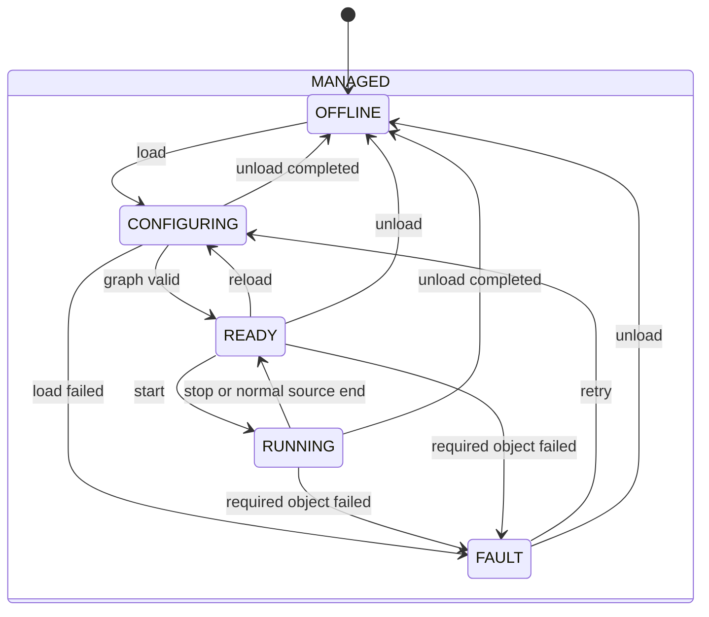

# PipeWireAO development operating contract

Status: active normative development contract; implementation underway

Applicable profile: `development`

Review date: 2026-09-01

## Authority

This document defines the behavior of the first `pipewireao-rtc` runner. The
[architecture](architecture.md) owns its boundary and exclusions. The
[roadmap](roadmap.md) owns implementation order and acceptance evidence.
PipeWireAO and Calculon remain authoritative for their data-plane and
scientific interfaces.

Uppercase requirement terms use the meanings defined by BCP 14 (RFC 2119 and
RFC 8174). Lowercase forms are ordinary prose.

## Terms

A **development configuration** is one resolved standard PipeWire relaxed
SPA-JSON configuration containing the admitted endpoints, FGN graph instances,
explicit links, initial values, and declared observation ports needed for one
session. The minimum increment contains one source, one graph, and one sink.

An **RTC session** is the set of required objects owned by one runner lifecycle.
It contains the minimum three-object graph or the multi-composite topology
defined by RTC-DEV-010.

A **required object** is the configured source, execution composite, sink, or
link whose availability is necessary for the graph to reach `READY` or remain
`RUNNING`.

An **observer** is an ordinary PipeWire client or configured observation
branch that reads published state or samples without owning lifecycle or
pacing the required graph.

## Requirements

### RTC-DEV-001 — Non-actuating development envelope

The runner MUST accept only the `development` profile. It MUST reject a
configuration that requests a physical device endpoint, an actuating sink,
physical correction authority, the `CORRECTING` state, or an operational,
safety, deadline, or real-time qualification claim. A command-shaped ndarray
MAY be produced and inspected only through a simulated, discard, or otherwise
non-actuating sink. Endpoint admission MUST use an explicit allowlist of known
development source and sink factories; a configuration label alone MUST NOT
classify an arbitrary plugin as non-actuating.

Verification intent (informative): accept simulated and recorded sources plus
discard and simulated sinks; reject fixtures containing physical camera or DM
identities, correction requests, unlisted factories, or promoted claims before
creating links.

### RTC-DEV-002 — Minimal configuration and validation

The runner MUST resolve exactly one complete-frame source, one `fgn-native`
Calculon execution composite, and one non-actuating sink from the development
configuration. It MUST validate declared ports, directions, element types,
shapes, schemas, scalar properties, ndarray parameters, and links before
entering `RUNNING`. A rejection MUST identify the scientific object and the
incompatible or missing field.

The runner MUST consume standard PipeWire relaxed SPA-JSON or a directly
equivalent in-memory model emitted by the maintained PipeWireAO generator. It
MUST NOT require TOML, YAML, a run catalog, an artifact database, or an
operational deployment manifest.

Verification intent (informative): mutate each required name, direction,
type, shape, schema, property, parameter, and link in the smallest fixture and
check that validation fails before streaming with an actionable diagnostic.

### RTC-DEV-003 — Exact topology realization and cleanup

The runner MUST realize the configured source → execution composite → sink
topology without substituting discovered devices or creating undeclared
critical links. It MUST expose the resulting objects through standard
PipeWire introspection. On unload or failed configuration, it MUST remove the
nodes and links it owns and MUST NOT stop or mutate an unrelated shared
PipeWire object.

Verification intent (informative): run beside unrelated nodes, fail creation
after each owned object, and verify exact topology, visible introspection,
complete owned-object cleanup, and preservation of unrelated objects.

### RTC-DEV-004 — Basic lifecycle

The runner MUST serialize the following stable states and transitions:

| State | Observable meaning |
| --- | --- |
| `OFFLINE` | The runner owns no active development graph. |
| `CONFIGURING` | The configuration is being resolved, objects are being created, and initial values are being applied. |
| `READY` | The exact required topology exists and can start, but it is not processing frames. |
| `RUNNING` | The source, graph, and sink are processing in open loop. |
| `FAULT` | A requested transition or required object failed; the diagnostic is retained and no physical action is possible. |

Startup and stopping MAY be reported as transition progress but are not
additional stable states. An unload request MUST be accepted from every
`MANAGED` leaf; after the applicable cancel, stop, and cleanup effects complete,
it MUST reach `OFFLINE`, or `FAULT` if cleanup fails. `CORRECTING` MUST NOT
exist in this profile.

Verification intent (informative): exercise every transition, retry after
each injected creation and streaming failure, repeat load/start/stop/unload,
and verify that invalid commands leave the state and owned objects coherent.

### RTC-DEV-009 — Statig hierarchical lifecycle execution

The runner MUST implement RTC-DEV-004 with Statig's blocking state-machine API
and one serialized event dispatcher. `CONFIGURING`, `READY`, `RUNNING`, and
`FAULT` MUST be descendants of a `MANAGED` superstate. The superstate MUST own
the common unload behavior required by RTC-DEV-004. The lifecycle interface
and effect-executor boundary MUST use RTC domain states, events, effects, and
results; they MUST NOT expose Statig types.

A state handler MUST NOT perform potentially blocking PipeWire,
configuration, or filesystem work. It MUST emit a typed effect, and the runner
MUST return the effect's success or failure to the same serialized dispatcher
as a typed completion event. Every effect and completion MUST carry a runner-
allocated token that is not reused during the runner process lifetime. The
development runner MAY permit only one lifecycle effect in flight, but it MUST
reject a completion whose token, effect kind, or originating transition does
not match the current pending effect instead of applying it to a later state.

Verification intent (informative): inspect the Statig hierarchy and lifecycle
boundary; exercise superstate handling, deterministic event order, one in-
flight effect, successful and failed completions, and a delayed completion
delivered after a retry or unload; verify that blocking test effects run
outside state handlers and that stale completions cannot change the current
state.

### RTC-DEV-010 — RTCW multi-composite sessions

The runner MUST accept a development configuration that declares one or more
`fgn-native` filter-graph instances, admitted complete-frame sources,
non-actuating sinks, and exact ordinary PipeWire links between those objects.
RTC-DEV-002 remains the required minimum fixture; for a multi-composite
configuration this requirement supersedes only RTC-DEV-002's exact-one graph
and endpoint cardinality. Every endpoint remains subject to RTC-DEV-001, and
every declared object and link remains subject to RTC-DEV-002 and RTC-DEV-003
validation and cleanup.

Graph authoring MUST remain in the maintained PipeWireAO `filter.graph`
configuration. The runner MUST delegate parsing and realization of each
`filter.graph` body to the maintained PipeWireAO module and MUST NOT implement
a second filter-graph parser or runner-private graph language. It MUST realize
only the declared inter-composite PipeWire links.

One session-level RTC-DEV-004 lifecycle MUST initially own all required
objects. The session MUST reach `READY` only after every required graph
instance and link is realized. Start, stop, retry, required-object failure, and
unload MUST apply coherently to the session as a unit. The runner MUST NOT
provide independent per-graph lifecycle control in this increment.

The runner MUST leave frame scheduling and any concurrent execution of
independent graphs to PipeWire and FGN. It MUST NOT add a runner task scheduler,
worker pool, or graph-operation threads. Concurrency observed in a development
fixture is functional evidence only and MUST NOT be reported as a deadline or
real-time claim.

Verification intent (informative): run a FITS source → graph A → graph B →
discard chain and two independent source → graph → discard paths; inspect the
exact objects and links; inject failure after every creation point; stop and
restart the complete session; unload it without removing an unrelated object;
and verify that no runner-local filter-graph parser or scheduler is present.

### RTC-DEV-005 — Standard property and parameter paths

The runner MUST use the existing FGN and PipeWireAO interfaces for updates. It
MUST send scalar runtime values through the declared property surface and
large arrays through declared ndarray parameter ports. It MUST distinguish a
submitted or requested value from an observed active value. If the standard
host surface cannot establish active adoption, the runner MUST report the
active state as unknown rather than infer it. It MUST NOT invent a second RTC
property protocol.

A change to port count, shape, schema, algorithm identity, or topology MUST be
handled by stopping and reloading the graph. Construction values MUST be
resolved before instance creation.

Verification intent (informative): apply scalar, multi-property, parameter,
and rejected updates; inspect the host's requested and active observations;
then prove that a structural change requires reload and that repeated updates
match direct Calculon behavior.

### RTC-DEV-006 — Optional observation

The runner MUST NOT require a GUI, recorder, telemetry exporter, or command-
line observer to reach `READY` or remain `RUNNING`. An observer MUST use a
declared standard PipeWire observation surface. Attaching, detaching, stalling,
or terminating a non-gating observer MUST NOT change accepted scientific
outputs or lifecycle progress. A sample observer used to establish this claim
MUST attach behind an existing bounded non-gating PipeWireAO observation
boundary; a direct link whose backpressure can pace the required graph does not
satisfy this requirement.

Verification intent (informative): run the same input sequence with no
observer and with an observer that attaches, stalls, disconnects, and
reattaches; compare graph results and lifecycle transitions.

### RTC-DEV-007 — Numerical and state equivalence

For every maintained development fixture, the test harness MUST feed the same
inputs, initial state, properties, and ndarray parameters to the FGN graph and
the maintained direct Calculon or fused reference. It MUST compare every
accepted output and externally meaningful state using declared tolerances.
Source end, reset, property update, and parameter update MUST be included.

Verification intent (informative): retain deterministic inputs and expected
results for the small three-object fixture and REVOLT Classic, report the
first differing frame and scientific field, and fail the development gate on
an unexplained difference.

### RTC-DEV-008 — Scientist-level algorithm authoring

A scientist adding a supported algorithm MUST provide only an ordinary typed
Calculon implementation, its local declaration, array-level tests, and the
scientific ports, shapes, schemas, scalar properties, ndarray parameters, and
construction values that the algorithm genuinely needs. The integration MUST
NOT require hand-written SPA callbacks, raw-pointer handling, errno or unwind
translation, worker code, process management, or an edit to a central adapter
registry.

The same implementation MUST remain directly callable with ordinary arrays
and usable by a non-PipeWire graph executor without transport-specific source
changes.

Verification intent (informative): add one representative stateless,
stateful, multi-input, and ndarray-parameter algorithm from its own package;
unit-test each with arrays; discover and compose it into FGN without editing a
central plugin list; and inspect scientific diagnostics for invalid use.

## Minimum configuration model

The minimum configuration contains only these semantic fields:

| Field | Meaning |
| --- | --- |
| profile | The literal `development` |
| source | Simulated or recorded complete-frame source plus its node arguments |
| graph | Canonical `fgn-native` graph configuration |
| sink | Simulated, discard, or other non-actuating sink |
| properties | Initial scalar values keyed by declared scientific names |
| parameters | Paths or prepared references for declared ndarray parameter ports |
| observations | Optional graph outputs made visible for ordinary PipeWire clients |

This table defines the model, not new syntax. The implementation should reuse
the existing generated PipeWire configuration and keep the initial invocation
to one command. It should add a schema only when the existing configuration
cannot represent a required field.

The RTCW extension pluralizes the existing source, graph, sink, and link
objects in the same standard configuration. It does not add a second graph
model. A future GUI may edit or generate that configuration, but the GUI is
not part of lifecycle admission and is not required for `READY` or `RUNNING`.

## Update classes

| Value | Active path | When it changes |
| --- | --- | --- |
| Frame data | Typed ndarray data port | Every complete frame |
| Large scientific state | Ndarray parameter port | Prepared and adopted through the FGN host contract |
| Scalar runtime value | Declared property and PipeWire `Props` projection | Through the FGN property contract |
| Construction value | Node configuration | Before instance creation |
| Shape, schema, or topology | Configuration reload | While stopped |

Large reconstructors, calibration planes, masks, references, and subaperture
origins are parameters, not scalar properties. Their file loading and
validation occur outside repeated processing.

## Error surface

Errors are reported with scientific names and enough context to correct the
configuration. At minimum, diagnostics distinguish:

- missing node, port, property, or parameter;
- wrong port direction;
- element-type, shape, or schema mismatch;
- unsupported execution or progressive mode;
- link or format-negotiation failure;
- property or parameter rejection; and
- source, graph, or sink failure while running.

Raw SPA status codes may be included for debugging, but they are not the only
message presented to a scientist.

## Development gate

The active operating contract is complete when RTC-DEV-001 through
RTC-DEV-010 are implemented and their verification intent is covered for the
small fixtures and REVOLT Classic. Passing this gate permits only the claim
stated in the architecture: a usable, non-actuating development RTCW.
