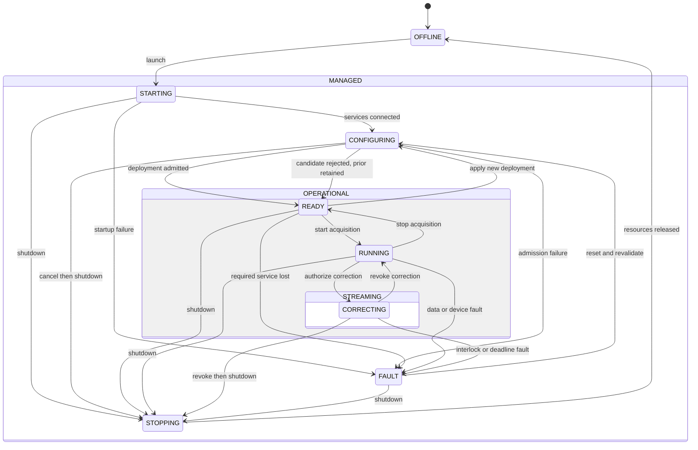
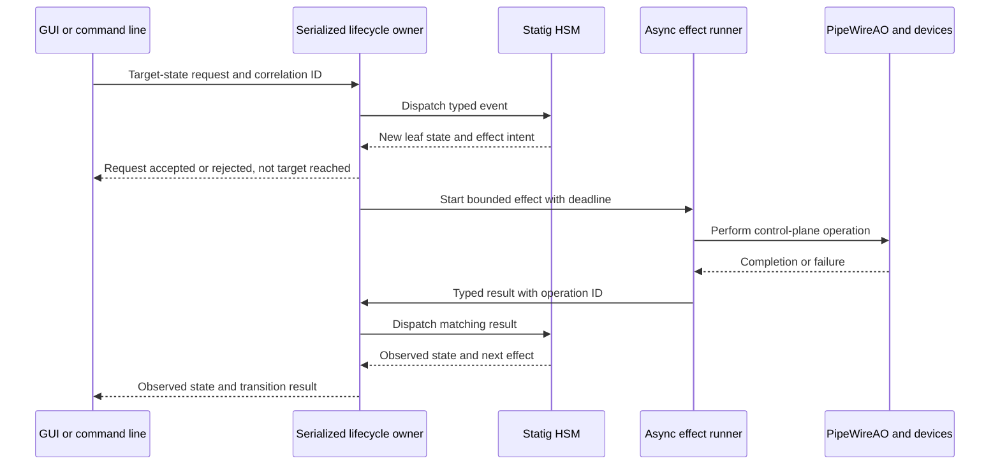
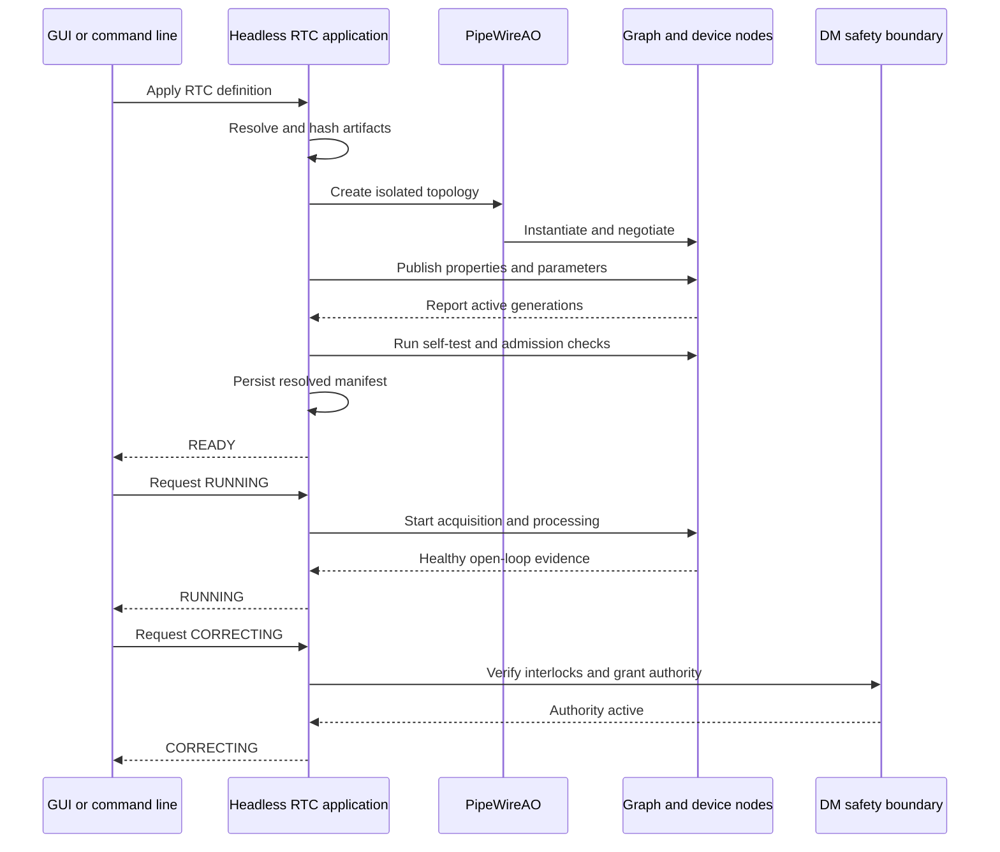
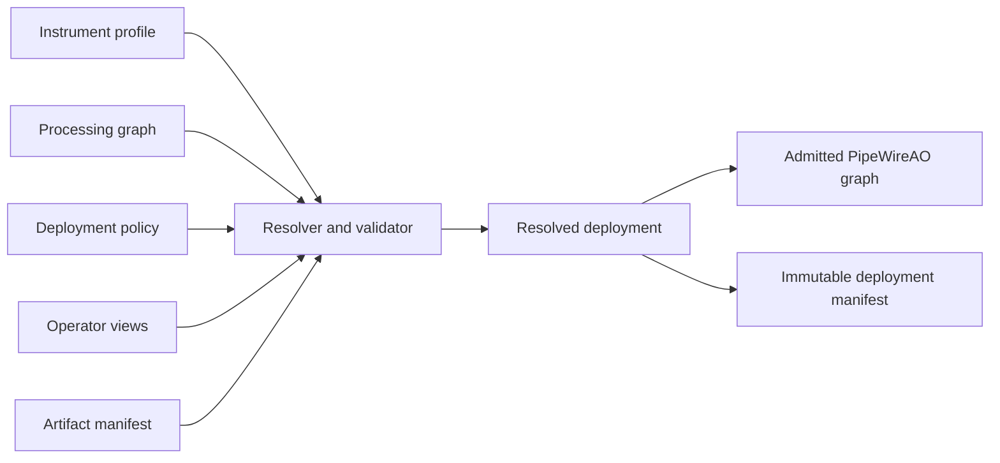
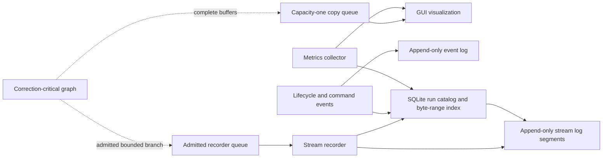
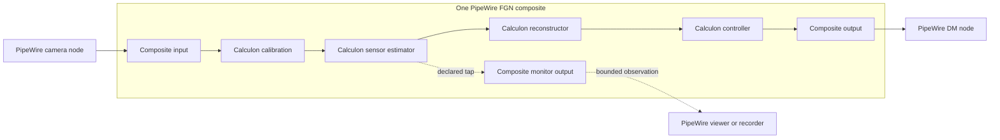

# PipeWireAO RTC operational architecture

Status: proposed operational companion architecture; RTC-ARCH-003,
RTC-ARCH-004, and RTC-ARCH-006 selected

Review date: 2026-08-29

## Authority and scope

This document owns the operational realization of the
[PipeWireAO RTC system architecture](architecture.md): instrument
lifecycle, configuration and artifact admission, scientist graph workflow,
control projection, telemetry and recording, GUI behavior, WirePlumber policy,
and process supervision. The system architecture remains authoritative for
component ownership and target topology. The
[time, causality, and performance contract](time-and-performance.md)
and [scientific data and command contract](scientific-data-and-command-contracts.md)
own the cross-cutting timing and scientific semantics used here. The
[audit and reconstruction contract](audit-and-reconstruction.md) owns protected
operation progression and run reconstruction.

## Instrument lifecycle

PipeWire node states describe whether individual graph objects are idle,
paused, streaming, or in error. They are evidence for the RTC lifecycle, not a
replacement for it. The RTC state must cover the whole instrument and include
the safety-significant distinction between processing data and applying
corrections.



| State | Required meaning |
| --- | --- |
| `OFFLINE` | No deployment is owned. Physical device boundaries remain independently safe. |
| `STARTING` | Required processes and the PipeWire core are being discovered or launched. No scientific graph is authoritative. |
| `CONFIGURING` | The RTC application resolves configuration and artifacts, creates an isolated graph, negotiates formats, publishes parameters, and runs admission checks. |
| `READY` | The exact deployment is admitted and recorded. Devices are configured and safe, but acquisition is not driving correction. |
| `RUNNING` | Acquisition and processing are active in open loop. Commands cannot reach the physical DM as corrections. |
| `CORRECTING` | All guards are satisfied and the physical command boundary accepts correction proposals. This is the only correction-authorized state; it does not imply that any particular proposal was demanded, accepted by the device, physically applied, or measured. |
| `STOPPING` | Correction permission is revoked first; acquisition, recorders, graph, and devices are then stopped in dependency order. |
| `FAULT` | Correction is revoked, the device boundary is safe or attempting its independent safe policy, and diagnostic state is preserved. Reset means revalidation, not merely clearing a flag. |

Health should be an orthogonal status—`OK`, `WARNING`, `DEGRADED`, or
`FAULT`—rather than multiplying lifecycle states. A dropped observation frame
can make recording degraded while correction remains valid; a stale WFS frame
must instead revoke correction according to policy.

Correction authority and command outcome are separate. The RTC application
owns permission to submit correction proposals; the DM command authority owns
composition, constraints, the demanded physical command, and its terminal
result; the device plugin owns truthful submission, acceptance, application,
read-back, and fault observations. The
[scientific data and command contract](scientific-data-and-command-contracts.md)
defines those stages and prohibits treating API acceptance as measured
physical effect.

HEART's block lifecycle is a useful model for system coordination, but
PipeWireAO should not require every pure Calculon algorithm to implement that
state machine. Device and service nodes own meaningful local lifecycle;
scientific filter instances follow graph construction, activation, reset, and
cleanup. The RTC application aggregates those observations into the instrument
state and keeps lifecycle machinery out of scientist code.

### Hierarchical lifecycle implementation

The Rust headless application should implement this model with
[Statig](https://github.com/mdeloof/statig), while keeping the normative RTC
states, events, guards, and observable results independent of that crate.
Statig directly provides nested superstates, state-local storage, entry and exit
actions, dispatch and transition introspection, and blocking and asynchronous
handlers. It is MIT licensed. The dependency version is pinned by the Rust lock
file and recorded in the deployment software manifest; it is not part of the
public RTC protocol.

The hierarchy removes repeated transition logic:

| Superstate | Leaf descendants | Shared policy |
| --- | --- | --- |
| `MANAGED` | `STARTING`, `CONFIGURING`, `READY`, `RUNNING`, `CORRECTING`, `FAULT`, and `STOPPING` | Own shutdown requests and the rule that correction authority is revoked before teardown. |
| `OPERATIONAL` | `READY`, `RUNNING`, and `CORRECTING` | Own required-service loss, replacement-deployment requests, and invalidation of the admitted deployment. |
| `STREAMING` | `RUNNING` and `CORRECTING` | Own acquisition stop, stale or incomplete input, sequence and deadline policy, and camera-stream loss. |
| `CORRECTING` leaf | `CORRECTING` only | Own explicit correction revocation and correction-only interlock or authority events. |

A child handler processes its state-specific event or returns `Super` so its
parent applies the shared rule. The externally visible leaf names and meanings
remain those in the table above. `OPERATIONAL`, `STREAMING`, and `MANAGED` are
implementation superstates, not additional operator-visible states. Health
remains orthogonal to the hierarchy.

The first implementation should use Statig's blocking dispatcher inside one
serialized control-plane owner task, even if the surrounding application uses
an asynchronous runtime. A state handler or entry/exit action may validate an
event, update bounded in-memory lifecycle state, and emit an effect intent. It
must not await PipeWire, WirePlumber, device, filesystem, database, or network
I/O. An asynchronous effect runner performs that work and submits a typed
completion, failure, cancellation, or timeout event back to the owner task.



Transient leaves own the operation ID, deployment generation, deadline, and
rollback context for their current work. Completion events with an old
operation ID or generation are recorded and ignored. Shutdown and safety events
must have reserved bounded delivery capacity so a queue filled with ordinary
requests cannot delay them. Device-local watchdogs remain the ultimate safety
boundary if the application or its event loop fails.

Statig is the transition engine, not the lifecycle protocol, durable event log,
async executor, timeout facility, or safety mechanism. In particular:

- Statig's internal `Handled` outcome is not an external acknowledgement. Every
  client request receives a domain result such as accepted, rejected with a
  reason, or ignored as stale.
- Generated `State` and `Superstate` types remain private. Public IPC and stored
  records use explicitly versioned RTC state, event, reason, and correlation
  types so a Statig or macro update cannot change the wire or archive schema.
- Introspection hooks enqueue structured transition evidence; they do not write
  logs synchronously from a handler.
- Restart does not deserialize the private state-machine representation. The
  application starts without correction authority, reconciles observed system
  state, and proceeds through `STARTING` and `CONFIGURING` before it may return
  to an operational leaf.
- Illegal and unexpected events are tested and explicitly rejected. They must
  not disappear into an implicit top-state fallback.

This is decision **RTC-ARCH-006**: define the instrument lifecycle as a
library-independent hierarchical state machine and implement its first Rust
owner with Statig. Use synchronous, serialized dispatch plus asynchronous typed
effects; keep Statig types private; and keep the complete lifecycle mechanism
outside the correction data path and scientist-authored algorithms.

### Transition semantics

- Clients request a **target state**, not an imperative sequence of button
  presses. Repeating a request is idempotent.
- A target-state request updates requested intent and starts reconciliation; it
  never forces the private HSM into a leaf. Only typed observation, completion,
  failure, cancellation, and timeout events can advance observed state through
  legal transitions.
- Every request has a correlation identifier and deployment generation. The
  RTC application publishes requested, accepted, and observed state separately.
- A transition has guards, a deadline, compensating rollback, and an ordered
  result. Partial success cannot be reported as `READY` or `CORRECTING`.
- Only the RTC application can grant correction authority. The DM boundary can
  always revoke it locally.
- A graph or artifact change creates a new deployment generation. It cannot
  silently alter the admitted generation.
- An RTC application restart never automatically resumes `CORRECTING` unless a
  separately qualified policy, physical watchdog, and complete state recovery
  make that safe. The conservative first behavior is to remain open-loop.

### Startup and correction sequence



Graph creation should be isolated from the active physical DM. Where an old
and new graph cannot coexist, the RTC application first revokes correction,
stops acquisition, applies the transaction, and returns only after complete
admission.

## Configuration and artifact model

### One bundle, separate semantic documents

Instrument profile and graph configuration are related, but they are not the
same object. Keeping them separate prevents a reusable scientific topology
from being copied for every camera serial number, and prevents device identity
from leaking into each algorithm node. They should be bound by one immutable
bundle manifest.

A practical deployment bundle is:

```text
revolt-classic/
  bundle.toml
  instrument.toml
  graph.conf
  deployment.toml
  views.toml
  artifacts.toml
```

The names are illustrative; the semantic boundaries are the decision.
`graph.conf` can remain standard PipeWire relaxed SPA-JSON and can be emitted
by the current config generator. TOML is suitable for the surrounding profile
and manifest files. A script builder and GUI edit the same typed model and
produce the same resolved graph rather than introducing another graph
runtime.

More specifically, the canonical persisted graph should remain the SPA-JSON
accepted by `module-ndarray-filter-chain`. The shared typed model is an
abstract-syntax-tree and validation library over that format, not a second
serialization or executor. Script builders construct that tree, the GUI edits
it, and ordinary PipeWire tools can still load the emitted file.

The term **instrument profile** here means the system-level document that
binds physical device identity and geometry. It is not a node-wide ndarray
format field and must not weaken the exact per-port schema and device-boundary
identity checks.



### Configuration classes

| Class | Examples | Correct transport | Activation point |
| --- | --- | --- | --- |
| Per-frame data | pixels, slopes, modal coefficients, commands | typed data ports | each frame or row block |
| Large sparse updates | reconstructors, interaction matrices, masks, reference slopes, subaperture origins | ndarray parameter ports | prepared off-loop, adopted atomically at a graph-cycle boundary |
| Scalar runtime properties | loop gain, leak, threshold, enable flags, limits | typed `PropInfo` and `Props` | bounded publication at a frame boundary |
| Construction configuration | fixed port count, algorithm variant, static workspace size | node construction config | before instance creation |
| Graph-rebuild configuration | shapes, schemas, topology, worker partition, negotiated format | RTC definition and topology transaction | after correction is revoked and the new graph is admitted |
| Device configuration | camera ROI, exposure, trigger mode, DM identity | instrument profile and device API | guarded device transition, with read-back and rollback |
| Deployment policy | CPU set, priority, pool sizes, drop policy, restart policy | RTC application and service-manager config | deployment admission |
| Operator presentation | selected views, color maps, logical node bindings | GUI view config | GUI session only |

Resolution should be deterministic. Descriptor defaults are applied first;
the versioned graph and instrument bundle then supply explicit scientific and
device values; the deployment file supplies host placement and resource
policy; and a small allowlist of launch-time overrides may select paths,
devices, or a deployment identifier. Environment variables and command-line
flags must not silently replace scientific values. Every permitted override is
expanded into the resolved manifest before admission. Runtime property changes
occur after admission and therefore belong in the ordered event log rather
than rewriting that manifest.

A pathname or artifact catalog identifier is a construction input to the
resolver, not a data-loop property. The resolver loads and validates large
objects outside the data loop, builds the prepared representation, submits it
through the parameter transaction, and waits until the active generation is
observed. Only then can the deployment manifest say that the new artifact is
active.

### Required artifact identity

Every correction-relevant artifact should record at least:

- stable artifact identifier and semantic role;
- content digest and byte size;
- element type, shape, and scientific schema;
- units, coordinate frame, indexing convention, and relevant detector or DM
  geometry identities;
- producing software revision and source data lineage when known;
- qualification state and applicable instrument profile;
- requested, prepared, and active generation; and
- any conversion performed during loading.

The [scientific data and command contract](scientific-data-and-command-contracts.md)
makes these semantic fields operational compatibility requirements. Equal
element type and dimensions do not make a reconstructor, modal basis, detector
calibration, or DM vector interchangeable. Coefficient replacement may use a
large parameter transaction only when its exact input and output quantity,
unit, coordinate frame, basis, sign, normalization, layout, and schema remain
unchanged. Changing any of those meanings is structural reconfiguration.

This is where CACAO's useful “stage, inspect, adopt” model becomes an explicit
transaction instead of a directory convention.

The artifact activation sequence is:

1. resolve an immutable identifier into staged bytes;
2. verify the digest and provenance metadata;
3. decode or convert outside the data loop;
4. validate type, shape, schema, units, coordinate frame, and device geometry;
5. prepare the node's bounded parameter plan;
6. submit the complete graph-wide parameter transaction;
7. observe the expected active generation at a frame boundary; and
8. append the activation event and reclaim retired state outside the strict
   path.

Julia is well suited to producing control matrices and other artifacts as an
offline job or non-real-time PipeWire client. It publishes the qualified
artifact to the catalog; it does not need to execute inside the daemon or the
correction callback merely because the resulting matrix is consumed there.

### Resolved deployment and run record

At `READY`, the RTC application writes an immutable resolved deployment manifest
containing:

- RTC definition and instrument-profile identifiers;
- graph topology and canonical node configuration;
- plugin, DSO, Calculon bundle, and executable identities or digests;
- exact artifact identities and active generations;
- device serials, firmware/SDK information, negotiated formats, and read-back
  configuration;
- scalar-property initial values;
- scheduling, CPU, pool, queue, and overload policy;
- host, kernel, PipeWireAO, and clock information needed for interpretation;
- run identifier, acquisition identity policy, and event-log location; and
- admission results and the admitted deployment generation.

During execution, an append-only event log records protected property changes,
artifact or deployment requests, lifecycle transitions, faults, and recovery.
At closure, a final run record binds the immutable manifest to that log,
recorded-stream index, termination reason, and loss summary. Together they are
the answer to “what RTC ran and what changed?” A source graph file alone cannot
answer that question.

## Scientist-facing graph development

### Required authoring experience

A scientist should need to provide only:

1. an ordinary typed Calculon implementation and its local declaration;
2. scientific names, shapes, schemas, and units for ports;
3. which values are scalar properties, large parameters, or construction
   values;
4. a graph assembled from declared algorithms and device endpoints; and
5. instrument-specific artifacts and initial values.

They should not need to provide:

- PipeWire or SPA callbacks;
- C layouts, raw pointers, errno values, atomics, or unwind guards;
- a shared-library registry entry outside their package;
- worker-thread, queue, or buffer-pool code;
- process launch scripts or service definitions; or
- lifecycle and recording boilerplate for every algorithm.

The generated Calculon FGN adapter remains the common transport boundary.
Rust and Julia declarations should describe the same portable algorithm
contract. The runtime adapter, not the scientist, owns callback containment,
prepared-state publication, and language-runtime admission.

### Script and GUI parity

The script API and GUI must operate on one typed RTC-definition model. A
conceptual script—not a proposed exact API—should be no more complex than:

```text
rtc "revolt-classic" {
    pixels = device "wfs-camera"
    slopes = algorithm "shwfs-slopes-f32" (
        image = pixels,
        origins = artifact "subaperture-origins",
        threshold = 0.0)
    modes = algorithm "reconstruct-f32" (
        input = slopes,
        matrix = artifact "control-matrix")
    command = algorithm "leaky-integrator-f32" (
        input = modes,
        gain = 0.4,
        leak = 0.99)
    connect command to device "woofer-dm"
}
```

The builder resolves descriptor metadata and rejects missing ports, wrong
shapes, schema mismatches, incompatible artifact roles, or illegal feedback
before starting PipeWireAO. The GUI renders the same model as nodes, typed
ports, links, properties, and artifact selectors. Saving in the GUI and loading
through a script must produce the same canonical graph and deployment digest.

The definition also supplies the GUI's internal FGN topology. Runtime
introspection reconciles that definition with the composite instance and its
active generations; it does not require one PipeWire node per Calculon
algorithm. Scalar properties remain addressable through namespaced composite
properties. An intermediate ndarray becomes observable only through a
declared external/monitor port or a guarded graph-rebuild transaction. The GUI
must never borrow arbitrary internal workspace pointers.

This model also remains usable outside PipeWireAO. AdaptiveOpticsSim can
interpret Calculon declarations and the scientific portion of the graph with
its own executor while ignoring PipeWire deployment and device policy. That
portability depends on keeping scheduling, service management, and device
control out of algorithm declarations.

### Authoring acceptance tests

The scientist-facing surface is ready only when all of these are true:

- a new unary, multi-input, stateful, or parameterized algorithm is declared
  in its own Rust or Julia package without editing a central adapter crate;
- its descriptor appears automatically to graph tooling;
- a script and GUI can discover its ports, schemas, properties, defaults, and
  artifact roles;
- it can be tested with ordinary arrays without PipeWireAO;
- the same implementation runs serially as the numerical reference and under
  the FGN adapter without scientific source changes;
- construction and runtime errors use scientific names and actionable
  messages; and
- the REVOLT graph can be recreated without hand-written SPA plugin code.

## RTC application control surface

The headless RTC application should expose its common operational state as an
ordinary PipeWire control object so the GUI can discover it through the same
registry connection it already uses. A control-only node using standard
`PropInfo` and `Props` is the preferred first experiment. Namespaced
properties can include:

- requested and observed RTC state;
- deployment generation and digest;
- instrument profile and run identifiers;
- correction permission and interlock summary;
- current health level, fault code, and concise reason;
- active artifact and property generations; and
- lifecycle request correlation and completion identifiers.

Target-state requests are small, typed, and idempotent, which fits the
existing property model better than one-shot command strings. The object must
republish observed values; submission alone is not success.

Before this becomes a contract, a small spike must prove that a control-only
node can publish changing `PropInfo`/`Props`, enforce the required PipeWire
permissions, survive reconnects, and report request completion without joining
a data loop. If that shape is unsuitable, use a dedicated metadata/global
object for the same domain model; do not invent a dummy high-rate port merely
to carry lifecycle commands.

Large definition upload, artifact transfer, catalog search, and detailed
diagnostic retrieval should not be forced into scalar properties. For the
first single-host implementation, the RTC application can load a local bundle and
the GUI or command line can select its stable identifier. Define the domain
transaction API in the RTC application before choosing a remote
transport. Add a local socket, D-Bus, or another management transport only
when a concrete operation cannot be represented safely through PipeWire
objects and local bundle selection.

Production access policy should distinguish:

- read-only observers;
- ordinary scientific-property writers;
- graph and artifact operators;
- correction-authority operators; and
- engineering access to device nodes.

The initial engineering deployment can permit direct property writes, but
protected nodes and transitions must eventually be writable only by the
RTC application. The RTC application records accepted changes and their active
generation.

## Telemetry, visualization, and recording

“Telemetry” should not mean one overloaded stream type. Four related surfaces
are needed:

1. **Live status and control values:** node state, `PropInfo`, `Props`, active
   generations, device read-back, and low-rate counters.
2. **Scientific streams:** pixels, calibrated images, slopes, modes, residuals,
   DM commands, and diagnostic ndarrays observed from ports.
3. **Lifecycle and audit events:** ordered requests, transitions, artifact and
   property changes, faults, recoveries, and operator identity.
4. **Performance telemetry:** acquisition, enqueue, process, and command
   timestamps; sequence gaps; deadline misses; queue and pool pressure; worker
   timings; and drop reasons.

These surfaces share identities but not semantics. Audit events distinguish
request, target admission, preparation, activation, terminal command result,
and device observation. Performance observations identify their clock domain
and measurement point. DM observations name whether they are requested,
demanded, submitted, accepted, applied, predicted, or measured. A client or
recorder must not collapse those stages into one generic status merely because
they refer to the same correlation or acquisition. The
[audit and reconstruction contract](audit-and-reconstruction.md) defines the
required progression and terminal dispositions.



The GUI path normally uses capacity one and replaces old observations. It
releases PipeWire buffers immediately and renders from GUI-owned memory. The
recorder path uses a separately admitted bounded capacity. Its policy may drop
old data, drop new data, or deliberately revoke correction for a deployment
that requires lossless recording; that choice must be explicit. It may never
silently block the correction graph.

### Dynamic observer attachment

PipeWire output ports can have multiple links. An ordinary client process may
therefore create an input node and connect it to a compatible external output
while the graph is running. The current PipeWireAO GUI already follows this
model: it creates an input stream and link for the selected video or rank-two
ndarray source and removes them when observation stops. Command-line tools may
create or remove the same links for engineering use.

This capability has two boundaries:

1. A Calculon FGN composite exposes only the external and monitor ports declared
   in its admitted definition. A client cannot dynamically borrow an internal
   workspace or expose an undeclared intermediate. Doing so requires a guarded
   graph rebuild.
2. A dynamic link is not automatically an isolation boundary. A passive link
   changes activation behavior, but it does not prevent a slow client from
   retaining buffers or changing negotiation and scheduling work.

The critical-side link into each normal observation queue should therefore be
created and admitted before correction. GUI and best-effort telemetry clients
may then attach and detach on the observer side of that queue without changing
the scientific graph. A continuous recorder uses a separate queue because its
capacity, pacing, and loss policy differ from latest-value visualization.

| Runtime action | Policy while `CORRECTING` |
| --- | --- |
| Attach or detach a read-only client at a prepared observation-queue output | Allowed through access policy; record the subscription interval and first and last observed acquisition identities. |
| Start a best-effort snapshot or telemetry consumer at a prepared output | Allowed with explicit finite capacity and drop accounting. |
| Add a new critical-side queue link to a declared monitor port | Avoid in the first qualified deployment because link negotiation and pool changes can disturb the admitted graph; revoke correction first unless deployment evidence proves otherwise. |
| Start a recorder whose completeness is a correction requirement | Arm and admit it before `RUNNING`; failure follows the declared open-loop, stop, or fault policy. |
| Export a new internal FGN value, change an algorithm or format, or alter a camera or DM link | Revoke correction, rebuild transactionally, re-admit, and resume only through an explicit lifecycle transition. |

Production access policy should make the RTC application the only owner of AO
topology. An external recorder may create its own node, but it requests the
subscription from the RTC application, which validates the logical port and
schema, creates or authorizes the link, and records the topology event. Direct
`pw-link` use remains a useful engineering mode rather than an untracked
operational control path.

This is decision **RTC-ARCH-003**: observation nodes are detachable ordinary
PipeWire clients, but they consume only declared external products through
bounded observation branches. Observer-side attachment may be dynamic;
scientific-graph and correction-critical topology changes are admitted RTC
transactions.

### Standard node health and performance fields

Every relevant node should expose a common minimum set:

- frames or blocks accepted and produced;
- last acquisition identifier, sequence, and timestamp;
- sequence gaps, duplicate, stale, corrupt, and incomplete inputs;
- drops by reason and queue high-water mark;
- process errors and current error reason;
- requested and active property and parameter generations;
- process-time and scheduling-delay histogram or bounded summary;
- deadline misses and longest observed processing time; and
- current PipeWire state plus an AO health contribution.

The acquisition metadata already carried with ndarray buffers should be the
join key between camera data, intermediate streams, commands, telemetry, and
recorded events. Wall-clock timestamps alone are not sufficient.
Cross-clock timing summaries are valid only under the mapping and uncertainty
rules in the
[time, causality, and performance contract](time-and-performance.md).

### Run recording model

#### SPIDERS archive precedent

The inspected `RTC_planning/spiders/archiverservice` did not store
`TensorMessage` bodies in SQLite. It used a log-structured split:

- every complete received SBE message was written verbatim to a rolling raw
  file, shared by the streams being recorded;
- one SQLite database per observing night indexed the message header, Aeron URI
  and stream, raw filename, and exact start and stop byte offsets;
- index rows were accumulated and inserted in batches, with a time limit for
  sparse traffic and SQLite write-ahead logging for concurrent readers;
- recording subscriptions could be enabled and disabled dynamically, while a
  metadata stream was always subscribed; and
- selection, replay, and FITS generation queried SQLite and then memory-mapped
  the raw files rather than copying tensor bodies out of database rows.

That separation worked well because the write path stayed sequential, the
database remained small and searchable, and the original encoded message was
available for replay or later scientific conversion. The aspects to improve
are record framing and validation, explicit crash-consistency ordering,
recoverable orphaned tails, checksums, durability-window reporting, and
first-class loss accounting. Those are implementation issues around the
pattern, not reasons to replace the pattern with tensor BLOBs.

#### PipeWireAO indexed-log design

A run catalog entry should contain:

```text
run-id/
  resolved-manifest
  lifecycle-and-command-events
  metrics
  stream-index.sqlite
  event-log-segments/
  stream-log-segments/
  loss-summary
  termination-record
```

The initial continuous recorder should preserve each accepted PipeWire buffer
in an append-only, self-framing **portable SPA-buffer record**. This means
serializing the buffer's logical publication, not copying the memory image of
`struct spa_buffer`, `struct spa_data`, `struct spa_meta`, or
`struct spa_chunk`. Those structures contain process-local pointers, file
descriptors, allocator and pool state, native layout and padding, and storage
properties that do not survive process exit.

The negotiated format is a port or pool-generation property rather than a
member of `struct spa_buffer`, so each segment descriptor records the exact
format and the buffer records refer to that format generation. A replay source
allocates a new local SPA buffer pool and reconstructs the recorded logical
chunks and metadata into those new buffers. It never attempts to recreate the
original pointer, file descriptor, memory type, pool index, or mapping address.

PipeWire's native client-node protocol is useful implementation evidence but is
not a persistent archive format. It marshals buffer-pool descriptors and passes
file descriptors out of band; it does not define a self-contained, durable
serialization of payload bytes and per-publication metadata.

The first serialization profile covers complete and row-block
`application/ndarray` plus the raw-video formats needed by the camera boundary.
It preserves the exact logical content needed to reconstruct a publication:

| Archive object | Required content |
| --- | --- |
| Stream and segment descriptor | Run and logical-port identities; exact media format and format generation; ndarray schema, profile, element type, shape, layout, and units or raw-video pixel format, extent, and stride; and recorder policy. A format change starts a new segment. |
| Per-buffer record | Record length, serialization-profile version and byte order; acquisition identity; portable metadata records; data-block and logical chunk descriptors; exact valid payload bytes; recorder arrival information; and checksum. Circular chunks are copied into a defined on-disk order while retaining the original logical offset, size, stride, and flags for validation and replay. |
| SQLite index row | Logical stream, acquisition identity and sequence, timestamps, segment filename, byte offset and length, format generation, checksum state, and any discontinuity or drop status. It does not contain the ndarray payload. |
| Sealed segment record | Final byte length, record count, first and last identities, digest, and known loss summary. |

Metadata needs an explicit serialization registry. The first profile admits and
validates `SPA_META_Header` and `SPA_META_Acquisition`, which contain the
identity, sequence, timestamps, discontinuity state, and exposure provenance
needed by PipeWireAO. Link-local `SPA_META_Busy` is never archived. Metadata
containing a file descriptor, pointer, synchronization object, or an unknown
custom layout is rejected or handled by a separately versioned codec; it is not
blindly copied as apparently portable bytes. Source memory information such as
MemPtr, MemFd, DmaBuf, and mapping offsets may be retained as diagnostic index
fields, but replay does not treat it as part of the scientific value.

The format record should retain both the exact negotiated SPA format POD for
same-stack replay and a versioned canonical description of the ndarray or video
format for validation and long-term decoding. The archive's own framing,
integer byte order, bounds, checksums, and compatibility rules are independent
of the host C ABI.

The recorder writes and validates complete records before making their index
rows durable. For a durability batch, the ordering is:

```text
append complete framed records
  -> flush and synchronize the log according to the declared durability policy
  -> commit the corresponding SQLite index rows
  -> advance the recorder's durable acquisition watermark
```

A crash after log synchronization but before index commit may leave an
unindexed tail; record framing and checksums make that tail discoverable and
recoverable. The inverse—an index row referring to bytes that were never made
durable—must not be an accepted state. Active segments use an explicit
incomplete state and are sealed only after their index and loss summary agree.
The configured batch size and synchronization interval define a visible
maximum durability window rather than an undocumented promise of per-frame
durability.

Protected commands use the same provenance principle. The event log retains
the exact request and observed result, while indexed fields distinguish
requested, accepted, submitted, active, rejected, and failed states. If a
deployment requires an accepted command to survive power loss, the RTC
application acknowledges acceptance only after the corresponding event is
within the durable watermark. Per-frame DM command vectors remain scientific
stream records joined to those events by acquisition identity.

The recorder interface remains pluggable above this contract. FITS is useful
for snapshots, exchange, and derived observing products; XRIF is effective for
continuous image streams; HDF5 or Zarr can be useful for structured scientific
datasets. These formats may be export targets or qualified recorder backends,
but conversion and compression must not be hidden in the correction path. The
first implementation should favor a simple indexed append-only log plus an
offline FITS exporter, following the successful SPIDERS split while improving
its recovery and integrity contract.

#### Temporal metadata and derived products

Raw accepted stream and event records remain authoritative. A FITS, CAOM, or
other derived scientific product may join slower instrument or observatory
metadata only through a declared policy: exact acquisition or operation
identity, an identified validity interval, or a named nearest-observation rule
with a maximum age and tie breaker. Recorder arrival order and an unqualified
wall-clock nearest neighbour are not sufficient.

The derived product records the selected source records, join policy, clock
mapping generation where time comparison was required, uncertainty or age,
missing-field disposition, exporter revision, and output digest. Missing or
ambiguous metadata remains missing or explicitly qualified; an exporter must
not silently borrow a later value. Re-exporting may improve presentation or
metadata selection without rewriting the raw run record.

PipeWireAO standardizes identity, timing, metadata, bounded delivery, loss
reporting, and catalog association. The database is the searchable catalog and
byte-range index; it is not the high-rate tensor store.

This is decision **RTC-ARCH-004**: record continuous ndarray and admitted video
products as portable logical SPA-buffer records in self-framing append-only log
segments, index them in SQLite without tensor payload BLOBs, replay them into
new local SPA buffers, and generate FITS and other scientific formats through
explicit export or qualified backend stages.

Replay should be able to select recorded source streams, reconstruct the
resolved graph, suppress physical outputs, and compare intermediate and final
results with stored streams. This becomes the main regression bridge from
simulation to hardware.

## GUI role

The GUI should have two clearly separated modes over the same discovered
objects.

GUI, terminal, and automation frontends should share one deterministic client
core that reduces identified PipeWire observations and RTC events into
immutable bounded snapshots. One adapter or session owner holds PipeWire
proxies and buffer leases; it copies admitted observation data into
client-owned bounded storage before publication. Frontend threads never retain
a PipeWire lease, mutate authoritative RTC state directly, or infer a later
command stage from an earlier acknowledgement. This preserves one reconnection,
gap, stale-generation, and command-result policy across every frontend without
making the client core another system authority.



The GUI renders both levels. It discovers the outer graph from PipeWire and
renders the inner scientific graph from the canonical definition plus runtime
introspection. Keeping the inner operations in one composite preserves the
synchronous FGN execution and avoids adding a PipeWire scheduling boundary for
every small scientific operation.

### Engineering observation

- enumerate nodes, ports, links, formats, schemas, properties, and current
  values directly from PipeWireAO, and reconcile the configured internal FGN
  graph;
- subscribe to selected video or ndarray ports through bounded observation
  branches;
- display timestamps, acquisition identity, active generations, drop counts,
  and process health;
- offer specialized WFS, slope, modal, SCC, and DM visualizations; and
- reconnect without changing graph or instrument state.

### Operational control

- display the RTC application's requested and observed RTC states;
- request guarded transitions such as `READY`, `RUNNING`, and `CORRECTING`;
- select a versioned definition and qualified artifact set;
- preview and validate graph changes before applying them;
- show transition progress, blocking guards, and exact failure reasons;
- browse run manifests, events, recordings, and loss summaries; and
- use the same typed graph model as the script builder.

The GUI should never infer that correction is active merely because nodes are
streaming. It should display the explicit correction-authority state reported
by the RTC application and the independent safe/authority status reported by the
DM boundary.

For early development the graph editor may generate a bundle and invoke an
apply operation. It should not become an untracked stream of arbitrary link
and property mutations. Every operationally applied edit creates a new
deployment generation and manifest record.

## WirePlumber decision

PipeWire's term **session manager** means policy for PipeWire objects: discover
devices, configure nodes, decide links, enforce permissions, and maintain
metadata. An AO instrument session additionally means calibrated artifacts,
an admitted processing graph, device readiness, correction interlocks,
safe-state behavior, and a reproducible run. These scopes overlap but are not
identical.

WirePlumber is not the RTC. It plays the same role for PipeWireAO that it plays
for a DAW: it makes devices and generic policy available, while the domain
application owns its project. If AO application logic is packaged as
WirePlumber components, the dedicated WirePlumber process hosts that logic;
the AO components and bundle, rather than stock WirePlumber, remain the RTC
application.

| Approach | Advantages | Problems | Recommendation |
| --- | --- | --- | --- |
| Fork `pipewire-media-session` | Compact C example of direct PipeWire session management. | It was replaced by WirePlumber and is now an example/debugging reference; a fork would inherit low-level asynchronous object, access, reconnect, and policy work. | Read as a reference; do not use as the product base. |
| Fork WirePlumber | Immediate access to registry, link policy, permissions, and mature daemon infrastructure. | Permanent fork maintenance and unnecessary divergence from public component APIs. | Do not do this. |
| Host all AO application logic in a dedicated WirePlumber profile | Few processes; direct use of cached objects, events, hooks, profiles, and permissions. | Project loading, artifacts, run records, and domain lifecycle become coupled to a session-policy host; blocking control work must be kept off its event loop. | Valid fixed-appliance packaging, but not the default application boundary. |
| Headless RTC application using raw PipeWire | Clear DAW-like domain ownership and process isolation. | Reimplements cached asynchronous object readiness, reconnect, and generic session utilities. | Avoid unnecessary raw-client duplication. |
| Headless RTC application using `libwireplumber` | Clear DAW-like domain ownership while reusing WirePlumber's object model and asynchronous utilities; compatible with the selected Rust implementation through bindings or a narrow C shim. | Adds a separate process and requires an explicit no-conflict contract with the WirePlumber daemon. | Recommended default. |

Upstream PipeWire describes `pipewire-media-session` as its first
implementation and now mainly a debugging example. See the
[PipeWire overview](https://pipewire.pages.freedesktop.org/pipewire/page_overview.html)
and archived
[media-session documentation](https://pipewire.pages.freedesktop.org/media-session/).

WirePlumber's daemon only hosts the components selected by a profile, while
`libwireplumber` is explicitly available to external management applications
and custom session managers. Its object manager caches asynchronous PipeWire
object information before presenting ready objects. See the upstream
[WirePlumber architecture](https://pipewire.pages.freedesktop.org/wireplumber/design/understanding_wireplumber.html)
and [components and profiles](https://pipewire.pages.freedesktop.org/wireplumber/daemon/configuration/components_and_profiles.html).

The maintained deployment should run a minimal WirePlumber policy appropriate
to the dedicated PipeWireAO core. WirePlumber may discover and configure
devices and grant access. The RTC application creates and owns the AO graph,
selects exact device identities, and controls its lifecycle. Generic policy
must not move an RTC stream, choose a fallback target, or automatically
reconnect it to a different camera or DM. WirePlumber's standard
`target.object`, `node.dont-reconnect`, `node.dont-move`, and
`node.dont-fallback` mechanisms provide a starting point, but the resulting AO
behavior requires explicit integration tests.

WirePlumber supports profiles and multiple instances specifically to separate
device monitoring from graph policy. A PipeWireAO deployment may use that
facility, but every instance must have a non-overlapping role. See
[running multiple WirePlumber instances](https://pipewire.pages.freedesktop.org/wireplumber/daemon/multi_instance.html).

No configuration parsing, artifact work, scientific processing, recording, or
device safety may run synchronously in WirePlumber's policy event loop. If the
fixed-appliance variant hosts processing-related PipeWire modules through
WirePlumber, they belong in its separate client context; they remain
PipeWireAO data-plane components, not Lua processing hooks.

## Process supervision and failure policy

Use the operating-system service manager for process concerns instead of
recreating CACAO or MagAO-X terminal-session supervision:

- service dependencies and startup order;
- process identity and clean shutdown;
- privilege and device access;
- CPU affinity, cgroups, memory locking, and scheduling limits;
- restart limits and crash evidence; and
- log routing for non-real-time service logs.

The service manager does not decide that the instrument is `READY` or
`CORRECTING`. A process being alive is only one lifecycle guard.

| Failure | Required first response | Recovery owner |
| --- | --- | --- |
| GUI disconnect or crash | None on correction; release observation buffers. | GUI reconnects and rebuilds its snapshot. |
| Recorder slow or failed | Apply declared drop policy and report degraded recording; never block silently. | Recorder and RTC application. |
| Camera stale, malformed, or disconnected | Revoke correction according to frame-validity policy; mark data invalid; preserve diagnostics. | Camera boundary and RTC application. |
| FGN helper does not complete a bounded dispatch by its deadline | Abandon the affected frame, do not publish partial output or advance state, account for the deadline failure, and revoke correction at the configured threshold. | FGN coordinator first, RTC application using published health second. |
| Scientific node error or repeated deadline miss | Stop correction commands and transition out of `CORRECTING`; fault if policy requires. | RTC application using node health. |
| DM disconnect or rejected command | Device-local safe action immediately; revoke correction; enter `FAULT`. | DM boundary first, RTC application second. |
| PipeWireAO daemon loss | Device-local safe action; deployment is no longer admitted; enter `FAULT`. | Device boundaries and RTC application. |
| WirePlumber loss | Preserve existing correction only if all required objects remain independently owned and the deployment explicitly admits that behavior; otherwise revoke through the resulting device or policy fault. Never choose replacement hardware during recovery. | RTC application and service manager. |
| RTC application loss | Device watchdog or leased authority expires to safe/open-loop state. Do not resume correction automatically after restart. | Device boundary and service manager. |
| Artifact activation timeout or mismatch | Keep the prior active generation; reject the deployment transaction. | Node publication protocol and RTC application. |

Correction authority should be a renewable lease or equivalent bounded
device-side permission so the absence of the control process cannot leave an
actuator indefinitely accepting stale commands. The exact mechanism is
device-specific, but the failure invariant is system-wide.

Process placement changes failure containment. A vendor SDK crash in a separate
device process loses that device boundary; the same crash in a co-located
placement loses the complete strict island and is treated as PipeWireAO daemon
loss. Admission must test and record both the latency benefit and this expanded
failure consequence before accepting co-location.
