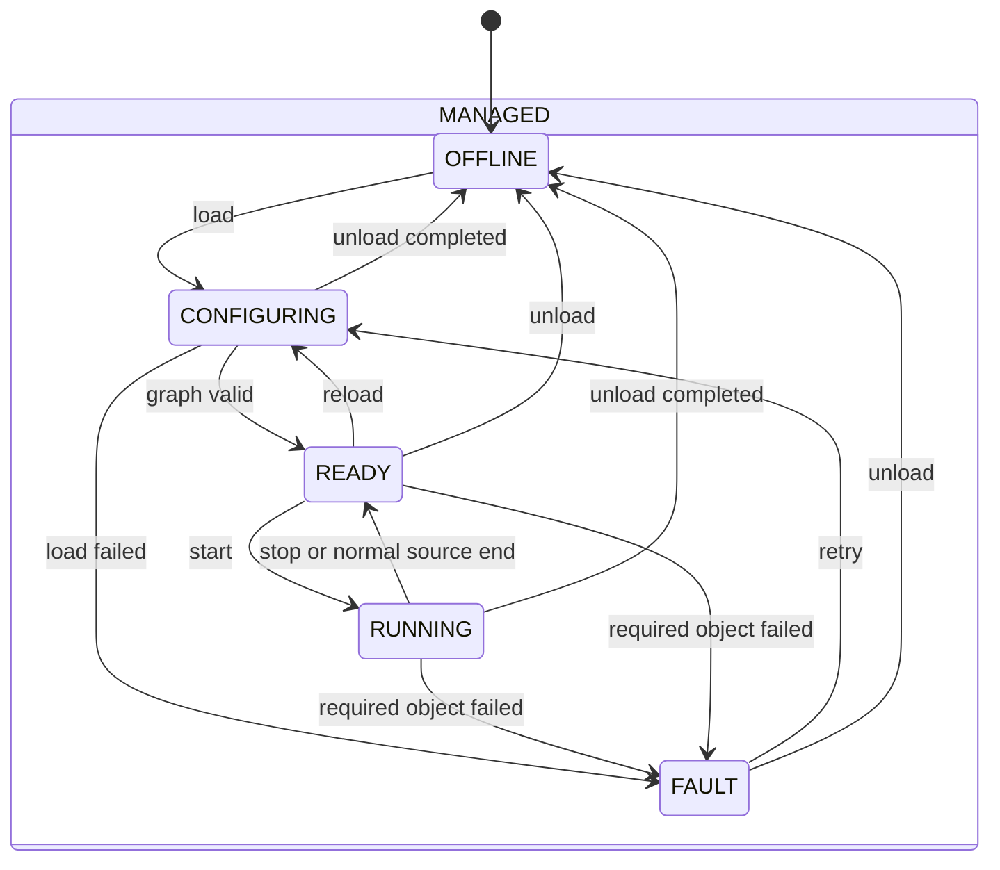

# PipeWireAO development operating contract

Status: active normative development contract; implementation underway

Applicable profile: `development`

Review date: 2026-09-04

## Authority

This document defines the behavior of the first `pipewireao-rtc` runner. The
[architecture](architecture.md) owns its boundary and exclusions. The
[roadmap](roadmap.md) owns implementation order and acceptance evidence.
PipeWireAO remains authoritative for the data plane, while each scientific
Algorithm package remains authoritative for its implementation and declaration.

Uppercase requirement terms use the meanings defined by BCP 14 (RFC 2119 and
RFC 8174). Lowercase forms are ordinary prose.

## Terms

A **development configuration** is one resolved standard PipeWire relaxed
SPA-JSON configuration containing the admitted endpoints, FGN graph instances,
explicit links, initial values, and declared observation ports needed for one
session. The minimum increment contains one source, one graph, and one sink.

An **RTC session** is the set of required objects admitted by one runner
lifecycle. It contains runner-owned objects and MAY contain explicitly declared
external HIL endpoints. Ownership does not transfer merely because an object is
required by the session.

An **execution group** is a uniquely named, non-empty set of declared session
nodes that starts and stops as one processing unit while the session remains
realized. It does not own configuration, links, cleanup, or a separate Statig
lifecycle.

A **required object** is the configured source, execution composite, sink, or
link whose availability is necessary for the graph to reach `READY` or remain
`RUNNING`.

An **external HIL endpoint** is a required PipeWire node owned by an admitted
simulation application rather than by the runner. Its source or sink role,
node name, ports, formats, shapes, and schemas are declared
exactly in the development configuration.

An **external processing node** is a required execution composite created and
destroyed by another application. Its object ownership remains external even
when the development configuration explicitly grants the RTC session authority
to submit tokened run-control requests. The owning application applies an
accepted request through its owner-local PipeWire activation operation.

An **observer** is an ordinary PipeWire client or configured observation
branch that reads published state or samples without owning lifecycle or
pacing the required graph.

## Requirements

### RTC-DEV-001 — Non-actuating development envelope

The runner MUST accept only the `development` profile. It MUST reject a
configuration that requests a physical device endpoint, an actuating sink,
physical correction authority, the `CORRECTING` state, or an operational,
safety, deadline, or real-time qualification claim. A command-shaped ndarray
MAY be produced and inspected only through a simulated, discard, or otherwise
non-actuating sink. Endpoint admission MUST use an explicit allowlist of known
development source and sink factories; a configuration label alone MUST NOT
classify an arbitrary plugin as non-actuating.

Verification intent (informative): accept simulated and recorded sources plus
discard and simulated sinks; reject fixtures containing physical camera or DM
identities, correction requests, unlisted factories, or promoted claims before
creating links.

### RTC-DEV-002 — Minimal configuration and validation

The runner MUST resolve exactly one complete-frame source, one `fgn-native`
execution composite, and one non-actuating sink from the development
configuration. It MUST validate declared ports, directions, element types,
shapes, schemas, scalar properties, ndarray parameters, and links before
entering `RUNNING`. A rejection MUST identify the scientific object and the
incompatible or missing field.

The configuration MUST declare one positive complete-frame session rate.
Every repeated data port MUST negotiate that rate. A declared sparse ndarray
parameter port does not carry a repeated frame cadence and MUST be validated as
a parameter rather than rejected for omitting the session rate.

The runner MUST consume standard PipeWire relaxed SPA-JSON or a directly
equivalent in-memory model emitted by the maintained PipeWireAO generator. It
MUST NOT require TOML, YAML, a run catalog, an artifact database, or an
operational deployment manifest.

Verification intent (informative): mutate each required name, direction,
type, shape, schema, property, parameter, and link in the smallest fixture and
check that validation fails before streaming with an actionable diagnostic.

### RTC-DEV-003 — Exact topology realization and cleanup

The runner MUST realize the configured source → execution composite → sink
topology without substituting discovered devices or creating undeclared
critical links. It MUST expose the resulting objects through standard
PipeWire introspection. On unload or failed configuration, it MUST remove the
nodes and links it owns and MUST NOT stop or mutate an unrelated shared
PipeWire object.

Verification intent (informative): run beside unrelated nodes, fail creation
after each owned object, and verify exact topology, visible introspection,
complete owned-object cleanup, and preservation of unrelated objects.

### RTC-DEV-004 — Basic lifecycle

The runner MUST serialize the following stable states and transitions:

```mermaid
stateDiagram-v2
    [*] --> OFFLINE
    state MANAGED {
        CONFIGURING --> READY: graph valid
        CONFIGURING --> FAULT: load failed
        READY --> RUNNING: start
        RUNNING --> READY: stop or normal source end
        READY --> CONFIGURING: reload
        RUNNING --> FAULT: required object failed
        READY --> FAULT: required object failed
        FAULT --> CONFIGURING: retry
        CONFIGURING --> OFFLINE: unload completed
        RUNNING --> OFFLINE: unload completed
    }
    OFFLINE --> CONFIGURING: load
    READY --> OFFLINE: unload
    FAULT --> OFFLINE: unload
```

| State | Observable meaning |
| --- | --- |
| `OFFLINE` | The runner owns no active development graph. |
| `CONFIGURING` | The configuration is being resolved, objects are being created, and initial values are being applied. |
| `READY` | The exact required topology exists and can start, but it is not processing frames. |
| `RUNNING` | Session execution is admitted. All execution groups start in the running condition, after which individual groups may be stopped and restarted under RTC-DEV-011. |
| `FAULT` | A requested transition or required object failed; the diagnostic is retained and no physical action is possible. |

Startup and stopping MAY be reported as transition progress but are not
additional stable states. An unload request MUST be accepted from every
`MANAGED` leaf; after the applicable cancel, stop, and cleanup effects complete,
it MUST reach `OFFLINE`, or `FAULT` if cleanup fails. `CORRECTING` MUST NOT
exist in this profile.

Verification intent (informative): exercise every transition, retry after
each injected creation and streaming failure, repeat load/start/stop/unload,
and verify that invalid commands leave the state and owned objects coherent.

### RTC-DEV-009 — Statig hierarchical lifecycle execution

The runner MUST implement RTC-DEV-004 with Statig's blocking state-machine API
and one serialized event dispatcher. `CONFIGURING`, `READY`, `RUNNING`, and
`FAULT` MUST be descendants of a `MANAGED` superstate. The superstate MUST own
the common unload behavior required by RTC-DEV-004. The lifecycle interface
and effect-executor boundary MUST use RTC domain states, events, effects, and
results; they MUST NOT expose Statig types.

A state handler MUST NOT perform potentially blocking PipeWire,
configuration, or filesystem work. It MUST emit a typed effect, and the runner
MUST return the effect's success or failure to the same serialized dispatcher
as a typed completion event. Every effect and completion MUST carry a runner-
allocated token that is not reused during the runner process lifetime. The
development runner MAY permit only one lifecycle effect in flight, but it MUST
reject a completion whose token, effect kind, or originating transition does
not match the current pending effect instead of applying it to a later state.

Verification intent (informative): inspect the Statig hierarchy and lifecycle
boundary; exercise superstate handling, deterministic event order, one in-
flight effect, successful and failed completions, and a delayed completion
delivered after a retry or unload; verify that blocking test effects run
outside state handlers and that stale completions cannot change the current
state.

### RTC-DEV-010 — RTCW multi-composite sessions

The runner MUST accept a development configuration that declares one or more
`fgn-native` filter-graph instances, admitted complete-frame sources,
non-actuating sinks, and exact ordinary PipeWire links between those objects.
RTC-DEV-002 remains the required minimum fixture; for a multi-composite
configuration this requirement supersedes only RTC-DEV-002's exact-one graph
and endpoint cardinality. Every endpoint remains subject to RTC-DEV-001, and
every declared object and link remains subject to RTC-DEV-002 and RTC-DEV-003
validation and cleanup.

Graph authoring MUST remain in the maintained PipeWireAO `filter.graph`
configuration. The runner MUST delegate parsing and realization of each
`filter.graph` body to the maintained PipeWireAO module and MUST NOT implement
a second filter-graph parser or runner-private graph language. It MUST realize
only the declared inter-composite PipeWire links.

One session-level RTC-DEV-004 lifecycle MUST initially own all required
objects. The session MUST reach `READY` only after every required graph
instance and link is realized. Start, stop, retry, required-object failure, and
unload MUST apply coherently to the session as a unit. Selective run control
under RTC-DEV-011 and RTC-DEV-012 does not transfer that ownership or create an
independent per-graph lifecycle.

The runner MUST leave frame scheduling and any concurrent execution of
independent graphs to PipeWire and FGN. It MUST NOT add a runner task scheduler,
worker pool, or graph-operation threads. Concurrency observed in a development
fixture is functional evidence only and MUST NOT be reported as a deadline or
real-time claim.

Verification intent (informative): run a FITS source → graph A → graph B →
discard chain, one FITS source forked to graph A and graph B with a separate
discard sink for each branch, and two independent source → graph → discard
paths; inspect the exact objects and links; inject failure after every creation
point; stop and restart the complete session; unload it without removing an
unrelated object; and verify that no runner-local filter-graph parser or
scheduler is present.

### RTC-DEV-018 — Explicit latest/hold rate transition

A repeated data port MAY declare a positive exact rational rate. An omitted
rate MUST inherit the session rate, and both ends of every ordinary link MUST
have rationally equivalent effective rates. A sparse parameter port MUST NOT
declare a repeated-data rate.

The runner MAY realize `api.ndarray.latest-hold` as the only admitted multirate
factory. It MUST preflight the configured maintained ndarray build artifact and
request the fixed `ndarray/libspa-ndarray` library name; the PipeWire core's
trusted `context.spa-libs` mapping remains authoritative for the library that is
loaded. It MUST use exact construction properties for element type, shape,
row-major layout, schema, input rate, output rate, and a hold bound from 1
through `2^31 - 1` cycles. The node MUST have exactly one data input and one
data output with matching element type, shape, and schema, and its output rate
MUST be greater than its input rate. The runner MUST reject arbitrary SPA
factories, plugin paths, aliases, parameter ports, and inferred rate-transition
values.

The latest/hold object MUST remain ordinary PipeWire topology. The runner MUST
own it with the session, control it only with standard SPA `Start` and `Pause`,
and exclude it from numerical graph-owner run control, reset control, and
scientific property discovery. A reset MUST be accepted only in `READY`, pause
the hold before numerical graph reset, and MUST NOT restart the execution group.
The runner MUST NOT add a scheduler, timer, FIFO, worker, or private hold
protocol. PipeWire selects the driver; live qualification MUST report the
selected driver and prove that the node's `SPA_IO_Position` cadence admission
matches the configured output rate.

Verification intent (informative): validate the positive and negative
configuration matrix, realize and inspect the exact factory and port rates,
run a 100 Hz identity-bearing no-buffer follower behind a selected 1000 Hz
driver, compare retained Acquisition identity and final command provenance for
native FGN and JuliaFilterGraph, exercise stop, READY reset, explicit restart,
pool replacement, and cleanup, and measure steady-state allocation and latency.

### RTC-DEV-011 — Selective execution groups

The development configuration MUST declare one or more uniquely named,
non-empty execution groups using session node names. Every processing graph
instance and every sink MUST belong to exactly one execution group. Every
execution group MUST contain at least one processing graph. A source MAY
belong to at most one group; a source intentionally shared by groups MUST
remain session-managed outside every group. The runner MUST reject an unknown
member, duplicate membership, an empty group, a group without a graph, an
unassigned graph or sink, or a direct link between two different groups with a
field-specific diagnostic.

Every link from a session-managed upstream node into an execution group MUST
declare standard PipeWire passive-link behavior. The live adapter MUST verify
that the public link surface retains that property. It MUST reject the session
instead of claiming selective control when the property is absent or ignored.
A link that does not cross that boundary MUST declare non-passive behavior in
this development profile. The runner MUST otherwise realize the exact declared
links and MUST NOT add a private gate, queue, scheduler, or frame-processing
callback.

Session start MUST start every session-managed node and every execution group.
While the session remains `RUNNING`, the runner MUST accept a stop or start
request for one named group. A successful group stop MUST leave its nodes and
links realized and inspectable, stop new buffers from reaching its declared
sinks, preserve algorithm state, and leave every other running group able to
progress. A successful group start MUST resume that preserved group and
produce a later buffer at each of its declared sinks. Session stop, unload,
reload, retry, and required-object failure remain session-wide. Reset, bypass,
and group-local fault recovery are not selected by this requirement.

Verification intent (informative): configure the serial chain as one group and
reject a split A → B chain; stop and restart either independent path while the
other sink counter advances; stop and restart either fork branch while the
shared source and other branch continue; observe group state, preserved
objects, unchanged links, resumed sink delivery, and session-wide cleanup.

### RTC-DEV-012 — Serialized execution-group control

Execution-group requests MUST enter the same single serialized dispatcher used
by RTC-DEV-004 and RTC-DEV-009. A Statig handler MUST only validate the stable
session state and emit a typed group effect. Potentially blocking PipeWire and
metric work MUST execute outside the handler and return through the dispatcher
as a typed completion containing the runner-allocated token, operation kind,
originating transition, and execution-group identity.

The dispatcher MUST allow at most one session or group effect in flight. It
MUST reject an invalid state or group request without changing group or
session state. It MUST reject a stale, duplicate, wrong-kind,
wrong-transition, or wrong-group completion. A failed group start or stop MUST
retain a scientific diagnostic and move the required session to `FAULT`.
Session stop, unload, or required-object failure MUST supersede a pending group
operation, and its late completion MUST NOT change subsequent state.

Verification intent (informative): inspect that the private Statig machine and
one dispatcher remain the only control-state writer; exercise group start and
stop success and failure, duplicate requests, unknown groups, every completion
mismatch, session stop and unload during a pending group effect, late
completion rejection, and repeated group and session cycles.

### RTC-DEV-013 — External PipeWire endpoint composition

The runner MUST admit an already-running external source or sink without
depending on its implementation package, language, process, or private
properties. It MUST require declared external ownership and validate the exact
node and port names, direction, `F32_LE` element type, complete shape, and
scientific schema before creating a link. A node name or descriptive label
alone MUST NOT establish a compatible port contract.

The external WFS source and simulated correction-command sink MUST already be
inspectable on the selected private PipeWire core before the session reaches
`READY`. The runner MUST NOT create, destroy, or claim ownership of either node.
It MUST own and remove only its FGN graphs and declared links. Unload,
failed configuration, and retry MUST leave the adapter nodes intact. Loss or
incompatible mutation of either required endpoint while `READY` or `RUNNING`
MUST move the session to `FAULT` through the existing serialized dispatcher.

This admission is valid only as part of a maintained development composition
whose launcher supplies known non-actuating applications on an isolated
private core. It MUST NOT be presented as generic physical-device admission.
The runner's factory allowlists continue to apply to every node it creates.

Verification intent (informative): reject invalid ownership, a runner factory
on an external declaration, missing or duplicate nodes, and every port-format
mismatch; then realize and unload a private-core session while both external
nodes survive and an unrelated object remains untouched. Inspect the runner
to confirm that no AdaptiveOpticsSim or adapter-specific identifier controls
admission.

### RTC-DEV-014 — Complete-frame simulated closed-loop causality

The maintained `AdaptiveOpticsSimPipeWireHIL.jl` application MUST publish
exactly one complete WFS frame for sequence `n` and accept exactly one finite
complete correction command carrying sequence `n`. AdaptiveOpticsSim MUST
apply the accepted command to simulated frame `n + 1`; zero, stale, duplicate,
future, missing, wrong-shape, wrong-schema, and non-finite commands MUST be
rejected without advancing the plant. The development fixture MAY allow only
one frame and command in flight.

AdaptiveOpticsSim MUST remain transport-neutral. All PipeWire streams, buffers,
metadata, waiting, and lifecycle mapping MUST reside in the separate integration
package. Simulation and scientific processing MUST run outside PipeWire process
callbacks; those callbacks MAY only validate and copy one prepared complete
buffer, update bounded exchange state, and return or queue the buffer.

Verification intent (informative): compare the same deterministic
AdaptiveOpticsSim frame and command sequence through direct lockstep exchange
and the PipeWire adapter, inject every sequence and format fault, and verify
that command `n` first affects frame `n + 1`.

### RTC-DEV-015 — AdaptiveOpticsSim closed-loop reference fixture

The repository MUST maintain one private-core, non-actuating SCAO reference
fixture with an AdaptiveOpticsSim WFS source, at least one runner-owned
`fgn-native` graph, and an AdaptiveOpticsSim correction-command sink.
The fixture MUST reach `READY`, start, exchange multiple complete frames and
commands, stop to `READY`, restart without reconstructing the graph, unload to
`OFFLINE`, remove every runner-owned graph and link, and preserve the two
external adapter nodes plus an unrelated object.

The fixture MUST compare the transported commands and externally meaningful
plant diagnostics with a maintained direct or fused reference at declared
tolerances. It MUST run with no GUI. Any GUI or command-line inspection is
optional and does not satisfy the numerical oracle. Functional passage makes
no deadline, real-time, physical-device, or safety claim.

Verification intent (informative): run flat and deterministic atmospheric
inputs, record the first differing sequence and scientific field, demonstrate
stop/restart state continuity, and show a declared closed-loop diagnostic
improves over the matching open-loop reference without claiming qualification.

### RTC-DEV-016 — Implementation-independent processing node

The development configuration MUST allow one scientific processing role to be
realized either by a runner-owned `fgn-native` graph or by an externally owned
PipeWire node. The external declaration MUST identify the exact node, ports,
directions, element types, shapes, schemas, ownership, and run-control grant.
Admission MUST NOT depend on a Julia package name, process identity, or another
implementation-specific property. The initial maintained external processing
application SHALL be a prepared `JuliaFilterGraph.jl` graph published through
`FilterGraphPipeWire`.

When session run control is granted, the runner MUST submit a Version 1
PipeWireAO run-control request through the processing node's public
`SPA_PARAM_Props` parameter. The request MUST contain a positive
runner-allocated token that is not reused during the runner process lifetime
and exactly one requested state, `stopped` or `running`. The node owner MUST
validate the complete request outside its frame-processing callback, MUST call
its owner-local `pw_filter_set_active()` operation, and MUST publish a status
on the same public parameter containing the protocol version, completed token,
result, and observed actual state. The runner MUST enter or remain in the
requested lifecycle or execution-group state only after every targeted graph
reports a successful token-matched completion and the matching actual state.

The owner MUST reject a malformed, unsupported-version, zero-token, stale, or
conflicting request without changing activation state. Because
`SPA_PARAM_Props` represents current state, an owner MAY republish an identical
status for its most recently completed token when another Props value changes.
The runner MUST treat such an identical snapshot as idempotent and MUST NOT
dispatch a second lifecycle completion. It MUST reject a future-token,
conflicting same-token, wrong-node, wrong-state, or otherwise mismatched status,
and MUST ignore an older current-state snapshot. The serialized lifecycle
dispatcher continues to reject stale or duplicate typed completion events.

The runner MUST treat owner rejection, activation failure, completion timeout,
required-node loss, replacement, or incompatible mutation as a required-object
failure that reaches `FAULT` through the existing serialized dispatcher. At
most one session or execution-group effect remains in flight. Stop and restart
MUST preserve every graph object, link, and algorithm state; reset is a separate
operation. Unload MUST remove only RTC-owned objects and links and MUST leave
external processing nodes and unrelated objects intact. Without an explicit
run-control grant, the runner MUST NOT send a run-control request and MUST NOT
place the node in an RTC-controlled execution group.

Verification intent (informative): launch an external
`FilterGraphPipeWire.PipeWireNode` before RTC load, substitute it for the
matching `fgn-native` role under identical scientific contracts, and compare
accepted outputs and state across start, stop, restart, failure, retry, and
unload. Exercise malformed requests and every request/status mismatch. Prove
that runner-owned FGN and external Julia graph hosts expose the same Version 1
contract and that one declared execution group can be controlled without
reconstructing or destroying its graph nodes.

### RTC-DEV-017 — REVOLT Classic simulated-plant fixture

The maintained REVOLT Classic fixture MUST use `REVOLTClassicSim.jl` as a
transport-neutral simulated plant. A separate
`REVOLTClassicSimPipeWireHIL.jl` package MUST expose the prepared 352-by-352
Shack–Hartmann frame and 277-element HSDM277 command boundary as external
PipeWire nodes using exact versioned schemas and the RTC-DEV-014 sequence
contract. `REVOLTClassicSim.jl` MUST NOT depend on PipeWireAO, and the RTC
runner MUST NOT load Julia or interpret simulation internals.

The fixture MUST admit and link the external plant to the maintained REVOLT
Classic RTC component. It MUST cover a runner-owned `fgn-native` realization
and an equivalent external `JuliaFilterGraph.jl` realization without changing
the plant adapter or scientific port contracts. Each realization MUST complete
the session lifecycle, preserve external and unrelated nodes on unload, and
compare every transported command plus declared plant diagnostics against the
maintained direct or fused reference at declared tolerances.

Verification intent (informative): use deterministic seeded atmosphere and
calibration inputs, report the first differing sequence and scientific field,
prove command `n` first affects simulated frame `n + 1`, and compare both RTC
component implementations without making physical-device, deadline, safety, or
qualification claims.

### RTC-DEV-005 — Standard property and parameter paths

The runner MUST use the existing FGN and PipeWireAO interfaces for updates. It
MUST send scalar runtime values through the declared property surface and
large arrays through declared ndarray parameter ports. It MUST distinguish a
submitted or requested value from an observed active value. If the standard
host surface cannot establish active adoption, the runner MUST report the
active state as unknown rather than infer it. It MUST NOT invent a second RTC
property protocol.

A change to port count, shape, schema, algorithm identity, or topology MUST be
handled by stopping and reloading the graph. Construction values MUST be
resolved before instance creation.

Verification intent (informative): apply scalar, multi-property, parameter,
and rejected updates; inspect the host's requested and active observations;
then prove that a structural change requires reload and that repeated updates
match direct Algorithm behavior.

### RTC-DEV-006 — Optional observation

The runner MUST NOT require a GUI, recorder, telemetry exporter, or command-
line observer to reach `READY` or remain `RUNNING`. An observer MUST use a
declared standard PipeWire observation surface. Attaching, detaching, stalling,
or terminating a non-gating observer MUST NOT change accepted scientific
outputs or lifecycle progress. A sample observer used to establish this claim
MUST attach behind an existing bounded non-gating PipeWireAO observation
boundary; a direct link whose backpressure can pace the required graph does not
satisfy this requirement.

Verification intent (informative): run the same input sequence with no
observer and with an observer that attaches, stalls, disconnects, and
reattaches; compare graph results and lifecycle transitions.

### RTC-DEV-007 — Numerical and state equivalence

For every maintained development fixture, the test harness MUST feed the same
inputs, initial state, properties, and ndarray parameters to the FGN graph and
the maintained direct or fused Algorithm reference. It MUST compare every
accepted output and externally meaningful state using declared tolerances.
Source end, reset, property update, and parameter update MUST be included.

Verification intent (informative): retain deterministic inputs and expected
results for the small three-object fixture and REVOLT Classic, report the
first differing frame and scientific field, and fail the development gate on
an unexplained difference.

### RTC-DEV-008 — Scientist-level algorithm authoring

A scientist adding a supported Algorithm MUST provide only its ordinary typed
implementation, local declaration, array-level tests, and the
scientific ports, shapes, schemas, scalar properties, ndarray parameters, and
construction values that the algorithm genuinely needs. The integration MUST
NOT require hand-written SPA callbacks, raw-pointer handling, errno or unwind
translation, worker code, process management, or an edit to a central adapter
registry.

The same implementation MUST remain directly callable with ordinary arrays
and usable by a non-PipeWire graph executor without transport-specific source
changes.

Verification intent (informative): add one representative stateless,
stateful, multi-input, and ndarray-parameter algorithm from its own package;
unit-test each with arrays; discover and compose it into FGN without editing a
central plugin list; and inspect scientific diagnostics for invalid use.

## Minimum configuration model

The minimum configuration contains only these semantic fields:

| Field | Meaning |
| --- | --- |
| profile | The literal `development` |
| rate | Positive complete-frame session rate inherited by repeated data ports that omit a port rate |
| port rate | Optional positive rational cadence; both ends of an ordinary link must be equivalent |
| source | Simulated or recorded complete-frame source plus its node arguments |
| graph | Canonical `fgn-native` graph configuration or the admitted `api.ndarray.latest-hold` transition |
| sink | Simulated, discard, or other non-actuating sink |
| execution groups | Named sets of session nodes with selective start and stop control |
| properties | Initial scalar values keyed by declared scientific names |
| parameters | Paths or prepared references for declared ndarray parameter ports |
| observations | Optional graph outputs made visible for ordinary PipeWire clients |

This table defines the model, not new syntax. The implementation should reuse
the existing generated PipeWire configuration and keep the initial invocation
to one command. It should add a schema only when the existing configuration
cannot represent a required field.

The RTCW extension pluralizes the existing source, graph, sink, and link
objects in the same standard configuration. It does not add a second graph
model. A future GUI may edit or generate that configuration, but the GUI is
not part of lifecycle admission and is not required for `READY` or `RUNNING`.

## Update classes

| Value | Active path | When it changes |
| --- | --- | --- |
| Frame data | Typed ndarray data port | Every complete frame |
| Large scientific state | Ndarray parameter port | Prepared and adopted through the FGN host contract |
| Scalar runtime value | Declared property and PipeWire `Props` projection | Through the FGN property contract |
| Construction value | Node configuration | Before instance creation |
| Shape, schema, or topology | Configuration reload | While stopped |

Large reconstructors, calibration planes, masks, references, and subaperture
origins are parameters, not scalar properties. Their file loading and
validation occur outside repeated processing.

## Error surface

Errors are reported with scientific names and enough context to correct the
configuration. At minimum, diagnostics distinguish:

- missing node, port, property, or parameter;
- wrong port direction;
- element-type, shape, or schema mismatch;
- unsupported execution or progressive mode;
- link or format-negotiation failure;
- property or parameter rejection; and
- source, graph, or sink failure while running.

Raw SPA status codes may be included for debugging, but they are not the only
message presented to a scientist.

## Development gate

The active operating contract is complete when RTC-DEV-001 through
RTC-DEV-017 are implemented and their verification intent is covered for the
small fixtures, the AdaptiveOpticsSim reference fixture, and REVOLT Classic.
Passing this gate permits only the claim stated in the architecture: a usable,
non-actuating development RTCW.

## Optional laboratory deployment profile

### RTC-DEV-019 — Verified process and thread placement

For a declared laboratory latency run, the companion launcher MUST record the
exact source revisions, binaries, graph configuration, input data, offered
frame schedule, readout schedule, and requested process and thread placement.
It MUST apply each required process CPU mask and scheduling policy before
frame ingress. The PipeWireAO configuration MUST state the intended data-loop
affinity, RT priority, idle policy, and `mem.mlock-all` value explicitly. An
external Graph owner MUST state and apply its own thread placement through its
maintained runtime interface. The launcher MUST inspect the effective CPU
affinity and scheduler class and priority of every process thread after
warmup and before ingress, and record them again after the run. If a required
setting cannot be applied or verified, the launcher MUST stop before ingress
and report the failed setting and thread or process.

The run record MUST include exact input and output counts, ordered command
identities, numerical comparison status, missing or repeated identities,
first-WFS-packet and terminal-WFS-packet to command latency distributions, startup and
warmup intervals, and the observed page backing and locked-memory amount of
each processing process. A run with incomplete delivery MUST NOT contribute
latency percentiles to a qualified comparison. The launcher MUST NOT add an
algorithm worker pool, copy ndarray payloads for scheduling, change host power
or RT-runtime policy, or claim an operational deadline guarantee.

Verification intent (informative): use one recorded Copper FITS cube and one
pixel source for HEART, FGN, and JFG; reject an unavailable CPU, failed RT or
memory-lock request, and an unplaced new thread before ingress; inspect the
effective per-thread policy; then compare at least three independently
qualified complete-frame and progressive replays at the same offered load.

## Selected deployment package contract

### RTC-DEV-020 — Installed scientific profiles

The package MUST provide Classic and Copper configurations for FGN and JFG in
full-frame and row-block modes. Each profile MUST name its exact scientific
input/output contracts, calibration artifacts and owner dependencies. Export
MUST use the maintained scientific generators; the runner MUST NOT implement
scientific operations. The matched Classic controller is the 221-coordinate
controller with 277-command extrapolation and clipping feedback, not the older
277-by-376 HIL integrator fixture. Installed runtime paths MUST NOT require a
benchmark cache, a temporary replay directory or an experimental worktree.
Installation MUST NOT implicitly enable or start a service. An unresolved
dependency MUST be reported rather than described as a deployable profile.

Verification intent: export and load all eight combinations; retain exact
graph/calibration hashes and scientific-owner provenance. Reuse the accepted
direct numerical checks as focused regression evidence, not a new benchmark.

Live parameter publishers are declared by validated passive links to typed graph
parameter inputs. Initial file submissions in the session's `parameters` map
are optional. A profile that omits them MUST prepare the scientific owner's
initial calibrated values before ingress. Maintained exported profiles preload
those values and retain live-update routes without duplicate startup submission.
Exact-delivery replay MUST keep calibration fixed; adoption checks MUST account
for the owner's documented abandonment of an in-flight progressive publication
unit and verify recovery and fresh active generations separately.

### RTC-DEV-021 — Admission and coherent lifecycle

The launcher MUST prepare the private core, scientific owners and stopped RTC
session before ingress. It MUST verify exact READY topology and requested
effective per-thread affinity, scheduler and memory/QoS prerequisites before
explicit start/source release. Readiness markers MUST belong to the current
launch instance; stale markers MUST NOT admit ingress. An external source MUST
remain held until release and MUST stop when admission is revoked. A source
without a hold contract MUST be rejected for deployment admission.

Failure or loss of any required owned process MUST revoke admission and stop
the deployment. Restart MUST recreate and revalidate the dependent set, without
automatically replaying operator mutations. Shutdown MUST stop ingress before
unloading consumers and terminate only owned processes with finite deadlines.
The deployment MUST support both foreground and systemd user-unit operation
through the same commands/configuration. User units MUST NOT elevate the whole
control or Julia process to FIFO or assume unavailable inherited rights.

Verification intent: delayed owner, wrong contract, bad placement/rights,
stale marker, partial launch failure, dependency death and repeated restart;
source silence before admission and clean shutdown in both launch modes.

### RTC-DEV-022 — Bounded local control

The console and private Unix endpoint MUST use one typed command executor on
the sole lifecycle owner. Socket I/O and parameter-file preparation MUST run
outside that owner. The endpoint MUST admit at most one prepared request at a
time, limit a request to 16 KiB and 128 fields, a parameter payload to 512 MiB,
and a reply to 64 KiB. Parameter dimensions/type/byte length MUST be checked
before reading the payload. Client read/write deadlines MUST be finite.
Malformed commands MUST reject the request without terminating a healthy
session. The endpoint MUST restrict access to the owning user and MUST NOT
unlink arbitrary pre-existing path objects.

Commands MUST cover session/group start and stop, reset, scalar transactions,
declared ndarray parameter replacement, property/parameter generation queries,
status and shutdown. Responses MUST include request identity, lifecycle state
and success/rejection. Submission MUST NOT be represented as active adoption.
A client disconnect MUST NOT cause an automatic retry or imply rollback.
Status freshness and existing effect deadlines MUST be documented; an effect
may retain the dispatcher for up to five seconds. Unsupported observations
MUST remain unknown. Hot-path logging MUST NOT be introduced for health.

Verification intent: oversized input/file, dimension overflow, flood/slow
client/disconnect, operator rejection, stopped submission, running adoption,
unknown timeout outcome and required-object monitoring between commands.

### RTC-DEV-023 — Deployment controls and documentation

One documented command MUST start either selected REVOLT system from recorded
FITS input against an explicitly selected PipeWireAO prefix, normally
`/opt/pipewireao`. The package MUST provide install, preflight, foreground
launch, user-unit start/stop and local control instructions. Configuration MUST
permit other existing RTC graphs without changing scientist algorithms.
Maintained host profiles MUST exclude CPUs 0 and 1. Preflight MUST distinguish
account group membership from effective process/user-manager credentials and
report missing dependencies, RT rights and locking/QoS access before ingress.
No command may change host-wide power, IRQ, RT-runtime or unrelated-service
policy implicitly. Validation records MUST distinguish installation, functional
deployment and timing/physical-system qualification.

Verification intent: a relocated installed package works without source-tree
paths; user-unit syntax and effective environment match foreground; bounded
status and controls function; missing prerequisites fail with useful diagnostics.

### RTC-DEV-024 — Installed complete-frame AOS/HIL composition

The deployment MUST provide Classic and Copper complete-frame profiles with
either FGN or JFG using the maintained calibrated science chains from
RTC-DEV-020. It MUST substitute the external simulated WFS and command pair
without changing reconstructor, projections, controller coefficients, limits or
feedback. Detector and static reference offsets MUST follow RTC-DEV-027 instead
of retaining recorded instrument offsets. Export MUST retain hashes and source
provenance for science, model, adapter and resolved Julia environment. Installed
execution MUST be independent
of source worktrees and evidence caches. The WFS contract MUST declare row-major
UInt16 ADC codes and the command contract MUST declare ordered HSDM277 Float32
micrometre OPD demands, converted explicitly to metre OPD for the model.

Verification intent: inspect unchanged matrix/controller hashes and declared
simulation-derived offset hashes, export/relocate/load all
four CPU compositions, check every frame/command identity and finite command,
and validate encoding, order and unit conversion against a direct oracle.

### RTC-DEV-025 — Acknowledged simulator admission and controls

The source owner MUST warm and reset before reporting prepared, connect held,
and publish no frame before explicit release following effective placement and
RTC Running acknowledgement. One frame and same-sequence command MAY be in
flight. Pause MUST acknowledge only after outstanding adoption. The supervisor
MUST pause before session/group stop and shutdown, start the graph before
resuming the source, and reset the held model only with the stopped RTC. A
reset MUST change acquisition generation and clear sequence/timing state.

Control files and the coordinating socket MUST use current-instance ownership,
finite sizes, positive request identities, matching acknowledgements and finite
waits. Malformed/stale controls MUST preserve state. Timeout/disconnect outcomes
MUST remain unknown without automatic retry. Required-owner death or unconfirmed
source control MUST fail the deployment and revoke ingress before consumer
cleanup. Both foreground and user-service paths MUST use this same behavior.

Verification intent: silence before admission, delayed/malformed acknowledgements,
stop/restart state preservation, stopped reset, invalid-request survival,
dependency failure, finite completion and ownership-safe cleanup.

### RTC-DEV-026 — Explicit simulator backend and cadence

The simulator MUST select CPU, CUDA or AMDGPU explicitly during preparation.
A selected unavailable backend MUST fail before source admission; it MUST NOT
silently fall back. AOS MUST complete and stage device work outside transport
callbacks. Backend packages MUST remain optional to CPU deployment.

The profile MUST declare wall pacing, model period and exposure, require a
positive period and exposure no longer than that period, and report achieved
cadence and missed wall periods. It MUST preserve one model step per accepted
command exchange and MUST NOT produce catch-up bursts or silently skip model
sequences. Preparation/warm/reset costs MUST precede admission. Hardware results
MUST identify the tested backend/device; CPU checks alone do not qualify GPUs.

Verification intent: CPU functional exchange, explicit unsupported-device rejection,
selected GPU execution where available, model/command causality, pacing and
missed-period boundary tests. These are functional simulation checks, not a
hard real-time rate or maximum-throughput qualification.

### RTC-DEV-027 — Simulation-derived calibration offsets

An installed AOS/HIL export MUST acquire its detector background from an
independent zero-photon detector owner using the installed plant's exposure,
gain, dark current, read noise and ADC settings. It MUST average the same
nearest-ties-to-even UInt16 ADC codes used by transport and MUST NOT consume or
reset the production detector RNG. Recorded camera backgrounds or static
instrument offsets MUST NOT be inserted into the simulation to reproduce
recorded calibration artifacts.

Classic reference slopes MUST be the existing RTC estimator's response to the
installed simulated zero-OPD, zero-command optical flat, with noiseless detector
acquisition, the simulated background, and the declared coordinates,
subaperture order, pixel thresholds, flux thresholds and active mask. Invalid
flat measurements MUST be reported; masks and thresholds MUST NOT be adjusted
implicitly. Copper's additive PDM system flat MUST follow its simulated static
figure; the selected zero-figure model therefore requires zero commands.

Both FGN and JFG MUST adopt the generated background and offsets. Export MUST
record artifact hashes, model identity, ADC units/layout, sample count and RNG
ownership. Recorded-input profiles MUST remain unaffected. Retained measured
reconstructors or projections MUST be identified as hybrid calibration and
MUST NOT establish a scientific convergence claim from finite command exchange.

Verification intent: demonstrate the original low-flux rejection, simulated
dark ADC acquisition and reference generation, matching offsets for both graph
owners, successful installed exchange and unchanged plant/matrix/controller
configuration. Keep invalid reference measurements and unresolved scientific
acceptance visible.

## RTC-DEV-028 — External HEART simulation deployment

The selected non-actuating HEART HIL deployment MUST use the maintained SPA
Standard WFS sink and Standard DM source on a private PipeWire core, an
unchanged supervised HEART executable, and the installed AOS plant. A session
with `execution = external-rtc` MUST have no processing graphs, execution
groups, property/parameter submissions or observations. Its endpoints MUST be
application-controlled external nodes with exact port contracts. This mode MAY
contain direct source-to-sink links without processing graphs. RTC-DEV-029 also
admits explicitly declared complete-frame acquisition observer links between
external endpoints; existing processing graph requirements otherwise remain.

Export MUST validate and record native executable, plugin, plant, calibration
and configuration identities. Simulated dark/reference/static offsets MUST be
supplied to HEART through its existing configuration interface. Measured
reconstructors, controller laws and projections MUST be identified separately
from simulation-generated offsets. The ndarray/UDP bridge MUST preserve frame
correlation and explicit actuator ordering. Unit conversion and the mirror
OPD/displacement convention MUST be verified before a live qualification claim.

Admission MUST keep the simulator paused until HEART, bridge endpoints and
required threads are ready. Pause MUST finish the outstanding exchange before
stopping publication. A stopped reset MUST reset both simulator and HEART
controller/sequence state before a new frame is published. Child exit, command
rejection and bounded exchange/control timeout MUST fault the deployment.
Shutdown MUST reap owned children and preserve unrelated processes and objects.
The deployment MUST exclude CPUs 0/1 and record actual HEART worker placement.

Verification intent: focused parser and lifecycle rejection tests; installed
finite exchanges through both UDP legs for Classic and Copper; matched IDs,
finite bounded commands, simulated calibration provenance, pause/reset/restart,
unexpected child death and cleanup. CPU qualification MUST precede any added
GPU or paced-readout claim. Finite exchanges MUST NOT establish convergence,
maximum frame rate, physical actuation or algorithmic equivalence.

## RTC-DEV-029 — Operational interaction calibration

This requirement applies to explicitly selected operational-calibration
sessions. Existing installed finite exchange profiles retain RTC-DEV-025,
RTC-DEV-026 and RTC-DEV-027 unchanged. For the new calibration session only,
this requirement replaces RTC-DEV-027's independent/noiseless offset acquisition
with operational detector/WFS acquisition. Existing offset exports remain
historical fixture capability and MUST NOT be relabeled as operational
interaction calibration.

A complete-frame session MAY link an application-owned external source directly
to an application-owned external sink to collect raw detector evidence alongside
its processing graphs. Such a link MUST be explicitly declared and MUST retain
the ordinary type, shape, schema, rate, direction, execution-group, passive-link
and single-producer checks. Complete-frame processing graphs remain required.
This extension MUST NOT admit direct links involving factory-owned endpoints
or change row-block admission. It does not introduce a pass-through scientific
algorithm or an RTC data scheduler.

Calibration acquisition extends the RTC-DEV-025/026 lockstep contract: one
adopted probe MAY remain held across several settling and measurement exposures,
without requiring a new correction command for every frame. Frames MUST retain
unique acquisition identities and advance the simulated model by one declared
step per generated exposure. Probe adoption, settling and response association
MUST remain explicit. This exception MUST NOT change ordinary closed-loop
frame/command causality or authorize skipped frame identities or catch-up bursts.

The selected AOS calibration workflow MUST issue each probe through the
configured RTC DM command output and its normal transport. The simulator MUST
adopt the received command before generating exposures accepted for that probe.
Production acquisition MUST NOT obtain responses from hidden optical arrays or
apply probes by directly mutating an AOS command buffer. The same acquisition
procedure and numerical estimator MUST be usable with future physical
endpoints; actual device operation remains outside this increment.

A calibration run MUST declare command units, actuator order, reference figure,
probe basis/amplitudes, WFS representation and measurement order, detector
settings, exposure, settling rule and averaging count. It MUST acquire
backgrounds/references through the declared detector/WFS processing path. Normal
configured detector noise and ADC encoding MUST remain active unless a separate
ideal diagnostic run is explicitly selected. Command clipping or failed probe
adoption MUST be detected; changed probe amplitudes MUST NOT be hidden.

Each response MUST be associated with an adopted probe and exposures following
the declared settling rule. Stale, incomplete, duplicate or unrelated frames
MUST NOT enter the accepted response batch. Calibration MUST select explicit
ownership of DM commands and hold ordinary closed-loop integration during
probing. Completion or abort MUST request restoration of the declared reference
figure and report whether restoration was acknowledged. Partial measurements
MUST NOT replace the active calibration.

The acquisition contract MUST declare finite deadlines for probe adoption,
settling, response collection and reference restoration, and the disposition
of a timeout or interrupted run. If command adoption is unknown or reference
restoration is unconfirmed, the session MUST retain calibration command
ownership and the integration hold, or enter a fault state that prevents
ordinary loop resumption. Normal operation MUST NOT resume with an unknown DM
figure.

Calibration progress MUST be driven by correlated completion events: exclusive
command ownership/integration hold established, probe adopted, settling rule
satisfied, response batch completed, reference restored, and ownership released.
An acknowledgement of submission MUST NOT stand in for adoption or settling.
Accepted exposure starts MUST follow the settling boundary; queued earlier
exposures MUST be rejected. Each completion MUST identify the current run and
request. Wrong, duplicate or late completions MUST NOT advance acquisition.

Settling MUST use the endpoint's declared completion/readback, model-time rule
or discarded-exposure count. AOS's instantaneous DM MAY complete immediately
after adoption; a physical write completion MUST NOT imply mechanical settling.
A synchronous caller MAY await these same events outside processing callbacks;
the event-serving context MUST remain able to run. Arbitrary sleeps MUST NOT
establish successful completion. Restoration MUST fence outstanding probe and
acquisition work before confirming the reference figure, so a late operation
cannot invalidate restoration.

AdaptiveOpticsCalibration MUST form the interaction matrix and selected
reconstructor from accepted measured responses. Export MUST record probe and
response identities, units/order, settings, numerical policy, model/endpoint
identity and artifact hashes. Shared artifacts for HEART, FGN and JFG MUST
require compatible measurement/command conventions and declared response
agreement. Invalid measurements and unobservable directions MUST remain visible.

Verification intent: Classic first, then Copper; confirm probes traverse the
ordinary DM transport, measure with each deployed WFS frontend, compare
independent interaction calibrations and reconstructed outputs, and demonstrate
closed-loop correction with simulation-derived artifacts. Exercise rejected
probe/frame association and interrupted calibration without replacing active
artifacts. Backend/rate checks remain distinct from calibration correctness;
HEART interfaces require observed support without source modifications.

### Calibration completion channel

The prototype `CalibrationSocketEndpoint` uses a preconnected local Unix stream
with one bounded pending request, outside processing callbacks. It does not
establish command ownership itself. The endpoint server MUST serialize effects,
fence prior work before restoration, and retain the hold or fault the deployment
on an unknown outcome or disconnect. The installed deployment launcher does not
select a calibration server yet.

Records are newline-terminated JSON: requests are at most 16 KiB, replies at most
64 KiB, including the delimiter. Requests carry `version = 1`, positive integer
`run` and `serial`, positive relative `timeout_ns`, and an `action` object. Host
monotonic `Instant` deadlines remain authoritative at the coordinator; the
relative budget does not synchronize process clocks or extend that deadline.
Submission enqueues one request without socket I/O or waiting for queue space;
the receiving caller drives nonblocking I/O and waits for readiness with the
same deadline. There is no reconnect or operation retry after an unknown outcome.

| Action kind | Additional fields | Completion result kind / fields |
| --- | --- | --- |
| `hold` | none | `held`: `cursor` |
| `adopt` | `probe`, absolute `figure` | `adopted`: `cursor`, actual `figure`, `clipped` |
| `settle` | `probe`, `after`, `rule` | `settled`: `cursor` |
| `collect` | `probe`, `after`, `measurements`, `frames` | `responses`: averaged `values`, contributing `exposures`, `valid` |
| `restore` | absolute `figure`, `rule` | `restored`: actual `figure`, `clipped` |
| `release` | none | `released`: no additional fields |

Replies carry `version`, `run`, `serial`, and `result`. Failure results have
`kind = failed` and `reason` equal to `cancelled`, `endpoint`, `invalid_evidence`,
or `probe_clipped`. Unknown fields/kinds and malformed records fail validation.
Settling rules have kind `immediate`, `discard_exposures` with `frames`, or
`model_time` with `duration_ns`. Cursors carry `domain`, `generation`, `sequence`
and `model_ns`; exposure records replace `model_ns` with `start_model_ns` and
`duration_ns`. These are integer model-time/identity fields, not Header PTS or
host receipt timestamps. The server must record an explicit mapping from its
full acquisition domain to the coordinator's domain ID. Transport limits are
additional to the coordinator's retained-data budget; oversized records reject
without unbounded allocation or silent truncation.
