# PipeWireAO development roadmap

Status: active implementation plan

Review date: 2026-09-01

## Goal

Deliver the smallest useful RTC workstation: one command constructs a declared
non-actuating PipeWireAO session, one lifecycle runs its existing `fgn-native`
filter graphs, scientists can add ordinary typed algorithms without transport
boilerplate, and the maintained scientific graph is demonstrably equivalent
to the direct or fused implementation.

The first executable remains deliberately small. Delivery proceeds from FITS
→ discard, through one minimal filter graph, to serial, forked, and independent
multi-graph composition. Graph authoring remains in standard PipeWireAO
`filter.graph` configuration files. PipeWire and FGN, not the RTC runner,
schedule graph execution. A GUI is a valuable optional observer and editor of
that standard configuration, never a runtime prerequisite.

The active work ends at the non-actuating development gate. The larger former
roadmap is retained only in the [inactive design archive](archive/full-rtc/README.md).

## Starting assets

The sibling Calculon and PipeWireAO repositories already provide the intended
foundation:

- typed Calculon algorithm declarations and array-level reference behavior;
- the FGN plugin ABI and ndarray graph host;
- bounded scalar-property and ndarray-parameter publication;
- a generated REVOLT Classic graph with explicit SHWFS subaperture origins;
- simulated or FITS-compatible sources and non-actuating sinks; and
- standard PipeWire discovery plus GUI inspection surfaces.

These are starting assumptions, not evidence for the RTC gate. The first
implementation task revalidates the exact revisions and interfaces it uses.

## Delivery sequence

```mermaid
flowchart LR
    Contract["0. Freeze the small contract"]
    Transport["1a. FITS to discard"]
    Fixture["1b. One filter graph"]
    Chain["1c. Serial graph chain"]
    Fork["1d. Forked graph paths"]
    Parallel["1e. Independent paths"]
    Control["1f. Selective run control"]
    Revolt["2. REVOLT Classic equivalence"]
    Authoring["3. Scientist authoring proof"]
    Profile["4. Development performance profile"]
    Gate["Development gate"]

    Contract --> Transport --> Fixture --> Chain --> Fork --> Parallel --> Control
    Control --> Revolt --> Authoring --> Profile --> Gate
```

### 0. Freeze the small contract

- keep only the active architecture, operating contract, and roadmap in the
  maintained document set;
- use standard PipeWire relaxed SPA-JSON rather than inventing another
  configuration language;
- identify the exact current PipeWireAO and Calculon revisions; and
- map RTC-DEV-001 through RTC-DEV-012 to implementation and tests as work
  begins.

Exit evidence: the active index has no dependency on archived requirements,
all links and diagrams validate, and the implementation team can describe the
first executable without loading the archive.

### 1. Build the RTCW foundation

Deliver these slices in order:

1. **RTC-owned FITS → discard transport fixture.** In the RTC repository's
   private PipeWireAO core, link one finite complete-frame FITS source directly
   to the maintained format-agnostic discard SPA sink through public PipeWire
   factory interfaces. Observe at least one complete buffer and clean up both
   nodes and the link while preserving an unrelated object. This is a transport
   integration preflight, not RTC-DEV-002 or RTC-DEV-004 runner evidence; the
   sibling plugin test remains only factory-level regression coverage.
2. **FITS → one graph → discard.** Use the small Rust runner, one session
   lifecycle, one minimal `fgn-native` graph, and exact declared links. This is
   the minimum RTC-DEV-002 fixture.
3. **FITS → graph A → graph B → discard.** Reuse existing `filter.graph`
   configurations, delegate their parsing to PipeWireAO, and add only the
   session-level composition needed by RTC-DEV-010.
4. **One FITS source forked to two graph → discard paths.** Create two ordinary
   PipeWire links from the declared source output, leave buffer transport and
   branch scheduling to PipeWire, and control both branches as one session.
5. **Two independent source → graph → discard paths.** Realize and control
   both paths as one session while leaving their execution to PipeWire. Inspect
   the active topology with ordinary tools and, where a bounded non-gating
   boundary exists, attach and stall an optional GUI observer.
6. **Selective execution-group control.** Declare one whole-chain group for
   the serial fixture, one group per independent path, and one group per fork
   branch while leaving the shared source session-managed. Route group stop and
   start through the existing dispatcher, preserve realized objects and
   algorithm state, and prove an unaffected group continues processing.

For the runner slices beginning with FITS → one graph → discard:

- create the small Rust `pipewireao-rtc` executable;
- use Statig's blocking state-machine API, a `MANAGED` superstate, one
  serialized dispatcher, and typed effects from the first implementation;
- load admitted sources, existing `fgn-native` filter graphs, and maintained
  discard sinks from standard configuration;
- implement `OFFLINE`, `CONFIGURING`, `READY`, `RUNNING`, and `FAULT`;
- validate topology and initial values before streaming;
- expose the objects to standard PipeWire inspection; and
- clean up only owned objects on every failure point.

Exit evidence: the RTC-owned transport preflight delivers one complete 4 by 3
U16 image-sized buffer and removes its source, link, and sink without touching
the unrelated object. It does not inspect pixel values. Every subsequent
runner fixture starts, runs, stops, restarts, retries, and unloads repeatedly;
each complete path delivers a buffer to its discard sink; malformed
configurations fail with scientific diagnostics; exact owned objects are
removed; unrelated PipeWire objects survive; and a read-only observer is
optional.

Selective-control exit evidence additionally requires rejection of unsafe
cross-group serial links, token-validated group effects through the one
dispatcher, preserved topology and state across group stop/start, live fork
and independent isolation, failure-to-`FAULT`, and session-wide cancellation
and cleanup while group work is pending.

### 2. Add REVOLT Classic

- load the maintained 277-actuator complete-frame REVOLT Classic graph;
- use explicit subaperture origins;
- publish its reconstructor, references, origins, and other ndarray
  parameters through their declared parameter ports;
- apply declared scalar properties through the existing property surface;
- connect a deterministic simulated or FITS input and a non-actuating command
  sink; and
- compare every accepted output and relevant state with the direct or fused
  reference.

Exit evidence: deterministic start, stop, source end, reset, property update,
and parameter update scenarios satisfy RTC-DEV-007 at declared tolerances.

### 3. Prove scientist authoring

- remove any remaining requirement to edit a central adapter registry;
- demonstrate package-local declarations for representative stateless,
  stateful, multi-input, and ndarray-parameter algorithms;
- make errors use scientific port, property, parameter, shape, and schema
  names; and
- show that the same implementations run in ordinary array tests and can be
  consumed by a non-PipeWire graph builder.

Exit evidence: a scientist unfamiliar with SPA can add, test, compose, run,
and inspect a representative algorithm by touching only its scientific package
and graph configuration.

### 4. Characterize development performance

Performance characterization answers whether the abstraction is practical;
it does not create a real-time qualification claim.

- compare the complete-frame FGN graph with the maintained direct or fused
  REVOLT implementation using identical inputs and thread settings;
- measure warmup separately from steady state;
- retain per-frame distributions, throughput, CPU time, allocations, context
  switches, and the exact software and host configuration;
- profile enough to attribute material overhead to graph callbacks, format or
  buffer handling, operation boundaries, or algorithm work; and
- repeat after any optimization that changes the comparison.

Exit evidence: a reproducible report states the cost of the development graph,
where that cost occurs, and whether it is acceptable for continued work. It
does not claim camera-to-DM latency, fixed-arrival behavior, row-block benefit,
or correction-critical suitability.

## Requirement delivery map

| Requirement | Primary increment | Implementation | Evidence | Required evidence |
| --- | --- | --- | --- | --- |
| RTC-DEV-001 | 1 | implemented | validated | The explicit allowlists and negative physical, actuating, correction, progressive, and promoted-claim cases pass before realization; the FITS live fixture reaches `READY` and `RUNNING` without physical authority |
| RTC-DEV-002 | 1 | implemented | validated | The minimal FITS → graph → discard fixture and field-by-field diagnostics pass; the live adapter validates directions, F32_LE, shape `[2]`, row-major layout, 1000/1 rate, scientific schemas, the discard wildcard, and both links before `RUNNING` |
| RTC-DEV-003 | 1 | implemented | partial | Deterministic creation-point cleanup and the live exact topology pass; both links are admitted, owned objects are removed, and the unrelated node survives, but live lower-level failure injection after every creation point remains missing |
| RTC-DEV-004 | 1 | partial | partial | Transition, retry, invalid-command, required-object failure, repeated-cycle, and complete live lifecycle tests pass; explicit live stop and restart work within one load, but the FITS source exposes no public normal-completion signal for automatic return to `READY` |
| RTC-DEV-005 | 2 | planned | missing | Requested/active property and parameter update tests |
| RTC-DEV-006 | 1 and 2 | partial | partial | The private-core runner reaches and remains in its lifecycle without a GUI and rejects an undeclared observation; no suitable bounded non-gating sample boundary is available for attach, detach, and stall evidence |
| RTC-DEV-007 | 2 | planned | missing | Deterministic REVOLT output and state oracle |
| RTC-DEV-008 | 3 | planned | missing | Package-local declaration examples and ordinary-array tests |
| RTC-DEV-009 | 1 | implemented | validated | Statig hierarchy, serialized dispatch, typed effects, effect failure, stale-completion rejection, and the full private-core lifecycle pass through the same dispatcher |
| RTC-DEV-010 | 1c through 1e | implemented | partial | The exact serial, forked, and independent sessions each pass the private-core lifecycle and deliver to every sink; standard graph files are delegated unchanged and PipeWire owns branch execution; deterministic creation-point failure coverage uses the fake adapter, so live lower-level failure injection after every point remains missing |
| RTC-DEV-011 | 1f | implemented | partial | Valid and invalid execution-group configurations pass; the live serial, fork, and independent fixtures preserve exact objects and links, quiesce the selected sinks, leave unaffected sinks progressing, and resume delivery. PipeWireAO pause/start retains the same FGN instance and does not call its separate reset operation, but accepted numerical output is not observed to prove state continuity |
| RTC-DEV-012 | 1f | implemented | validated | Group start and stop use the one dispatcher and typed token, kind, origin, and group-target completions; mismatch, invalid request, effect failure to `FAULT`, stop/unload/required-failure supersession, late completion, retry, and repeated-cycle tests pass |

Implementation and evidence state remain separate when this table is updated.
A merged implementation is not validated until its complete evidence passes
for all maintained fixtures.

RTC-DEV-010 is tracked across its independently observable surfaces:

| Surface | Implementation | Evidence | Acceptance boundary |
| --- | --- | --- | --- |
| Plural session configuration and opaque `filter.graph` delegation | implemented | validated | One or more admitted sources, graphs, sinks, and exact links load without an RTC filter-graph parser |
| Serial graph chain | implemented | validated | FITS → graph A → graph B → discard processes a frame and completes the session lifecycle |
| Forked graph paths | implemented | validated | One FITS output feeds graph A and graph B, each branch processes a frame into its own discard sink |
| Independent graph paths | implemented | validated | Two FITS sources feed separate graph and discard paths in one session |
| Whole-session failure and cleanup | implemented | partial | Fake creation-point failures, live stop and restart, retry, unload, and unrelated-object preservation pass; live failure injection after every lower-level creation point is missing |

### Increment 1 implementation note

The current implementation baseline is PipeWireAO
`abe269d63c0aa553c5cb96da245a8a5de715ec42`, the public PipeWireAO Rust
binding `75f407498f24a884f97ef3dc4fa3675a61e641fd`, PipeWireAO SPA plugins
`cc95b806b67439ca9526f49b5e141e2c0c37ed6e`, and Calculon
`3d49237b3c9f4423f120b52bd2761cd5a90f5e94`. These revisions identify the
interfaces inspected for this increment; they do not promote sibling worktree
changes to evidence.

The executable, standard PipeWire relaxed SPA-JSON decoder, Statig lifecycle,
fake graph adapter, and live private-core adapter are present. A narrow C shim
exposes the public `spa_json_*` cursor API missing from the Rust binding. The
runner decodes only its session objects, execution-group membership, typed
boundary ports, and exact ordinary PipeWire links. Each graph entry references
a complete standard PipeWire module-argument file; the executor reads that
file and passes it unchanged to `libpipewire-module-ndarray-filter-chain`. The
runner has no
`filter.graph` parser, algorithm model, renderer, scheduler, worker pool, or
per-graph ownership lifecycle. Selective stop/start uses standard node commands
on declared whole-node groups. A passive PipeWire link isolates each fork
branch from its session-managed shared source; the live adapter verifies that
property through public link introspection. The configuration rejection matrix
is in `tests/configuration.rs`; lifecycle and effect-completion coverage is in
`tests/lifecycle.rs`; deterministic object and link failure injection is in
`tests/graph_adapter.rs`; and the maintained private-core target is in
`tests/live_private_core.rs`. Its RTC-owned FITS transport implementation is in
`tests/live_private_core/fits_discard.rs`; it does not invoke or count the
sibling repository's integration test.

The live test is intentionally ignored by the generic Cargo suite because it
requires the maintained sibling PipeWireAO and Calculon build artifacts. Its
explicit invocation now passes the complete `Load` → `READY` → `Start` →
`RUNNING` → `Stop` → `READY` → `Start` → `RUNNING` → `Stop` → `READY` →
`Unload` → `OFFLINE` lifecycle for the minimal, serial, forked, and independent
sessions. While each session remains `RUNNING`, it also stops and restarts each
declared execution group, confirms that selected sink delivery quiesces without
removing nodes or links, and confirms that every unaffected group continues to
deliver. Before admitting links, it enumerates the public port formats and
checks their directions, element types, shapes, layouts, rates, scientific
schemas, and every discard sink's format wildcard. It then confirms every
configured node and link through ordinary inspection, a discard-buffer
increase at every sink after each start, complete owned-object cleanup, and
preservation of an unrelated node. The test observes delivery to each sink,
not the numerical contents of output frames. PipeWireAO's ndarray filter-chain
module maps pause and start to deactivation and activation of the same FGN
graph instance; its separate graph-reset operation is not invoked. Numerical
state-continuity evidence therefore remains partial until an admitted
non-gating output observation can compare accepted values across the pause.

The current PipeWireAO SPA plugin working tree provides the discard scheduling
handshake, stable FITS node and output-port identities, and fixed-string
negotiation repair. Factory tests cover two distinctly named FITS instances
plus direct and `SPA_CHOICE_None`-negotiated schema strings and configured
source identities. The RTC live result uses those build-tree artifacts through
`PIPEWIREAO_SPA_PLUGINS_BUILD`; the RTC repository creates, observes, and cleans
up both its transport preflight and its FITS → graph → discard runner topology.

The FITS source can stop producing when a non-looping file ends, but its public
node surface does not yet publish a normal finite-source completion event or
state change. Consequently the runner has validated explicit stop and restart,
but RTC-DEV-004 remains partial for automatic `RUNNING` → `READY` on normal
source completion. The narrow lower-level contract needed is an observable
public EOS/completion indication from the required source.

The runner pins PipeWireAO-rs revision
`75f407498f24a884f97ef3dc4fa3675a61e641fd`. That revision accepts negotiated
fixed ndarray values represented as `SPA_CHOICE_None`, removes the retired
acquisition-wire definitions, and exposes a self-destruction-aware owner for
locally loaded modules. The live adapter uses that owner directly; it no longer
carries module-lifetime or retired-symbol compatibility shims.

The binding does not expose the public
`pipewireao-plugins/discard.h` property identifiers. The live adapter therefore
keeps the two metric IDs it reads at its narrow discard boundary. A later
PipeWireAO plugin binding can remove those constants; this gap does not require
another module or unsafe shim.

## Development completion gate

The milestone is complete only when:

- RTC-DEV-001 through RTC-DEV-012 are implemented for the maintained fixtures;
- one command loads the REVOLT Classic development configuration;
- output and state equivalence pass for nominal frames and updates;
- repeated lifecycle and failure tests leave no owned objects behind;
- an optional observer cannot change accepted results or progress;
- scientist authoring requires no SPA or central adapter work; and
- the development performance comparison is reproducible and honestly scoped.

This gate unlocks continued algorithm and graph development. It does not
unlock physical hardware, correction, production operation, or a real-time
claim.

## Deferred capabilities

The following topics are not active work. Their previous proposals are
sequestered so they do not expand the implementation by accident.

| Capability | Archived input | Promotion trigger |
| --- | --- | --- |
| Physical camera service | [camera sessions](archive/full-rtc/camera-sessions.md) | A named camera is selected after the development gate |
| Physical DM and correction authority | [scientific command contract](archive/full-rtc/scientific-data-and-command-contracts.md) | A named non-actuating simulation has first validated the command path |
| Recording and reconstruction | [audit](archive/full-rtc/audit-and-reconstruction.md) and [operations](archive/full-rtc/operations.md) | A concrete stream-retention and recovery need is selected |
| Row-block and worker execution | [time and performance](archive/full-rtc/time-and-performance.md) | Complete-frame correctness is established and a camera-readout latency target exists |
| Julia execution service | [full operations](archive/full-rtc/operations.md) | Native execution and the scientist declaration boundary are stable |
| Remote GUI and WebAssembly | [full operations](archive/full-rtc/operations.md) | A concrete remote-operations use case exists |
| Operational lifecycle and service supervision | [full architecture](archive/full-rtc/architecture.md) and [operations](archive/full-rtc/operations.md) | A physical service or unattended deployment is selected |
| Target-host qualification | [time and performance](archive/full-rtc/time-and-performance.md) | An exact physical topology, offered load, deadline, and host are named |

Promotion is one capability at a time. The archived text must be reviewed
against current lower-level interfaces and reduced to the minimum active
contract needed for that capability; the archive is never reactivated as one
package.
