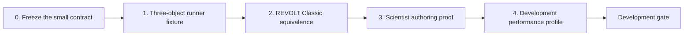

# PipeWireAO development roadmap

Status: active implementation plan

Review date: 2026-08-31

## Goal

Deliver the smallest useful RTC application: one command constructs and runs
a REVOLT Classic Calculon graph through PipeWireAO, scientists can add ordinary
typed algorithms without transport boilerplate, and the graph is demonstrably
equivalent to the maintained direct or fused implementation.

The active work ends at the non-actuating development gate. The larger former
roadmap is retained only in the [inactive design archive](archive/full-rtc/README.md).

## Starting assets

The sibling Calculon and PipeWireAO repositories already provide the intended
foundation:

- typed Calculon algorithm declarations and array-level reference behavior;
- the FGN plugin ABI and ndarray graph host;
- bounded scalar-property and ndarray-parameter publication;
- a generated REVOLT Classic graph with explicit SHWFS subaperture origins;
- simulated or FITS-compatible sources and non-actuating sinks; and
- standard PipeWire discovery plus GUI inspection surfaces.

These are starting assumptions, not evidence for the RTC gate. The first
implementation task revalidates the exact revisions and interfaces it uses.

## Delivery sequence

### 0. Freeze the small contract

- keep only the active architecture, operating contract, and roadmap in the
  maintained document set;
- use standard PipeWire relaxed SPA-JSON rather than inventing another
  configuration language;
- identify the exact current PipeWireAO and Calculon revisions; and
- map RTC-DEV-001 through RTC-DEV-009 to implementation and tests as work
  begins.

Exit evidence: the active index has no dependency on archived requirements,
all links and diagrams validate, and the implementation team can describe the
first executable without loading the archive.

### 1. Build the three-object runner fixture

- create the small Rust `pipewireao-rtc` executable;
- use Statig's blocking state-machine API, a `MANAGED` superstate, one
  serialized dispatcher, and typed effects from the first implementation;
- load one source, one minimal `fgn-native` graph, and one discard sink from a
  standard configuration;
- implement `OFFLINE`, `CONFIGURING`, `READY`, `RUNNING`, and `FAULT`;
- validate topology and initial values before streaming;
- expose the objects to standard PipeWire inspection; and
- clean up only owned objects on every failure point.

Exit evidence: one valid configuration starts, runs, stops, retries, and
unloads repeatedly; malformed configurations fail with scientific diagnostics;
unrelated PipeWire objects survive; a read-only observer is optional.

### 2. Add REVOLT Classic

- load the maintained 277-actuator complete-frame REVOLT Classic graph;
- use explicit subaperture origins;
- publish its reconstructor, references, origins, and other ndarray
  parameters through their declared parameter ports;
- apply declared scalar properties through the existing property surface;
- connect a deterministic simulated or FITS input and a non-actuating command
  sink; and
- compare every accepted output and relevant state with the direct or fused
  reference.

Exit evidence: deterministic start, stop, source end, reset, property update,
and parameter update scenarios satisfy RTC-DEV-007 at declared tolerances.

### 3. Prove scientist authoring

- remove any remaining requirement to edit a central adapter registry;
- demonstrate package-local declarations for representative stateless,
  stateful, multi-input, and ndarray-parameter algorithms;
- make errors use scientific port, property, parameter, shape, and schema
  names; and
- show that the same implementations run in ordinary array tests and can be
  consumed by a non-PipeWire graph builder.

Exit evidence: a scientist unfamiliar with SPA can add, test, compose, run,
and inspect a representative algorithm by touching only its scientific package
and graph configuration.

### 4. Characterize development performance

Performance characterization answers whether the abstraction is practical;
it does not create a real-time qualification claim.

- compare the complete-frame FGN graph with the maintained direct or fused
  REVOLT implementation using identical inputs and thread settings;
- measure warmup separately from steady state;
- retain per-frame distributions, throughput, CPU time, allocations, context
  switches, and the exact software and host configuration;
- profile enough to attribute material overhead to graph callbacks, format or
  buffer handling, operation boundaries, or algorithm work; and
- repeat after any optimization that changes the comparison.

Exit evidence: a reproducible report states the cost of the development graph,
where that cost occurs, and whether it is acceptable for continued work. It
does not claim camera-to-DM latency, fixed-arrival behavior, row-block benefit,
or correction-critical suitability.

## Requirement delivery map

| Requirement | Primary increment | Implementation | Evidence | Required evidence |
| --- | --- | --- | --- | --- |
| RTC-DEV-001 | 1 | partial | partial | Endpoint allowlist and negative physical/correction fixtures pass; live admission reaches the lower link-negotiation blocker |
| RTC-DEV-002 | 1 | partial | partial | The minimal fixture and field-by-field diagnostics pass in-process; live element, shape, schema, and format confirmation is blocked before `READY` |
| RTC-DEV-003 | 1 | partial | partial | Exact topology and cleanup pass with failure injection; the private-core fixture creates three inspectable nodes but cannot realize both links |
| RTC-DEV-004 | 1 | partial | partial | Transition, retry, invalid-command, required-object failure, and repeated-cycle tests pass; a complete live cycle is blocked before `READY` |
| RTC-DEV-005 | 2 | planned | missing | Requested/active property and parameter update tests |
| RTC-DEV-006 | 1 and 2 | partial | missing | The runner has no GUI dependency and rejects an undeclared observation; no suitable bounded non-gating sample boundary is available for attach, detach, and stall evidence |
| RTC-DEV-007 | 2 | planned | missing | Deterministic REVOLT output and state oracle |
| RTC-DEV-008 | 3 | planned | missing | Package-local declaration examples and ordinary-array tests |
| RTC-DEV-009 | 1 | partial | partial | Statig hierarchy, serialized dispatch, typed effects, effect failure, and stale-completion tests pass; the full private-core lifecycle does not pass |

Implementation and evidence state remain separate when this table is updated.
A merged implementation is not validated until its complete evidence passes
for both maintained fixtures.

### Increment 1 implementation note

The current implementation baseline is PipeWireAO
`52bd8f5fb5c2727f6ecef4c80c889e7ba0e58f7e`, the public PipeWireAO Rust
binding `14552339336209a936043d6c95f3a96bf9ac6241`, and Calculon
`3d49237b3c9f4423f120b52bd2761cd5a90f5e94`. These revisions identify the
interfaces inspected for this increment; they do not promote sibling worktree
changes to evidence.

The executable, strict relaxed SPA-JSON fixture, Statig lifecycle, fake graph
adapter, and live private-core adapter are present. The configuration rejection
matrix is in `tests/configuration.rs`; lifecycle and effect-completion coverage
is in `tests/lifecycle.rs`; deterministic object and link failure injection is
in `tests/graph_adapter.rs`; and the maintained private-core target is in
`tests/live_private_core.rs`.

The live test is intentionally ignored because the public PipeWire link factory
cannot complete the graph. Three configured nodes are created and visible, and
their adjacent ports enumerate matching ndarray media type, `F32_LE` element
type, shape `[2]`, row-major layout, and declared schemas. Creating the
graph-to-sink link reports `-EINVAL` and `Format negotiation failed`; the local
ndarray module reports `invalid ndarray filter parameter` while applying the
negotiated format. This blocks `READY`, frame processing, a complete live
lifecycle, live cleanup evidence after a successful run, and optional-observer
evidence. It is a lower PipeWireAO format-negotiation contract defect, not an
RTC configuration substitution opportunity.

The Rust binding also omits `pw_context_load_module` and
`pw_impl_module_destroy`. The runner contains a narrow ownership shim for those
two public C operations. The published binding revision still references three
retired acquisition-wire definitions; a compile-only compatibility header and
unreachable false-returning symbols keep that revision buildable until the
existing sibling fix is published.

## Development completion gate

The milestone is complete only when:

- RTC-DEV-001 through RTC-DEV-009 are implemented for the maintained fixtures;
- one command loads the REVOLT Classic development configuration;
- output and state equivalence pass for nominal frames and updates;
- repeated lifecycle and failure tests leave no owned objects behind;
- an optional observer cannot change accepted results or progress;
- scientist authoring requires no SPA or central adapter work; and
- the development performance comparison is reproducible and honestly scoped.

This gate unlocks continued algorithm and graph development. It does not
unlock physical hardware, correction, production operation, or a real-time
claim.

## Deferred capabilities

The following topics are not active work. Their previous proposals are
sequestered so they do not expand the implementation by accident.

| Capability | Archived input | Promotion trigger |
| --- | --- | --- |
| Physical camera service | [camera sessions](archive/full-rtc/camera-sessions.md) | A named camera is selected after the development gate |
| Physical DM and correction authority | [scientific command contract](archive/full-rtc/scientific-data-and-command-contracts.md) | A named non-actuating simulation has first validated the command path |
| Recording and reconstruction | [audit](archive/full-rtc/audit-and-reconstruction.md) and [operations](archive/full-rtc/operations.md) | A concrete stream-retention and recovery need is selected |
| Row-block and worker execution | [time and performance](archive/full-rtc/time-and-performance.md) | Complete-frame correctness is established and a camera-readout latency target exists |
| Julia execution service | [full operations](archive/full-rtc/operations.md) | Native execution and the scientist declaration boundary are stable |
| Remote GUI and WebAssembly | [full operations](archive/full-rtc/operations.md) | A concrete remote-operations use case exists |
| Operational lifecycle and service supervision | [full architecture](archive/full-rtc/architecture.md) and [operations](archive/full-rtc/operations.md) | A physical service or unattended deployment is selected |
| Target-host qualification | [time and performance](archive/full-rtc/time-and-performance.md) | An exact physical topology, offered load, deadline, and host are named |

Promotion is one capability at a time. The archived text must be reviewed
against current lower-level interfaces and reduced to the minimum active
contract needed for that capability; the archive is never reactivated as one
package.
