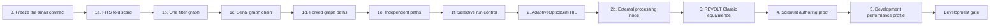

# PipeWireAO development roadmap

Status: active implementation plan

Review date: 2026-09-04

## Goal

Deliver the smallest useful RTC workstation: one command constructs a declared
non-actuating PipeWireAO session, one lifecycle runs its declared processing
nodes, scientists can add ordinary typed algorithms without transport
boilerplate, and the maintained scientific graph is demonstrably equivalent
to the direct or fused implementation.

The first executable remains deliberately small. Delivery proceeds from FITS
→ discard, through one minimal filter graph, to serial, forked, and independent
multi-graph composition. Graph authoring remains in standard PipeWireAO
`filter.graph` configuration files. PipeWire and FGN, not the RTC runner,
schedule graph execution. A GUI is a valuable optional observer and editor of
that standard configuration, never a runtime prerequisite.

The next slice connects a transport-neutral AdaptiveOpticsSim reference plant
through a separate PipeWire adapter package. A following substitution slice
allows the same RTC role to be supplied by either `fgn-native` or an external
`JuliaFilterGraph.jl` node. The RTC remains a Rust control plane and never loads
or executes Julia graph code.

The active work ends at the non-actuating development gate. The larger former
roadmap is retained only in the [inactive design archive](archive/full-rtc/README.md).

## Starting assets

The sibling Rust FGN implementation and PipeWireAO repositories already
provide the intended foundation:

- typed Algorithm declarations and array-level reference behavior;
- the FGN plugin ABI and ndarray graph host;
- bounded scalar-property and ndarray-parameter publication;
- a generated REVOLT Classic graph with explicit SHWFS subaperture origins;
- simulated or FITS-compatible sources and non-actuating sinks; and
- standard PipeWire discovery plus GUI inspection surfaces.

These are starting assumptions, not evidence for the RTC gate. The first
implementation task revalidates the exact revisions and interfaces it uses.

## Delivery sequence

```mermaid
flowchart LR
    Contract["0. Freeze the small contract"]
    Transport["1a. FITS to discard"]
    Fixture["1b. One filter graph"]
    Chain["1c. Serial graph chain"]
    Fork["1d. Forked graph paths"]
    Parallel["1e. Independent paths"]
    Control["1f. Selective run control"]
    AOSHIL["2. AdaptiveOpticsSim HIL"]
    ExternalGraph["2b. External processing node"]
    Revolt["3. REVOLT Classic equivalence"]
    Authoring["4. Scientist authoring proof"]
    Profile["5. Development performance profile"]
    Gate["Development gate"]

    Contract --> Transport --> Fixture --> Chain --> Fork --> Parallel --> Control
    Control --> AOSHIL --> ExternalGraph --> Revolt --> Authoring --> Profile --> Gate
```

### 0. Freeze the small contract

- keep only the active architecture, operating contract, and roadmap in the
  maintained document set;
- use standard PipeWire relaxed SPA-JSON rather than inventing another
  configuration language;
- identify the exact current PipeWireAO and Rust FGN implementation revisions;
- map RTC-DEV-001 through RTC-DEV-017 to implementation and tests as work
  begins.

Exit evidence: the active index has no dependency on archived requirements,
all links and diagrams validate, and the implementation team can describe the
first executable without loading the archive.

### 1. Build the RTCW foundation

Deliver these slices in order:

1. **RTC-owned FITS → discard transport fixture.** In the RTC repository's
   private PipeWireAO core, link one finite complete-frame FITS source directly
   to the maintained format-agnostic discard SPA sink through public PipeWire
   factory interfaces. Observe at least one complete buffer and clean up both
   nodes and the link while preserving an unrelated object. This is a transport
   integration preflight, not RTC-DEV-002 or RTC-DEV-004 runner evidence; the
   sibling plugin test remains only factory-level regression coverage.
2. **FITS → one graph → discard.** Use the small Rust runner, one session
   lifecycle, one minimal `fgn-native` graph, and exact declared links. This is
   the minimum RTC-DEV-002 fixture.
3. **FITS → graph A → graph B → discard.** Reuse existing `filter.graph`
   configurations, delegate their parsing to PipeWireAO, and add only the
   session-level composition needed by RTC-DEV-010.
4. **One FITS source forked to two graph → discard paths.** Create two ordinary
   PipeWire links from the declared source output, leave buffer transport and
   branch scheduling to PipeWire, and control both branches as one session.
5. **Two independent source → graph → discard paths.** Realize and control
   both paths as one session while leaving their execution to PipeWire. Inspect
   the active topology with ordinary tools and, where a bounded non-gating
   boundary exists, attach and stall an optional GUI observer.
6. **Selective execution-group control.** Declare one whole-chain group for
   the serial fixture, one group per independent path, and one group per fork
   branch while leaving the shared source session-managed. Route group stop and
   start through the existing dispatcher, preserve realized objects and
   algorithm state, and prove an unaffected group continues processing.

For the runner slices beginning with FITS → one graph → discard:

- create the small Rust `pipewireao-rtc` executable;
- use Statig's blocking state-machine API, a `MANAGED` superstate, one
  serialized dispatcher, and typed effects from the first implementation;
- load admitted sources, existing `fgn-native` filter graphs, and maintained
  discard sinks from standard configuration;
- implement `OFFLINE`, `CONFIGURING`, `READY`, `RUNNING`, and `FAULT`;
- validate topology and initial values before streaming;
- expose the objects to standard PipeWire inspection; and
- clean up only owned objects on every failure point.

Exit evidence: the RTC-owned transport preflight delivers one complete 4 by 3
U16 image-sized buffer and removes its source, link, and sink without touching
the unrelated object. It does not inspect pixel values. Every subsequent
runner fixture starts, runs, stops, restarts, retries, and unloads repeatedly;
each complete path delivers a buffer to its discard sink; malformed
configurations fail with scientific diagnostics; exact owned objects are
removed; unrelated PipeWire objects survive; and a read-only observer is
optional.

Selective-control exit evidence additionally requires rejection of unsafe
cross-group serial links, token-validated group effects through the one
dispatcher, preserved topology and state across group stop/start, live fork
and independent isolation, failure-to-`FAULT`, and session-wide cancellation
and cleanup while group work is pending.

### 2. Add the AdaptiveOpticsSim HIL reference

- keep AdaptiveOpticsSim free of PipeWireAO dependencies, extensions, buffers,
  and callbacks;
- maintain `AdaptiveOpticsSimPipeWireHIL.jl` as the narrow package that owns both
  dependencies and exposes a prepared AOS HIL boundary as one WFS-frame source
  plus one non-actuating correction-command sink;
- extend the RTC configuration with an explicit external ownership declaration
  and exact port contracts, without making the RTC interpret the external
  application's package, language, process, or private properties;
- attach the runner-owned FGN graph and links to the already-running HIL
  endpoint pair on the private core;
- preserve same-sequence command exchange and apply command `n` to simulated
  frame `n + 1` with at most one exchange in flight; and
- compare transported outputs and plant diagnostics with the maintained direct
  reference for flat and deterministic atmospheric cases.

Exit evidence: the external endpoint rejection matrix passes; both adapter
nodes are visible before load and survive failed load, retry, stop, restart, and
unload; every runner-owned graph and link is removed; the unrelated fixture
object survives; multiple complete frames close through FGN with exact
sequence causality; direct and transported results satisfy declared tolerances;
and the fixture runs without a GUI. This remains non-actuating functional
evidence, not a deadline, physical-device, or safety claim.

### 2b. Substitute an external processing node

- launch the existing `JuliaFilterGraph.jl` deployment application separately
  and publish its prepared graph through `FilterGraphPipeWire`;
- declare external object ownership and an independent session run-control
  grant in the standard configuration;
- discover the exact public PipeWire ports and link the node into the session
  without a Julia-specific runner factory, parser, or process manager;
- use the existing serialized session and execution-group effects to send
  tokened owner-mediated run-control requests through public PipeWire node
  parameters; and
- run the same scientific graph once through `fgn-native` and once through the
  external Julia node with identical inputs and declared values.

Exit evidence: both implementations satisfy the same port and schema contract;
accepted outputs and state match at declared tolerances; stop/restart preserves
the external node and algorithm state; loss, replacement, format mutation, and
command failure reach `FAULT`; retry succeeds; and unload removes only
RTC-owned links. This proves an implementation-independent RTC component, not a
runner-hosted Julia execution service.

The runner-side admission and owner-mediated control path are implemented.
Standard configuration can declare an externally owned processing graph with
explicit `session` or `application` run control. Identity admission,
ownership-safe unload, loss detection, stale-proxy cleanup, replacement retry,
and durable stop/restart pass with externally owned FGN and Julia instances.

`FilterGraphPipeWire` provides an explicit PipeWire boundary-layout option.
Its borrowed-array boundary maps multidimensional logical indices to packed
row-major transport without copying, while the scientific graph retains its
ordinary Julia array semantics. Direct adapter tests cover both rank-two index
mapping and leaky-integrator state across deactivate and reactivate.

The selected correction is the Version 1 owner-mediated PipeWireAO run-control
contract in RTC-DEV-016. PipeWireAO now provides the public request/status POD
contract and owner handling in both `fgn-native` modules and standalone ndarray
filters. The RTC sends one lifecycle token to each targeted graph and waits for
matching owner status. `PipeWireAO.jl` and `FilterGraphPipeWire` expose the
standalone owner option. The private-core matrix proves durable session and
execution-group stop/restart for native graphs and durable session stop/restart
for an externally owned Julia graph. The earlier command experiment remains
useful negative evidence:
`SPA_NODE_COMMAND_Pause` did not clear server-side active state, while
`SPA_NODE_COMMAND_Suspend` tore down negotiated buffers and failed to preserve
restartable topology.

### 3. Add the REVOLT Classic simulated plant

- keep `REVOLTClassicSim.jl` free of PipeWireAO and wrap its prepared HIL
  boundary in a separate `REVOLTClassicSimPipeWireHIL.jl` package;
- expose its 352-by-352 complete Shack–Hartmann frame source and 277-element
  HSDM277 non-actuating command sink with exact versioned schemas;
- launch the plant before RTC load and discover it as ordinary external
  PipeWire nodes;
- load the maintained 277-actuator complete-frame REVOLT Classic RTC graph;
- use explicit subaperture origins;
- publish its reconstructor, references, origins, and other ndarray
  parameters through their declared parameter ports;
- apply declared scalar properties through the existing property surface;
- connect a deterministic simulated or FITS input and a non-actuating command
  sink; and
- compare every accepted output and relevant state with the direct or fused
  reference; and
- repeat the controller role with the equivalent `JuliaFilterGraph.jl` node
  without changing the plant integration or RTC scientific contracts.

Exit evidence: deterministic start, stop, source end, reset, property update,
and parameter update scenarios satisfy RTC-DEV-007 at declared tolerances for
both RTC component implementations; the simulated plant satisfies
RTC-DEV-014 and RTC-DEV-017 without a GUI or physical authority.

The REVOLT Classic slice now discovers the external plant, realizes either
controller implementation against identical port contracts, and uses an
RTC-owned ordinary PipeWire stream for the declared sparse reconstructor
parameter link. The private-core fixture resets controller state, submits a
gain/pole transaction while stopped and a scaled reconstructor while running,
distinguishes submission from active host generations, and compares ten
commands and plant states per controller with direct references. A second
gain/pole transaction follows parameter adoption. The fixture accepts a
one-way sparse-parameter adoption during sequences 6–8, classifies each
command against its direct old and updated controller states, records the
observed previous-to-requested transition, and requires the updated state by
sequence 8. Before the numerical sequence begins, the private core separately
proves repeated live gain/pole updates and rejection of an undeclared property
for native and Julia graphs, including no generation change on rejection; a
wrong-shape reconstructor update reaches `FAULT`, `retry` rebuilds the declared
topology, and unload/reload clears the retained rejection diagnostic. It
stops a minimal graph, reloads a different serial topology, restarts, and
confirms the old objects are absent. After the tenth Classic command, the
external owner signals finite source completion to the RTC. The fixture checks
`RUNNING` → `READY`, unchanged plant and command state after that transition,
and survival of the externally owned WFS and command nodes for both
implementations. This exercises the existing lifecycle event; automatic
discovery of external source end is not implemented. A separate common-input
private-core fixture fans each of ten complete WFS frames to simultaneous
native FGN and JuliaFilterGraph nodes. It waits for two same-sequence commands,
checks both against the direct Classic oracle and each other, and then advances
the plant. Its fixed initial controller configuration does not cover simultaneous
parity through the reconstructor-adoption window. That stricter cross-controller
comparison is outside RTC-DEV-007: the host may adopt each live parameter at a
different permitted frame boundary, while each implementation is checked
against its own independent direct-reference history. The explicit external
source-end notification satisfies the development fixture's source-end case;
automatic discovery of external PipeWire end-of-stream remains a separate
possible extension.

### 4. Prove scientist authoring

- remove any remaining requirement to edit a central adapter registry;
- demonstrate package-local declarations for representative stateless,
  stateful, multi-input, and ndarray-parameter algorithms;
- make errors use scientific port, property, parameter, shape, and schema
  names; and
- show that the same implementations run in ordinary array tests and can be
  consumed by a non-PipeWire graph builder.

Exit evidence: a scientist unfamiliar with SPA can add, test, compose, run,
and inspect a representative algorithm by touching only its scientific package
and graph configuration.

Calculon's `rtc_dev_008_scientist_authoring.rs` exercises stateless,
stateful, multi-input, and ndarray-parameter declarations with borrowed arrays
and a small non-PipeWire graph executor. The production FGN bundle selects all
46 portable declarations; its C graph-host fixture names and processes their
labels without a central adapter registry edit. The ordinary-array test suite
and the ABI 7 host declaration script passed on 2026-09-29.

### 5. Characterize development performance

Performance characterization answers whether the abstraction is practical;
it does not create a real-time qualification claim.

- compare the complete-frame FGN graph with the maintained direct or fused
  REVOLT implementation using identical inputs and thread settings;
- measure warmup separately from steady state;
- retain per-frame distributions, throughput, CPU time, allocations, context
  switches, and the exact software and host configuration;
- profile enough to attribute material overhead to graph callbacks, format or
  buffer handling, operation boundaries, or algorithm work; and
- repeat after any optimization that changes the comparison.

Exit evidence: a reproducible report states the cost of the development graph,
where that cost occurs, and whether it is acceptable for continued work. It
does not claim camera-to-DM latency, fixed-arrival behavior, row-block benefit,
or correction-critical suitability.

An optional REVOLT Classic private-core harness now records raw monotonic
source Header-PTS to same-sequence command-receipt observations for both the
native FGN and external Julia controller after the maintained numerical
equivalence/update sequence. It preserves raw warmup records, reports mergeable
histograms outside the timed boundary, and retains sequence/correctness
counters. The simulated HIL exchange is one-frame completion-paced, so this
implementation is only graph-path characterization; it is not fixed-arrival,
detector-readout-overlap, PTP, physical-loop, or real-time qualification. No
fixed-arrival result is checked in. The separate
[Classic development callback report](../benchmark/CLASSIC_DEVELOPMENT_PERFORMANCE.md)
records the paired complete-frame graph/direct comparison, raw distributions,
whole-process counters, allocation differential, and profile attribution at
the narrower synchronous callback boundary.

## Requirement delivery map

| Requirement | Primary increment | Implementation | Evidence | Required evidence |
| --- | --- | --- | --- | --- |
| RTC-DEV-001 | 1 | implemented | validated | The explicit allowlists and negative physical, actuating, correction, progressive, and promoted-claim cases pass before realization; the FITS live fixture reaches `READY` and `RUNNING` without physical authority |
| RTC-DEV-002 | 1 | implemented | validated | The minimal FITS → graph → discard fixture and field-by-field diagnostics pass; the live adapter validates directions, F32_LE, shape `[2]`, row-major layout, 1000/1 rate, scientific schemas, the discard wildcard, and both links before `RUNNING` |
| RTC-DEV-003 | 1 | implemented | validated | Exact topology and ordinary introspection pass. The private-core matrix injects a one-shot failure after every runner-owned node and link creation point, removes only the partial session, preserves the unrelated node, retries to `READY`, and unloads cleanly |
| RTC-DEV-004 | 1 | implemented | validated | Transition, retry, invalid-command, required-object failure, repeated-cycle, and lifecycle-dispatch tests pass. Native and Julia graphs stop to durable live `READY` and restart without reconstructing objects or links. A non-looping FITS source publishes completion after its final buffer returns, and the sole dispatcher automatically returns `RUNNING` to `READY` |
| RTC-DEV-005 | 3 | implemented | validated | Reset, typed scalar-property updates, and typed ndarray Parameter Port publication use the one lifecycle dispatcher and standard host surfaces. The private core proves submitted-versus-active behavior for native FGN and JuliaFilterGraph REVOLT controllers. Two gain/pole transactions and a sparse reconstructor update are checked against all ten transported commands and plant states per implementation, with observed values and generations. Separate running-update cases prove two successive live gain/pole transactions and undeclared-property rejection without generation change. A minimal-to-serial structural reload preserves the lifecycle and replaces every former graph object |
| RTC-DEV-006 | 1 and 2 | implemented | validated | The private-core runner reaches and remains in its lifecycle without a GUI. A declared source output feeds the bounded PipeWireAO queue in copy/drop-oldest mode; a Julia observer attaches, holds a buffer, detaches, and reattaches while the required sink and lifecycle continue. An identical finite replay without the observer produces the same accepted buffer count, byte count, and payload digest |
| RTC-DEV-007 | 2 and 3 | implemented | validated | AdaptiveOpticsSim flat and atmospheric cases and both REVOLT Classic controllers compare transported outputs and meaningful state with direct references. The Classic fixture covers reset, two gain/pole transactions, sparse-parameter adoption, and finite external-owner source completion; the common-input Classic fixture checks ten completion-paced frames through both graphs against the direct oracle and each other. The minimal, serial, forked, and independent small-graph fixtures compare each stepped sink prefix with a direct Calculon integrator through source completion/resume, reset, and gain replacement. Focused Classic and common-input replays passed on 2026-09-29. Both Copper fixtures compare 16 clipped complete frames, five output/state boundaries, and exact delivery against a direct Calculon Algorithm path. A separate 4 + 8 conditioning + 4 frame replay per controller verifies source end, reset, atomic gain/pole/anti-windup replacement, observed reconstructor adoption, and all five measured boundaries against the direct path with zero frame or command loss; [COPPER.md](../benchmark/COPPER.md) records results and limits. Julia requires the GC-safe PipeWireAO main-loop binding and the RTC source trigger before parameter adoption |
| RTC-DEV-008 | 4 | implemented | validated | Calculon tests package-local stateless optical-gain, stateful integrator, multi-input pseudo-open-loop, and ndarray-parameter pixel-calibration declarations with ordinary arrays, a small non-PipeWire graph executor, and scientific error types. The production bundle selects all 46 portable declarations without a central adapter registry edit. The ABI 7 C graph-host fixture covers the full label inventory, including detector-frame assembly, PDM system-flat adoption, pixel-calibration readout, PWFS readout reconstruction, and SHWFS readout reconstruction. The ordinary-array tests and ABI-aware declaration script passed on 2026-09-29 |
| RTC-DEV-009 | 1 | implemented | validated | Statig hierarchy, serialized dispatch, typed effects, effect failure, stale-completion rejection, and the full private-core lifecycle pass through the same dispatcher |
| RTC-DEV-010 | 1c through 1e | implemented | validated | The exact serial, forked, and independent sessions each pass the private-core lifecycle and deliver to every sink; standard graph files are delegated unchanged and PipeWire owns branch execution. The private core injects failure after every actual owned node and link creation point and proves cleanup plus retry |
| RTC-DEV-011 | 1f | implemented | validated | Valid and invalid execution-group configurations and typed control effects pass. The private-core serial, fork, and independent fixtures use owner-mediated graph control, retain every object and link, stop delivery to the selected sink, allow other groups to advance, and resume later delivery. A one-Hz native fixture compares payload digests before and after selective group stop/restart and proves that graph state persists |
| RTC-DEV-012 | 1f | implemented | validated | Group start and stop use the one dispatcher and typed token, kind, origin, and group-target completions; mismatch, invalid request, effect failure to `FAULT`, stop/unload/required-failure supersession, late completion, retry, and repeated-cycle tests pass |
| RTC-DEV-013 | 2 | implemented | validated | The generic external source/sink matrix validates exact contracts, admitted global identities, loss, replacement, incompatible mutation, retry, ownership-safe cleanup, and unrelated-object survival. The REVOLT private-core fixture now polls required objects throughout both native and Julia frame exchanges and checks the external WFS and command node IDs before and after every exchange. Two consecutive monitored replays completed without identity loss; the provider recreates its endpoints only between the two separately unloaded RTC sessions |
| RTC-DEV-014 | 2 | implemented | validated | The separate integration package implements bounded complete-frame exchange, acquisition-to-model-time conversion, and an explicit command-response window. Its private-core suite rejects zero, stale, duplicate, future, missing, short, non-finite, wrong-shape, and wrong-schema commands without advancing the plant. The RTC SCAO fixture exchanges sequences 1 through 15 against a direct lockstep oracle; nonzero command 1 leaves frame 1 unchanged and first appears in frame 2. Both suites pass against integration-package commit `cfbcc0d` |
| RTC-DEV-015 | 2 | implemented | validated | The private-core deterministic Shack–Hartmann fixture discovers external AOS nodes, generates an ordinary centroid → reconstructor → integrator FGN graph from a directly measured interaction matrix, and completes both flat and seeded four-layer-atmosphere cases. The flat case preserves the graph across stop/restart after sequence 7 and completes sequence 15 with direct DM-surface causality and residual convergence. The atmospheric case preserves the graph across stop/restart after sequence 10 and completes sequence 20; every WFS frame, atmosphere OPD, DM-surface OPD, pupil OPD, and transported command matches its direct oracle at declared tolerances, mean closed-loop Strehl exceeds 0.5 and improves by more than 3× over open loop, and mean pupil OPD RMS improves. Both cases unload to `OFFLINE`, remove runner-owned objects, preserve external and unrelated nodes, and run without a GUI |
| RTC-DEV-016 | 2b | implemented | validated | The Version 1 public request/status POD contract, native FGN and standalone owner handling, safe Rust protocol API, `PipeWireAO.jl` flag, and `FilterGraphPipeWire` opt-in are implemented. The private core proves the same RTC configuration against externally owned FGN and Julia graphs, token-matched start/stop/restart, identity-loss fault, replacement retry for both providers, ownership-safe unload, and identical four-frame leaky-integrator payload digests at a non-overloaded 10 Hz fixture rate. Parser and RTC status tests reject malformed, future-token, conflicting, failed, and wrong-state values |
| RTC-DEV-017 | 3 | implemented | validated | The separate REVOLT Classic adapter exposes the 352-by-352 WFS and 277-element HSDM277 HIL boundary with their declared REVOLT scientific schemas. The private core runs the same plant with native FGN and JuliaFilterGraph controllers, checks ten commands and plant diagnostics per implementation against direct oracles, proves command 1 first affects frame 2, exercises reset, two gain/pole transactions, and sparse-parameter adoption at controlled frame boundaries, polls required objects throughout processing, unloads to `OFFLINE`, and removes only RTC-owned nodes and links. Two consecutive monitored replays and the adapter package tests passed |
| RTC-DEV-018 | 3b | implemented | partial | Optional per-port rates, rational link-rate validation, the exact maintained `api.ndarray.latest-hold` realization, standard Start/Pause ownership, READY-only reset ordering, and declared-source Julia Acquisition propagation are implemented. Parser, unit, adapter, and focused private-core tests cover a configured 1000 Hz Dummy Driver, a source with 100 Hz data and 1000 Hz Position cadence, exact hold publication, Acquisition provenance, contiguous sustained native/Julia command processing through the final current identity, stop/restart without replay, and cleanup. The live native/Julia replays check that the hold and both sources have the selected Dummy Driver object ID. Both replays offer identity 11 while READY after reset and identity 13 while the group is stopped; neither appears at the output. Explicit session and group restarts admit fresh identities 12 and 14, ten outputs each, with exact Acquisition and payload checks. Three driver-paced FIFO timing runs per graph owner delivered 2,000 measured slow identities and 20,000 measured commands after warmup; a separate stopped-state endpoint-pool replacement run passed. Allocation and CPU profiles are retained. Internal pool generation, live retained-sample replacement, and a direct zero-allocation callback proof remain open |

Implementation and evidence state remain separate when this table is updated.
A merged implementation is not validated until its complete evidence passes
for all maintained fixtures.

The `PIPEWIREAO_RTC_LATEST_HOLD_POOL_REPLACEMENT=1` private-core diagnostic
updates the existing slow-source and hold-observer `EnumFormat` while the hold
group is stopped. In the final native and Julia replays, each external stream
removed three buffers and added three, then fresh identity 14 reached ten held
outputs and ten matching commands after explicit restart. An earlier
source-only experiment and an initial two-update experiment stalled during
recovery; their cause is unresolved. These checks observe endpoint pool
replacement and recovery after both updates. They do not inspect the hold's
internal pool generation or replace a live retained sample. The
[latest/hold characterization](../benchmark/LATEST_HOLD_RESULTS_20260929.md)
retains three exact-delivery driver-paced baseline runs per graph owner, one
pool-replacement timing run, a failed ordinary-scheduling trace, and separate
allocation and CPU profiles. PipeWire's live Props must bypass parameter
caching for its counters to remain observable after pool replacement.
RTC-DEV-018 stays partial until internal pool generation and live retained
sample replacement are checked and allocation evidence is sufficient for its
steady-state callback claim.

RTC-DEV-010 is tracked across its independently observable surfaces:

| Surface | Implementation | Evidence | Acceptance boundary |
| --- | --- | --- | --- |
| Plural session configuration and opaque `filter.graph` delegation | implemented | validated | One or more admitted sources, graphs, sinks, and exact links load without an RTC filter-graph parser |
| Serial graph chain | implemented | validated | FITS → graph A → graph B → discard processes a frame and completes the session lifecycle |
| Forked graph paths | implemented | validated | One FITS output feeds graph A and graph B, each branch processes a frame into its own discard sink |
| Independent graph paths | implemented | validated | Two FITS sources feed separate graph and discard paths in one session |
| Whole-session failure and cleanup | implemented | validated | Fake and live creation-point failures, stop and restart, retry, unload, and unrelated-object preservation pass; the live matrix injects once after every owned node and link creation point |

### Increment 1 implementation note

The recorded validation baseline is PipeWireAO
`5558a6c44090bc37c4e1b5385047e47afc650651`, the public PipeWireAO Rust
binding `6f42bc8d6cd35e9ef7a1df032678a1fd7bfaad41`, PipeWireAO_jll
`v1.7.0+10`, PipeWireAO.jl
`6d78f8a82e9d8212a822a8264f6f4d07bf717c38`, JuliaFilterGraph
`6608097bdeab040a2cfcd8db31c6fa9d4ae0d99a`, PipeWireAO SPA plugins
`aefdf6ace2decf04ccf3ac6968d58326fd0ae1c8`, and the legacy-named
`calculon-algorithms` Rust FGN implementation at
`1d07d223d5f2d0e0e966204af4add3a960f6563a`. These revisions identify the
interfaces and artifacts used by the maintained private-core validation.
The reference-system revisions are AdaptiveOpticsSim
`d30db3f78d7fad77d0d5e9212b3eee1a34d86244`,
AdaptiveOpticsSimPipeWireHIL
`d9ff094338705ef7b7f3b83c5edf0f5a9834b94c`, REVOLTClassicSim
`e0fbdab9a5483d92fa6df5539019624d40b84f1e`, and
REVOLTClassicSimPipeWireHIL
`325c233d6fc2e74992365d134f85b8ee5bbd8755`.

The executable, standard PipeWire relaxed SPA-JSON decoder, Statig lifecycle,
fake graph adapter, and live private-core adapter are present. A narrow C shim
exposes the public `spa_json_*` cursor API missing from the Rust binding. The
runner decodes only its session objects, execution-group membership, typed
boundary ports, and exact ordinary PipeWire links. Each graph entry references
a complete standard PipeWire module-argument file; the executor reads that
file and passes it unchanged to `libpipewire-module-ndarray-filter-chain`. The
runner has no
`filter.graph` parser, algorithm model, renderer, scheduler, worker pool, or
per-graph ownership lifecycle. Selective stop/start sends Version 1
owner-mediated requests to the declared processing graphs in each whole-node
group. A passive PipeWire link isolates each fork
branch from its session-managed shared source; the live adapter verifies that
property through public link introspection. The configuration rejection matrix
is in `tests/configuration.rs`; lifecycle and effect-completion coverage is in
`tests/lifecycle.rs`; deterministic object and link failure injection is in
`tests/graph_adapter.rs`; and the maintained private-core target is in
`tests/live_private_core.rs`. Its RTC-owned FITS transport implementation is in
`tests/live_private_core/fits_discard.rs`; it does not invoke or count the
sibling repository's integration test.

The live test is intentionally ignored by the generic Cargo suite because it
requires the maintained sibling PipeWireAO and Rust FGN build artifacts. At
the recorded increment-1 revisions, its explicit invocation exercises the
requested `Load` → `READY` → `Start` → `RUNNING` → `Stop` → `READY` →
`Start` → `RUNNING` → `Stop` → `READY` → `Unload` → `OFFLINE` event sequence
for the minimal, serial, forked, and independent sessions. It also sends
owner-mediated stop and start requests to individual execution groups,
observes a short interval without new sink counters, and observes continued
delivery in unaffected groups. Token-matched owner status confirms durable
session and group stop before the RTC reports `READY`. Before admitting links,
the test enumerates the public port formats and
checks their directions, element types, shapes, layouts, rates, scientific
schemas, and every discard sink's format wildcard. It then confirms every
configured node and link through ordinary inspection, a discard-buffer
increase at every sink after each start, complete owned-object cleanup, and
preservation of an unrelated node. The native state-continuity case compares
payload digests across a selective group stop/restart boundary. The external-provider
case compares four complete output frames from the native FGN and Julia graph
implementations by their format-independent discard payload digests.

The current PipeWireAO SPA plugin working tree provides the discard scheduling
handshake, stable FITS node and output-port identities, and fixed-string
negotiation repair. Factory tests cover two distinctly named FITS instances
plus direct and `SPA_CHOICE_None`-negotiated schema strings and configured
source identities. The RTC live result uses those build-tree artifacts through
`PIPEWIREAO_SPA_PLUGINS_BUILD`; the RTC repository creates, observes, and cleans
up both its transport preflight and its FITS → graph → discard runner topology.

The FITS source publishes the read-only `fits.completed` property for a
non-looping complete-frame file. It becomes true only after the final published
buffer returns. The live adapter polls that public property outside Statig
handlers and sends a typed finite-source completion event through the sole
lifecycle dispatcher, which stops the graph and returns `RUNNING` to `READY`.

The runner pins PipeWireAO-rs revision
`6f42bc8d6cd35e9ef7a1df032678a1fd7bfaad41`. That revision accepts negotiated
fixed ndarray values represented as `SPA_CHOICE_None`, removes the retired
acquisition-wire definitions, exposes a self-destruction-aware owner for
locally loaded modules, and provides typed FITS-completion, discard-metric, and
Version 1 run-control identifiers, and the Version 1 reset-control protocol.
The live adapter uses those public APIs directly; it carries no local control
codec, copied plugin identifiers, module-lifetime shim, or retired-symbol
compatibility shim.

The bounded observation fixture uses the public PipeWireAO queue module in
`copy` and `drop-oldest` mode. Its passive source-output link is outside the
required path. The test attaches a Julia follower with a smaller independent
buffer pool, holds a buffer while the required discard sink advances, detaches,
and reattaches. A finite replay with no observer and two replays spanning the
stalled and reattached observer produce the exact expected accepted buffer
count, byte count, and payload digest. The queue nodes are removed at fixture
teardown and the unrelated object survives.

The public host and the current Rust FGN bundle now use
`SPA_FGN_PLUGIN_ABI_VERSION` 7 and a `spa_fgn_format` ending at `schema`.
PipeWire ndarray formats likewise use the schema as the authoritative payload
contract and do not carry a second interpretation-profile field. This resolves
the former ABI-layout blocker without an RTC compatibility shim. The
deterministic flat-reference SCAO path and the connected fault matrix now
satisfy RTC-DEV-014. Public-registry identity tracking and live contract
revalidation now satisfy RTC-DEV-013 for both endpoint roles from `READY` and
`RUNNING`. The deterministic 20-frame four-layer-atmosphere reference completes
with a stop/restart boundary after frame 10. It compares every transported WFS
frame, command, atmosphere OPD, DM-surface OPD, and pupil OPD with direct
oracles and gates closed-loop Strehl and pupil OPD RMS improvement. RTC-DEV-015
is implemented and validated for the maintained AdaptiveOpticsSim reference.
The SCAO graph uses the Rust FGN branch through
`4b67841`, including the committed `shack-hartmann-image-f32` graph-rebuild
`image_schema` binding from `f76b06f` and the schema-authoritative ABI-v7
adapter. The private-core test selects that exact build-tree bundle through
`PIPEWIREAO_RTC_FGN_BUNDLE` and selects the HIL integration package through
`PIPEWIREAO_RTC_AOS_HIL_PACKAGE`; it does not use installed system artifacts.

The REVOLT Classic fixture uses the separate adapter package and leaves
`REVOLTClassicSim.jl` transport-neutral. It measures a deterministic 277 by 376
control matrix, publishes it through an RTC-owned ordinary PipeWire Parameter
Port source, and runs the same Shack–Hartmann measurement, reconstruction, and
leaky integration graph once through `fgn-native` and once through an external
JuliaFilterGraph node. Both implementations compare every command and relevant
plant output against direct oracles for ten sequences, prove
command-to-next-frame causality, reset controller state, adopt updated gain
and pole at sequence 5, reconstructor during sequences 6–8, and a second
gain/pole transaction at sequence 9, and remove only
runner-owned objects on unload. The native Shack–Hartmann declaration binds
the REVOLT frame schema as a graph construction value; the CMOS readout is
not mislabeled as calibrated pixels in PDE. The fixture now polls
required objects during every frame exchange and checks the provider's WFS
and command node IDs around each exchange. The provider closes and recreates
those nodes only after the native RTC has unloaded and before the Julia RTC
loads. Two consecutive monitored replays passed on 2026-09-29. The finite
source-end fixture explicitly sends the external-owner completion event after
the tenth command and checks `READY` plus unchanged plant, command, and
external-node state; it does not claim automatic PipeWire end-of-stream
discovery for the external WFS.

## Development completion gate

The milestone is complete only when:

- RTC-DEV-001 through RTC-DEV-017 are implemented for the maintained fixtures;
- the AdaptiveOpticsSim closed-loop reference passes its direct numerical
  comparison;
- one command loads the REVOLT Classic development configuration;
- output and state equivalence pass for nominal frames and updates;
- repeated lifecycle and failure tests leave no owned objects behind;
- an optional observer cannot change accepted results or progress;
- scientist authoring requires no SPA or central adapter work; and
- the development performance comparison is reproducible and accurately scoped.

This gate unlocks continued algorithm and graph development. It does not
unlock physical hardware, correction, production operation, or a real-time
claim.

The ordinary Rust suite, the full private-core lifecycle fixture, the focused
sequential and common-input REVOLT Classic fixtures, and Calculon's
ordinary-array and ABI 7 FGN declaration-host checks passed on 2026-09-29.
The development gate is complete at the maintained non-actuating scope. Direct
numerical checks now cover every serial, forked, and independent small-graph
output, and the measured development performance report is checked in.
RTC-DEV-018 latest/hold evidence and the optional RTC-DEV-019 laboratory
placement profile are separate from this gate.

## Selected next increment: laboratory deployment profile

RTC-ARCH-019 and RTC-DEV-019 select a narrow, non-actuating profile for
repeatable HEART, FGN, and JFG latency comparisons. It is separate from the
maintained development gate and does not promote the archived operational RTC
as a whole.

The implementation order is:

1. Capture a post-install, exact-delivery Copper baseline against the merged
   `/opt/pipewireao` core and compatible HEART plugin. Preserve the 474 Hz,
   2,000 µs readout fixture and record process placement and artifact build IDs.
2. Define one role-to-process launch contract using the existing PipeWireAO
   configuration and external-owner placement interfaces. Validate CPU sets,
   RT and memory-lock permissions before launching the pixel source; capture
   actual per-thread policy after warmup.
3. Add fail-closed placement and lifecycle handling to a companion launcher.
   Keep Graph scheduling, workers, and buffer ownership in PipeWireAO, FGN,
   and the external Graph owner. Do not add another scientific graph format.
4. Qualify three independent replays per implementation and ingress mode with
   one corpus, offered schedule, numerical oracle, delivery checks, and
   first-WFS-packet and terminal-WFS-packet latency distributions. Record first-use and
   warm results separately. Only then vary one placement or memory policy at
   a time to explain a measured tail or throughput gap.

The first post-install JFG replay delivered 2,048 WFS packets, 2,048 Graph
callbacks, and 1,024 ordered DM commands at 474 Hz. Terminal-packet-to-DM
latency was 224 µs p50 and 468 µs p99. This single run establishes deployment
function, not a latency regression or a matched three-way result. Its raw
record is `/home/dgamroth/.cache/copper-merged-opt-jfg-474-20260928.json`.

The [Copper post-install baseline](../benchmark/COPPER.md) now records three
exact-delivery HEART, FGN, and JFG replays in each of row-block and full-frame
ingress at that same offered load. Every run emitted 1,024 ordered commands
and the cross-RTC command vectors agreed within 4.564 × 10⁻⁸ µm. The recorded
process envelopes passed before/after checks. This is workload and numerical
evidence, not completion of RTC-DEV-019: the current checks do not require
specific RT-thread counts or prove the declared Julia and HEART worker pins.
The FGN daemon loop was observed under SCHED_OTHER, while the JFG island loop
used FIFO83. The workstation also had unrelated CPU-saturating Julia tasks.
Strict thread placement, first-use characterization, and an uncontended
latency comparison remain in the selected increment.

The source/core ready-retry repair has since been merged to PipeWireAO
`master` (`d130d3afa`) and HEART plugin `main` (`83e3c7b`); related RTC
(`6154ad4`), JuliaFilterGraph (`7a126ec`), and Calculon/FGN algorithms
(`8361b31`) changes are merged as well. The normal `/opt/pipewireao` release
is deployed, with provenance at
`~/.cache/pipewireao-merged-ready-deploy-20260929/deployment.json`. Three
repaired 1,024-frame live-update diagnostic runs per controller (Julia and
native) passed delivery, update adoption, five-output comparison, and the
recorded diagnostic timing checks. The first installed three-way 1,024-frame ×
3 attempt failed before Julia ingress because the ignored benchmark Manifest
resolved PipeWireAO.jl 0.6.10. After resolving PipeWireAO.jl 0.6.11 with no
tracked changes, the fresh three-way baseline passed all nine reports and
9,216 ordered commands. Its [evidence](../benchmark/data/copper_merged_fullframe_baseline_20260929.json)
records exact delivery, numerical comparisons, clipping checks, and latency
phases. Diagnostic observer timing remains distinct from the packet-to-DM
wire boundary and does not establish a worst-case latency bound. Follow-up
[installed control checks](../benchmark/data/copper_merged_control_checks_20260929.json)
also passed: native and Julia each delivered 1,024 continuous-update commands
and 16 reset/restart commands, with five-output numerical agreement and zero
source drops. The live runs adopted reconstructor and gain/pole updates without
reset. Clipped control cycles exercised limiting and feedback. Source timing
is opt-in through `--live-update-timing`; normal release checks leave timing
fields null. Complete-frame correctness is established for this workload;
progressive and Classic fixed-arrival characterization remain separate.

The timer-driven Copper sender starts its clock during `wfsSimulator`
startup, before the launcher can inspect its threads. HEART's existing
`-wfs 1 -sync 1` mode has a ready semaphore and an external frame trigger.
The later opt-in [source gate](../benchmark/COPPER_GATED_SOURCE.md) uses that
interface without changing HEART. It verifies the sender and companion
pacer before releasing the first trigger and records the resulting distinct
source-clock configuration. The timer-driven results still have no
pre-ingress sender placement claim.

The managed Copper RTC runner now captures pre-ingress and post-replay thread
snapshots, maps Julia's PipeWireAO JLL to the selected installation, and defaults
to one OpenBLAS thread. Four 1,024-frame Julia runs at 474 Hz delivered every
command and matched the saved FGN vectors. An otherwise aligned eight-thread
Julia run lost commands and callbacks; the retained native RTC run passed
delivery, simulator-schedule, and vector checks. These runs identify a useful
thread-count setting for this loaded workstation. They preceded the opt-in
placement experiment below and do not meet RTC-DEV-019's latency-distribution
or first-use evidence requirements.

The managed RTC companion now accepts an opt-in host-specific thread profile.
It preflights requested CPU masks and scheduler policy, explicitly configures
the daemon data loop, pins the Julia owner's two threads through its maintained
interface, and rejects a mismatched live thread map before starting the pixel
source. One native and one Julia 1,024-frame replay at 474 Hz passed the
before/after thread checks, exact ordered delivery, offered-schedule check,
and demanded-vector comparison on 2026-09-29. The native difference from the
saved FGN vector file was zero; Julia's was 2.981 × 10⁻⁸ µm. A deliberately
incomplete RTC thread profile failed before ingress. The source process still
has no pre-ingress thread handshake. The companion launcher can now attach
the maintained Standard-DM adapter and sink outside the RTC fixture and
qualify WFS and DM UDP packets with demanded-vector equivalence. One
1,024-frame native and one Julia managed wire replay passed at 474 Hz; their
first-packet → DM p50 values were 1,164 and 1,169 µs, respectively, and
terminal-packet → DM p50 values were 166 and 171 µs. These are individual
software-boundary observations under an offered schedule, not a comparative
ranking or physical camera-to-DM result. The placement records now include
resident memory by reported kernel page size, huge-page categories, and
locked-memory amount for every inspected process, with a strict pre-ingress
failure when page backing is unavailable. At that stage, strict three-repeat,
cold-graph first-use, and progressive qualifications remained open, so
RTC-DEV-019 remains partial.

The managed complete-frame wire path subsequently passed three independent
1,024-frame runs each for native FGN and JuliaFilterGraph at 474 Hz, with the
same FITS cube, strict role profile, numerical vector reference, and packet
qualification. [Copper evidence](../benchmark/COPPER.md) retains the per-run
p50/p99 spread and raw report paths. The
[first-frame analysis](../benchmark/COPPER_FIRST_FRAME.md) now separates the
first transported command from later packet intervals in these qualified
captures. This closes the repeated managed
complete-frame delivery measurement on this host; it does not establish a
cross-implementation latency ranking because ambient load was not controlled.
Strict HEART/FGN/JFG progressive repetitions, cold-graph first-use isolation,
and source pre-ingress thread inspection remained open at that point.

An opt-in Ryzen thread profile now checks exact policy and affinity counts at
each runner's pre-ingress and post-replay boundary. It exposed the FGN daemon's
missing RT loop before pixels were sent. A separate FGN laboratory setting
now creates an eventfd data loop at FIFO83 on CPU 0. One 1,024-frame replay
per ingress mode passed the strict profile, exact delivery, and cross-RTC
numerical comparison; the raw records are linked from
[the Copper benchmark](../benchmark/COPPER.md). The workstation still had
competing CPU-saturating tasks, and the profile does not prove the identity of
each algorithm worker. Explicit loop and memory settings for the remaining
PipeWireAO processes, owner pin identity, cold-graph first-use evidence, and three
uncontended independent repetitions per mode remain open.

Three subsequent strict-profile 1,024-frame repetitions per ingress mode
qualified for HEART, FGN, and JFG, with complete WFS and Standard-DM packet
capture, exact ordered delivery, and command-vector parity. The
[repeated Copper result](../benchmark/COPPER.md) retains the manifests and
per-run latency distributions. This closes repeated strict-profile
qualification at the tested 474 Hz offered load, including row blocks. Six
CPU-saturating Julia analysis processes were observed and run order was
fixed, so these measurements do not establish an uncontended latency ranking.
Source pre-ingress thread inspection, exact Julia owner pin identity, cold
graph first-use isolation, and controlled placement/memory experiments remain
open. RTC-DEV-019 remains partial.

The opt-in gated-source path subsequently qualified one 1,024-frame
row-block and one complete-frame HEART/FGN/JFG comparison. It inspected all
live source, pacer, and wrapper threads at CPU 12 / FIFO20 before release,
recorded 1,024 rational 474 Hz trigger targets per RTC, and retained exact
WFS/DM delivery and command-vector parity. The
[gated-source report](../benchmark/COPPER_GATED_SOURCE.md) separates these
runs from the timer-driven series and retains one earlier FGN startup
failure before pixel ingress. Six unrelated CPU-saturating Julia processes
were still active. The source gate closes the pre-ingress sender-inspection
gap for this opt-in mode; cold graph first use, exact algorithm-worker pin
identity, complete explicit process memory/loop settings, and controlled
latency comparisons remain open. RTC-DEV-019 remains partial.

The Ryzen Copper profile now checks the Linux names as well as policy and
affinity of the HEART stage workers, FGN daemon loop, JFG island loop and
pinned Julia threads, and observer/adapter loops. The
[placement record](../benchmark/LAB_PLACEMENT.md) rechecks 128 historical
thread snapshots offline and records two newly gated 16-frame HEART/FGN/JFG
runs, one per ingress mode, that applied the stronger profile live. This
narrows the thread-identity gap for the selected zero-worker JFG Copper
configuration. It does not establish placement of Julia MVM shard tasks in
other configurations, nor does it close explicit memory/loop configuration,
cold graph first use, or controlled-latency evidence. RTC-DEV-019 remains
partial.

A subsequent no-offline-Graph-warmup comparison qualified one 1,024-frame
row-block and one complete-frame three-way run under the source gate and
named-thread profile. The [first-frame record](../benchmark/COPPER_FIRST_FRAME.md)
compares their transported first commands with the earlier offline-warmup
runs. It does not isolate Julia compilation because package loading and
graph preparation precede release, and competing host work remained active.
Structured startup/warmup intervals and a controlled first-use experiment
remain open under RTC-DEV-019.

The strict Copper launcher now derives the JFG island client-loop CPU and
FIFO priority from the named thread profile. The JFG runner renders and
hashes an island-only PipeWireAO client configuration with explicit eventfd
idle and `mem.mlock-all=false`. A gated 16-frame row-block replay and a
gated 16-frame complete-frame replay both qualified three-way delivery,
command comparison, and observed CPU 0 / FIFO83 island-loop placement before
and after ingress. The [evidence](../benchmark/data/copper_client_loop_evidence_20260929.json)
does not cover explicit client settings for every other PipeWireAO process,
long-run latency, or uncontended repetitions. RTC-DEV-019 remains partial.

After merging, one 1,024-frame run in each Copper ingress mode qualified
three-way WFS/DM delivery, command comparison, and strict placement. The
[packet-phase record](../benchmark/data/copper_client_loop_main_phases_20260929.json)
requalifies both captures. Six unrelated CPU-saturating Julia processes and
fixed run order still prevent a controlled cross-RTC latency ranking.
RTC-DEV-019 remains partial.

An opt-in [all-loop Copper profile](../benchmark/profiles/ryzen-6800h-copper-all-loops.json)
now drives explicit PipeWireAO daemon, island, observer, and adapter loop
settings for FGN and JFG. Two gated 16-frame three-way replays, one per
ingress mode, passed numerical and exact delivery checks and verified the
named loops before ingress and after replay. The
[placement record](../benchmark/data/copper_all_loop_evidence_20260929.json)
retains each rendered configuration hash and thread snapshot. Three gated
1,024-frame repetitions per Copper ingress mode subsequently qualified with
the local GC-safe PipeWireAO.jl binding. Each of the 18 RTC runs delivered all
frames and passed command comparison; the [phase report](../benchmark/data/copper_all_loop_local_binding_phases_20260929.json)
retains the packet timing. An earlier complete-frame attempt using installed
PipeWireAO.jl 0.6.10 stalled after 1,009 JFG commands with a Julia GC wait
cycle; its failed manifest is retained and excluded from latency summaries.
The GC-safe binding is now registered as PipeWireAO.jl 0.6.11. Longer registered
replays exposed intermittent complete-frame command loss and a final retained
input without a subsequent driver cycle; those failed captures are excluded
from latency rankings. The ready-retry handoff repair has since been merged
and deployed, repaired live-update candidate replays pass, and the resolved
installed three-way baseline passes (see [Copper evidence](../benchmark/COPPER.md)). Startup/warmup intervals,
controlled host-load repetitions, and a Classic fixed-arrival profile remain
open. RTC-DEV-019 remains partial.

## Classic four-gate characterization (2026-09-30)

The separately requested Classic comparison now resolves numerical development
acceptance, characterizes helper/layout and measured allocation boundaries,
measures repeated packet→command latency and exact-delivery capacity, and
qualifies the FITS/SPA stdWfs transport into all five selected RTC paths.
[The comparison record](../benchmark/CLASSIC.md) reports the results and
[the independent verification](CLASSIC_FOUR_GATE_VERIFICATION.md) records the
claim boundaries. Original strict numerical failures and unsuccessful captures
remain preserved. This is laboratory development evidence for the selected
science chain; it does not promote the deferred physical-device service.

All five paths pass three 1,029-frame windows at 250 Hz with exact delivery and
no 4 ms period misses. The finite higher-rate bounds separate delivery from
deadline: complete-frame FGN/JFG pass delivery at 1,250 Hz while missing that
frame-period deadline. Row diagnostics establish completed SH sensing and MVM
work during readout. The measured Julia callback bodies have zero steady-state
allocation/GC counter increments; native transport and lifecycle work remain
outside that boundary. See the linked evidence for layout, clock-model and
numerical-policy details.

The follow-up [Classic platform campaign](../benchmark/CLASSIC_PLATFORM.md)
passes all 30 normal replay windows with exact delivery and no observed
frame-period deadline misses. The common zero CPU latency request reduces
FGN/JFG tail latency and rate dependence; unchanged HEART already makes this
request when its device access succeeds. Ten separate diagnostic windows
locate the large off-condition delay before row publication and confirm
substantial completed SH/MVM work during readout. These finite laboratory
results do not add operational systemd units, core isolation, physical-device
qualification or a hard latency bound.

## Selected next increment: deployment package (2026-10-01)

RTC-ARCH-020 and RTC-DEV-020 through RTC-DEV-023 promote the bounded deployment
package requested after the Classic/Copper characterization. The implementation
order is:

1. A stopped-start option and shared bounded local control on the Rust owner.
2. Installed standard scientific configurations/calibrations and one foreground
   profile with explicit preparation, placement admission and cleanup.
3. The same launcher in systemd user units, with effective-rights preflight and
   coherent dependency failure/restart semantics.
4. Complete Classic/Copper × FGN/JFG × full-frame/row-block profile coverage and
   documented local controls, with focused functional regression evidence.

The independent [deployment review](DEPLOYMENT_REVIEW.md) identifies prerequisites
DEP-001 through DEP-006. The selected disposition accepts all six as gaps to
close for this increment. Existing five-second effect deadlines are retained
and documented; asynchronous adoption is a later design option, not an implied
100 ms control-response guarantee.

| Requirement | Implementation | Validation |
| --- | --- | --- |
| RTC-DEV-020 | implemented | all eight installed profile command-count checks passed |
| RTC-DEV-021 | implemented | foreground, native/Julia user service, fresh restart and dependency-failure cleanup passed |
| RTC-DEV-022 | implemented | bounded protocol, operator rejection, live adoption and subsequent output progress passed |
| RTC-DEV-023 | implemented | export, relocation, installation, preflight, controls and documentation checked |

[Deployment validation](DEPLOYMENT_VALIDATION.md) and its
[artifact/placement record](deployment-evidence.json) retain the evidence.
Row replay keeps calibration fixed; a progressive parameter transaction can
abandon an in-flight unit, so mutation/adoption recovery is qualified separately.
The recorded-input, non-actuating increment is complete. Physical devices,
exclusive core isolation and hard timing guarantees remain outside this claim.

After these four items, construct the live AOS/HIL deployment graph through the
existing external endpoint contracts. Do not substitute the older HIL science
fixture for the matched Classic controller. No further capacity or latency
campaign is selected for this deployment increment.

## Selected AOS/HIL increment (2026-10-01)

Baseline: RTC `1bc5eaa`, AOS `d30db3f`, Classic plant `e0fbdab`, Copper plant
`cb840cd`, adapter `e0f78f6`. Dirty parent science checkouts are preserved;
separate task checkouts supply committed sources. RTC-ARCH-021 and
RTC-DEV-024 through RTC-DEV-026 select complete-frame simulator deployment.
The existing small HIL fixtures remain historical reference evidence and do
not substitute for the maintained extrapolation/limiter/feedback controllers.

| Requirement | Allocation | Verification | State |
| --- | --- | --- | --- |
| RTC-DEV-024 | installed exporter, unchanged science, AOS plant and transport adapter | four CPU compositions, relocation, encoding/order/units and correlated finite outputs | partial: functional profiles pass; Classic exact replay localization pending |
| RTC-DEV-025 | source-owner protocol, supervised control, owner reset | quiet admission, pause/start/reset, rejection, timeout/death and cleanup | demonstrated for the selected installed and user-service profiles |
| RTC-DEV-026 | optional backend environments, AOS preparation, paced single-writer owner | CPU and available GPU checks; explicit unsupported-device failures and cadence boundaries | demonstrated for documented backend/device combinations; no hard-rate claim |

Evidence and exact limits are recorded in
[HIL_DEPLOYMENT_VALIDATION.md](HIL_DEPLOYMENT_VALIDATION.md), the
[evidence summary](HIL_DEPLOYMENT_EVIDENCE.json), and the independent
[review](HIL_DEPLOYMENT_REVIEW.md). The original exact-replay failure remains
retained; no numerical tolerance or science coefficient was changed.

Implementation order is transport encoding/units and reset, held simulator
owner, source-supervised deployment controls, installed exporter, then focused
live checks. No new HEART benchmark or capacity campaign is selected. Scientific
convergence with the provisional plant is a separate calibration acceptance
question; retain any failed or unestablished oracle rather than relabelling
functional command exchange as scientific equivalence.

### Simulated offset correction (2026-10-02)

Baseline: RTC `b950c8b`, recorded complete-frame science and unchanged installed
plant models. The user selected simulation-derived bias and offsets after
Classic's recorded background rejected all simulated subapertures. This
correction implements RTC-DEV-027 within RTC-ARCH-021. It replaces detector
backgrounds, Classic reference slopes and Copper's additive PDM flat while
retaining recorded reconstructors, projections, controller coefficients,
thresholds and masks. The deployment remains hybrid and convergence unqualified.

| Requirement | Allocation | Verification | State |
| --- | --- | --- | --- |
| RTC-DEV-027 | cold detector/reference acquisition and exporter bindings | independent ADC darks, identical FGN/JFG artifacts, invalid-flat diagnostics, installed finite exchange | demonstrated for four CPU profiles and three Copper FGN GPU profiles; no rate or convergence claim |

The original zero-command observations remain historical failed scientific
response evidence. Do not attribute a maximum Classic GPU rate to the earlier
requested 10 Hz CPU deployment checks or Copper GPU measurements.

## Selected HEART HIL bridge (2026-10-02)

Baseline: RTC `7b5bc3c`, existing installed simulated-offset profiles and
native HEART. RTC-ARCH-022 and RTC-DEV-028 select a
third scientific owner through the two existing UDP bridge factories.

| Obligation | Allocation | Acceptance evidence | State |
| --- | --- | --- | --- |
| Explicit external session and exact transport contracts | Rust config parser and existing runner | positive/negative parser tests, installed private-core admission with two exact links | implemented / finite checks passed |
| Simulated offsets and explicit command conventions | HEART exporter and existing calibration artifacts | offset FITS hashes, native config readers, exact pixel/order/conversion capture checks | implemented / physical OPD interpretation unqualified |
| Held native owner and paired reset | supervisor, HEART owner wrapper, simulator control | 32 exchanges per profile, pause/reset/restart, rejection and owned child-death fault/cleanup | implemented / finite checks passed |
| Installed CPU Classic/Copper path | portable deployment and existing SPA plugins | installed exports, 32 exact identities/commands per profile, 27 native threads and six scientific workers, cleanup | implemented / CPU finite checks passed |

The [validation record](HEART_HIL_VALIDATION.md),
[independent review](HEART_HIL_REVIEW.md) and
[evidence summary](HEART_HIL_EVIDENCE.json) describe the demonstrated finite CPU
path. Copper requires the demonstrated 2000 µs sender interval: the zero-interval
run timed out before its first command. Its mechanism and minimum safe interval
remain unresolved. This compatibility setting does not qualify physical camera
readout or progressive overlap.

GPU simulation, latency/rate characterization, scientific convergence and
HIL010 remain separate gates. Unit conversion and actuator order are verified;
physical OPD/displacement meaning and delayed-packet generation fencing remain
unqualified. RTC-DEV-028 therefore has finite functional evidence, not full
physical or scientific qualification.

## Selected operational calibration (2026-10-02)

RTC-ARCH-023 and RTC-DEV-029 select the same calibration procedure for AOS as
for an instrument: issue DM probes, settle, acquire and average detector/WFS
responses, then estimate the interaction matrix and reconstructor. This is
planned work; the installed profiles still retain measured reconstructors.
Existing noiseless REVOLT/pyRTC calibration helpers provide diagnostic
reference code, not acceptance of the deployed HEART/FGN/JFG acquisition path.

Deliver in dependency order:

1. Freeze the shared probe/response contract: physical versus virtual command
   basis, units/order, detector/exposure settings, settling, averaging and
   command/frame association. Define finite acquisition/restoration deadlines
   and abort behavior, retaining command ownership and integration hold or
   faulting the session if reference restoration is unconfirmed.
   Inventory each owner's public command emission
   and WFS readback surfaces. HEART's legacy `CALIB_INTER` handler in
   `source/template/src/hrtTemplateCmds.c` returns `Not yet implemented`;
   a declared API name alone is not support. Determine usable unchanged-HEART
   interfaces before selecting an acquisition adapter. Implemented pieces
   include legacy `DM_SHAPE` file application and WFS averaging (SH gradients
   or PWFS pixels); their support in the selected runner, output units, clipping
   and exposure association need live verification. Generated modern `DM_APPLY`
   declarations do not establish an implemented executor.
   The current AOS PipeWire adapter permits one frame followed by one matching
   correction command. Operational calibration needs DM probe adoption while
   acquisition is held, then accepted exposures after settling. Establish that
   endpoint contract explicitly; do not bypass transport or fake an exchange
   to satisfy the existing loop. RTC-DEV-029 explicitly selects held-probe,
   multiple-exposure acquisition and supersedes the fixture offset method for
   this new mode; existing finite lockstep deployments retain their contract.
2. Implement ordinary endpoint acquisition for Classic. Route probes through
   DM command output/transport and acquire measurements from each deployed WFS
   frontend, with normal detector noise and ADC encoding. Keep the coordinator
   outside processing callbacks and reuse AdaptiveOpticsCalibration.
3. Export and compare the measured interaction matrix/reconstructor under the
   configured command basis and numerical inverse policy. Adopt common arrays
   only after response agreement; retain failed measurements and rank evidence.
   Verify correction and clipping feedback before rate characterization.
4. Repeat for Copper's deployed four-pupil pixel representation and stateful
   normalization. The existing pyRTC signal representation differs and its
   matrix cannot be substituted into the current 3600-measurement graph.
5. Qualify simulator backends and achievable wall rates separately. The 2000 µs
   HEART sink setting is a sender readout budget, not a GPU frame-service bound.
   Its current timer spacing is budget divided by packet count, with packet 1
   sent immediately. The lockstep adapter currently simulates, transfers,
   receives and adopts a command serially. A 1 kHz Classic deployment also
   requires extending the present 500 Hz cadence limit and fitting exposure,
   readout and exchange work within the selected period.

Completion evidence: accepted probes and exposure associations, same operational
procedure for the simulated endpoint, measured matrices and artifact provenance
for all three owners, known noise/linearity/rank limits, and demonstrated
closed-loop correction. No physical hardware, maximum rate or scientific
convergence claim follows from the existing finite transport checks.

Plan validation (2026-10-02): independent architecture review resolved the
fixture/operational acquisition scope and held-probe contract conflicts, and
added bounded abort/restoration behavior. Local links, requirement identities,
whitespace/newlines and all changed Mermaid documents passed checks. This is
documentation evidence; operational calibration is not yet implemented.

### Completion-driven coordinator delivery

Baseline: `e82879d`, RTC-ARCH-023 and RTC-DEV-029. The selected implementation
uses one serialized calibration owner outside frame callbacks and one pending
effect. Endpoint adapters report correlated facts; a synchronous driver awaits
the same completions. Numerical probing/inversion remains owned by
AdaptiveOpticsCalibration. Existing closed-loop deployment remains unchanged.

| RTC-DEV-029 obligation | Allocation / verification | State / remaining gate |
| --- | --- | --- |
| Hold ordinary integration and command ownership | Coordinator hold/release effects; rejection and failure tests | Core implemented; deployed owner controls missing |
| Adopt probes, then establish settling | Correlated adoption and settling completions; applied-command, deadline and cursor checks | Core implemented; held-probe AOS adapter missing |
| Associate post-settling WFS exposures | Bounded completed batches with acquisition generation, sequence and exposure intervals; stale/duplicate/early-frame rejection | Core implemented; graph WFS batch readback missing |
| Abort, restore and prevent unsafe resumption | Fenced restoration and release completions; cancellation/timeouts/failure tests | Core implemented; endpoint fencing and deployment fault integration missing |
| Synchronous usage | Blocking endpoint driver sharing the event coordinator; no sleep-based success | Core implemented; requires independent event-serving context |
| Background/reference acquisition, AOC matrices and exports | Operational detector/WFS adapters and calibration client | Missing; no operational matrix claim |
| Classic/Copper, HEART/FGN/JFG, CPU/CUDA/AMDGPU | Live endpoint qualification and numerical/correction checks | Missing; coordinator tests do not qualify endpoints |

Implemented acquisition core: [calibration module](../src/calibration.rs),
[focused tests](../tests/calibration.rs) and
[independent review](CALIBRATION_COORDINATOR_REVIEW.md). The core has no installed
calibration command or operational endpoint adapters. Thus RTC-DEV-029 remains
partial: synthetic completions establish coordinator behavior, not endpoint
compliance, scientific calibration or closed-loop correction.

Coordinator verification (2026-10-02): 19 focused tests, 79 default workspace
tests and 115 live-feature workspace tests passed; three environment-dependent
live tests remained ignored. Formatting and live-feature all-target Clippy with
`-D warnings` passed. The existing `proc-macro-error2` future-incompatibility
warning remains. Independent source/test review found no blocking findings.
Isolated fault reproductions for spare-capacity accounting and retained
restoration status failed the regression tests; corrected source passed the
same tests. These were temporary source variants, not historical release runs.
Changed Mermaid documents, local links, whitespace/newlines and requirement
identities passed documentation checks. Exact checks, source/test hashes,
limitations and remaining gates are recorded in the
[evidence summary](CALIBRATION_COORDINATOR_EVIDENCE.json). No runtime or test
change was made to HEART, FGN, JFG or the AOS adapter in this slice.

### Initial calibration endpoint increment (in progress)

Baseline `6482fdd`; isolated RTC branch `work/operational-calibration-20261002`.
The selected design uses independent ordinary WFS
and PDM constraint graphs. The normal correction graph is unstarted and absent
from the command topology. No new scientific algorithm or controller-coefficient
change is needed; preservation of a running integrator remains a later gate.

| Component | Observed evidence | Remaining gate |
| --- | --- | --- |
| Graph asset export | [Exporter](../deployment/export_calibration.py) preserves selected full-frame Classic/Copper FGN/JFG WFS and command node declarations, startup arrays and source provenance; all four exports checked. Four native graphs prepared against a private installed core with exact ports, including Classic validity; no frames or run requests | Assets have no runnable deployment descriptor; native live processing and actual WFS acquisition remain unqualified |
| Julia graph preparation | Both WFS and command graphs prepared with the real owner for Classic and Copper; no connection was made | Live response acquisition and numerical agreement |
| Validity transport | RTC configuration and live format validation admit `BOOL8` alongside F32/U16 data; mismatched links and non-F32 runtime parameters still reject | Actual linked Classic validity delivery |
| Completion IPC | [Unix stream endpoint](../src/calibration_socket.rs) queues bounded requests without I/O in submit; eight focused socket tests include kernel queue saturation and late adoption during restoration | Serialized operational server, restoration fences and deployment fault integration |
| AOS held-probe boundary | Separate boundary advances probe and exposure identities independently; CPU algorithm-graph selector passes 596 assertions, including inference, zero warmed allocations and alias rejection | GPU qualification and deployed scientific acquisition |
| Held-probe transport | Private-core fixture passes 278 assertions: delayed first probe, returned-buffer reuse, exhaustion recovery without another model step, 16 exposures plus reset and four further exposures, full-identity completion fences | Actual deployed WFS collection and command/clipping feedback; operational session and estimator |
| Calibration session and estimator | Existing WFS/constraint algorithms and AdaptiveOpticsCalibration retain their ownership | Operational backgrounds/references, associated responses, AOC matrices, installation and correction checks; unchanged HEART interface qualification |

The graph exporter retains historical offset claims without promoting them to
operational acquisition. It excludes the additional system-flat stage because
prepared absolute probes contain the reference already. Source publications do
not acknowledge WFS completion. The new adapter must fence the complete identity
before another exposure and must retain probe wire tokens across reset.

RTC checks in this increment: 88 default workspace tests and 124 live-feature
tests passed, with three environment-dependent live tests ignored. Deployment
Python checks: 124 discovered, 123 passed and one unconfigured existing generator
matrix skipped. Live-feature all-target Clippy and formatting passed. These are
software checks, not operational calibration or cadence qualification.

The return/redequeue fixture reproduced two native stream ownership defects.
PipeWireAO `42fdf86f4` clears the returned loan flag, releases Busy ownership only
for output and preserves the loan if insertion fails. Identical output/input
regressions fail before and pass after; nine existing stream/ndarray regressions
also pass. The independently reviewed fix is merged and pushed to owned master
and installed in `/opt/pipewireao`, with unchanged exported symbol names/types.
A released JLL artifact must include it before artifact-only calibration is
accepted. The AOS boundary (`8b6364c`) and HIL adapter (`2731227`) are committed
on development branches; the original dirty AOS checkout remains untouched.

The adapter's offline checks pass 364 assertions and Aqua passes 11. Independent
review closes readiness-refresh and no-buffer retry findings at the software
transport level. The installed-matrix Python rerun passes 123 tests and skips
one unselected normal exporter generator matrix; the unconfigured discovery run
passes 122 and skips both matrices. Exact hashes, original failures, review
dispositions and remaining gates are recorded in the
[endpoint evidence](CALIBRATION_ENDPOINT_EVIDENCE.json). No operational
calibration server, interaction matrix or correction qualification is claimed.

The next gate is actual multi-output WFS response acquisition. Source inspection
confirms that the native FGN Classic and Copper frontends declare the detector
image as metadata source for every response output, and PDM constraints declare
the requested figure as source for both demanded and feedback outputs. The
shared FGN metadata copy requires complete matching negotiated records. JFG's
generic adapter has per-output propagation; deployed WFS association must still
be checked independently for each engine before acknowledging an exposure.

### Deployed calibration acquisition increment (in progress)

Baseline `cfa36b0`; isolated branch `work/calibration-acquisition-20261002`.
Classic is first. Generic prepared ndarray producers and one-exposure consumers
belong to PipeWireAO.jl; this deployment composes the ordinary WFS and PDM
constraint graphs. The AOS adapter retains the plant boundary and provides an
owner-side hook to arm consumers with the actual exposure identity before
publication. It also retains the received command's original Float32 wire values
for adoption evidence, avoiding a multiply/divide round trip through metre OPD.

| Delivery obligation | Planned acceptance | Current state |
| --- | --- | --- |
| Actual WFS outputs and constraint feedback | All output identities, durations and requested-minus-demanded feedback agree before exposure acknowledgement | Observed for Classic CPU FGN and JFG; clipped 0.9 → 0.8 µm OPD and fresh zero restoration verified |
| Serialized bounded endpoint and command | Existing Rust coordinator drives hold, adoption, settling, collection, restoration and release; missing acknowledgements retain ownership | Private-core and installed FGN/JFG full cycles complete; invalid quality and clipping abort with confirmed restoration. Current installed full runs include normal release, public stop/quit and observed child exits zero |
| Normal detector calibration | Dark, reference and interaction acquisitions traverse the raw ADC transport; detector noise and ADC settings remain enabled | Classic operational dark/flat/reference captures observed; explicit simulated eligibility selects 184 of 188 positions while retaining intrinsic validity. Automatic campaign/export and Copper remain open |
| FGN/JFG agreement | Identical recorded exposures, parameter arrays and absolute probes; explicit Float32 tolerance and clipping acceptance | Current installed full runs verify all 1663 actual ADC frames and individual WFS outputs bit for bit, all 208,304 accepted response values and matching 376 × 277 matrices. An earlier installed full JFG run differs and lacks raw captures; its cause remains unattributed. Independent noisy calibration repeatability is a separate gate |
| AOC estimation and correction | Associated accepted measurements produce matrices, provenance and an accepted reconstructor; installed graph demonstrates correction | Current AOC 0.17 reproduces both private-core and installed physical-command matrices bit for bit; deployment export validates. Small-probe noise identified. Precision acceptance, 221-coordinate command-map composition, reconstructor and correction remain open |
| Copper, unchanged HEART and accelerators | Repeat functional/scientific gates before separately measuring cadence | Missing; helper transport tests do not qualify these endpoints |

The interaction acquisition will use an explicitly stationary calibration
illumination with zero uncompensated OPD and the production detector. This is a
calibration condition, not a noise-free physics shortcut. Independent noisy
acquisitions can differ statistically; comparing both engines on the same raw
exposures isolates their algorithmic agreement. Every failure must fence pending
publication and collection before restoration or close. A faulted plant instance
cannot silently clear its failure and resume.

The full-cycle and noise-discrimination evidence is recorded in
[calibration acquisition validation](CALIBRATION_ACQUISITION_VALIDATION.md).
Matched processing was established for this Classic acquisition increment;
scientific reconstructor acceptance and automatic campaigns were then open, as
were unchanged HEART,
Copper and accelerator/cadence qualification remain open. RTC-DEV-029 stays
partial.

## Deferred capabilities

The following topics are not active work. Their previous proposals are
sequestered so they do not expand the implementation by accident.

| Capability | Archived input | Promotion trigger |
| --- | --- | --- |
| Physical camera service | [camera sessions](archive/full-rtc/camera-sessions.md) | A named camera is selected after the development gate |
| Physical DM and correction authority | [scientific command contract](archive/full-rtc/scientific-data-and-command-contracts.md) | A named non-actuating simulation has first validated the command path |
| Recording and reconstruction | [audit](archive/full-rtc/audit-and-reconstruction.md) and [operations](archive/full-rtc/operations.md) | A concrete stream-retention and recovery need is selected |
| Remote GUI and WebAssembly | [full operations](archive/full-rtc/operations.md) | A concrete remote-operations use case exists |
| Physical operational lifecycle and authority | [full architecture](archive/full-rtc/architecture.md) and [operations](archive/full-rtc/operations.md) | A named physical service and its authority contract are selected |
| Target-host qualification | [time and performance](archive/full-rtc/time-and-performance.md) | An exact physical topology, offered load, deadline, and host are named |

Promotion is one capability at a time. The archived text must be reviewed
against current lower-level interfaces and reduced to the minimum active
contract needed for that capability; the archive is never reactivated as one
package.

### Automatic Classic CPU campaign increment

Baseline `dccb179`; isolated branch `work/calibration-campaign-20261002`.
The [campaign usage](CALIBRATION_CAMPAIGN_USAGE.md) provides the maintained
CLI and explicit example recipe. Fresh dark, lamp training, independent
frozen-reference qualification and zonal interaction sessions now complete
through the public installed FGN and JFG launchers. All stages confirm
reference restoration, ownership release, public stop/quit and cleanup. AOC
owns the batch numerical methods; RTC publishes five candidate artifacts
without modifying an active calibration.

The selected campaigns derive 184 of 188 eligible positions without forcing
a count, pass the declared 0.1-pixel held-out mean-reference bound and produce
byte-identical dark/reference/mask/interaction artifacts. Dark and training
payloads also match. Four held-out raw frames differ between separate runs;
associated WFS values differ, and the paired comparison preserves its failed
exact-trajectory result. Source-input/transport attribution is unresolved for that historical run.
A subsequent instrumented FGN qualification checks all 18 source/sink frames
and all 16 capture payloads exactly. Its 16 raw/slopes/flux/validity records
match the earlier JFG corpus byte for byte, establishing processing parity on
shared inputs without attributing the historical divergence.

[Validation](CALIBRATION_CAMPAIGN_VALIDATION.md) and the
[evidence record](CALIBRATION_CAMPAIGN_EVIDENCE.json) retain both successful
functional results and original failures. At the campaign increment, exact
trajectory characterization, precision/linearity/observability, 277→221
coordinate composition, reconstructor/correction acceptance, Copper, unchanged
HEART calibration and GPU/cadence checks were open. The subsequent quality
increment below records the finite Classic gates closed since that baseline.

### Classic measured-calibration quality and selectable methods, 2026-10-03

The finite Classic CPU quality gates now have independently reviewed evidence:
two measured 277-coordinate sweeps, exact composition through the existing
221-coordinate completion maps, frozen TSVD validation/locked test, and
non-actuating correction in both FGN and JFG. The initial selected inverse retains 186
modes at unchanged controller settings. Shared-input complete-graph command
differences and clipping feedback are explicitly recorded; correction uses
verified replay/baseline evidence, including the fresh JFG live OPD witness.
Historical failed JFG ADC replay reports remain unaccepted and their cause
remains open. See [quality validation](CALIBRATION_QUALITY_VALIDATION.md) and
[independent review](CORRECTION_ANALYSIS_REVIEW.md).

The maintained selectable method owner adds zonal, complete Hadamard, supplied
modal and spatial sine/cosine preparation through public AOC. Chronological
receipts are validated before reordering. The reverse-modal deployed smoke
passed restoration, release and shutdown and published an explicitly unaccepted
directional candidate. [Usage](CALIBRATION_METHOD_USAGE.md),
[review](CALIBRATION_METHOD_COMPARISON.md) and
[method measurements](CALIBRATION_METHOD_VALIDATION.md) distinguish this
workflow evidence from scientific method selection. The bounded dense-pattern
confirmation was followed by two complete sweeps for each family. All candidate
bytes, receipts and finite forward scores passed independent re-estimation.
Precision, energy and acquisition time differ under the declared settings;
spatial 64 remains a partial span. The subsequent
[fresh frozen decision](CALIBRATION_METHOD_SELECTION.md) compares ten inverses,
selects a 206-mode Hadamard candidate and passes its separate locked response
corpus and deployed FGN/JFG correction checks at unchanged settings. Shared-input
complete-graph agreement and requested/demanded/feedback outputs are recorded.
The baseline remains preserved; the new payload is admitted only in explicitly
staged comparison packages. The JFG detector replay discrepancy remains
unattributed despite exact live OPD witness verification.

RTC-DEV-029 remains partial for its full selected scope: Copper, unchanged
HEART, accelerator acquisition, physical endpoints, instrument acceptance and
wall-cadence qualification are not established by the finite Classic CPU
results. No ideal optical output entered calibration estimation; direct OPD
witnesses are optional correction diagnostics only.

### Copper operational capture increment, 2026-10-03

The [bounded capture extension](COPPER_CALIBRATION_CAPTURE.md) now records
Copper's raw 64×64 ADC, 4×900 reconstruction pixels and current mean intensity
through the normal noisy deployed acquisition path. Explicit profile dispatch
and validation preserve Classic's contract. Copper requires at least one
completed discarded exposure after each adoption because its normalization
uses the previous successful frame. Capture and collect enforce this rule,
including collection without optional capture storage.

Installed FGN and JFG CPU checks each completed one discarded exposure, four
captured exposures and a fresh reference-restoration exposure. All recorded
ADC and WFS payloads match byte for byte; both runs confirmed restoration,
release, public shutdown and owned-process cleanup. The first attempt's stale
RTC release-binary rejection is retained separately and was resolved by
rebuilding existing main, with no validator change. See the
[independent review](COPPER_CALIBRATION_CAPTURE_REVIEW.md) and
[evidence ledger](COPPER_CALIBRATION_CAPTURE_EVIDENCE.json).

This closes only Copper capture admission and functional transport. Its full
campaign, reference-centering/adoption, 277→253 composition, interaction matrix,
inverse acceptance and correction are still open. Historical offset fixtures
and provisional detector/DM settings remain explicitly identified. Cold stage
times are recorded separately from model-time exposure settings; wall cadence,
unchanged HEART calibration, accelerator acquisition and physical qualification
remain open under RTC-DEV-029.
