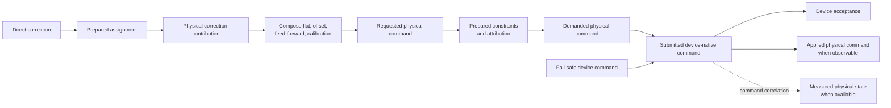

# PipeWireAO RTC scientific data and command contracts

Status: proposed normative companion contract

Approval blockers for physical correction or an explicit simulated conformance
profile:

- RTC-DM-007 requires a versioned, bounded PipeWireAO command-stage identity,
  publisher-binding, predecessor, and result carrier; and
- RTC-DM-008 requires a versioned PipeWireAO/device-boundary correction-
  authority grant, renewal, revocation, expiry, and observed-state contract.

Neither lower-level contract exists yet. They do not block a development graph
whose output is an ordinary ndarray consumed by a non-actuating sink.

Review date: 2026-08-31

## Authority and applicability

This document defines the adaptive-optics meanings that must remain stable
across Calculon algorithms, execution-composite ports, artifact manifests, the headless RTC
application, deformable-mirror (DM) device plugins, operator clients, and run
records. It owns:

- quantities, encoded units, coordinate frames, bases, signs, and
  normalization compatibility;
- the distinction among controller output, requested, demanded, fail-safe,
  submitted, accepted, applied, and measured DM values;
- command constraint outcomes and feedback attribution.

Applicability follows RTC-OPS-006. RTC-DATA requirements apply to every graph
that claims the corresponding scientific compatibility. RTC-DM requirements
apply when a value is selected as a DM contribution or command stage. A
development graph may terminate at an ordinary command-vector observation or
non-actuating sink without claiming the physical command stages. Physical
correction selects the complete applicable DM contract; a lower capability
profile cannot waive it.

The [PipeWireAO RTC architecture](architecture.md) owns system
topology, lifecycle, correction authority, configuration classes, recording,
and process placement. The [ndarray filter-graph contract](https://github.com/DarrylGamroth/PipeWireAO/blob/master/doc/dox/internals/filter-graph-ndarray.md)
owns port-format validation and publication mechanics. The
[acquisition metadata contract](https://github.com/DarrylGamroth/PipeWireAO/blob/master/doc/dox/internals/acquisition-metadata.md) owns acquisition
identity and time fields. The
[audit and reconstruction contract](audit-and-reconstruction.md) owns protected
operation progression, event identity, terminal disposition, durability, and
safe replay. Device plugins remain authoritative for what their hardware APIs
actually submit, accept, report as applied, or measure.

PipeWire and SPA can carry these meanings through schemas, formats, metadata,
properties, parameters, and introspection. They do not define the scientific
meaning of a `Float32` vector or prove that a device acknowledgement represents
physical motion. These are PipeWireAO contracts layered on the generic APIs.

Uppercase requirement terms use the meanings defined by BCP 14 (RFC 2119 and
RFC 8174). Lowercase forms are ordinary prose.

## Scientific terms

| Term | Meaning |
| --- | --- |
| Quantity | Physical or algorithmic meaning, such as detector signal, centroid displacement, wavefront slope, optical-path difference, surface displacement, modal coefficient, or actuator drive. |
| Encoded unit | Unit used by one concrete schema, such as detector digital number, photoelectron, pixel, radian, metre, volt, DAC count, or one. |
| Coordinate frame | Named origin, axes, orientation, handedness, and coordinate units in which a product is expressed. |
| Basis | Ordered vector or modal basis, including its normalization and sign convention. |
| Normalization | Declared mapping to a numerical representation using a named reference, divisor, scale, norm, or full-scale definition. |
| Display unit | Checked client-side presentation conversion. It does not change the port, artifact, or command contract. |
| Direct correction | Controller output in the compact correction space owned by the scientific controller. |
| Physical correction contribution | Direct correction mapped through the prepared assignment into the physical DM vector space. |
| Physical command domain | One identified actuator vector space and safety boundary, or one explicitly coupled set of such devices, for which requested and demanded commands are atomic. |
| DM command authority | The one admitted bounded owner that composes contributions and commits requested and demanded commands plus proposal-to-demand results for a physical command domain. Its placement is a deployment choice; it is distinct from the RTC lifecycle authority, scientific contribution producers, and the device's truthful result publisher. |
| Command-stage identity | A command-publisher incarnation UUID, command-stage kind, and nonzero unsigned 64-bit sequence that identify one immutable proposal, requested command, demanded command, fail-safe selection, device submission, or device-result observation. |
| Correction-authority grant | One device-safety-boundary-owned, time-bounded permission for an admitted DM command authority to submit demanded correction commands in one physical command domain. It is distinct from RTC lifecycle state and from a command-stage identity. |
| Requested physical command | Complete composed physical DM vector before command constraints. |
| Demanded physical command | Authoritative post-constraint physical vector selected by the DM command authority for device submission. Its decision record remains immutable if the device safety boundary later submits a fail-safe command. |
| Fail-safe device command | Separately identified command selected by the device safety boundary while correction authority is absent, revoked, or expired. It does not alter or impersonate the last demanded physical command. |
| Submitted device-native command | Exact representation passed to the device API after any declared native conversion or quantization. |
| Device-accepted command | Command the device API reports as accepted. Acceptance does not by itself prove physical application. |
| Applied physical command | Physical command state reported as applied under a qualified device contract. |
| Measured physical state | Independent metrology or device measurement. It is never inferred from software submission or acceptance. |

## Numerical meaning and compatibility

### RTC-DATA-001 — Numerical meaning is part of the contract

Every correction-relevant port, property, parameter, and artifact MUST identify
its quantity, encoded unit, coordinate frame or layout, basis, sign, and
normalization wherever those concepts affect compatibility. A primitive type
and shape are not sufficient to make two scientific values compatible.

The fixed Calculon execution-composite scientific schema MAY resolve this
information through a versioned descriptor rather than repeating strings in
every buffer. The `fgn-native` and `julia-runtime` profiles MUST project the
same portable semantic identity. Unknown or incompatible descriptor identities
MUST be rejected during preparation or format negotiation. The repeated data
path MUST NOT perform dynamic unit lookup, string interpretation, or generic
conversion.

Verification intent (informative): construct equal-shaped `Float32` ports with
different units, bases, coordinate frames, and normalization descriptors and
verify rejection before operation begins.

### RTC-DATA-002 — Explicit transformation boundaries

A change of quantity, unit, coordinate frame, basis, sign, or normalization
MUST have one declared transformation owner and prepared numerical contract.
The transformation MAY be an explicit graph node or fused into a qualified
algorithm, but its input and output semantic contracts MUST remain distinct
and testable against an unfused reference.

Verification intent (informative): compare fused and decomposed versions of
each selected transformation and verify equivalent outputs, identities, units,
and failure behavior.

### RTC-DATA-003 — Normalization contract

A normalized value MUST declare:

- its input quantity and domain;
- the reference, divisor, norm, scale, or full-scale mapping;
- whether that reference is static, prepared, or computed per acquisition;
- output range and saturation behavior;
- zero, near-zero, negative, non-finite, and invalid-input behavior;
- normalization or calibration generation when applicable; and
- whether an inverse physical estimate is supported.

An implementation MUST publish the declared invalid or degraded outcome when a
data-dependent normalizer is unusable. It MUST NOT silently substitute another
normalizer or imply physical units that the selected calibration cannot
establish.

Verification intent (informative): test zero and near-zero denominators,
saturation, NaN, infinity, stale generation, and unavailable inverse mapping.

### RTC-DATA-004 — Matrix and prepared-artifact compatibility

A matrix or other large ndarray artifact MUST identify the exact semantic
input and output contracts in addition to dimensions and storage layout. A
reconstructor for normalized slopes MUST NOT consume angular slopes merely
because both input vectors have the same extent. Artifact preparation MUST
validate its declared quantities, units, bases, layouts, normalization,
element representation, storage order, provenance, and numerical validity
limits.

Verification intent (informative): exchange same-shaped artifacts with one
semantic field changed and verify graph-wide transaction rejection with the
prior active generation retained.

### RTC-DATA-005 — Change classification

Replacing numerical coefficients while preserving the exact input and output
contracts MAY use bounded parameter publication. Changing quantity, encoded
unit, coordinate frame, basis, sign, normalization kind, schema, or vector
ordering MUST be treated as structural graph configuration: revoke correction,
drain, prepare a coherent deployment generation, validate, and re-admit it.

A display-unit change is client-local and MUST NOT create an RTC deployment or
algorithm-property change.

Verification intent (informative): exercise coefficient replacement,
calibration replacement, semantic-contract replacement, and display conversion
and verify the distinct activation paths.

## Deformable-mirror command semantics

The command path preserves separate scientific and device meanings even when a
particular simulator or instrument produces numerically identical vectors.

The device-result edges are conditional observations. Acceptance, application,
and measurement are not inferred from one another.

### RTC-DM-001 — Distinct command stages

The command authority, device boundary, recorder, and operator clients MUST
preserve the distinct identities of direct correction, physical correction
contribution, requested physical command, demanded physical command, submitted
device-native command, fail-safe device command, device acceptance, applied
physical command, and measured physical state whenever those stages exist.

A component MUST NOT label submission or acceptance as applied physical state
unless the qualified device contract establishes that meaning and its effective
time. It MUST NOT label a model prediction as measured physical state.

Verification intent (informative): use a simulated device that independently
delays, rejects, quantizes, applies, and measures commands; verify that each
surface reports only the stage it owns.

### RTC-DM-002 — Compatible contribution composition

Every admitted physical command domain MUST identify exactly one DM command
authority, its process and graph placement, its complete input-contribution set,
and its failure and recovery policy. Only that authority MAY commit the
domain's requested or demanded physical command and proposal-to-demand result.
Scientific controllers and other producers submit identified contributions;
they do not become additional command authorities. A placement change MUST NOT
change scientific contribution semantics and requires a new deployment.
The device safety boundary MAY submit a separately identified fail-safe device
command while correction authority is absent, revoked, or expired, but it MUST NOT commit,
rewrite, or relabel a requested or demanded physical command and does not become
a second proposal-to-demand authority.

Every contribution summed into one requested physical command MUST use the
same quantity, encoded unit, physical vector space, layout, basis, sign,
normalization, and unavailable-actuator policy. Each selected contribution
MUST have one owner, a finite prepared slot, a freshness rule, and a declared
participation and priority policy.

An incompatible contribution MUST pass through an explicit prepared
transformation before composition. The command authority MUST NOT add, for
example, an optical-path-difference vector directly to normalized device
drive.

Verification intent (informative): test flat, RTC correction, engineering
offset, feed-forward, and calibration contributions independently and in every
selected combination; reject semantic mismatch before changing demanded state.

### RTC-DM-003 — Prepared constraints and attribution

A physical DM deployment MUST prepare and identify every selected command
constraint, including its equation, units, participating actuator set,
evaluation order, carried state, terminal policy, and numerical tolerance.
Missing mandatory constraint data MUST prevent readiness; a constraint MUST
NOT be silently disabled because its artifact is absent.

When a constraint changes a requested command, the command authority MUST
attribute the change to the responsible contribution or contributions. Only
the part attributed to the RTC correction may become feedback that changes
controller history. Limits caused by a flat, engineering offset, or another
authority MUST remain observable without being misrepresented as correction
error.

Verification intent (informative): exercise actuator range, slew,
inter-actuator difference, common-mode, command-power, health, and non-finite
policies in the configured order; verify requested-minus-demanded attribution
and the direct-space feedback oracle.

### RTC-DM-004 — Terminal command result

The command authority MUST produce one terminal proposal-to-demand result for
every admitted direct-correction proposal. That result MUST contain the
proposal identity, causal acquisition reference, assignment and constraint
generations, demanded-command identity when one was committed, constraint
attribution, and one outcome:

- `DemandedUnchanged`: a demanded physical command was committed and equals
  the requested physical command under the selected constraints;
- `Limited`: constraints changed the request and committed an admissible
  demand;
- `Rejected`: no demand was committed for the proposal;
- `Held`: no new demand was committed and the command authority retained its
  previously demanded command; or
- `Failed`: device or command-path policy requires lifecycle fault handling.

`DemandedUnchanged` and `Limited` prove a demanded-command decision, not device
acceptance or physical application. A later device result retains the proposal
and demanded-command linkage but remains a separate observation and MUST NOT
replace the proposal-to-demand disposition. `Failed` applies only when no
earlier terminal proposal-to-demand result exists; a device failure observed
after such a result follows the device and lifecycle fault contracts.

Retries or repeated publication MAY reproduce the same identified terminal
result, but MUST NOT create a second disposition for the proposal. Before
admitting a proposal, the critical path MUST have finite capacity for its
required demand and terminal result, or it MUST reject or hold without changing
authoritative state.

Verification intent (informative): exhaust every output capacity, inject each
constraint and device outcome, and verify one disposition, no partial commit,
bounded recovery, and stable identity under retry. Prove that
`DemandedUnchanged` is not displayed or recorded as device acceptance.

### RTC-DM-005 — Controller-history policy

The selected controller contract MUST state whether its history commits at
calculation, demanded-command commit, device acceptance, qualified application,
or another explicit terminal boundary. It MUST define behavior for missing,
duplicate, stale, mismatched, rejected, held, limited, and late results.

The RTC MUST NOT claim that controller history tracks applied physical state
unless a bounded result path actually supplies that state. A stateful Calculon
operation that cannot roll back MAY remain fused with its command authority or
use an explicit unit-delay/result contract; the selected execution profile
MUST NOT hide an implicit feedback edge.

Verification intent (informative): run every terminal result and timeout
through the controller reference and verify the declared history commit, hold,
rollback, or fault behavior without accepting the next dependent proposal
early.

### RTC-DM-006 — Physical-effect truth

The device plugin MUST publish the most specific truthful observation its
hardware supports and MUST document whether it represents API submission,
queue admission, device acceptance, reported application, electrical
read-back, predicted optical effect, or measured optical effect. The RTC
application and GUI MUST preserve that qualification.

An independent device watchdog or safety boundary MUST remain able to revoke or
expire correction authority and submit its declared fail-safe device command
even if the RTC application, PipeWire daemon, or scientific graph fails. It
MUST publish that intervention with its own identity, cause, exact physical or
device-native command, and truthful device-result stages; it MUST NOT rewrite
or relabel the last demanded physical command. The resulting device observation
and fault MUST retain the last relevant demanded, fail-safe, and deployment
identities when available.

Verification intent (informative): terminate each process at every command
stage and verify safe-state behavior plus honest final observation semantics.

### RTC-DM-007 — Command-stage identity and causal linkage

Before its first command-stage publication, each scientific proposal producer,
DM command authority, and device or fail-safe publisher MUST allocate a fresh
UUIDv4 command-publisher incarnation identity from the operating system's
cryptographically secure random source outside the correction-critical path.
The binding owner MUST reject a collision with any retained publisher identity.
The publisher MUST allocate a separate unsigned 64-bit sequence for each
command-stage kind that it publishes, beginning at one and incrementing without
wrap. A restart, loss of sequence continuity, or replacement that cannot prove
continuity MUST use a new publisher identity. Before exhaustion, the publisher
MUST prepare and publish a new incarnation or stop accepting work; it MUST NOT
wrap. Representation follows RTC-OPS-004.

Before a receiver treats a stage from that publisher as admitted, the resolved
deployment or device-safety profile MUST bind the publisher identity to its
authenticated process or source incarnation, exact producer role, physical
command domain, permitted stage kinds, and applicable deployment or independent
fail-safe scope. This binding and its finite receiver capacity MUST be published
outside the correction-critical path. A receiver MUST reject an unbound,
wrong-process, wrong-domain, or wrong-stage publisher even when its UUID and
sequence are otherwise well formed. Replacing a singleton command authority
MUST record an ordered predecessor, successor, and cutover and MUST NOT permit
both to initiate demands concurrently. Retirement prevents new work from the
old publisher but MUST retain its bounded in-flight records until their
required terminal or indeterminate dispositions are consumed.

One command-stage identity MUST bind one immutable canonical payload or result,
physical command domain, applicable deployment and command-contract
generations, and causal context. The applicable command-contract generation
MUST identify the versioned canonical encoding used for duplicate-content
comparison. Delivery retry retains the identity and payload; reuse with changed
content MUST be rejected. Identity construction on the repeated path MAY
increment a preallocated local or lock-free counter and fill fixed metadata,
but MUST NOT allocate memory, call a random source, take an unbounded lock, or
perform I/O.

Every demanded-command record MUST reference the proposal or bounded
contribution set from which it was composed. Every device submission MUST
reference exactly one demanded-command identity or fail-safe-command identity.
A device acceptance, application, rejection, read-back, or other result MUST
reference its exact submission identity when the device contract can establish
that link; otherwise it MUST publish the observation with its own identity and
mark the submission link unknown rather than infer it from time or value
equality. An independent measurement likewise retains its own observation
identity and links to a command only under a qualified causal measurement
contract. Command-stage identity does not replace acquisition, request,
operation, authority-epoch, run, or deployment identity.

RTC-DM-007 is not ready for approval until the lower PipeWireAO contract
defines the exact bounded buffer-metadata, port, parameter, or event-record
carriers for command-stage identity, authenticated publisher binding, finite
contribution predecessors, demanded or fail-safe submission linkage, device
results, explicit unknown links, reconnect, and loss. A command vector MUST NOT
borrow `SPA_META_Acquisition` fields as its command-stage identity merely
because it is acquisition-derived.

Verification intent (informative): reorder, duplicate, delay, and drop every
stage; restart each publisher with child sequences repeated; retry one identity
with equal and changed payloads; exhaust a stage sequence; and remove device
correlation support. Inject an unbound, wrong-process, wrong-domain, wrong-stage,
colliding, and overlapping-singleton publisher. Verify unique complete
identities, authenticated bindings, immutable retry, explicit predecessor links
or unknown linkage, bounded old-publisher terminalization, no stale-result
match, no repeated-path allocation or random call, and stop-before-wrap
behavior.

### RTC-DM-008 — Fenced correction-authority grant

Every physical command domain MUST have exactly one admitted device-safety
boundary that enforces correction authority and publishes its observed state.
Only that boundary MAY create, renew, revoke, or expire a correction-authority
grant, and at most one grant MAY be active for a domain. The RTC application is
the only lifecycle owner that may request a grant or renewal, but a request or
transport acknowledgement is not proof that the grant is active. The RTC MUST
report `CORRECTING` only after it observes the matching active grant, and it
MUST NOT report an open-loop or safely revoked result until it observes the
grant inactive or has qualified independent expiry evidence.

The initial operational profile admits exactly one correction-required physical
command domain. Several physical devices MAY participate only when the
deployment models them as one explicitly coupled domain behind one atomic
command and safety boundary. A deployment with several independently granted
correction domains MUST remain unavailable for `CORRECTING` until a separately
approved atomic authority-set contract defines all-or-none activation,
revocation, partial-failure behavior, and command gating; sequential independent
grants are not an atomic substitute. The causal activation event of the one
observed grant is the semantic entry boundary for `CORRECTING`; later delivery
of a lifecycle projection does not move that boundary.

The deployment MUST enumerate each authenticated fail-safe source permitted to
request revocation, including applicable camera or strict-island watchdogs and
the RTC application. Such a source can only shorten or end the current grant;
it cannot create, replace, renew, or lengthen one. The device-safety boundary
MAY also revoke autonomously on any admitted interlock or coverage failure. An
unknown revocation requester MUST be rejected and reported without changing
the rule that loss of required coverage causes independent expiry.

Each grant MUST have a fresh, nonreused UUIDv4 identity allocated outside the
correction-critical path by the device-safety boundary. Its immutable record
MUST bind the physical command domain; authenticated device-safety process or
hardware incarnation; active RTC authority epoch, run, and deployment
generation; admitted DM command-authority publisher identity and command-
contract generations; grant operation identity; boundary-local monotonic grant
observation and initial expiry; maximum duration; and renewal policy. Each
successful renewal MUST append a separate immutable record containing its
request and operation identities, grant-scoped renewal sequence, boundary-local
receipt observation, and resulting expiry. Revocation or expiry MUST append one
terminal record and reason without rewriting either the grant or renewal
records. Record publication MUST use pre-admitted bounded audit capacity and
MUST NOT delay enforcement; publication loss leaves an explicit audit gap and
does not extend the grant. UUID and counter representation follows RTC-OPS-004.
The boundary MUST
reject a collision with retained grant identities and a request for a stale
epoch, run, deployment, command publisher, or command contract.

The enforcement boundary MUST authenticate the RTC-OPS-001 holder for grant
and renewal requests and MUST check the active grant identity and admitted
demanded-command publisher at every correction submission before the SDK or
hardware accepts it. An RTC authority epoch carried in a request is correlation
data, not sufficient authorization by itself. A duplicate, stale, reordered,
wrong-grant, wrong-publisher, or post-expiry command or renewal MUST NOT extend
authority or reach the correction device path. A replacement grant MUST have
an ordered non-overlap boundary; it MUST NOT make two command authorities valid
concurrently. A command-publisher rotation or replacement MUST revoke the grant
that names the prior publisher; the binding is immutable, and admitting the
successor requires a new grant.

The active-grant check, expiry state, admitted publisher binding, and fail-safe
command needed by the device submission path MUST be prepared in fixed-capacity
storage outside that path and published with a race-free bounded mechanism.
Each command-path check MUST be bounded and allocation-free and MUST NOT perform
filesystem or network I/O, take an unbounded lock, or wait for the RTC. A grant
or renewal update MUST NOT expose a mixed identity, publisher, or expiry.

Expiry MUST be enforced by a named monotonic clock and execution or hardware
boundary that remains effective for the admitted failure cases, including RTC,
PipeWireAO daemon, connection, scientific-graph, and device-safety-process loss;
the last case requires the admitted hardware or external safety mechanism. Its
maximum grant duration, renewal cadence, detection and fail-safe-command
deadlines, clock-failure outcome, and independently enforced device action MUST
be admitted and bounded. The renewal sequence MUST start at one, increment
without wrap within one grant, and use the grant identity as its parent scope.
A transport retry of an already consumed renewal sequence and request identity
MUST return the retained outcome without extending expiry again. A new renewal
MAY advance expiry only from an authenticated current-grant request received
before the prior expiry and only within the admitted maximum; it MUST NOT revive
an expired or revoked grant. Sequence exhaustion MUST revoke the grant before
wrap; any successor requires a new grant identity. Revocation, expiry, coverage
loss, or departure from `CORRECTING` MUST prevent new demanded correction
submissions and select the declared RTC-DM-006 fail-safe behavior independently
of RTC progress. Restart or reconnect MUST begin with no correction grant and
MUST require complete deployment readmission; observed streaming or a prior
grant record MUST NOT restore one.

RTC-DM-008 is not ready for approval until the lower PipeWireAO and device-
boundary contract defines the exact grant, renewal, revoke, observed-state,
reason, ordering, authentication, command-carrier, reconnect, and compatibility
surfaces for the initial simulated and physical DM profiles.

Verification intent (informative): delay, duplicate, reorder, forge, and lose
grant, renewal, revoke, and demanded-command messages; restart every RTC,
daemon, command-authority, and device-boundary process; stop renewal at every
point around expiry; inject monotonic-clock and watchdog-coverage failure; and
attempt two overlapping authorities. Verify one observed grant per domain,
source-side rejection of every stale or unbound command, no lifecycle claim
from submission alone, bounded independent expiry and fail-safe selection, and
no automatic correction after restart or reconnect. Reject several
independently granted correction domains in the initial profile and verify one
coupled-domain grant activates and revokes all of its devices atomically. Race
renewal and revocation against command submission while checking for no mixed
grant state, no repeated-path allocation or blocking, and preprepared fail-safe
action.

## Operator and scientist boundaries

Scientists continue to declare typed Calculon inputs, outputs, properties,
parameters, and construction values. They do not implement these transport,
audit, device, or real-time publication rules. Generated declarations bind the
scientific schema identities to portable execution-composite descriptors;
profile adapters project those descriptors without scientist duplication, and
deployment tooling binds layouts, artifacts, constraints, and devices.

### RTC-DATA-006 — Client presentation preserves scientific meaning

Operator clients MAY convert declared encoded units into display units, but
they MUST preserve the underlying quantity, stage, generation, and provenance.
A generic panel named only `DM command` is insufficient when requested,
demanded, fail-safe, submitted, accepted, applied, or measured values are
simultaneously available. The GUI MUST display correction authority separately
from node streaming state and device acceptance.

Verification intent (informative): display two same-shaped quantities and every
available DM command stage with and without a checked display-unit conversion;
verify unambiguous labels, unchanged underlying values and identities, and
separate correction-authority and streaming indications.

## PipeWireAO mapping

The contract uses existing PipeWireAO extension points rather than replacing
PipeWire:

- exact Calculon scientific schemas identify the semantic contracts of internal
  algorithm ports in every execution profile;
- generic SPA ndarray formats carry element type, shape, layout, rate, schema,
  and device-boundary profile identity where applicable;
- scalar properties and large ndarray parameter ports preserve their existing
  activation classes;
- instrument and artifact manifests resolve layouts, bases, units,
  normalization, constraints, and qualified device mappings before readiness;
- acquisition metadata and graph generations provide the causal join fields;
- DM device plugins publish their own truthful submission, acceptance,
  application, read-back, and fault status; and
- the RTC application joins those observations into lifecycle, audit, run, and
  operator projections without entering the frame-processing path.
