# PipeWireAO RTC scientific data and command contracts

Status: proposed normative companion contract

Review date: 2026-08-29

## Authority and applicability

This document defines the adaptive-optics meanings that must remain stable
across Calculon algorithms, FGN ports, artifact manifests, the headless RTC
application, deformable-mirror (DM) device plugins, operator clients, and run
records. It owns:

- quantities, encoded units, coordinate frames, bases, signs, and
  normalization compatibility;
- the distinction among controller output, requested, demanded, submitted,
  accepted, applied, and measured DM values;
- command constraint outcomes and feedback attribution.

The [PipeWireAO RTC architecture](architecture.md) owns system
topology, lifecycle, correction authority, configuration classes, recording,
and process placement. The [ndarray filter-graph contract](https://github.com/DarrylGamroth/PipeWireAO/blob/master/doc/dox/internals/filter-graph-ndarray.md)
owns port-format validation and publication mechanics. The
[acquisition metadata contract](https://github.com/DarrylGamroth/PipeWireAO/blob/master/doc/dox/internals/acquisition-metadata.md) owns acquisition
identity and time fields. The
[audit and reconstruction contract](audit-and-reconstruction.md) owns protected
operation progression, event identity, terminal disposition, durability, and
safe replay. Device plugins remain authoritative for what their hardware APIs
actually submit, accept, report as applied, or measure.

PipeWire and SPA can carry these meanings through schemas, formats, metadata,
properties, parameters, and introspection. They do not define the scientific
meaning of a `Float32` vector or prove that a device acknowledgement represents
physical motion. These are PipeWireAO contracts layered on the generic APIs.

Uppercase requirement terms use the meanings defined by BCP 14 (RFC 2119 and
RFC 8174). Lowercase forms are ordinary prose.

## Scientific terms

| Term | Meaning |
| --- | --- |
| Quantity | Physical or algorithmic meaning, such as detector signal, centroid displacement, wavefront slope, optical-path difference, surface displacement, modal coefficient, or actuator drive. |
| Encoded unit | Unit used by one concrete schema, such as detector digital number, photoelectron, pixel, radian, metre, volt, DAC count, or one. |
| Coordinate frame | Named origin, axes, orientation, handedness, and coordinate units in which a product is expressed. |
| Basis | Ordered vector or modal basis, including its normalization and sign convention. |
| Normalization | Declared mapping to a numerical representation using a named reference, divisor, scale, norm, or full-scale definition. |
| Display unit | Checked client-side presentation conversion. It does not change the port, artifact, or command contract. |
| Direct correction | Controller output in the compact correction space owned by the scientific controller. |
| Physical correction contribution | Direct correction mapped through the prepared assignment into the physical DM vector space. |
| Requested physical command | Complete composed physical DM vector before command constraints. |
| Demanded physical command | Authoritative post-constraint physical vector selected for device submission. |
| Submitted device-native command | Exact representation passed to the device API after any declared native conversion or quantization. |
| Device-accepted command | Command the device API reports as accepted. Acceptance does not by itself prove physical application. |
| Applied physical command | Physical command state reported as applied under a qualified device contract. |
| Measured physical state | Independent metrology or device measurement. It is never inferred from software submission or acceptance. |

## Numerical meaning and compatibility

### RTC-DATA-001 — Numerical meaning is part of the contract

Every correction-relevant port, property, parameter, and artifact MUST identify
its quantity, encoded unit, coordinate frame or layout, basis, sign, and
normalization wherever those concepts affect compatibility. A primitive type
and shape are not sufficient to make two scientific values compatible.

The fixed FGN scientific schema MAY resolve this information through a
versioned descriptor rather than repeating strings in every buffer. Unknown or
incompatible descriptor identities MUST be rejected during preparation or
format negotiation. The repeated data path MUST NOT perform dynamic unit
lookup, string interpretation, or generic conversion.

Verification intent (informative): construct equal-shaped `Float32` ports with
different units, bases, coordinate frames, and normalization descriptors and
verify rejection before operation begins.

### RTC-DATA-002 — Explicit transformation boundaries

A change of quantity, unit, coordinate frame, basis, sign, or normalization
MUST have one declared transformation owner and prepared numerical contract.
The transformation MAY be an explicit graph node or fused into a qualified
algorithm, but its input and output semantic contracts MUST remain distinct
and testable against an unfused reference.

Verification intent (informative): compare fused and decomposed versions of
each selected transformation and verify equivalent outputs, identities, units,
and failure behavior.

### RTC-DATA-003 — Normalization contract

A normalized value MUST declare:

- its input quantity and domain;
- the reference, divisor, norm, scale, or full-scale mapping;
- whether that reference is static, prepared, or computed per acquisition;
- output range and saturation behavior;
- zero, near-zero, negative, non-finite, and invalid-input behavior;
- normalization or calibration generation when applicable; and
- whether an inverse physical estimate is supported.

An implementation MUST publish the declared invalid or degraded outcome when a
data-dependent normalizer is unusable. It MUST NOT silently substitute another
normalizer or imply physical units that the selected calibration cannot
establish.

Verification intent (informative): test zero and near-zero denominators,
saturation, NaN, infinity, stale generation, and unavailable inverse mapping.

### RTC-DATA-004 — Matrix and prepared-artifact compatibility

A matrix or other large ndarray artifact MUST identify the exact semantic
input and output contracts in addition to dimensions and storage layout. A
reconstructor for normalized slopes MUST NOT consume angular slopes merely
because both input vectors have the same extent. Artifact preparation MUST
validate its declared quantities, units, bases, layouts, normalization,
element representation, storage order, provenance, and numerical validity
limits.

Verification intent (informative): exchange same-shaped artifacts with one
semantic field changed and verify graph-wide transaction rejection with the
prior active generation retained.

### RTC-DATA-005 — Change classification

Replacing numerical coefficients while preserving the exact input and output
contracts MAY use bounded parameter publication. Changing quantity, encoded
unit, coordinate frame, basis, sign, normalization kind, schema, or vector
ordering MUST be treated as structural graph configuration: revoke correction,
drain, prepare a coherent deployment generation, validate, and re-admit it.

A display-unit change is client-local and MUST NOT create an RTC deployment or
algorithm-property change.

Verification intent (informative): exercise coefficient replacement,
calibration replacement, semantic-contract replacement, and display conversion
and verify the distinct activation paths.

## Deformable-mirror command semantics

The command path preserves separate scientific and device meanings even when a
particular simulator or instrument produces numerically identical vectors.

```mermaid
flowchart LR
    Direct["Direct correction"]
    Assign["Prepared assignment"]
    Contrib["Physical correction contribution"]
    Compose["Compose flat, offset,<br/>feed-forward, calibration"]
    Requested["Requested physical command"]
    Limits["Prepared constraints<br/>and attribution"]
    Demanded["Demanded physical command"]
    Native["Submitted device-native command"]
    Accepted["Device acceptance"]
    Applied["Applied physical command<br/>when observable"]
    Measured["Measured physical state<br/>when available"]

    Direct --> Assign
    Assign --> Contrib
    Contrib --> Compose
    Compose --> Requested
    Requested --> Limits
    Limits --> Demanded
    Demanded --> Native
    Native --> Accepted
    Accepted --> Applied
    Applied --> Measured
```

The last two edges are conditional observations, not inferred facts.

### RTC-DM-001 — Distinct command stages

The command authority, device boundary, recorder, and operator clients MUST
preserve the distinct identities of direct correction, physical correction
contribution, requested physical command, demanded physical command, submitted
device-native command, device acceptance, applied physical command, and
measured physical state whenever those stages exist.

A component MUST NOT label submission or acceptance as applied physical state
unless the qualified device contract establishes that meaning and its effective
time. It MUST NOT label a model prediction as measured physical state.

Verification intent (informative): use a simulated device that independently
delays, rejects, quantizes, applies, and measures commands; verify that each
surface reports only the stage it owns.

### RTC-DM-002 — Compatible contribution composition

Every contribution summed into one requested physical command MUST use the
same quantity, encoded unit, physical vector space, layout, basis, sign,
normalization, and unavailable-actuator policy. Each selected contribution
MUST have one owner, a finite prepared slot, a freshness rule, and a declared
participation and priority policy.

An incompatible contribution MUST pass through an explicit prepared
transformation before composition. The command authority MUST NOT add, for
example, an optical-path-difference vector directly to normalized device
drive.

Verification intent (informative): test flat, RTC correction, engineering
offset, feed-forward, and calibration contributions independently and in every
selected combination; reject semantic mismatch before changing demanded state.

### RTC-DM-003 — Prepared constraints and attribution

A physical DM deployment MUST prepare and identify every selected command
constraint, including its equation, units, participating actuator set,
evaluation order, carried state, terminal policy, and numerical tolerance.
Missing mandatory constraint data MUST prevent readiness; a constraint MUST
NOT be silently disabled because its artifact is absent.

When a constraint changes a requested command, the command authority MUST
attribute the change to the responsible contribution or contributions. Only
the part attributed to the RTC correction may become feedback that changes
controller history. Limits caused by a flat, engineering offset, or another
authority MUST remain observable without being misrepresented as correction
error.

Verification intent (informative): exercise actuator range, slew,
inter-actuator difference, common-mode, command-power, health, and non-finite
policies in the configured order; verify requested-minus-demanded attribution
and the direct-space feedback oracle.

### RTC-DM-004 — Terminal command result

Every admitted direct-correction proposal MUST receive one target-authored
terminal result with the proposal identity, causal acquisition reference,
assignment and constraint generations, demanded-command identity when one was
committed, constraint attribution, and one outcome:

- `Accepted`: demanded equals requested under the selected constraints;
- `Limited`: constraints changed the request and committed an admissible
  demand;
- `Rejected`: no demand was committed for the proposal;
- `Held`: the previously demanded safe command remains authoritative; or
- `Failed`: device or command-path policy requires lifecycle fault handling.

Retries or repeated publication MAY reproduce the same identified terminal
result, but MUST NOT create a second disposition for the proposal. Before
admitting a proposal, the critical path MUST have finite capacity for its
required demand and terminal result, or it MUST reject or hold without changing
authoritative state.

Verification intent (informative): exhaust every output capacity, inject each
constraint and device outcome, and verify one disposition, no partial commit,
bounded recovery, and stable identity under retry.

### RTC-DM-005 — Controller-history policy

The selected controller contract MUST state whether its history commits at
calculation, demanded-command commit, device acceptance, qualified application,
or another explicit terminal boundary. It MUST define behavior for missing,
duplicate, stale, mismatched, rejected, held, limited, and late results.

The RTC MUST NOT claim that controller history tracks applied physical state
unless a bounded result path actually supplies that state. A stateful Calculon
operation that cannot roll back MAY remain fused with its command authority or
use an explicit unit-delay/result contract; the FGN host MUST NOT hide an
implicit feedback edge.

Verification intent (informative): run every terminal result and timeout
through the controller reference and verify the declared history commit, hold,
rollback, or fault behavior without accepting the next dependent proposal
early.

### RTC-DM-006 — Physical-effect truth

The device plugin MUST publish the most specific truthful observation its
hardware supports and MUST document whether it represents API submission,
queue admission, device acceptance, reported application, electrical
read-back, predicted optical effect, or measured optical effect. The RTC
application and GUI MUST preserve that qualification.

An independent device watchdog or safety boundary MUST remain able to revoke
or replace demanded commands even if the RTC application, PipeWire daemon, or
scientific graph fails. The resulting device observation and fault MUST retain
the last relevant command and deployment identities when available.

Verification intent (informative): terminate each process at every command
stage and verify safe-state behavior plus honest final observation semantics.

## Operator and scientist boundaries

Scientists continue to declare typed Calculon inputs, outputs, properties,
parameters, and construction values. They do not implement these transport,
audit, device, or real-time publication rules. Generated declarations bind the
scientific schema identities to FGN descriptors; deployment tooling binds
layouts, artifacts, constraints, and devices.

Operator clients MAY convert declared encoded units into display units, but
they MUST preserve the underlying quantity, stage, generation, and provenance.
A generic panel named only `DM command` is insufficient when requested,
demanded, accepted, applied, or measured values are simultaneously available.
The GUI MUST display correction authority separately from node streaming state
and device acceptance.

## PipeWireAO mapping

The contract uses existing PipeWireAO extension points rather than replacing
PipeWire:

- exact FGN scientific schemas identify the semantic contracts of internal
  algorithm ports;
- generic SPA ndarray formats carry element type, shape, layout, rate, schema,
  and device-boundary profile identity where applicable;
- scalar properties and large ndarray parameter ports preserve their existing
  activation classes;
- instrument and artifact manifests resolve layouts, bases, units,
  normalization, constraints, and qualified device mappings before readiness;
- acquisition metadata and graph generations provide the causal join fields;
- DM device plugins publish their own truthful submission, acceptance,
  application, read-back, and fault status; and
- the RTC application joins those observations into lifecycle, audit, run, and
  operator projections without entering the frame-processing path.
