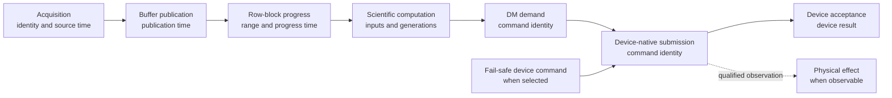

# PipeWireAO RTC time, causality, and performance

Status: proposed normative companion contract

Approval blockers for capabilities that select the affected semantics:

- RTC-FRAME-004 requires a versioned PipeWireAO/FGN output or adoption-record
  carrier for each applicable scoped active generation-set identity; and
- RTC-CAUSAL-001 requires a versioned bounded multi-acquisition join carrier
  for any profile whose authoritative product depends on more than one
  acquisition identity.

Neither carrier exists yet. They do not block a single-source, complete-frame
`development` graph that makes no protected-adoption, reconstruction, or
multi-acquisition claim.

Review date: 2026-08-31

## Authority and applicability

This document defines the system-level time, causal-order, frame-boundary,
deadline, replay-timing, and performance-evidence contracts for a PipeWireAO
real-time controller (RTC). Applicability follows RTC-OPS-006: declared time
domains and complete-frame semantics apply when their values are interpreted;
multi-acquisition, progressive, replay, deadline, and performance clauses apply
when the deployment selects or claims those capabilities. RTC-PERF requirements
are promotion evidence, not prerequisites for an unqualified development
graph. When a clause applies, it applies equally to every selected Calculon
execution profile, including `fgn-native` and `julia-runtime`.

PipeWire supplies graph scheduling, buffers, metadata carriage, and object
state. It does not by itself define which physical acquisition caused an
output, when an entire scientific frame is complete, whether a timestamp is
comparable with another clock, or what a latency percentile proves. Those are
adaptive-optics system semantics and therefore belong above the generic
PipeWire scheduler.

Adjacent authorities remain:

| Document | Authority |
| --- | --- |
| [PipeWireAO RTC architecture](architecture.md) | System ownership, topology, lifecycle, correction authority, deployment, and roadmap. |
| [Acquisition metadata](https://github.com/DarrylGamroth/PipeWireAO/blob/master/doc/dox/internals/acquisition-metadata.md) | `SPA_META_Acquisition` ABI, acquisition identity, exposure timing, and multi-host join fields. |
| [Ndarray filter graph](https://github.com/DarrylGamroth/PipeWireAO/blob/master/doc/dox/internals/filter-graph-ndarray.md) | FGN graph-cycle execution, property and parameter publication, worker ownership, and plugin ABI. |
| [Row-block ndarrays](https://github.com/DarrylGamroth/PipeWireAO/blob/master/doc/dox/internals/row-block-ndarrays.md) | Row-block formats, markers, assembly, and per-frame discontinuity behavior. |
| [Progressive wavefront processing](https://github.com/DarrylGamroth/PipeWireAO/blob/master/doc/dox/internals/progressive-wavefront-processing.md) | Progressive scientific aggregation, fixed-worker processing, and all-or-nothing frame publication. |
| [RTC operational architecture](operations.md) | Execution-composite profiles, Julia provider preparation and attestation, candidate activation, protected updates, and failure supervision. |
| [RTC audit and reconstruction](audit-and-reconstruction.md) | Protected-operation event identity, terminal disposition, durability, and run reconstruction. |

Uppercase requirement terms use the meanings defined by BCP 14 (RFC 2119 and
RFC 8174). Lowercase forms are ordinary prose.

## Terms

| Term | Meaning |
| --- | --- |
| Acquisition identity | The exact `(domain, generation, sequence)` tuple defined by `SPA_META_Acquisition`. |
| Source time | Time assigned by the acquisition authority to the physical or simulated observation. |
| Progress-publication time | Time at which a producer makes one row range or other progressive unit safely observable. It is not source time. |
| Arrival time | Time at which a receiving boundary observes an item. It includes preceding scheduling and transfer delay. |
| Monotonic measurement clock | A clock that cannot move backward and is used for local durations and deadlines. |
| Synchronized epoch time | A qualified cross-system time, such as PTP-derived TAI, used for correlation and archive queries. It is not a local deadline clock. |
| Clock-mapping key | A mapping-authority incarnation identity, ordered source and target time-domain identities, and unsigned 64-bit mapping generation that resolve to one immutable mapping record. |
| Semantic event time | Time supplied as an explicit input when passage of time affects authoritative behavior. |
| Graph-cycle boundary | The start of one execution-composite graph cycle at which the selected profile may adopt prepared property and parameter plans. In `fgn-native`, this is the start of one FGN process call. |
| Fully completed frame boundary | The causal point after all work and publication for one frame is terminal and before work for the next frame is admitted. Within-frame row-block batches may overlap before this terminal fence. |
| Service time | Time spent executing one admitted operation, excluding prior queue residence. |
| Schedule lateness | Difference between a scheduled arrival or execution time and when it was actually admitted or started. |
| End-to-end latency | Duration between two explicitly named events across the complete claimed path. |

## Causal path

The identities and time observations required for a useful end-to-end account
are shown below. An implementation may fuse stages, but it must preserve the
semantic distinctions.

### RTC-TIME-001 — Declared time domains

Every externally visible RTC timestamp MUST have a declared time domain,
unit, and measurement point through its field definition, negotiated metadata,
or versioned record schema. A field named only `timestamp` is insufficient.
Acquisition-derived buffers MUST use the acquisition metadata contract rather
than inventing another frame timestamp field.

Verification intent (informative): inspect every admitted metadata and event
schema; reject records with an unknown timebase; verify that source,
publication, arrival, and effect observations cannot be confused by a reader.

### RTC-TIME-002 — Monotonic deadlines

The owner of a local timeout, duration, or deadline MUST evaluate it with one
named monotonic measurement clock. Synchronized epoch time MUST NOT extend,
shorten, or move a previously admitted local deadline when the epoch clock is
corrected. A clock discontinuity or reset MUST produce a typed health or fault
observation according to the deployment policy.

Verification intent (informative): step the epoch clock while a deadline is
pending and prove that its monotonic terminal boundary does not change; inject
a monotonic-clock failure through the supported test clock and verify the
declared safe outcome.

### RTC-TIME-003 — Cross-domain mapping

Software that compares observations from different clock domains MUST use an
identified clock-mapping key whose immutable record contains its direction,
coefficients or transformation, validity interval, uncertainty bound,
observation method, and health evidence. The mapping owner MUST allocate a
fresh UUIDv4 mapping-authority incarnation identity from the operating system's
cryptographically secure random source before its first publication and after
every restart or loss of sequence continuity. Within that identity
and ordered domain pair, it MUST allocate mapping generations from one,
increment without wrap before any mapping record changes, and never reuse a
generation. Before exhaustion it MUST publish a new authority incarnation or
stop with visible mapping loss. UUID and counter representation follows
RTC-OPS-004; zero means no mapping is available.

Before admission, the deployment MUST bind each permitted mapping-authority
identity to its authenticated process, device, or timing-service incarnation;
provider role; ordered domain pair; observation method; and applicable mapping
policy. The binding owner MUST reject a collision with any retained authority
identity. A consumer MUST reject a mapping from an unbound, wrong-incarnation,
or wrong-domain provider even when the UUID and generation are well formed. A
replacement authority uses a new identity and an explicit predecessor and
cutover record; overlapping qualified records are usable only under the
deterministic selection rule below, not because arrival order chooses one.

A consumer MUST cite the complete mapping key, apply only a record whose
validity interval covers the compared observations and whose uncertainty meets
the admitted limit, and use the deployment's deterministic selection rule when
more than one qualified record overlaps. It MUST preserve observations in their
original domains when no valid mapping exists, and MUST NOT publish a cross-
domain latency claim after mapping loss or when uncertainty exceeds the
admitted limit. Re-observation or delivery retry of one immutable record keeps
its identity; replacement coefficients, validity, uncertainty, or health use a
new generation.

Each use MUST declare whether the mapping is required for authoritative
scientific behavior, correction admission, performance evidence, or only
diagnostic presentation, together with its loss and excessive-uncertainty
policy. Loss of a required mapping MUST make the affected comparison or product
invalid and apply that policy; a consumer MUST NOT silently retain an expired
record, switch to arrival time, or choose a different authority outside the
admitted selection rule.

PTP-derived TAI is one qualified deployment profile, not a universal
requirement. The acquisition metadata specification owns the exact PTP fields
and validity rules.

Verification intent (informative): exercise mapping replacement, excessive
uncertainty, overlapping records, synchronization loss, counter repetition
after mapping-owner restart, generation exhaustion, and device-clock reset;
inject an unbound, wrong-incarnation, wrong-domain, and colliding authority;
verify authenticated binding, deterministic record selection, and that invalid
cross-domain results are marked or withheld without losing the original
observations. Lose a mapping in every declared dependency class and verify only
the admitted diagnostic, invalid-data, open-loop, or fault consequence.

### RTC-CAUSAL-001 — Identity establishes causal order

An RTC component MUST establish causal order with acquisition identities,
component-local sequences, generations, correlations, and explicit predecessor
references. It MUST NOT infer causation from timestamp proximity, recorder
arrival order, or a stable display sort order.

A downstream acquisition-derived product MUST preserve the exact input
acquisition identity or a bounded join identity that resolves to every
correctness-relevant input. A DM command derived from an acquisition MUST retain
that causal reference through the command-result and recording boundaries.

Every multi-acquisition join contract MUST declare a finite maximum fan-in,
canonical input-role order, required and optional members, duplicate and
missing-input policy, and exact identity or time-mapping match rule. Its carrier
MUST be either a fixed-capacity inline ordered member set or a compact fresh
UUIDv4 join-record identity using the RTC-OPS-004 representation that resolves
to one immutable ordered set. A compact record created on a repeated path MUST
consume an identity pre-generated from the operating system's cryptographically
secure random source and a fixed record slot prepared outside that path. The
pool preparer MUST reject a collision with any retained join-record identity;
exhaustion MUST invalidate or
reject the work and MUST NOT drop a member, allocate, wait for persistence, or
fall back to timestamp proximity. The record becomes reconstructable only when
its member mapping is durable under RTC-AUDIT-004 and RTC-AUDIT-005.

The lower PipeWireAO contract MUST define the versioned output metadata or
adoption-record carrier, bounds, unknown and loss behavior, and replay mapping
for this join. Until it is approved and implemented, a deployment whose
authoritative output depends on more than one acquisition identity MUST NOT
claim complete causal reconstruction from one selected input's
`SPA_META_Acquisition` tuple.

Verification intent (informative): reorder equal-time and independently timed
events while preserving their identities; verify that joins, stale rejection,
and replay results remain unchanged. Exercise maximum, missing, duplicate, and
optional fan-in; exhaust the join-record pool; and verify canonical ordering,
complete durable resolution, no timestamp-derived member, and no authoritative
partial join.

### RTC-CAUSAL-002 — Time-dependent behavior is explicit

When passage of time changes authoritative RTC state, the owner MUST
materialize that condition as a typed timer, expiry, deadline, or
time-advance event. The semantic event time MUST be recorded with the event.
An algorithm or state-machine handler MUST NOT discover semantic time through
an undeclared clock read.

This requirement does not prohibit clock reads in a scheduler or measurement
adapter. It requires those observations to enter authoritative behavior
through the declared boundary.

Verification intent (informative): run the same event sequence with an
injected deterministic clock and verify identical state and output identities.

## Frame and configuration boundaries

### RTC-FRAME-001 — Fully completed frame boundary

For a frame-oriented path, frame `N` reaches its fully completed frame boundary
only when all of these conditions hold:

1. every required complete-frame or row-block input for `N` is terminally
   valid, terminally invalid, or explicitly absent under its contract;
2. every FGN helper or other subordinate job for `N` is terminal and its
   completion has been consumed;
3. every authoritative output and state transition attributable to `N` is
   committed or invalidated;
4. no work using the prior property, parameter, artifact, or deployment
   generation can still publish an authoritative result; and
5. work for frame `N + 1` has not been admitted.

A non-frame component MUST define an equivalent terminal work-unit boundary.
A graph-cycle boundary, row-block marker, callback return, or camera timestamp
MUST NOT be called a fully completed frame boundary unless it establishes all
five conditions.

These conditions apply unchanged to `julia-runtime`. Return from one Julia or
native callback is not a completed frame when progressive work, runtime tasks,
BLAS work, helper threads, state commit, output publication, or another
required input can remain nonterminal.

Verification intent (informative): hold one worker completion, abandon a
partial row-block frame, and delay one output publication in separate tests;
prove that none permits boundary publication or next-frame admission early.

### RTC-FRAME-002 — Coherent update adoption

A property, parameter, artifact, or mapping update that affects frame-scoped
behavior MUST NOT produce an authoritative frame containing mixed generations.
An implementation MUST use one of these declared policies:

1. defer adoption until the fully completed frame boundary; or
2. adopt at an earlier graph-cycle boundary, invalidate the affected partial
   frame before any authoritative output or state commit, and report the
   discontinuity and first subsequent complete frame using the new generation.

The current row-block FGN profile uses the second policy when a graph-cycle
update arrives after row zero. A future frame-aware adoption hook may use the
first policy without changing the scientific algorithm declaration.

Verification intent (informative): request an update after every possible row
block; verify either old-frame completion followed by new-frame adoption or
complete invalidation with no state advance, no mixed output, and an observable
discontinuity.

### RTC-FRAME-003 — Boundary adoption order

At a fully completed frame boundary, the authoritative owner MUST finish or
invalidate frame `N`, retire all frame-owned references, apply an eligible
coherent update, publish its actual active generation and boundary, and only
then admit frame `N + 1`. Retired prepared state MUST be reclaimed in the
non-real-time context selected by the FGN contract.

Verification intent (informative): observe worker generations, output
generations, update completion, and reclamation callbacks during concurrent
control submissions; verify the required order and absence of data-loop
destruction.

### RTC-FRAME-004 — Generation-to-work-unit trace

For every property, parameter, artifact, mapping, or deployment generation set
that can change a scientific result or authoritative state, the repeated path
MUST produce a bounded causal trace that identifies the exact first acquisition,
bounded join, or non-frame work unit admitted under that set. It MUST also
identify the prior set's last completed unit or the partial unit invalidated by
the change. The trace MAY be a compact generation-set identity carried by each
authoritative output, or an identified adoption record that maps a stable
generation-set identity to an exact work-unit boundary. The catalog MUST resolve
the compact identity to every constituent active generation.

Each generation-set identity MUST name one declared repeated-path or
authoritative-output scope. Its constituent list MUST be in canonical order by
stable component and field identity so independent paths do not imply one
system-wide atomic set. The first set in a scope MUST represent the prior-set
and prior-work-unit fields as absent. A prepared successor MUST retain every
unchanged constituent from its predecessor; concurrent updates that are not in
that prepared successor belong to a later set and MUST NOT be silently folded
into it at adoption.

The declared coordinator for each generation-set scope MUST allocate a fresh,
nonreused UUIDv4 for each distinct prepared or reconciled generation set outside
the repeated path, using the
operating system's cryptographically secure random source and RTC-OPS-004
representation. It MUST reject a collision with any retained set identity and
MUST bind the identity to the complete ordered set of
constituent identities, generations, artifact digests, and applicable source
key, source-configuration generation, and format key before publication. Re-
observation or delivery retry retains the
same identity; any changed constituent requires a new one.

For an unrequested source-owned change, such as an externally changed camera
setting, the source first establishes the new constituent generation and exact
effective-acquisition boundary under RTC-CAM-006. The applicable scope
coordinator MUST then create the composed generation set before any downstream
work using it can become authoritative. It MUST invalidate work in an ambiguous
interval and MUST NOT synchronously wait for the RTC control plane from the
source or FGN repeated path.

Each scope that can first observe an unrequested constituent change on its
repeated path MUST prepare a finite pool of fresh generation-set UUIDs and
fixed-capacity binding/adoption-record slots outside that path. The deployment
MUST bound the number and rate of unresolved sets and declare replenishment,
exhaustion, and loss behavior. The repeated-path coordinator MAY consume one
prepared identity and fill its fixed deployment-known constituent slots, but it
MUST NOT call a random source, allocate memory, resize a collection, format an
unbounded record, or wait for persistence. If no identity or record slot is
available, affected work MUST remain non-authoritative and the owner MUST apply
the declared invalid, open-loop, or fault policy. An unused or partially filled
identity abandoned during reset or failure MUST be retired without later reuse.

Trace production MUST satisfy the repeated-path allocation and blocking
contract of its owner. Delivery and persistence MAY occur asynchronously, but
the record's causal work-unit identity MUST be fixed at adoption; observer or
recorder arrival order and timestamp proximity MUST NOT be used to infer it. A
lost trace range MUST make the corresponding reconstruction interval explicitly
unknown under RTC-AUDIT-004 and RTC-AUDIT-005. Mid-frame row-block adoption MUST
identify the invalidated partial frame and the first later complete frame that
uses one coherent new set.

Verification intent (informative): adopt each update class before a frame,
between every row block, and after a frame; delay, reorder, duplicate, and drop
trace delivery independently of output recording; reconstruct the generation
set for every accepted output or mark the exact interval unknown without using
arrival time. Exhaust and replenish the pre-generated identity and adoption-
record pools during unrequested source changes; verify no repeated-path
allocation or wait, no identity reuse, and no authoritative output on
exhaustion.

## Deadlines and replay

### RTC-DEADLINE-001 — Defined latency and deadline claims

Every latency or deadline claim MUST name:

- the observable start event and terminal event;
- the clock and time domain used for the duration;
- the included queueing, scheduling, transfer, processing, and device stages;
- the last cancelable boundary, every irreversible submission or physical-
  effect boundary, and any device-side expiry or scheduling enforcement;
- the offered-load and burst model;
- the relevant input-size or work distribution;
- the percentile or maximum target and sample-count support; and
- the required late, rejected, dropped, invalid, and fault outcomes.

Terms such as `frame latency`, `processing latency`, or `real time` without
those fields are not acceptance criteria.

Verification intent (informative): require a machine-readable result manifest
containing each field before admitting a target-host performance claim.

### RTC-DEADLINE-002 — Late work cannot become authoritative

When admitted work misses its declared terminal deadline, its owner MUST record
the deadline identity and lateness, apply the configured invalid, hold,
open-loop, reject, or fault outcome, and prevent its late computed result or
command decision from becoming authoritative. It MUST recover every finite
slot, lease, worker claim, and
prepared reference through a bounded path.

If an in-process worker or callback remains nonterminal, its owner MUST NOT
pretend to cancel it, reclaim its shard, or admit conflicting work. The
deployment MUST declare a hard progress deadline and an observer outside that
worker's process or failure domain that can cause correction-authority expiry
or revocation and terminate the failed process. Process termination MAY be the
bounded recovery path for memory that cannot otherwise be proven unowned.

That software rule does not erase an irreversible device submission or physical
effect. A deployment that claims a late command cannot be applied MUST place
its deadline before the last irreversible submission boundary or admit a
qualified device-side schedule, expiry, cancellation, or authority-lease
mechanism that enforces the claim. Otherwise the contract MUST label the
deadline as observational after submission, preserve any later truthful device
result or physical-effect evidence, and enter the declared fail-safe lifecycle
outcome without calling the physical effect cancelled. The deployment MUST NOT
be admitted against a no-late-effect requirement that its device boundary
cannot enforce.

Verification intent (informative): delay each critical stage past its deadline
and verify the terminal outcome, absence of late publication, capacity
recovery, correction-authority response, and retained diagnostic identity.
Cross the last cancelable boundary before timeout and verify either qualified
device-side suppression or truthful late-effect evidence and the declared
fail-safe response. Stall a helper indefinitely and verify external authority
loss and process termination before any shard or buffer is reused.

### RTC-REPLAY-001 — Semantic replay and pacing are separate

Replay MUST keep these concepts separate:

- semantic order from identities, generations, and causation;
- recorded semantic event time supplied to authoritative handlers;
- source-time spacing when the replay scenario selects it; and
- execution pacing selected by the replay runner.

A replay source MUST allocate a fresh replay acquisition domain or generation
under the acquisition-metadata contract before publication. It MUST publish an
immutable mapping from each logical replay source and replay acquisition
identity to the recorded source acquisition identity, source-state key, and
selected record. One logical source and replay identity MUST NOT resolve to
more than one selected record.
The replay runner is the acquisition authority for this mapping. When selected
recorded sources shared one physical acquisition identity, it MUST distribute
one corresponding replay domain, generation, and sequence to those sources;
it MUST preserve both recorded equality and inequality rather than assign each
source an unrelated local sequence.
The recorded tuple remains provenance and MUST NOT be reused as the current
identity of a newly published replay sample. Two replay executions of the same
recording therefore have distinct current identities while resolving to the
same recorded provenance. Downstream products and comparisons use the replay
identity during execution and the retained mapping when joining to recorded
oracles.
The replay profile MUST bound mapping records and in-flight publications and
MUST resolve the mapping without a database or filesystem lookup on the strict
processing path; exhaustion makes the replay sample unavailable rather than
publishing an identity with missing provenance.

An unpaced replay MAY establish semantic and numerical equivalence but MUST NOT
claim production arrival timing. A paced replay MUST define how recorded time
maps to its execution clock and how lateness, backlog, and skipped or rejected
work are represented. Replaying a stored command into a live target creates a
new command; reading an audit record MUST NOT repeat a physical effect.

Verification intent (informative): run paced and unpaced replay from the same
catalog, obtain the same accepted semantic outputs, and verify that only the
paced run makes its separately qualified timing claim. Keep physical outputs
disabled unless an explicit hardware test authorizes them. Run two replays and
one live source with overlapping recorded sequences; verify distinct current
acquisition identities, exact provenance mappings, and no cross-run join.

## Performance measurement contract

### RTC-PERF-001 — Correctness precedes timing

Every benchmark used for admission or regression MUST run an unchanged
correctness oracle over the accepted outputs, identities, generations,
discontinuities, and command outcomes. A faster result with a changed or
unverified scientific result is a correctness failure, not a performance
improvement.

Verification intent (informative): compare serial, fixed-worker,
complete-frame, and row-block results against the selected Calculon reference
using the declared numerical tolerance and invalid-frame policy.

### RTC-PERF-002 — Schedule-preserving offered load

A fixed-rate or camera-rate latency claim MUST use a schedule-preserving
open-loop arrival model. A slow completion MUST NOT pause the arrival schedule
and silently remove the work that would have arrived during the delay. Every
scheduled arrival MUST appear as accepted, completed, rejected, dropped, or
timed out.

Closed-loop and unpaced saturation tests MAY measure concurrency-limited
throughput, but their results MUST be labeled as such and MUST NOT be presented
as fixed-arrival tail latency.

Verification intent (informative): inject a deliberate stall and verify that
scheduled arrivals continue to contribute latency or terminal overload
outcomes rather than disappearing through coordinated omission.

### RTC-PERF-003 — Bounded local recording

A latency distribution recorded on a correction-critical execution context
MUST use preallocated, fixed-capacity storage with one declared writer. Its
ordinary record operation MUST be bounded and allocation-free after
preparation. Range overflow MUST be observable and MUST make the affected
interval incomplete; it MUST NOT resize storage, clamp silently, or change
control behavior.

Histogram construction, rotation, queries, formatting, encoding, persistence,
and plotting MUST remain outside the measured correction-critical operation
unless the product contract deliberately includes that work. HdrHistogram is
an appropriate implementation family, but no specific language package is a
system requirement.

Verification intent (informative): measure clock-probe and record overhead,
exercise the highest configured value and overflow, and verify steady-state
allocation and single-writer ownership on every admitted implementation.

### RTC-PERF-004 — Non-gating interval extraction

Metrics extraction and aggregation MUST NOT gate the correction path. Metric
intervals MUST carry sequence and time-range identity; a missing, overwritten,
or out-of-range interval MUST make the affected aggregate visibly incomplete.
The collector MUST NOT fabricate a continuous percentile series across a gap.

Verification intent (informative): stop, slow, and restart the collector while
the loop continues; verify bounded local capacity, visible interval gaps, and
no change to correction-path ownership or backpressure.

### RTC-PERF-005 — Required workload regions

A target-host qualification MUST cover idle or light load, target rate,
declared bursts, near saturation, saturation, overload, and post-overload
recovery. It MUST separately account for cold start, first use, warm steady
state, and long-duration behavior when those phases occur in the deployed
system.

Verification intent (informative): preserve raw results for every workload
region and prove that overload remains bounded and that recovery restores
correct identities, capacity, and correction-authority state.

### RTC-PERF-006 — Reproducible evidence

Each promoted result MUST retain:

- specification and implementation revisions, including dirty state;
- exact build and run commands and performance-affecting flags;
- host CPU, caches, NUMA topology, SMT, kernel, governor, affinity, scheduling,
  interrupts, memory policy, and relevant device configuration;
- workload, input corpus or seed, arrival schedule, warmup, duration, and
  independent repetitions;
- offered, accepted, completed, rejected, dropped, and timed-out counts;
- raw mergeable latency distributions with range, precision, and sample count;
- queue, pool, worker, allocation, scheduling, and device counters needed to
  interpret the result; and
- correctness, overload, recovery, and unsupported-claim summaries.

A regression gate SHOULD combine an absolute product limit with a relative
comparison against repeated comparable baselines. No percentile may be
reported beyond what its sample count supports.

Verification intent (informative): reconstruct every reported table from the
retained raw artifacts and reject comparisons that change build mode,
placement, workload, warmup state, or correctness policy without disclosure.

### RTC-PERF-007 — Managed-runtime execution-profile admission

An execution profile that contains a managed, JIT-capable, garbage-collected,
or AOT-packaged language runtime MAY be admitted for development, simulation,
replay, commissioning, or open-loop processing with functional evidence and an
explicit non-strict status. It MUST NOT be admitted as a correction-critical
strict execution island until the exact runtime, graph, process placement,
scheduling policy, and target host satisfy RTC-PERF-001 through RTC-PERF-006,
RTC-DEADLINE-001 and RTC-DEADLINE-002, RTC-FRAME-001 through RTC-FRAME-004,
and the additional evidence below. `fgn-native` remains the comparison and
deployment baseline, but this specification does not claim that every native
target is already qualified.

The correction-critical evidence set MUST include:

- numerical output, invalid-frame, and state-transition parity with the
  maintained direct Calculon reference and the equivalent `fgn-native`
  composite for every applicable complete-frame and progressive mode;
- completion of provider loading, semantic analysis, lowering, JIT or AOT code
  generation, specialization, warmup, and first-use touching before activation;
- retained inference and generated-code evidence for the concrete prepared
  executor, plus proof that repeated processing performs no runtime
  compilation, method invalidation, provider or registry lookup, unexpected
  dynamic dispatch, or steady-state Julia heap allocation;
- bounded garbage-collection, safepoint, runtime-service, finalizer, signal,
  and scheduler interference, including evidence for native allocations and
  locks not visible to Julia heap-allocation accounting;
- a complete inventory and resource budget for Julia, garbage-collector, BLAS,
  package, callback, and helper threads, together with CPU affinity, scheduling
  class, SMT, NUMA, interrupt, oversubscription, and idle-policy evidence;
- code and data residency, memory locking or fault policy, first-use and long-
  duration page-fault observations, and the admitted response to residency
  loss;
- complete-frame, block-row, region-block, terminal-output, partial-frame
  abandonment, discontinuity, graph-cycle, and fully completed frame-boundary
  evidence for every delivery form selected by the deployment;
- property and ndarray-parameter preparation and coherent adoption during
  target-rate load, including active-generation republication and exact RTC-
  FRAME-004 first-work-unit traces;
- schedule-preserving fixed-offered-load tail-latency distributions, raw
  terminal outcome counts, independent repetitions, declared bursts,
  saturation, overload, late-work suppression, and bounded post-overload
  recovery;
- injected process crash, callback and runtime stall, garbage collection,
  external-watchdog termination, PipeWire disconnect, and service-manager
  restart at each candidate and active boundary; and
- evidence that correction authority is revoked or expires before any unsafe
  late command, no old-incarnation output becomes authoritative, and a restarted
  service remains unlinked and non-correcting until explicit readmission; and
- long-duration operation for the admitted qualification interval, including
  every periodic runtime and maintenance activity expected during an
  operational run, without losing the declared latency, allocation, residency,
  thread-budget, or recovery bounds.

The evidence MUST identify the Julia executable and runtime version, project
and manifest digests, sysimage when used, packages and source providers,
compiled-graph digest, operation identities, runtime thread inventory, host and
kernel, CPU and memory placement, workload, warmup procedure, duration, raw
latency distributions, causal counters, failure injections, and unsupported
claims. A warmed `julia-runtime` and a future `julia-aot` profile require the
same behavioral, causality, failure, safety, and target-host evidence applicable
to their deployed runtime. AOT packaging MUST NOT be treated as inherent real-
time qualification, absence of garbage collection, absence of runtime service,
or numerical parity.

Verification intent (informative): qualify the same configured composite under
`fgn-native`, warmed `julia-runtime`, and any future `julia-aot` candidate on
the selected target host using identical inputs, outputs, deadlines, offered
load, artifacts, property updates, fault schedule, and correctness oracle.
Promote only profiles whose complete retained evidence passes every applicable
limit; retain functional-only status and exact failed obligations for the
others.

## PipeWireAO mapping

These requirements map onto existing `fgn-native` PipeWireAO mechanisms and
the profile-independent projection required by RTC-EXEC-001 through
RTC-EXEC-005. That projection is planned and is not an implementation claim:

- `SPA_META_Acquisition` carries acquisition identity and qualified exposure
  time across buffers and recorders;
- the selected execution profile's node, graph, and plan generations identify
  the scientific work, with FGN generations providing the current
  `fgn-native` carrier;
- row-block markers and aggregators establish progress and terminal frame
  behavior without turning progress time into source time;
- the selected execution coordinator and its admitted fixed workers or runtime
  tasks provide the ownership needed to prove terminal work completion;
- the RTC application owns cross-node lifecycle events, deadlines, deployment
  generations, run identity, and correction-authority outcomes; and
- device plugins own the most specific truthful acceptance, application, and
  physical-effect observations their hardware can provide.

No change to ordinary scientist-authored Calculon algorithms is required.
Adapters, execution-profile hosts, device plugins, the RTC application, and
benchmark harnesses carry these system obligations.
