# PipeWireAO RTC time, causality, and performance

Status: proposed normative companion contract

Review date: 2026-08-29

## Authority and applicability

This document defines the system-level time, causal-order, frame-boundary,
deadline, replay-timing, and performance-evidence contracts for a PipeWireAO
real-time controller (RTC). These contracts apply to complete-frame and
row-block execution, serial and fixed-worker filter-graph execution, simulated
and physical devices, recorders, and the headless RTC application.

PipeWire supplies graph scheduling, buffers, metadata carriage, and object
state. It does not by itself define which physical acquisition caused an
output, when an entire scientific frame is complete, whether a timestamp is
comparable with another clock, or what a latency percentile proves. Those are
adaptive-optics system semantics and therefore belong above the generic
PipeWire scheduler.

Adjacent authorities remain:

| Document | Authority |
| --- | --- |
| [PipeWireAO RTC architecture](architecture.md) | System ownership, topology, lifecycle, correction authority, deployment, and roadmap. |
| [Acquisition metadata](https://github.com/DarrylGamroth/PipeWireAO/blob/master/doc/dox/internals/acquisition-metadata.md) | `SPA_META_Acquisition` ABI, acquisition identity, exposure timing, and multi-host join fields. |
| [Ndarray filter graph](https://github.com/DarrylGamroth/PipeWireAO/blob/master/doc/dox/internals/filter-graph-ndarray.md) | FGN graph-cycle execution, property and parameter publication, worker ownership, and plugin ABI. |
| [Row-block ndarrays](https://github.com/DarrylGamroth/PipeWireAO/blob/master/doc/dox/internals/row-block-ndarrays.md) | Row-block formats, markers, assembly, and per-frame discontinuity behavior. |
| [Progressive wavefront processing](https://github.com/DarrylGamroth/PipeWireAO/blob/master/doc/dox/internals/progressive-wavefront-processing.md) | Progressive scientific aggregation, fixed-worker processing, and all-or-nothing frame publication. |
| [RTC audit and reconstruction](audit-and-reconstruction.md) | Protected-operation event identity, terminal disposition, durability, and run reconstruction. |

Uppercase requirement terms use the meanings defined by BCP 14 (RFC 2119 and
RFC 8174). Lowercase forms are ordinary prose.

## Terms

| Term | Meaning |
| --- | --- |
| Acquisition identity | The exact `(domain, generation, sequence)` tuple defined by `SPA_META_Acquisition`. |
| Source time | Time assigned by the acquisition authority to the physical or simulated observation. |
| Progress-publication time | Time at which a producer makes one row range or other progressive unit safely observable. It is not source time. |
| Arrival time | Time at which a receiving boundary observes an item. It includes preceding scheduling and transfer delay. |
| Monotonic measurement clock | A clock that cannot move backward and is used for local durations and deadlines. |
| Synchronized epoch time | A qualified cross-system time, such as PTP-derived TAI, used for correlation and archive queries. It is not a local deadline clock. |
| Semantic event time | Time supplied as an explicit input when passage of time affects authoritative behavior. |
| Graph-cycle boundary | The start of one FGN process call, where the current FGN contract may adopt prepared property and parameter plans. |
| Fully completed frame boundary | The causal point after all work and publication for one frame is terminal and before work for the next frame is admitted. |
| Service time | Time spent executing one admitted operation, excluding prior queue residence. |
| Schedule lateness | Difference between a scheduled arrival or execution time and when it was actually admitted or started. |
| End-to-end latency | Duration between two explicitly named events across the complete claimed path. |

## Causal path

The identities and time observations required for a useful end-to-end account
are shown below. An implementation may fuse stages, but it must preserve the
semantic distinctions.

```mermaid
flowchart LR
    Acquire["Acquisition<br/>identity and source time"]
    Publish["Buffer publication<br/>publication time"]
    Progress["Row-block progress<br/>range and progress time"]
    Compute["Scientific computation<br/>inputs and generations"]
    Demand["DM demand<br/>command identity"]
    Accept["Device acceptance<br/>device result"]
    Effect["Physical effect<br/>when observable"]

    Acquire --> Publish
    Publish --> Progress
    Progress --> Compute
    Compute --> Demand
    Demand --> Accept
    Accept --> Effect
```

### RTC-TIME-001 — Declared time domains

Every externally visible RTC timestamp MUST have a declared time domain,
unit, and measurement point through its field definition, negotiated metadata,
or versioned record schema. A field named only `timestamp` is insufficient.
Acquisition-derived buffers MUST use the acquisition metadata contract rather
than inventing another frame timestamp field.

Verification intent (informative): inspect every admitted metadata and event
schema; reject records with an unknown timebase; verify that source,
publication, arrival, and effect observations cannot be confused by a reader.

### RTC-TIME-002 — Monotonic deadlines

The owner of a local timeout, duration, or deadline MUST evaluate it with one
named monotonic measurement clock. Synchronized epoch time MUST NOT extend,
shorten, or move a previously admitted local deadline when the epoch clock is
corrected. A clock discontinuity or reset MUST produce a typed health or fault
observation according to the deployment policy.

Verification intent (informative): step the epoch clock while a deadline is
pending and prove that its monotonic terminal boundary does not change; inject
a monotonic-clock failure through the supported test clock and verify the
declared safe outcome.

### RTC-TIME-003 — Cross-domain mapping

Software that compares observations from different clock domains MUST use an
identified mapping generation with a validity interval and uncertainty bound.
It MUST preserve observations in their original domains when no valid mapping
exists, and MUST NOT publish a cross-domain latency claim after mapping loss or
when uncertainty exceeds the admitted limit.

PTP-derived TAI is one qualified deployment profile, not a universal
requirement. The acquisition metadata specification owns the exact PTP fields
and validity rules.

Verification intent (informative): exercise mapping replacement, excessive
uncertainty, synchronization loss, and device-clock reset; verify that invalid
cross-domain results are marked or withheld without losing the original
observations.

### RTC-CAUSAL-001 — Identity establishes causal order

An RTC component MUST establish causal order with acquisition identities,
component-local sequences, generations, correlations, and explicit predecessor
references. It MUST NOT infer causation from timestamp proximity, recorder
arrival order, or a stable display sort order.

A downstream acquisition-derived product MUST preserve the exact input
acquisition identity or a bounded join identity that resolves to every
correctness-relevant input. A DM command derived from an acquisition MUST retain
that causal reference through the command-result and recording boundaries.

Verification intent (informative): reorder equal-time and independently timed
events while preserving their identities; verify that joins, stale rejection,
and replay results remain unchanged.

### RTC-CAUSAL-002 — Time-dependent behavior is explicit

When passage of time changes authoritative RTC state, the owner MUST
materialize that condition as a typed timer, expiry, deadline, or
time-advance event. The semantic event time MUST be recorded with the event.
An algorithm or state-machine handler MUST NOT discover semantic time through
an undeclared clock read.

This requirement does not prohibit clock reads in a scheduler or measurement
adapter. It requires those observations to enter authoritative behavior
through the declared boundary.

Verification intent (informative): run the same event sequence with an
injected deterministic clock and verify identical state and output identities.

## Frame and configuration boundaries

### RTC-FRAME-001 — Fully completed frame boundary

For a frame-oriented path, frame `N` reaches its fully completed frame boundary
only when all of these conditions hold:

1. every required complete-frame or row-block input for `N` is terminally
   valid, terminally invalid, or explicitly absent under its contract;
2. every FGN helper or other subordinate job for `N` is terminal and its
   completion has been consumed;
3. every authoritative output and state transition attributable to `N` is
   committed or invalidated;
4. no work using the prior property, parameter, artifact, or deployment
   generation can still publish an authoritative result; and
5. work for frame `N + 1` has not been admitted.

A non-frame component MUST define an equivalent terminal work-unit boundary.
A graph-cycle boundary, row-block marker, callback return, or camera timestamp
MUST NOT be called a fully completed frame boundary unless it establishes all
five conditions.

Verification intent (informative): hold one worker completion, abandon a
partial row-block frame, and delay one output publication in separate tests;
prove that none permits boundary publication or next-frame admission early.

### RTC-FRAME-002 — Coherent update adoption

A property, parameter, artifact, or mapping update that affects frame-scoped
behavior MUST NOT produce an authoritative frame containing mixed generations.
An implementation MUST use one of these declared policies:

1. defer adoption until the fully completed frame boundary; or
2. adopt at an earlier graph-cycle boundary, invalidate the affected partial
   frame before any authoritative output or state commit, and report the
   discontinuity and first subsequent complete frame using the new generation.

The current row-block FGN profile uses the second policy when a graph-cycle
update arrives after row zero. A future frame-aware adoption hook may use the
first policy without changing the scientific algorithm declaration.

Verification intent (informative): request an update after every possible row
block; verify either old-frame completion followed by new-frame adoption or
complete invalidation with no state advance, no mixed output, and an observable
discontinuity.

### RTC-FRAME-003 — Boundary adoption order

At a fully completed frame boundary, the authoritative owner MUST finish or
invalidate frame `N`, retire all frame-owned references, apply an eligible
coherent update, publish its actual active generation and boundary, and only
then admit frame `N + 1`. Retired prepared state MUST be reclaimed in the
non-real-time context selected by the FGN contract.

Verification intent (informative): observe worker generations, output
generations, update completion, and reclamation callbacks during concurrent
control submissions; verify the required order and absence of data-loop
destruction.

## Deadlines and replay

### RTC-DEADLINE-001 — Defined latency and deadline claims

Every latency or deadline claim MUST name:

- the observable start event and terminal event;
- the clock and time domain used for the duration;
- the included queueing, scheduling, transfer, processing, and device stages;
- the offered-load and burst model;
- the relevant input-size or work distribution;
- the percentile or maximum target and sample-count support; and
- the required late, rejected, dropped, invalid, and fault outcomes.

Terms such as `frame latency`, `processing latency`, or `real time` without
those fields are not acceptance criteria.

Verification intent (informative): require a machine-readable result manifest
containing each field before admitting a target-host performance claim.

### RTC-DEADLINE-002 — Late work cannot become authoritative

When admitted work misses its declared terminal deadline, its owner MUST record
the deadline identity and lateness, apply the configured invalid, hold,
open-loop, reject, or fault outcome, and prevent the late result from becoming
authoritative. It MUST recover every finite slot, lease, worker claim, and
prepared reference through a bounded path.

Verification intent (informative): delay each critical stage past its deadline
and verify the terminal outcome, absence of late publication, capacity
recovery, correction-authority response, and retained diagnostic identity.

### RTC-REPLAY-001 — Semantic replay and pacing are separate

Replay MUST keep these concepts separate:

- semantic order from identities, generations, and causation;
- recorded semantic event time supplied to authoritative handlers;
- source-time spacing when the replay scenario selects it; and
- execution pacing selected by the replay runner.

An unpaced replay MAY establish semantic and numerical equivalence but MUST NOT
claim production arrival timing. A paced replay MUST define how recorded time
maps to its execution clock and how lateness, backlog, and skipped or rejected
work are represented. Replaying a stored command into a live target creates a
new command; reading an audit record MUST NOT repeat a physical effect.

Verification intent (informative): run paced and unpaced replay from the same
catalog, obtain the same accepted semantic outputs, and verify that only the
paced run makes its separately qualified timing claim. Keep physical outputs
disabled unless an explicit hardware test authorizes them.

## Performance measurement contract

### RTC-PERF-001 — Correctness precedes timing

Every benchmark used for admission or regression MUST run an unchanged
correctness oracle over the accepted outputs, identities, generations,
discontinuities, and command outcomes. A faster result with a changed or
unverified scientific result is a correctness failure, not a performance
improvement.

Verification intent (informative): compare serial, fixed-worker,
complete-frame, and row-block results against the selected Calculon reference
using the declared numerical tolerance and invalid-frame policy.

### RTC-PERF-002 — Schedule-preserving offered load

A fixed-rate or camera-rate latency claim MUST use a schedule-preserving
open-loop arrival model. A slow completion MUST NOT pause the arrival schedule
and silently remove the work that would have arrived during the delay. Every
scheduled arrival MUST appear as accepted, completed, rejected, dropped, or
timed out.

Closed-loop and unpaced saturation tests MAY measure concurrency-limited
throughput, but their results MUST be labeled as such and MUST NOT be presented
as fixed-arrival tail latency.

Verification intent (informative): inject a deliberate stall and verify that
scheduled arrivals continue to contribute latency or terminal overload
outcomes rather than disappearing through coordinated omission.

### RTC-PERF-003 — Bounded local recording

A latency distribution recorded on a correction-critical execution context
MUST use preallocated, fixed-capacity storage with one declared writer. Its
ordinary record operation MUST be bounded and allocation-free after
preparation. Range overflow MUST be observable and MUST make the affected
interval incomplete; it MUST NOT resize storage, clamp silently, or change
control behavior.

Histogram construction, rotation, queries, formatting, encoding, persistence,
and plotting MUST remain outside the measured correction-critical operation
unless the product contract deliberately includes that work. HdrHistogram is
an appropriate implementation family, but no specific language package is a
system requirement.

Verification intent (informative): measure clock-probe and record overhead,
exercise the highest configured value and overflow, and verify steady-state
allocation and single-writer ownership on every admitted implementation.

### RTC-PERF-004 — Non-gating interval extraction

Metrics extraction and aggregation MUST NOT gate the correction path. Metric
intervals MUST carry sequence and time-range identity; a missing, overwritten,
or out-of-range interval MUST make the affected aggregate visibly incomplete.
The collector MUST NOT fabricate a continuous percentile series across a gap.

Verification intent (informative): stop, slow, and restart the collector while
the loop continues; verify bounded local capacity, visible interval gaps, and
no change to correction-path ownership or backpressure.

### RTC-PERF-005 — Required workload regions

A target-host qualification MUST cover idle or light load, target rate,
declared bursts, near saturation, saturation, overload, and post-overload
recovery. It MUST separately account for cold start, first use, warm steady
state, and long-duration behavior when those phases occur in the deployed
system.

Verification intent (informative): preserve raw results for every workload
region and prove that overload remains bounded and that recovery restores
correct identities, capacity, and correction-authority state.

### RTC-PERF-006 — Reproducible evidence

Each promoted result MUST retain:

- specification and implementation revisions, including dirty state;
- exact build and run commands and performance-affecting flags;
- host CPU, caches, NUMA topology, SMT, kernel, governor, affinity, scheduling,
  interrupts, memory policy, and relevant device configuration;
- workload, input corpus or seed, arrival schedule, warmup, duration, and
  independent repetitions;
- offered, accepted, completed, rejected, dropped, and timed-out counts;
- raw mergeable latency distributions with range, precision, and sample count;
- queue, pool, worker, allocation, scheduling, and device counters needed to
  interpret the result; and
- correctness, overload, recovery, and unsupported-claim summaries.

A regression gate SHOULD combine an absolute product limit with a relative
comparison against repeated comparable baselines. No percentile may be
reported beyond what its sample count supports.

Verification intent (informative): reconstruct every reported table from the
retained raw artifacts and reject comparisons that change build mode,
placement, workload, warmup state, or correctness policy without disclosure.

## PipeWireAO mapping

These requirements map cleanly onto existing PipeWireAO mechanisms:

- `SPA_META_Acquisition` carries acquisition identity and qualified exposure
  time across buffers and recorders;
- FGN node and graph generations identify the plans used by scientific work;
- row-block markers and aggregators establish progress and terminal frame
  behavior without turning progress time into source time;
- the FGN coordinator and fixed workers provide the ownership needed to prove
  terminal work completion;
- the RTC application owns cross-node lifecycle events, deadlines, deployment
  generations, run identity, and correction-authority outcomes; and
- device plugins own the most specific truthful acceptance, application, and
  physical-effect observations their hardware can provide.

No change to ordinary scientist-authored Calculon algorithms is required.
Adapters, the FGN host, device plugins, the RTC application, and benchmark
harnesses carry these system obligations.
